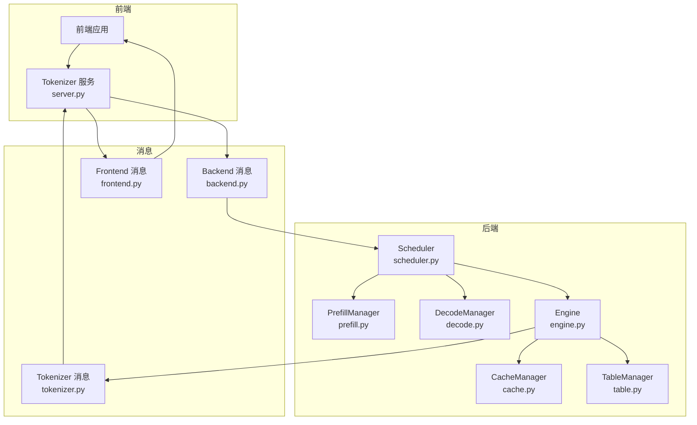
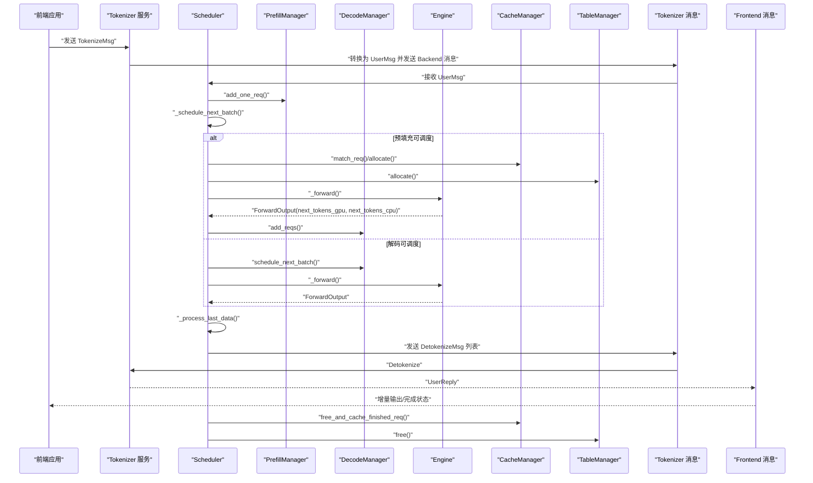
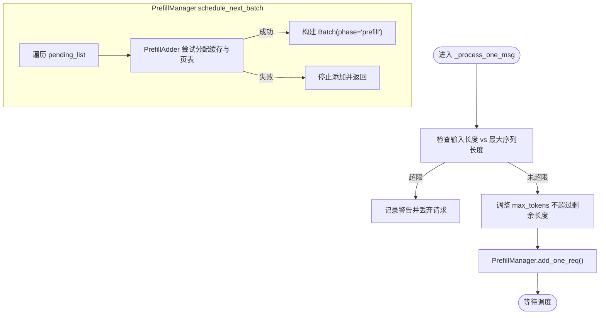
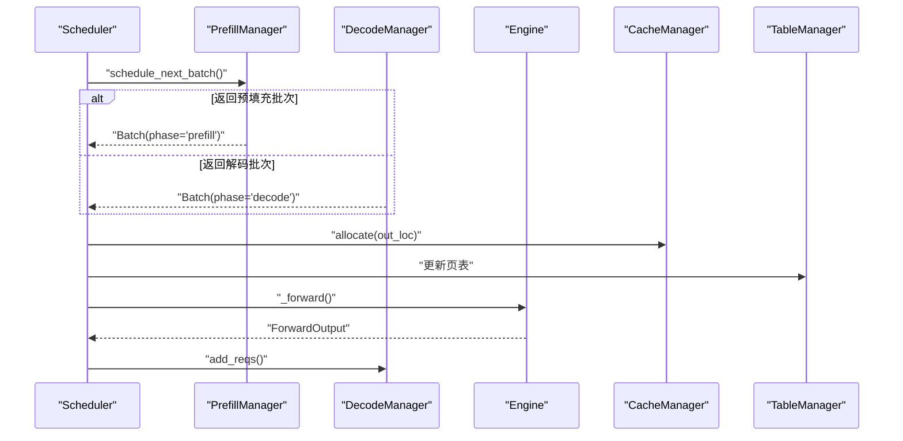
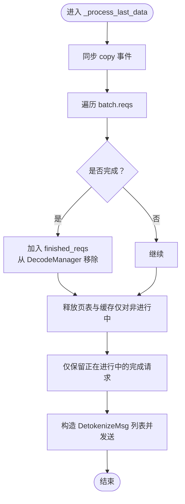
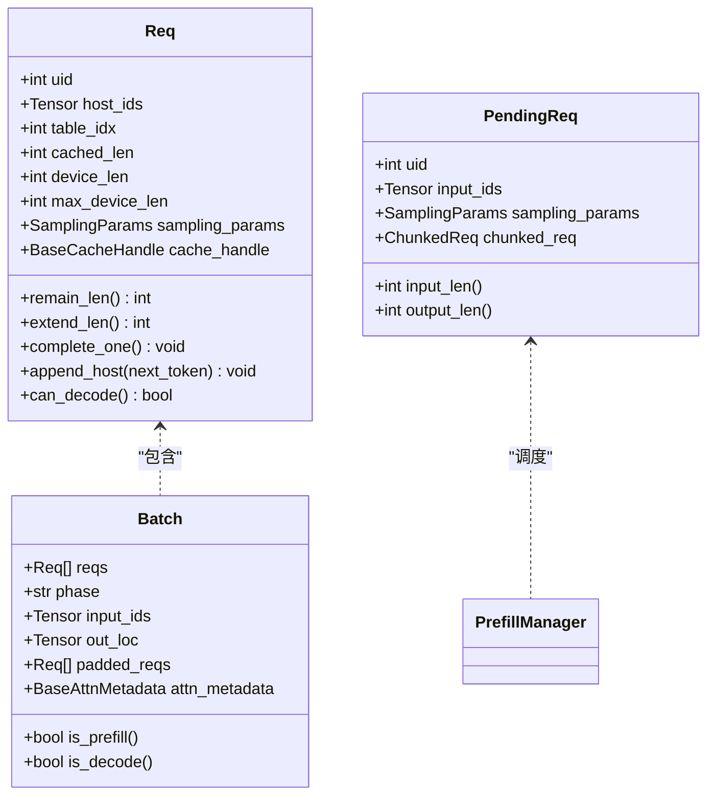
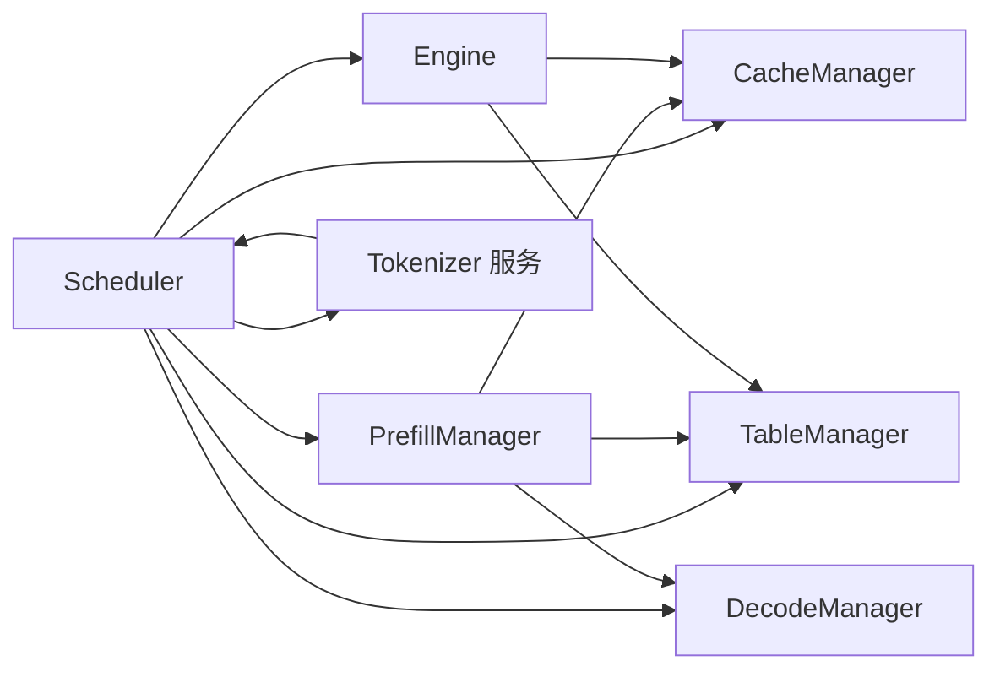

# 请求处理流程

<cite>
**本文引用的文件列表**
- [scheduler.py](file://python/minisgl/scheduler/scheduler.py)
- [prefill.py](file://python/minisgl/scheduler/prefill.py)
- [decode.py](file://python/minisgl/scheduler/decode.py)
- [cache.py](file://python/minisgl/scheduler/cache.py)
- [table.py](file://python/minisgl/scheduler/table.py)
- [engine.py](file://python/minisgl/engine/engine.py)
- [core.py](file://python/minisgl/core.py)
- [backend.py](file://python/minisgl/message/backend.py)
- [tokenizer.py](file://python/minisgl/message/tokenizer.py)
- [frontend.py](file://python/minisgl/message/frontend.py)
- [server.py](file://python/minisgl/tokenizer/server.py)
- [llm.py](file://python/minisgl/llm/llm.py)
</cite>

## 目录
1. [引言](#引言)
2. [项目结构](#项目结构)
3. [核心组件](#核心组件)
4. [架构总览](#架构总览)
5. [详细组件分析](#详细组件分析)
6. [依赖关系分析](#依赖关系分析)
7. [性能考量](#性能考量)
8. [故障排查指南](#故障排查指南)
9. [结论](#结论)

## 引言
本文件围绕“从接收到完成”的完整请求处理流程展开，重点覆盖以下内容：
- 从 _process_one_msg 开始，UserMsg 消息如何被接收并传递给 PrefillManager
- 预填充阶段到解码阶段的生命周期：_schedule_next_batch 如何优先选择预填充批次，_forward 如何执行模型计算
- _process_last_data 如何处理前向计算输出，将生成的 token 进行解码（detokenize），并判断请求是否完成（达到最大长度或遇到 EOS）
- finished_reqs 集合如何管理已完成但可能仍在批处理中的请求，以及资源（页表与 KV 缓存）在请求真正结束时的安全释放
- 错误处理：输入序列过长时的警告与丢弃逻辑

## 项目结构
该系统采用分层设计，消息通过前后端消息通道在不同模块间流转：
- 前端消息：前端通过 Tokenizer 服务将文本转为 DetokenizeMsg 或将用户输入转为 UserMsg
- 后端调度器：Scheduler 负责接收 UserMsg、调度预填充/解码、执行推理、解码输出并释放资源
- 引擎层：Engine 执行模型前向计算，采样生成下一个 token
- 缓存与表：CacheManager 管理 KV 缓存页，TableManager 管理页表槽位

图表来源
- [scheduler.py](file://python/minisgl/scheduler/scheduler.py#L155-L178)
- [prefill.py](file://python/minisgl/scheduler/prefill.py#L114-L154)
- [decode.py](file://python/minisgl/scheduler/decode.py#L9-L31)
- [engine.py](file://python/minisgl/engine/engine.py#L196-L211)
- [cache.py](file://python/minisgl/scheduler/cache.py#L12-L72)
- [table.py](file://python/minisgl/scheduler/table.py#L1-L20)
- [backend.py](file://python/minisgl/message/backend.py#L12-L37)
- [tokenizer.py](file://python/minisgl/message/tokenizer.py#L1-L44)
- [frontend.py](file://python/minisgl/message/frontend.py#L1-L30)
- [server.py](file://python/minisgl/tokenizer/server.py#L48-L100)

章节来源
- [scheduler.py](file://python/minisgl/scheduler/scheduler.py#L155-L178)
- [prefill.py](file://python/minisgl/scheduler/prefill.py#L114-L154)
- [decode.py](file://python/minisgl/scheduler/decode.py#L9-L31)
- [engine.py](file://python/minisgl/engine/engine.py#L196-L211)
- [cache.py](file://python/minisgl/scheduler/cache.py#L12-L72)
- [table.py](file://python/minisgl/scheduler/table.py#L1-L20)
- [backend.py](file://python/minisgl/message/backend.py#L12-L37)
- [tokenizer.py](file://python/minisgl/message/tokenizer.py#L1-L44)
- [frontend.py](file://python/minisgl/message/frontend.py#L1-L30)
- [server.py](file://python/minisgl/tokenizer/server.py#L48-L100)

## 核心组件
- Scheduler：消息入口、调度与执行协调者，负责预填充与解码的优先级选择、批准备、前向计算、结果处理与资源回收
- PrefillManager：接收 UserMsg，基于预算与缓存匹配进行预填充批次构建，支持分块请求
- DecodeManager：维护运行中请求集合，提供解码阶段调度
- Engine：执行模型前向与采样，返回 GPU/CPU 的下一个 token，并记录完成进度
- CacheManager：KV 缓存页分配、淘汰与完成请求的缓存插入
- TableManager：页表槽位分配与释放
- 消息体系：Backend 消息（UserMsg、BatchBackendMsg、ExitMsg）、Tokenizer 消息（DetokenizeMsg、TokenizeMsg、BatchTokenizerMsg）、Frontend 消息（UserReply）

章节来源
- [scheduler.py](file://python/minisgl/scheduler/scheduler.py#L80-L110)
- [prefill.py](file://python/minisgl/scheduler/prefill.py#L114-L154)
- [decode.py](file://python/minisgl/scheduler/decode.py#L9-L31)
- [engine.py](file://python/minisgl/engine/engine.py#L196-L211)
- [cache.py](file://python/minisgl/scheduler/cache.py#L12-L72)
- [table.py](file://python/minisgl/scheduler/table.py#L1-L20)
- [backend.py](file://python/minisgl/message/backend.py#L12-L37)
- [tokenizer.py](file://python/minisgl/message/tokenizer.py#L1-L44)
- [frontend.py](file://python/minisgl/message/frontend.py#L1-L30)

## 架构总览
下面以序列图展示一次完整的请求从接收至完成的关键步骤，包括预填充、解码、解码输出与资源释放。

图表来源
- [scheduler.py](file://python/minisgl/scheduler/scheduler.py#L155-L178)
- [scheduler.py](file://python/minisgl/scheduler/scheduler.py#L203-L210)
- [scheduler.py](file://python/minisgl/scheduler/scheduler.py#L218-L224)
- [scheduler.py](file://python/minisgl/scheduler/scheduler.py#L110-L154)
- [prefill.py](file://python/minisgl/scheduler/prefill.py#L114-L154)
- [decode.py](file://python/minisgl/scheduler/decode.py#L9-L31)
- [engine.py](file://python/minisgl/engine/engine.py#L196-L211)
- [cache.py](file://python/minisgl/scheduler/cache.py#L40-L63)
- [table.py](file://python/minisgl/scheduler/table.py#L15-L20)
- [tokenizer.py](file://python/minisgl/message/tokenizer.py#L27-L32)
- [frontend.py](file://python/minisgl/message/frontend.py#L25-L30)
- [server.py](file://python/minisgl/tokenizer/server.py#L48-L100)

## 详细组件分析

### 1) 消息接收与预填充入口：_process_one_msg 与 PrefillManager
- 接收 UserMsg：Scheduler 在 _process_one_msg 中校验输入长度与最大输出长度，若超限则丢弃并记录警告；否则将请求加入 PrefillManager 的待处理队列
- 预填充调度：PrefillManager.schedule_next_batch 依据预算与 DecodeManager 的在途 token 预留，尝试为多个 PendingReq 分配缓存句柄与页表槽位，构建 Batch（phase="prefill"）
- 分块处理：当输入长度超过单次预算时，创建 ChunkedReq 并保留未完成的 PendingReq，以便后续继续预填充

图表来源
- [scheduler.py](file://python/minisgl/scheduler/scheduler.py#L155-L178)
- [prefill.py](file://python/minisgl/scheduler/prefill.py#L114-L154)

章节来源
- [scheduler.py](file://python/minisgl/scheduler/scheduler.py#L155-L178)
- [prefill.py](file://python/minisgl/scheduler/prefill.py#L114-L154)

### 2) 批次调度与执行：_schedule_next_batch 与 _forward
- 优先策略：_schedule_next_batch 先尝试从 PrefillManager 获取预填充批次，若无则回退到 DecodeManager 的解码批次
- 批准备：_prepare_batch 计算 out_loc（写入位置）、加载索引与写入索引，更新页表，准备注意力元数据
- 执行前向：_forward 加载 token、调用 Engine.forward_batch，写回新 token 到 token_pool，并将请求加入 DecodeManager

图表来源
- [scheduler.py](file://python/minisgl/scheduler/scheduler.py#L203-L210)
- [scheduler.py](file://python/minisgl/scheduler/scheduler.py#L180-L201)
- [scheduler.py](file://python/minisgl/scheduler/scheduler.py#L218-L224)
- [engine.py](file://python/minisgl/engine/engine.py#L196-L211)
- [cache.py](file://python/minisgl/scheduler/cache.py#L39-L53)
- [table.py](file://python/minisgl/scheduler/table.py#L15-L20)

章节来源
- [scheduler.py](file://python/minisgl/scheduler/scheduler.py#L203-L210)
- [scheduler.py](file://python/minisgl/scheduler/scheduler.py#L180-L201)
- [scheduler.py](file://python/minisgl/scheduler/scheduler.py#L218-L224)
- [engine.py](file://python/minisgl/engine/engine.py#L196-L211)

### 3) 结果处理与解码：_process_last_data
- 处理上一批次输出：_process_last_data 在非重叠模式下直接处理，在重叠模式下与当前批次执行并行
- 解码与完成判定：对每个请求，追加下一个 token 至 host_ids，根据 remain_len、EOS、最大长度阈值判断是否完成
- 完成请求管理：将完成请求加入 finished_reqs；对于不在当前进行中的请求，释放其页表槽位与 KV 缓存句柄，并将完成请求的前缀插入缓存

图表来源
- [scheduler.py](file://python/minisgl/scheduler/scheduler.py#L110-L154)
- [decode.py](file://python/minisgl/scheduler/decode.py#L16-L18)
- [cache.py](file://python/minisgl/scheduler/cache.py#L54-L63)
- [table.py](file://python/minisgl/scheduler/table.py#L18-L20)

章节来源
- [scheduler.py](file://python/minisgl/scheduler/scheduler.py#L110-L154)
- [decode.py](file://python/minisgl/scheduler/decode.py#L16-L18)
- [cache.py](file://python/minisgl/scheduler/cache.py#L54-L63)
- [table.py](file://python/minisgl/scheduler/table.py#L18-L20)

### 4) 数据结构与生命周期
- Req：表示单个请求的状态（host_ids、cached_len、device_len、max_device_len、sampling_params、cache_handle 等），提供 remain_len、extend_len、complete_one、append_host、can_decode 等能力
- Batch：包含 reqs、phase（prefill/decode）、input_ids/out_loc/padded_reqs/attn_metadata 等字段
- PendingReq：用于预填充阶段的待处理请求包装，携带 uid、input_ids、sampling_params 与 chunked_req 标记

图表来源
- [core.py](file://python/minisgl/core.py#L22-L71)
- [core.py](file://python/minisgl/core.py#L73-L100)
- [scheduler/utils.py](file://python/minisgl/scheduler/utils.py#L14-L34)

章节来源
- [core.py](file://python/minisgl/core.py#L22-L71)
- [core.py](file://python/minisgl/core.py#L73-L100)
- [scheduler/utils.py](file://python/minisgl/scheduler/utils.py#L14-L34)

### 5) 错误处理与边界条件
- 输入过长：当 input_len >= max_seq_len 时，_process_one_msg 直接丢弃并记录警告
- 输出超限：当 sampling_params.max_tokens 超过剩余可用长度时，自动下调并记录警告
- 资源不足：PrefillAdder 在尝试分配时若预算不足或缓存不足会回退，导致无法继续添加请求
- 完成判定：忽略 EOS 可能导致请求不因 EOS 而终止；达到最大长度也会强制完成并记录警告

章节来源
- [scheduler.py](file://python/minisgl/scheduler/scheduler.py#L163-L174)
- [prefill.py](file://python/minisgl/scheduler/prefill.py#L38-L62)

## 依赖关系分析
- Scheduler 依赖 Engine、CacheManager、TableManager、DecodeManager、PrefillManager、Tokenizer
- PrefillManager 依赖 CacheManager、TableManager、DecodeManager（inflight_tokens）
- Engine 依赖 KV Cache、Attention Backend、Sampler、GraphRunner
- 消息层：Backend 消息与 Tokenizer 消息在前后端之间传递

图表来源
- [scheduler.py](file://python/minisgl/scheduler/scheduler.py#L80-L110)
- [prefill.py](file://python/minisgl/scheduler/prefill.py#L114-L154)
- [decode.py](file://python/minisgl/scheduler/decode.py#L9-L31)
- [engine.py](file://python/minisgl/engine/engine.py#L196-L211)
- [cache.py](file://python/minisgl/scheduler/cache.py#L12-L72)
- [table.py](file://python/minisgl/scheduler/table.py#L1-L20)
- [server.py](file://python/minisgl/tokenizer/server.py#L48-L100)

章节来源
- [scheduler.py](file://python/minisgl/scheduler/scheduler.py#L80-L110)
- [prefill.py](file://python/minisgl/scheduler/prefill.py#L114-L154)
- [decode.py](file://python/minisgl/scheduler/decode.py#L9-L31)
- [engine.py](file://python/minisgl/engine/engine.py#L196-L211)
- [cache.py](file://python/minisgl/scheduler/cache.py#L12-L72)
- [table.py](file://python/minisgl/scheduler/table.py#L1-L20)
- [server.py](file://python/minisgl/tokenizer/server.py#L48-L100)

## 性能考量
- 重叠调度：overlap_loop 通过多流与 CUDA Stream 协作，使消息接收与批准备与上一批次的执行重叠，隐藏 CPU Latency，提升 GPU 利用率
- 图执行：Engine 使用 GraphRunner 对可复用的批大小进行 CUDA Graph 重放，减少内核启动开销
- 预算与预留：PrefillManager 在调度时考虑 DecodeManager 的在途 token，避免解码阶段资源不足
- 写入优化：_make_2d_indices 与 token_pool 的 2D 视图配合，实现批量读取/写入索引的高效映射

章节来源
- [scheduler.py](file://python/minisgl/scheduler/scheduler.py#L231-L254)
- [engine.py](file://python/minisgl/engine/engine.py#L196-L211)
- [prefill.py](file://python/minisgl/scheduler/prefill.py#L124-L149)

## 故障排查指南
- 输入过长被丢弃：检查 max_seq_len 与输入长度，必要时缩短输入或增大 max_seq_len
- 输出被截断：确认 sampling_params.max_tokens 是否被自动下调
- 请求未完成：检查 remain_len、ignore_eos、EOS 是否命中、是否达到最大长度
- 资源泄漏：确保 finished_reqs 中的完成请求最终被释放（页表与缓存），可通过 CacheManager.check_integrity 与日志观察
- 通信问题：Tokenizer 服务与 Scheduler 之间的消息序列化/反序列化需保持一致

章节来源
- [scheduler.py](file://python/minisgl/scheduler/scheduler.py#L163-L174)
- [scheduler.py](file://python/minisgl/scheduler/scheduler.py#L130-L133)
- [cache.py](file://python/minisgl/scheduler/cache.py#L64-L72)
- [server.py](file://python/minisgl/tokenizer/server.py#L48-L100)

## 结论
该请求处理流程以 Scheduler 为核心，通过 PrefillManager 与 DecodeManager 的协作，结合 Engine 的高效前向与采样，实现了从接收 UserMsg 到完成输出的闭环。_process_last_data 负责将 GPU 采样的 token 解码为字符串并管理完成请求的资源释放，确保系统在高并发下的稳定性与性能。通过预算控制、重叠调度与图执行等机制，系统在吞吐与延迟之间取得平衡。