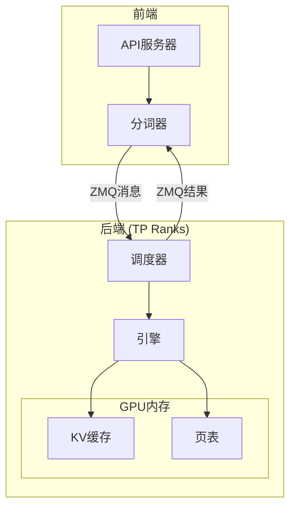
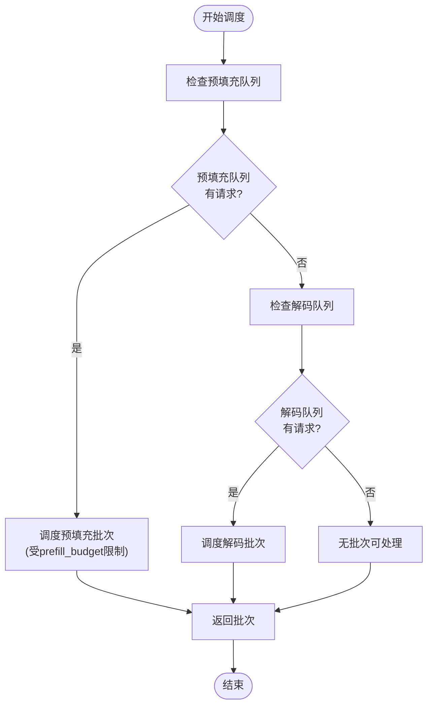
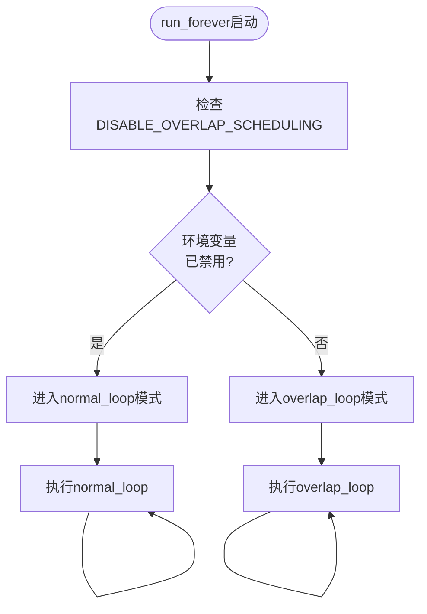
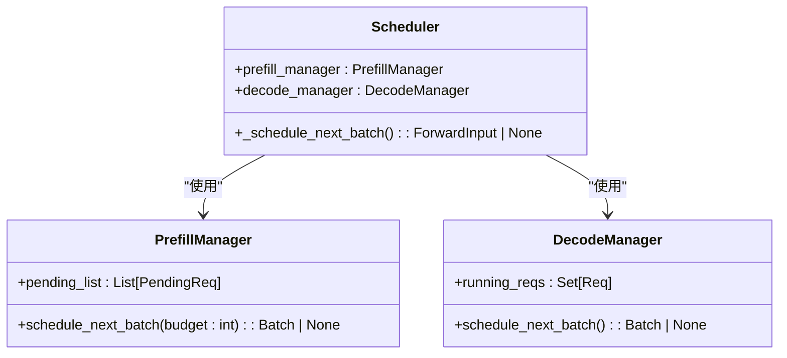

# 调度器概述

<cite>
**本文档中引用的文件**  
- [scheduler.py](file://python/minisgl/scheduler/scheduler.py)
- [prefill.py](file://python/minisgl/scheduler/prefill.py)
- [decode.py](file://python/minisgl/scheduler/decode.py)
- [cache.py](file://python/minisgl/scheduler/cache.py)
- [table.py](file://python/minisgl/scheduler/table.py)
- [io.py](file://python/minisgl/scheduler/io.py)
- [config.py](file://python/minisgl/scheduler/config.py)
- [engine.py](file://python/minisgl/engine/engine.py)
- [core.py](file://python/minisgl/core.py)
- [structures.md](file://docs/structures.md)
</cite>

## 目录
1. [简介](#简介)
2. [核心职责与设计目标](#核心职责与设计目标)
3. [系统架构与组件交互](#系统架构与组件交互)
4. [请求生命周期管理](#请求生命周期管理)
5. [批处理与调度策略](#批处理与调度策略)
6. [分布式环境下的角色](#分布式环境下的角色)
7. [主循环模式分析](#主循环模式分析)
8. [关键组件协作机制](#关键组件协作机制)
9. [性能优化特性](#性能优化特性)
10. [结论](#结论)

## 简介

调度器（Scheduler）是mini-sglang系统的核心协调组件，负责管理所有推理请求的生命周期。作为中央控制单元，它不仅协调请求的接收、处理和响应，还通过高效的批处理机制和与引擎（Engine）的紧密协作，实现了高吞吐量、低延迟和高GPU利用率的推理服务。本文档将深入探讨调度器在系统中的核心作用，涵盖其在分布式环境下的通信机制、与关键管理器的协作方式，以及其主循环的两种运行模式。

## 核心职责与设计目标

调度器的核心职责是作为系统的中央协调者，管理从请求接收、资源分配到结果返回的完整流程。其设计目标明确聚焦于高性能推理服务：

- **高吞吐量**：通过动态批处理（Dynamic Batching）技术，将多个并发请求合并为一个批次进行处理，最大化GPU的计算利用率。
- **低延迟**：采用重叠调度（Overlap Scheduling）等优化技术，隐藏CPU端的调度开销，确保GPU计算与CPU端的元数据处理并行执行。
- **高GPU利用率**：通过精细化的资源管理和高效的内存复用机制（如Radix Cache），确保GPU计算单元始终处于高负载状态。

调度器通过与`PrefillManager`、`DecodeManager`和`CacheManager`等组件的协同工作，实现了对请求的智能调度和资源的高效利用。

**Section sources**
- [scheduler.py](file://python/minisgl/scheduler/scheduler.py#L80-L285)
- [structures.md](file://docs/structures.md#L12-L13)

## 系统架构与组件交互

**Diagram sources**
- [structures.md](file://docs/structures.md#L5-L29)
- [scheduler.py](file://python/minisgl/scheduler/scheduler.py#L80-L285)

**Section sources**
- [structures.md](file://docs/structures.md#L5-L50)
- [scheduler.py](file://python/minisgl/scheduler/scheduler.py#L80-L285)

## 请求生命周期管理

调度器全面管理每个请求的整个生命周期。当用户请求通过API服务器和分词器进入系统后，调度器负责接收并处理这些请求。

1.  **请求接收**：调度器通过ZeroMQ（ZMQ）从分词器接收`UserMsg`消息。对于多GPU的张量并行（Tensor Parallelism, TP）设置，只有主秩（Rank 0）的调度器直接接收消息，然后通过ZMQ广播给其他秩的调度器。
2.  **请求验证与预处理**：调度器会检查输入序列长度是否超过模型的最大上下文长度，如果超出则丢弃请求。同时，它会调整`max_tokens`参数以确保总长度不超过限制。
3.  **请求调度**：经过验证的请求被提交给`PrefillManager`进行预填充处理。一旦请求开始生成输出，它将被`DecodeManager`接管，进入解码阶段。
4.  **结果生成与返回**：在每次推理迭代后，调度器处理引擎返回的输出，将生成的token ID追加到请求的历史记录中，并通过ZMQ将结果发送回分词器进行解码，最终流式返回给用户。
5.  **资源回收**：当一个请求完成（达到最大输出长度或遇到EOS token）时，调度器会将其标记为完成，并在后续的循环中释放其占用的KV缓存和页表资源。

**Section sources**
- [scheduler.py](file://python/minisgl/scheduler/scheduler.py#L155-L175)
- [scheduler.py](file://python/minisgl/scheduler/scheduler.py#L110-L153)
- [core.py](file://python/minisgl/core.py#L22-L70)

## 批处理与调度策略

调度器的核心功能之一是实现高效的批处理。它通过`_schedule_next_batch`方法决定下一个要处理的批次。

**Diagram sources**
- [scheduler.py](file://python/minisgl/scheduler/scheduler.py#L203-L209)
- [prefill.py](file://python/minisgl/scheduler/prefill.py#L124-L149)
- [decode.py](file://python/minisgl/scheduler/decode.py#L23-L26)

**Section sources**
- [scheduler.py](file://python/minisgl/scheduler/scheduler.py#L203-L209)
- [prefill.py](file://python/minisgl/scheduler/prefill.py#L114-L154)
- [decode.py](file://python/minisgl/scheduler/decode.py#L9-L31)

当前的调度策略遵循一个简单的优先级：优先调度预填充请求（`prefill_manager.schedule_next_batch`），如果没有可调度的预填充请求，则调度解码请求（`decode_manager.schedule_next_batch`）。`prefill_budget`参数限制了单个批次中用于预填充的总token数，以防止长上下文请求耗尽所有资源。

## 分布式环境下的角色

在张量并行（TP）的分布式环境中，每个GPU上都运行着一个调度器进程。它们的角色和协作方式如下：

- **主秩（Rank 0）**：扮演协调者的角色。它直接与分词器和解码器进行ZMQ通信，接收用户请求，并将请求广播给所有其他秩的调度器。同时，它负责收集所有秩的计算结果，并将最终结果发送回解码器。
- **非主秩（Rank > 0）**：作为工作节点。它们通过ZMQ从主秩接收请求广播，并执行本地的推理计算。它们不直接与分词器或解码器通信，计算结果由主秩统一收集。

这种设计确保了控制流的集中化，简化了外部接口，同时利用`torch.distributed`进行高效的GPU间张量通信（如All-Reduce），实现了计算的并行化。

**Section sources**
- [structures.md](file://docs/structures.md#L12-L13)
- [io.py](file://python/minisgl/scheduler/io.py#L27-L66)
- [engine.py](file://python/minisgl/engine/engine.py#L114-L140)

## 主循环模式分析

调度器的`run_forever`方法是其核心驱动循环，根据环境变量`ENV.DISABLE_OVERLAP_SCHEDULING`选择两种运行模式。

**Diagram sources**
- [scheduler.py](file://python/minisgl/scheduler/scheduler.py#L269-L280)

### normal_loop模式

当`DISABLE_OVERLAP_SCHEDULING`被设置时，调度器进入`normal_loop`模式。这是一个同步的、串行的执行流程：

1.  **接收消息**：从ZMQ接收新的用户请求。
2.  **调度批次**：调用`_schedule_next_batch`生成下一个要处理的批次。
3.  **执行前向传播**：在主线程的CUDA流上执行`_forward`，等待GPU计算完成。
4.  **处理结果**：处理上一个批次的输出结果，并发送给解码器。

这种模式逻辑简单，但CPU和GPU的执行是串行的，GPU在等待CPU处理元数据时可能处于空闲状态。

**Section sources**
- [scheduler.py](file://python/minisgl/scheduler/scheduler.py#L256-L267)

### overlap_loop模式

这是默认的、高性能的运行模式。它利用CUDA流（CUDA Stream）实现了CPU和GPU的重叠执行：

1.  **异步接收消息**：在调度器自己的CUDA流（`self.stream`）上接收和处理消息。
2.  **调度与准备**：在CPU上准备下一个批次的元数据（如`load_indices`）。
3.  **重叠执行**：
    -   **GPU侧**：切换到引擎的CUDA流（`self.engine_stream_ctx`），启动当前批次的GPU计算（`_forward`）。
    -   **CPU侧**：在调度器的流上，**并行地**处理上一个批次的结果（`_process_last_data`）。
4.  **同步点**：通过事件（`copy_done_event`）确保CPU处理上一个批次结果时，GPU的计算已经完成。

通过这种方式，CPU处理上一个批次结果的延迟被完全隐藏在当前批次的GPU计算时间之内，从而显著提高了GPU的利用率。

**Section sources**
- [scheduler.py](file://python/minisgl/scheduler/scheduler.py#L231-L254)
- [scheduler.py](file://python/minisgl/scheduler/scheduler.py#L88-L92)

## 关键组件协作机制

调度器通过与多个专用管理器的协作来实现其复杂功能。

### 与PrefillManager和DecodeManager的协作

- **PrefillManager**：专门负责管理需要进行预填充的请求。它维护一个待处理请求队列（`pending_list`），并根据可用的token预算（`prefill_budget`）和KV缓存情况，决定哪些请求可以被纳入下一个批次。调度器通过调用其`schedule_next_batch`方法来获取预填充批次。
- **DecodeManager**：负责管理所有正在进行解码的请求。当一个请求完成预填充并开始生成输出时，`DecodeManager`会将其加入`running_reqs`集合。调度器会优先处理预填充请求，只有当没有预填充请求时，才会调度`DecodeManager`提供的解码批次。

**Diagram sources**
- [scheduler.py](file://python/minisgl/scheduler/scheduler.py#L97-L100)
- [prefill.py](file://python/minisgl/scheduler/prefill.py#L114-L154)
- [decode.py](file://python/minisgl/scheduler/decode.py#L9-L31)

### 与CacheManager和TableManager的协作

- **CacheManager**：管理KV缓存池。它负责分配和回收缓存页，并实现了Radix Cache等高级缓存策略，以复用具有相同前缀的请求的KV缓存。调度器在准备批次时，会调用`CacheManager.allocate`来为请求分配新的缓存空间。
- **TableManager**：管理页表（Page Table）。页表是一个二维数组，记录了每个请求的每个token对应的缓存页ID。`TableManager`负责分配和释放页表的行（`table_idx`），并维护一个`token_pool`来存储请求的token ID序列。

这两个管理器共同为调度器提供了高效的内存管理能力，是实现高吞吐量的关键。

**Section sources**
- [scheduler.py](file://python/minisgl/scheduler/scheduler.py#L95-L96)
- [cache.py](file://python/minisgl/scheduler/cache.py#L12-L72)
- [table.py](file://python/minisgl/scheduler/table.py#L4-L20)

## 性能优化特性

调度器集成了多项先进的性能优化技术：

- **重叠调度（Overlap Scheduling）**：如前所述，通过CUDA流重叠CPU和GPU的执行，是提高GPU利用率的核心技术。
- **Radix Cache**：通过`CacheManager`实现，能够智能地匹配和复用具有相同前缀的请求的KV缓存，显著减少内存占用和计算量。
- **Chunked Prefill**：对于超长上下文的请求，`PrefillManager`可以将其拆分为多个块（chunk）进行处理，避免一次性占用过多内存。
- **CUDA图（CUDA Graph）**：引擎（Engine）利用CUDA图来捕获和重放固定的计算图，消除内核启动开销，进一步提升性能。

这些特性共同作用，使mini-sglang能够实现接近理论极限的推理性能。

**Section sources**
- [README.md](file://README.md#L18-L23)
- [scheduler.py](file://python/minisgl/scheduler/scheduler.py#L88-L92)
- [engine.py](file://python/minisgl/engine/engine.py#L101-L112)

## 结论

调度器是mini-sglang系统的大脑和心脏。它通过精巧的设计，将请求管理、资源调度、分布式协调和性能优化融为一体。作为中央协调者，它不仅高效地管理着请求的生命周期，还通过与`PrefillManager`、`DecodeManager`、`CacheManager`等组件的紧密协作，以及利用重叠调度等高级技术，驱动整个系统实现了高吞吐量、低延迟的推理服务。理解调度器的工作原理，是掌握mini-sglang高性能奥秘的关键。