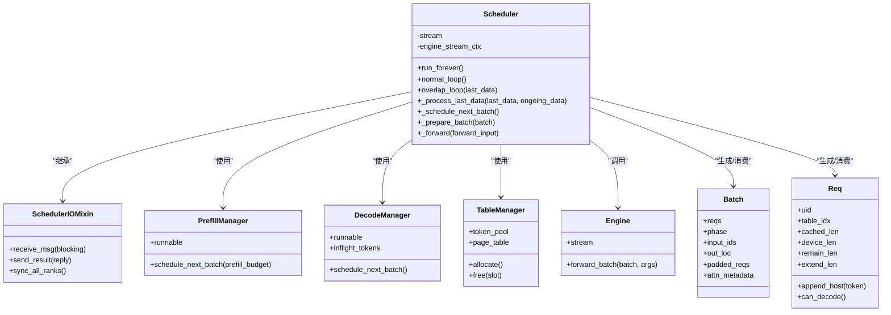

# 调度循环机制

<cite>
**本文引用的文件**
- [python/minisgl/scheduler/scheduler.py](file://python/minisgl/scheduler/scheduler.py)
- [python/minisgl/scheduler/io.py](file://python/minisgl/scheduler/io.py)
- [python/minisgl/scheduler/prefill.py](file://python/minisgl/scheduler/prefill.py)
- [python/minisgl/scheduler/decode.py](file://python/minisgl/scheduler/decode.py)
- [python/minisgl/scheduler/table.py](file://python/minisgl/scheduler/table.py)
- [python/minisgl/engine/engine.py](file://python/minisgl/engine/engine.py)
- [python/minisgl/env.py](file://python/minisgl/env.py)
- [python/minisgl/core.py](file://python/minisgl/core.py)
- [docs/features.md](file://docs/features.md)
</cite>

## 目录
1. [引言](#引言)
2. [项目结构](#项目结构)
3. [核心组件](#核心组件)
4. [架构总览](#架构总览)
5. [详细组件分析](#详细组件分析)
6. [依赖关系分析](#依赖关系分析)
7. [性能考量](#性能考量)
8. [故障排查指南](#故障排查指南)
9. [结论](#结论)

## 引言
本文件围绕调度器主循环展开，系统性对比“普通调度模式”（normal_loop）与“重叠调度模式”（overlap_loop），解释二者在消息接收、批次调度、前向计算与结果处理上的差异，并深入剖析 overlap_loop 的并行化设计：如何利用独立 CUDA 流（self.stream）与引擎流（engine.stream）之间的同步协作，实现 CPU 端元数据处理与 GPU 端前向计算的重叠；同时说明 last_data 与 ongoing_data 双缓冲机制如何在不同阶段复用内存与计算资源，从而提升整体吞吐。最后结合 ENV.DISABLE_OVERLAP_SCHEDULING 环境变量，给出模式切换的控制逻辑与建议。

## 项目结构
调度器位于 python/minisgl/scheduler 目录，核心文件包括：
- scheduler.py：调度器主体，包含 normal_loop、overlap_loop、run_forever 以及与 Engine 的交互
- io.py：调度器与分词器/后端的消息收发混入
- prefill.py：预填充阶段的请求管理与批调度
- decode.py：解码阶段的请求管理与批调度
- table.py：表管理器，提供 token_pool 与 page_table
- engine/engine.py：推理引擎，持有 engine.stream 并执行 forward_batch
- env.py：环境变量定义，含 DISABLE_OVERLAP_SCHEDULING
- core.py：核心数据结构，如 Batch、Req 等

图表来源
- [python/minisgl/scheduler/scheduler.py](file://python/minisgl/scheduler/scheduler.py#L80-L110)
- [python/minisgl/scheduler/io.py](file://python/minisgl/scheduler/io.py#L15-L66)
- [python/minisgl/scheduler/prefill.py](file://python/minisgl/scheduler/prefill.py#L114-L154)
- [python/minisgl/scheduler/decode.py](file://python/minisgl/scheduler/decode.py#L9-L31)
- [python/minisgl/scheduler/table.py](file://python/minisgl/scheduler/table.py#L1-L19)
- [python/minisgl/engine/engine.py](file://python/minisgl/engine/engine.py#L36-L68)
- [python/minisgl/env.py](file://python/minisgl/env.py#L58-L82)

章节来源
- [python/minisgl/scheduler/scheduler.py](file://python/minisgl/scheduler/scheduler.py#L80-L110)
- [python/minisgl/scheduler/io.py](file://python/minisgl/scheduler/io.py#L15-L66)
- [python/minisgl/scheduler/prefill.py](file://python/minisgl/scheduler/prefill.py#L114-L154)
- [python/minisgl/scheduler/decode.py](file://python/minisgl/scheduler/decode.py#L9-L31)
- [python/minisgl/scheduler/table.py](file://python/minisgl/scheduler/table.py#L1-L19)
- [python/minisgl/engine/engine.py](file://python/minisgl/engine/engine.py#L36-L68)
- [python/minisgl/env.py](file://python/minisgl/env.py#L58-L82)

## 核心组件
- Scheduler：负责消息接收、批次调度、前向计算与结果处理；维护 self.stream（独立CUDA流）与 engine.stream 的协作；提供 normal_loop 与 overlap_loop 两种主循环模式。
- SchedulerIOMixin：封装与分词器/后端的消息收发接口，支持单机与多机广播/订阅。
- PrefillManager/DecodeManager：分别负责预填充与解码阶段的请求排队与批调度。
- TableManager：提供 token_pool 与 page_table，支撑 token 加载/写回与 KV 页面分配。
- Engine：持有 engine.stream，执行 forward_batch，返回包含 next_tokens_gpu、next_tokens_cpu 与 copy_done_event 的 ForwardOutput。
- ENV：提供 DISABLE_OVERLAP_SCHEDULING 控制是否启用重叠调度。

章节来源
- [python/minisgl/scheduler/scheduler.py](file://python/minisgl/scheduler/scheduler.py#L80-L110)
- [python/minisgl/scheduler/io.py](file://python/minisgl/scheduler/io.py#L15-L66)
- [python/minisgl/scheduler/prefill.py](file://python/minisgl/scheduler/prefill.py#L114-L154)
- [python/minisgl/scheduler/decode.py](file://python/minisgl/scheduler/decode.py#L9-L31)
- [python/minisgl/scheduler/table.py](file://python/minisgl/scheduler/table.py#L1-L19)
- [python/minisgl/engine/engine.py](file://python/minisgl/engine/engine.py#L196-L206)
- [python/minisgl/env.py](file://python/minisgl/env.py#L58-L82)

## 架构总览
调度器通过 run_forever 在 CUDA 流上选择运行 normal_loop 或 overlap_loop。两者均以 receive_msg 为入口接收消息，但 overlap_loop 利用 self.stream 与 engine.stream 的等待关系，使 CPU 元数据处理与 GPU 前向计算并行重叠，从而隐藏 CPU 开销，提升 GPU 利用率。

图表来源
- [python/minisgl/scheduler/scheduler.py](file://python/minisgl/scheduler/scheduler.py#L231-L267)
- [python/minisgl/scheduler/scheduler.py](file://python/minisgl/scheduler/scheduler.py#L268-L284)
- [python/minisgl/scheduler/io.py](file://python/minisgl/scheduler/io.py#L79-L121)
- [python/minisgl/engine/engine.py](file://python/minisgl/engine/engine.py#L196-L206)

## 详细组件分析

### 普通调度模式 normal_loop
- 工作流程
  - 阻塞式接收消息：当无可运行的预填充或解码请求时，阻塞等待新消息；否则非阻塞轮询。
  - 批次调度：调用 _schedule_next_batch，从预填充或解码管理器中挑选下一组请求组成 Batch。
  - 前向计算：若存在可执行批次，则直接在当前流中调用 _forward，内部完成 token 加载、调用 Engine.forward_batch、写回 token，并更新 DecodeManager。
  - 结果处理：调用 _process_last_data，将上一批次的 next_tokens_cpu 同步拷贝到主机侧，拼装 DetokenizeMsg，标记完成并释放不再进行的请求资源。
- 特点
  - 串行执行：CPU 元数据处理与 GPU 前向计算严格串行，CPU 空闲时间较长，GPU 利用率受限。
  - 简洁稳定：逻辑清晰，易于调试与验证正确性。

章节来源
- [python/minisgl/scheduler/scheduler.py](file://python/minisgl/scheduler/scheduler.py#L256-L267)

### 重叠调度模式 overlap_loop
- 工作流程
  - 接收消息：根据是否有 last_data 或可运行的预填充/解码请求决定是否阻塞等待消息。
  - 批次调度：调用 _schedule_next_batch，准备下一组请求的 ForwardInput（含 load_indices/write_indices）。
  - 并行执行：若存在可执行批次，使用 with engine_stream_ctx 上下文，确保在引擎流（engine.stream）中执行前向计算；同时设置 engine.stream.wait_stream(self.stream)，使引擎流等待 self.stream 完成上一轮 CPU 处理。
  - 结果处理：调用 _process_last_data(last_data, ongoing_data)，将上一批次的 next_tokens_cpu 同步拷贝到主机侧，拼装 DetokenizeMsg，标记完成并释放不再进行的请求资源。
  - 返回值：返回 ongoing_data，作为下一次 overlap_loop 的 last_data，形成双缓冲。
- 关键并行点
  - CUDA 流同步：engine.stream.wait_stream(self.stream) 实现 CPU 与 GPU 的流水线重叠。
  - 双缓冲：last_data 与 ongoing_data 交替使用，避免 CPU 等待 GPU 的拷贝事件，最大化 GPU 时间片利用率。
- 性能收益
  - 隐藏 CPU 开销：在 GPU 计算的同时，CPU 可以继续接收消息、准备下一批次，减少空闲时间。
  - 提升吞吐：在高并发场景下，重叠调度显著降低调度周期内的空闲时间，提高整体吞吐。

章节来源
- [python/minisgl/scheduler/scheduler.py](file://python/minisgl/scheduler/scheduler.py#L231-L267)

### run_forever 与模式切换
- 当 ENV.DISABLE_OVERLAP_SCHEDULING 为真时，run_forever 使用 normal_loop，并通过 engine_stream_ctx 与 engine.stream.wait_stream(self.stream) 确保串行顺序，避免并行化带来的复杂性。
- 当 ENV.DISABLE_OVERLAP_SCHEDULING 为假时，run_forever 进入 overlap_loop，要求当前 CUDA 流必须是 self.stream，以保证 wait_stream 的语义正确。

章节来源
- [python/minisgl/scheduler/scheduler.py](file://python/minisgl/scheduler/scheduler.py#L268-L284)
- [python/minisgl/env.py](file://python/minisgl/env.py#L58-L82)

### _process_last_data 的双缓冲与资源回收
- 功能概述
  - 同步拷贝：在 last_data 存在时，先同步 copy_done_event，确保上一批次的 next_tokens_cpu 已就绪。
  - 结果组装：遍历 last_data 对应 Batch 的每个请求，追加主机侧输出，判断是否结束（EOS、长度上限等），并构造 DetokenizeMsg。
  - 资源回收：对已完成但不在 ongoing_data 中的请求，释放其表槽位与缓存句柄，清理 page_table 对应页。
  - 集合维护：仅保留 ongoing_reqs 在 finished_reqs 集合中，避免重复释放。
  - 发送结果：通过 send_result 将批量结果发送给分词器/后端。
- 双缓冲意义
  - last_data 与 ongoing_data 交替使用，使得 CPU 在处理上一批次结果的同时，GPU 正在执行下一批次的前向计算，从而实现计算与通信的重叠。

章节来源
- [python/minisgl/scheduler/scheduler.py](file://python/minisgl/scheduler/scheduler.py#L110-L154)

### _prepare_batch 与 ForwardInput/ForwardData
- ForwardInput 包含：
  - batch：当前批次
  - sample_args：采样参数
  - load_indices：从 token_pool 加载 input_ids 的索引
  - write_indices：将 next_tokens_gpu 写回 token_pool 的索引
- ForwardData 是 ForwardInput 与 ForwardOutput 的二元组，用于 overlap_loop 的双缓冲传递。
- _prepare_batch 负责：
  - 分配 out_loc（KV 缓存页）
  - 若需要，对 Batch 进行 pad（满足图编译/对齐要求）
  - 计算 load_indices 与 write_indices
  - 将 out_loc 写入 page_table
  - 准备注意力元数据与采样参数

章节来源
- [python/minisgl/scheduler/scheduler.py](file://python/minisgl/scheduler/scheduler.py#L180-L201)
- [python/minisgl/scheduler/scheduler.py](file://python/minisgl/scheduler/scheduler.py#L70-L78)

### PrefillManager 与 DecodeManager 的调度策略
- PrefillManager.schedule_next_batch：基于 token 预算与解码阶段在途 token 数，尝试将多个 PendingReq 组合成 Batch，支持分块请求（ChunkedReq）。
- DecodeManager.schedule_next_batch：从运行中的请求集合中挑选可解码的请求组成 Batch。
- runnable 属性：用于 normal_loop/overlap_loop 的阻塞决策，避免空转。

章节来源
- [python/minisgl/scheduler/prefill.py](file://python/minisgl/scheduler/prefill.py#L114-L154)
- [python/minisgl/scheduler/decode.py](file://python/minisgl/scheduler/decode.py#L19-L31)

### SchedulerIOMixin 的消息收发
- 单机/多机模式：根据 tp_info 与广播地址，选择不同的接收/发送路径。
- 阻塞策略：当 blocking 为真时，调用 run_when_idle，执行后台任务（如检查缓存完整性）。
- 多机一致性：通过 CPU 进程组广播消息数量，确保各 rank 的消息同步。

章节来源
- [python/minisgl/scheduler/io.py](file://python/minisgl/scheduler/io.py#L15-L66)
- [python/minisgl/scheduler/io.py](file://python/minisgl/scheduler/io.py#L79-L121)

### Engine.forward_batch 与 CUDA 流
- Engine 持有 engine.stream，并在 forward_batch 中断言当前流为 engine.stream。
- ForwardOutput 包含：
  - next_tokens_gpu：GPU 上的候选 token
  - next_tokens_cpu：CPU 上的候选 token
  - copy_done_event：用于同步 CPU/GPU 拷贝完成
- 该结构为 overlap_loop 的双缓冲与重叠提供了关键基础。

章节来源
- [python/minisgl/engine/engine.py](file://python/minisgl/engine/engine.py#L196-L206)

### 类关系与数据模型

图表来源
- [python/minisgl/scheduler/scheduler.py](file://python/minisgl/scheduler/scheduler.py#L80-L110)
- [python/minisgl/scheduler/io.py](file://python/minisgl/scheduler/io.py#L15-L66)
- [python/minisgl/scheduler/prefill.py](file://python/minisgl/scheduler/prefill.py#L114-L154)
- [python/minisgl/scheduler/decode.py](file://python/minisgl/scheduler/decode.py#L9-L31)
- [python/minisgl/scheduler/table.py](file://python/minisgl/scheduler/table.py#L1-L19)
- [python/minisgl/engine/engine.py](file://python/minisgl/engine/engine.py#L36-L68)
- [python/minisgl/core.py](file://python/minisgl/core.py#L22-L100)

## 依赖关系分析
- 调度器与引擎
  - Scheduler 通过 engine_stream_ctx 与 engine.stream.wait_stream(self.stream) 实现 CPU/GPU 流同步。
  - Engine.forward_batch 必须在 engine.stream 中执行，且返回的 ForwardOutput 供 Scheduler 处理。
- 调度器与 I/O
  - SchedulerIOMixin 提供 receive_msg/send_result，支持单机与多机广播/订阅。
- 调度器与管理器
  - PrefillManager/DecodeManager 提供 runnable 属性与 schedule_next_batch，决定是否阻塞与是否产生可执行批次。
- 表与缓存
  - TableManager 提供 token_pool/page_table，用于 token 加载/写回与 KV 页面分配。
- 环境变量
  - ENV.DISABLE_OVERLAP_SCHEDULING 控制 run_forever 的分支，进而影响 normal_loop 与 overlap_loop 的选择。

图表来源
- [python/minisgl/scheduler/scheduler.py](file://python/minisgl/scheduler/scheduler.py#L268-L284)
- [python/minisgl/env.py](file://python/minisgl/env.py#L58-L82)
- [python/minisgl/engine/engine.py](file://python/minisgl/engine/engine.py#L36-L68)

章节来源
- [python/minisgl/scheduler/scheduler.py](file://python/minisgl/scheduler/scheduler.py#L268-L284)
- [python/minisgl/env.py](file://python/minisgl/env.py#L58-L82)

## 性能考量
- overlap_loop 的关键收益
  - 通过 engine.stream.wait_stream(self.stream) 将 CPU 元数据处理与 GPU 前向计算并行化，隐藏 CPU 等待时间。
  - last_data 与 ongoing_data 双缓冲避免 CPU 等待 GPU 拷贝事件，最大化 GPU 时间片利用率。
- normal_loop 的适用场景
  - 简化部署与调试，适合低负载或对稳定性优先的场景。
- 环境变量控制
  - 设置 MINISGL_DISABLE_OVERLAP_SCHEDULING=1 可强制使用 normal_loop，便于问题定位与性能基线对比。
- 文档背景
  - 文档 features.md 指出 Mini-SGLang 采用重叠调度技术以减少 CPU 开销，提升吞吐。

章节来源
- [python/minisgl/scheduler/scheduler.py](file://python/minisgl/scheduler/scheduler.py#L231-L267)
- [python/minisgl/scheduler/scheduler.py](file://python/minisgl/scheduler/scheduler.py#L268-L284)
- [docs/features.md](file://docs/features.md#L49-L55)

## 故障排查指南
- 现象：GPU 利用率低，吞吐不足
  - 检查 ENV.DISABLE_OVERLAP_SCHEDULING 是否被设置为真；若是，请将其设为假以启用重叠调度。
  - 确认 CUDA 流设置：overlap_loop 要求当前流为 self.stream，否则会触发断言。
- 现象：CPU 等待 GPU 拷贝导致延迟
  - overlap_loop 通过 copy_done_event 与双缓冲缓解此问题；若仍出现瓶颈，检查 PrefillManager/DecodeManager 的调度策略与 Batch pad 策略。
- 现象：多机环境下消息不同步
  - 检查 SchedulerIOMixin 的广播/订阅路径与 CPU 进程组同步逻辑，确保各 rank 的消息数量一致。
- 现象：请求提前结束或被丢弃
  - 检查 _process_last_data 中的 EOS 判定与最大序列长度限制，确认 finished_reqs 的集合维护逻辑。

章节来源
- [python/minisgl/scheduler/scheduler.py](file://python/minisgl/scheduler/scheduler.py#L110-L154)
- [python/minisgl/scheduler/scheduler.py](file://python/minisgl/scheduler/scheduler.py#L231-L267)
- [python/minisgl/scheduler/io.py](file://python/minisgl/scheduler/io.py#L79-L121)
- [python/minisgl/env.py](file://python/minisgl/env.py#L58-L82)

## 结论
- overlap_loop 通过独立 CUDA 流与引擎流的等待关系，将 CPU 元数据处理与 GPU 前向计算并行化，配合 last_data/ongoing_data 双缓冲，有效隐藏 CPU 开销，显著提升 GPU 利用率与系统吞吐。
- normal_loop 保持串行简洁，适用于调试与低负载场景。
- ENV.DISABLE_OVERLAP_SCHEDULING 提供灵活的模式切换能力，便于在稳定性与性能之间权衡。
- 在实际部署中，建议默认启用重叠调度，并结合监控指标（GPU 利用率、队列长度、拷贝延迟）持续优化调度参数与批大小策略。