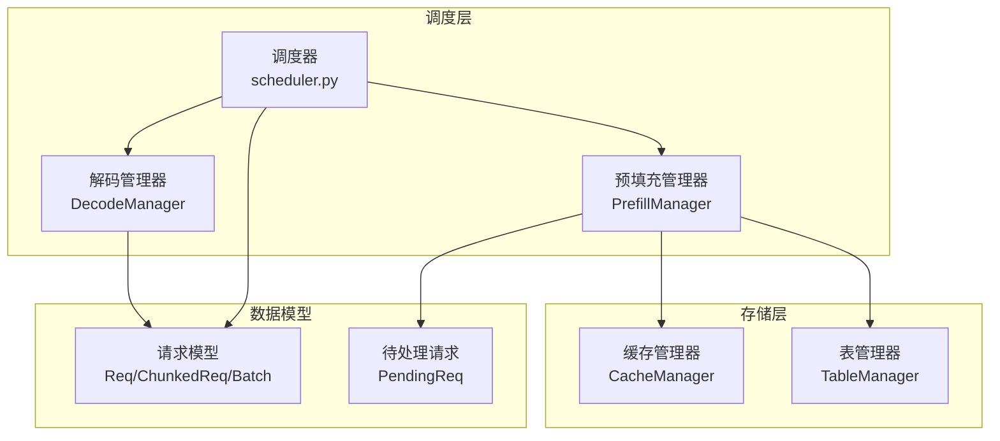
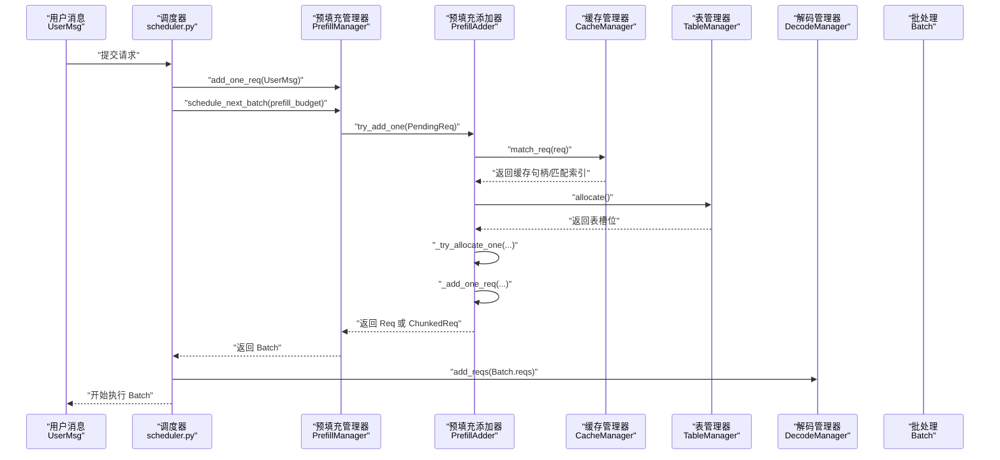
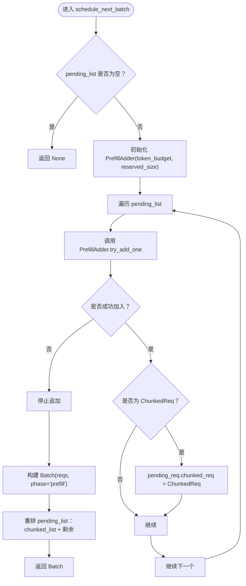
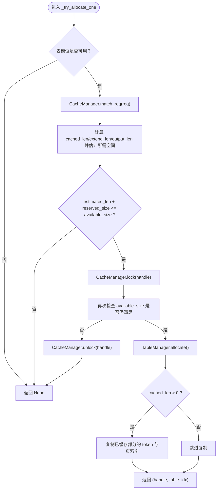
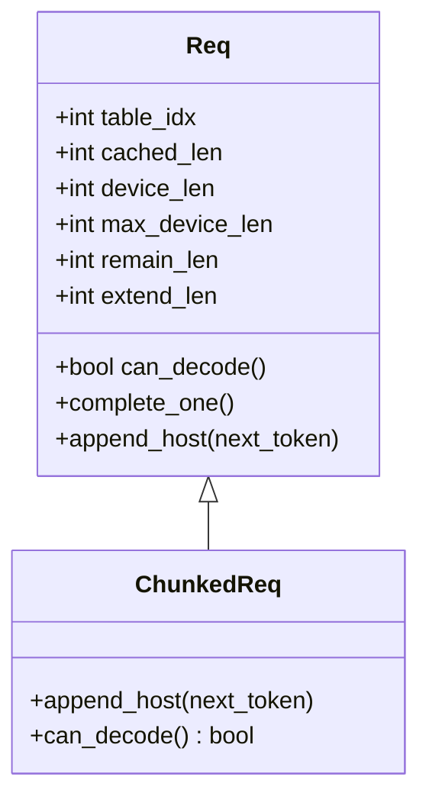
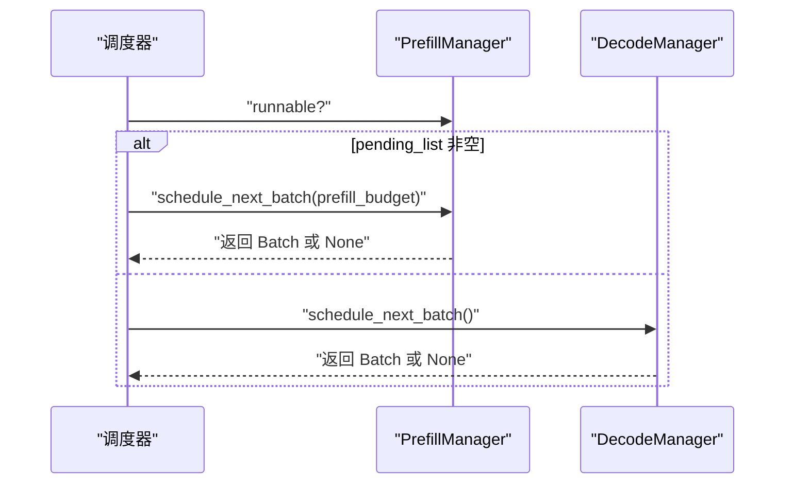
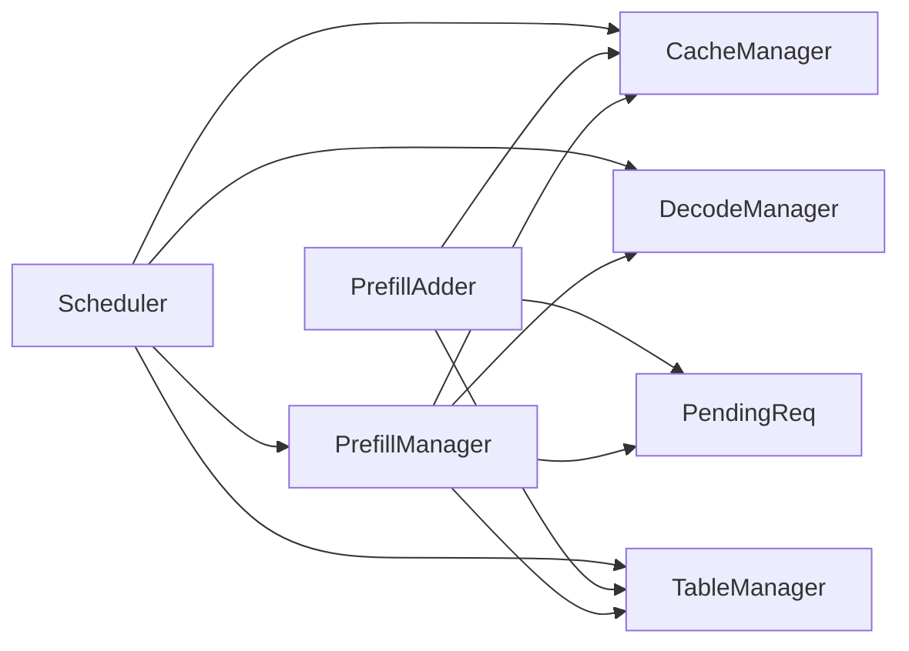

# 预填充管理

<cite>
**本文引用的文件**
- [prefill.py](file://python/minisgl/scheduler/prefill.py)
- [cache.py](file://python/minisgl/scheduler/cache.py)
- [table.py](file://python/minisgl/scheduler/table.py)
- [decode.py](file://python/minisgl/scheduler/decode.py)
- [scheduler.py](file://python/minisgl/scheduler/scheduler.py)
- [core.py](file://python/minisgl/core.py)
- [utils.py](file://python/minisgl/scheduler/utils.py)
</cite>

## 目录
1. [简介](#简介)
2. [项目结构](#项目结构)
3. [核心组件](#核心组件)
4. [架构总览](#架构总览)
5. [详细组件分析](#详细组件分析)
6. [依赖关系分析](#依赖关系分析)
7. [性能考量](#性能考量)
8. [故障排查指南](#故障排查指南)
9. [结论](#结论)

## 简介
本文件围绕 MiniSGL 的预填充调度子系统展开，重点解析以下内容：
- PrefillManager 如何维护待处理请求队列（pending_list）并驱动下一批次调度；
- schedule_next_batch 如何结合预填充预算与解码阶段的在途占用，构建新的预填充批次；
- PrefillAdder 辅助类的实现细节，包括缓存匹配、资源预估与内存分配；
- ChunkedReq 的设计目的与分块预填充策略；
- runnable 属性的判断逻辑及其在调度循环中的作用；
- 从新增请求到形成 Batch 的完整流程示例。

## 项目结构
与预填充管理相关的核心文件位于 python/minisgl/scheduler 目录，关键模块如下：
- prefilled.py：包含 PrefillManager、PrefillAdder、ChunkedReq 以及调度主流程衔接；
- cache.py：缓存管理器，负责 KV 缓存的匹配、锁定、释放与页分配；
- table.py：表管理器，负责为每个运行中的请求分配表槽位与 token 池视图；
- decode.py：解码管理器，记录在途解码请求并估算在途占用；
- scheduler.py：调度器主循环，协调预填充与解码的调度与执行；
- core.py：通用数据结构，如 Req、Batch、SamplingParams 等；
- utils.py：调度工具数据结构，如 PendingReq。

图表来源
- [scheduler.py](file://python/minisgl/scheduler/scheduler.py#L203-L209)
- [prefill.py](file://python/minisgl/scheduler/prefill.py#L114-L154)
- [cache.py](file://python/minisgl/scheduler/cache.py#L12-L72)
- [table.py](file://python/minisgl/scheduler/table.py#L4-L20)
- [decode.py](file://python/minisgl/scheduler/decode.py#L9-L31)
- [core.py](file://python/minisgl/core.py#L22-L100)
- [utils.py](file://python/minisgl/scheduler/utils.py#L14-L33)

章节来源
- [prefill.py](file://python/minisgl/scheduler/prefill.py#L114-L154)
- [cache.py](file://python/minisgl/scheduler/cache.py#L12-L72)
- [table.py](file://python/minisgl/scheduler/table.py#L4-L20)
- [decode.py](file://python/minisgl/scheduler/decode.py#L9-L31)
- [scheduler.py](file://python/minisgl/scheduler/scheduler.py#L203-L209)
- [core.py](file://python/minisgl/core.py#L22-L100)
- [utils.py](file://python/minisgl/scheduler/utils.py#L14-L33)

## 核心组件
- PrefillManager：维护 pending_list，基于预算与在途占用计算可加入的请求数量，构建 Batch 并返回给调度器。
- PrefillAdder：封装单个请求的资源预估与分配逻辑，支持缓存匹配、表槽位分配与 token 池写入。
- ChunkedReq：用于长序列的分块预填充，仅在当前批次内完成部分扩展，后续继续解码。
- CacheManager：负责缓存前缀匹配、锁定/解锁、页分配与回收。
- TableManager：为每个请求分配/释放表槽位，提供 token_pool 视图。
- DecodeManager：跟踪在途解码请求，估算在途占用（inflight_tokens）供预填充预算预留。
- Scheduler：主循环，优先尝试预填充，否则进入解码；随后准备 Batch 执行。

章节来源
- [prefill.py](file://python/minisgl/scheduler/prefill.py#L114-L154)
- [cache.py](file://python/minisgl/scheduler/cache.py#L12-L72)
- [table.py](file://python/minisgl/scheduler/table.py#L4-L20)
- [decode.py](file://python/minisgl/scheduler/decode.py#L9-L31)
- [scheduler.py](file://python/minisgl/scheduler/scheduler.py#L203-L209)
- [core.py](file://python/minisgl/core.py#L22-L100)

## 架构总览
下图展示了从接收用户请求到形成 Batch 的端到端流程，以及与解码阶段的协作关系。

图表来源
- [scheduler.py](file://python/minisgl/scheduler/scheduler.py#L175-L178)
- [scheduler.py](file://python/minisgl/scheduler/scheduler.py#L203-L209)
- [prefill.py](file://python/minisgl/scheduler/prefill.py#L114-L154)
- [prefill.py](file://python/minisgl/scheduler/prefill.py#L31-L112)
- [cache.py](file://python/minisgl/scheduler/cache.py#L24-L38)
- [table.py](file://python/minisgl/scheduler/table.py#L15-L19)
- [decode.py](file://python/minisgl/scheduler/decode.py#L13-L18)

## 详细组件分析

### PrefillManager 组件
- 待处理队列 pending_list：由 add_one_req 追加 PendingReq；schedule_next_batch 会遍历该队列，使用 PrefillAdder 尝试加入请求，直到预算不足或无法分配为止。
- schedule_next_batch：
  - 基于 prefill_budget 与 DecodeManager.inflight_tokens 计算可用空间；
  - 使用 PrefillAdder 逐个尝试加入请求；
  - 若某请求是 ChunkedReq，则将其挂回 PendingReq 以便后续继续；
  - 返回 Batch(phase="prefill")，交由调度器准备执行。
- runnable：当 pending_list 非空时为真，驱动调度循环在空闲时继续尝试调度。

图表来源
- [prefill.py](file://python/minisgl/scheduler/prefill.py#L124-L149)

章节来源
- [prefill.py](file://python/minisgl/scheduler/prefill.py#L114-L154)

### PrefillAdder 组件
- 资源预估与分配：
  - _try_allocate_one：检查表槽位可用性；通过 CacheManager.match_req 完成缓存前缀匹配，得到 cached_len 与匹配索引；估算 extend_len 与 output_len，综合 reserved_size 与 available_size 判断是否可分配；若可行则锁定缓存句柄并再次校验；最后分配表槽位，必要时复制已缓存部分的 token 与页索引。
  - _add_one_req：计算 remain_len 与 chunk_size（受 token_budget 限制），决定是否创建 ChunkedReq；更新 token_budget 与 reserved_size；将当前批次需要扩展的部分写入表管理器的 token_pool；构造 Req 或 ChunkedReq 并返回。
  - try_add_one：优先处理 pending_req 中残留的 ChunkedReq；否则走 _try_allocate_one + _add_one_req 流程；若预算耗尽或无法分配则返回 None。

图表来源
- [prefill.py](file://python/minisgl/scheduler/prefill.py#L38-L61)
- [cache.py](file://python/minisgl/scheduler/cache.py#L24-L38)
- [table.py](file://python/minisgl/scheduler/table.py#L15-L19)

章节来源
- [prefill.py](file://python/minisgl/scheduler/prefill.py#L31-L112)
- [cache.py](file://python/minisgl/scheduler/cache.py#L24-L38)
- [table.py](file://python/minisgl/scheduler/table.py#L15-L19)

### ChunkedReq 设计与分块预填充
- 设计目的：当单次预填充扩展长度超过 token_budget 时，将长序列拆分为多个批次逐步扩展，避免一次性占用过多显存或超出预算。
- 行为特征：
  - can_decode 返回 False，确保分块请求不会被误判为可解码；
  - append_host 在 ChunkedReq 上未实现，因为其应在采样阶段由调度器统一处理；
  - PrefillAdder 在 _add_one_req 中根据 remain_len 与 token_budget 决定是否创建 ChunkedReq。

图表来源
- [core.py](file://python/minisgl/core.py#L22-L71)
- [prefill.py](file://python/minisgl/scheduler/prefill.py#L23-L29)

章节来源
- [prefill.py](file://python/minisgl/scheduler/prefill.py#L23-L29)
- [core.py](file://python/minisgl/core.py#L22-L71)

### runnable 属性与调度循环
- PrefillManager.runnable：当 pending_list 非空时为真，驱动调度器在空闲时继续尝试调度预填充。
- 调度循环：
  - 优先尝试预填充：prefill_manager.schedule_next_batch；
  - 若无预填充可做，再尝试解码：decode_manager.schedule_next_batch；
  - 准备 Batch 执行：_prepare_batch 分配输出位置、准备索引、写入 page_table 并生成注意力元数据。

图表来源
- [prefill.py](file://python/minisgl/scheduler/prefill.py#L151-L154)
- [scheduler.py](file://python/minisgl/scheduler/scheduler.py#L203-L209)

章节来源
- [prefill.py](file://python/minisgl/scheduler/prefill.py#L151-L154)
- [scheduler.py](file://python/minisgl/scheduler/scheduler.py#L203-L209)

### 从 add_one_req 到形成 Batch 的完整流程示例
- 接收用户消息：调度器收到 UserMsg 后，调用 PrefillManager.add_one_req 将请求加入 pending_list。
- 下一批次调度：调度器调用 PrefillManager.schedule_next_batch，传入 prefill_budget；
- 预填充预算与在途占用：
  - PrefillManager 创建 PrefillAdder，token_budget 来自 prefill_budget，reserved_size 来自 DecodeManager.inflight_tokens；
- 逐个尝试加入：
  - PrefillAdder.try_add_one 先检查是否有残留的 ChunkedReq；
  - 若无，则执行 _try_allocate_one：缓存匹配、锁定、表槽位分配、复制已缓存部分；
  - 执行 _add_one_req：确定 chunk_size、更新预算与预留、写入 token_pool；
  - 若 remain_len > chunk_size，则创建 ChunkedReq 并挂回 PendingReq；
- 构建 Batch：
  - 收集所有成功加入的请求；
  - 若无请求可加入，返回 None；
  - 否则重排 pending_list，将仍在分块的请求置于前部，返回 Batch(phase="prefill")；
- 执行准备：调度器调用 _prepare_batch，分配输出位置、准备索引、写入 page_table 并生成注意力元数据。

章节来源
- [scheduler.py](file://python/minisgl/scheduler/scheduler.py#L175-L178)
- [scheduler.py](file://python/minisgl/scheduler/scheduler.py#L203-L209)
- [prefill.py](file://python/minisgl/scheduler/prefill.py#L124-L149)
- [prefill.py](file://python/minisgl/scheduler/prefill.py#L31-L112)

## 依赖关系分析
- PrefillManager 依赖：
  - CacheManager：缓存匹配与锁定/解锁；
  - TableManager：表槽位分配与 token_pool；
  - DecodeManager：在途占用预留；
  - PendingReq：待处理请求包装。
- PrefillAdder 依赖：
  - CacheManager：match_req、lock/unlock；
  - TableManager：allocate/free；
  - Token 预算与预留：来自调度器传入的 prefill_budget 与 DecodeManager.inflight_tokens。
- Scheduler 依赖：
  - PrefillManager、DecodeManager：调度决策；
  - CacheManager、TableManager：执行前的资源准备。

图表来源
- [prefill.py](file://python/minisgl/scheduler/prefill.py#L114-L154)
- [prefill.py](file://python/minisgl/scheduler/prefill.py#L31-L112)
- [scheduler.py](file://python/minisgl/scheduler/scheduler.py#L203-L209)

章节来源
- [prefill.py](file://python/minisgl/scheduler/prefill.py#L114-L154)
- [prefill.py](file://python/minisgl/scheduler/prefill.py#L31-L112)
- [scheduler.py](file://python/minisgl/scheduler/scheduler.py#L203-L209)

## 性能考量
- 预算与预留：
  - token_budget 控制单次预填充可扩展的最大 token 数；
  - reserved_size 预留解码阶段在途占用，避免预填充与解码互相抢占资源。
- 缓存命中与页分配：
  - 通过 CacheManager.match_req 提高缓存命中率，减少页分配与 evict 次数；
  - 在 _try_allocate_one 中先 lock 再校验，降低并发冲突带来的失败重试成本。
- 分块预填充：
  - 对超长序列采用 ChunkedReq，避免单次扩展导致显存压力过大；
  - 通过 remain_len 与 token_budget 的动态计算，平衡吞吐与延迟。
- I/O 优化：
  - PrefillAdder 在写入 token_pool 时使用 pin_memory 与非阻塞复制，减少 CPU-GPU 同步开销。

章节来源
- [prefill.py](file://python/minisgl/scheduler/prefill.py#L38-L61)
- [prefill.py](file://python/minisgl/scheduler/prefill.py#L63-L89)
- [cache.py](file://python/minisgl/scheduler/cache.py#L24-L38)
- [cache.py](file://python/minisgl/scheduler/cache.py#L39-L53)

## 故障排查指南
- 预算耗尽：
  - 现象：schedule_next_batch 返回 None；
  - 排查：确认 prefill_budget 是否过小，或 DecodeManager.inflight_tokens 是否过大。
- 无法分配表槽位：
  - 现象：_try_allocate_one 返回 None；
  - 排查：检查 TableManager.available_size 与 max_running_reqs 设置。
- 缓存锁定失败：
  - 现象：_try_allocate_one 在 recheck 失败后 unlock；
  - 排查：观察 CacheManager.available_size 与 evict 行为，确认是否存在频繁替换。
- 分块请求未推进：
  - 现象：ChunkedReq 一直存在；
  - 排查：确认调度器循环中是否持续调用 schedule_next_batch，且 token_budget 是否足够推进下一块。
- 调度循环卡住：
  - 现象：PrefillManager.runnable 为假但仍无新请求；
  - 排查：确认调度器 receive_msg 的阻塞参数与调度循环逻辑。

章节来源
- [prefill.py](file://python/minisgl/scheduler/prefill.py#L124-L149)
- [prefill.py](file://python/minisgl/scheduler/prefill.py#L38-L61)
- [table.py](file://python/minisgl/scheduler/table.py#L11-L19)
- [cache.py](file://python/minisgl/scheduler/cache.py#L39-L53)
- [scheduler.py](file://python/minisgl/scheduler/scheduler.py#L238-L254)

## 结论
PrefillManager 通过维护 pending_list 并结合 PrefillAdder 的资源预估与分配，实现了对长序列与高并发场景下的高效预填充调度。PrefillAdder 的缓存匹配与表槽位分配策略有效提升了缓存命中率与资源利用率；ChunkedReq 的引入使得长序列得以分块处理，避免了单次扩展的资源瓶颈。同时，DecodeManager 的在途占用预留与调度器的重叠执行机制共同保障了整体吞吐与延迟的平衡。建议在实际部署中根据硬件配置与业务负载动态调整 prefill_budget 与 max_running_reqs，以获得最佳性能。