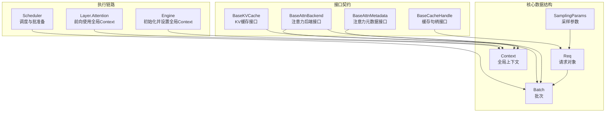
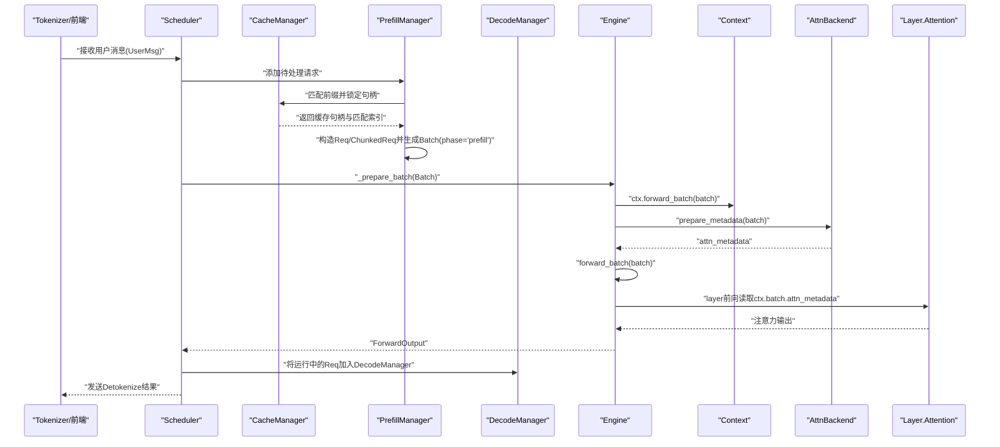
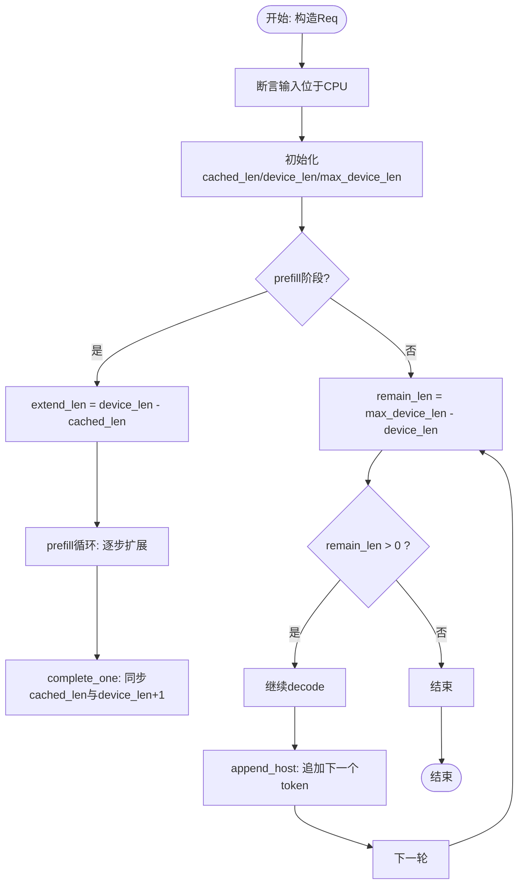
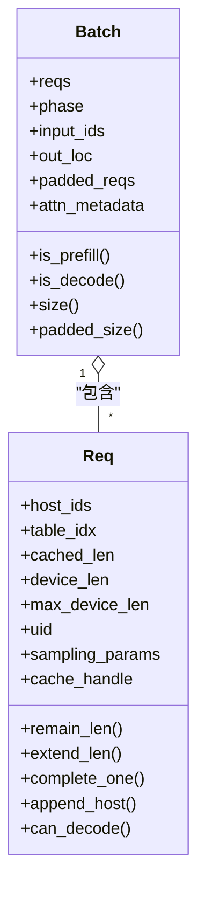
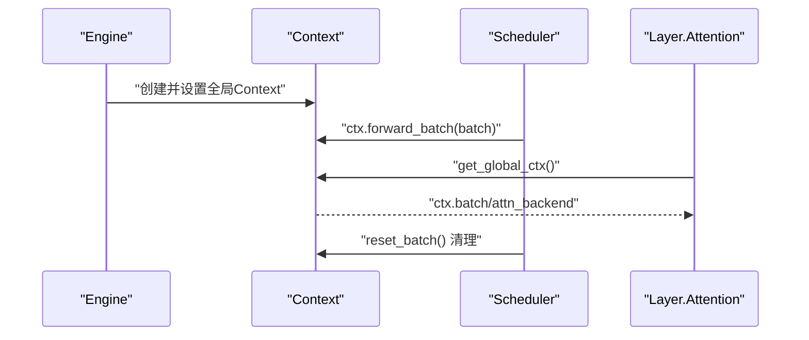
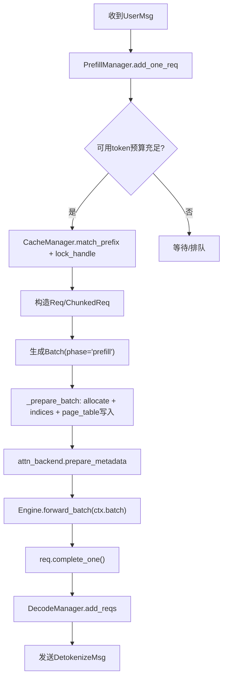
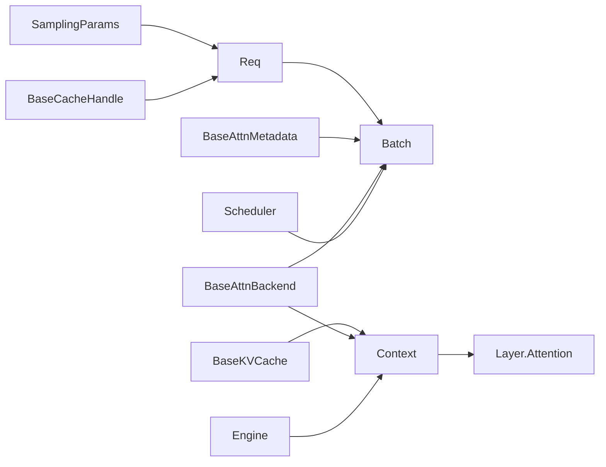

# 核心数据结构解析

<cite>
**本文引用的文件**
- [core.py](file://python/minisgl/core.py)
- [base.py（注意力接口）](file://python/minisgl/attention/base.py)
- [base.py（KV缓存接口）](file://python/minisgl/kvcache/base.py)
- [engine.py](file://python/minisgl/engine/engine.py)
- [scheduler.py](file://python/minisgl/scheduler/scheduler.py)
- [prefill.py](file://python/minisgl/scheduler/prefill.py)
- [decode.py](file://python/minisgl/scheduler/decode.py)
- [attention.py（层内使用上下文）](file://python/minisgl/layers/attention.py)
</cite>

## 目录
1. [引言](#引言)
2. [项目结构](#项目结构)
3. [核心组件](#核心组件)
4. [架构总览](#架构总览)
5. [详细组件分析](#详细组件分析)
6. [依赖关系分析](#依赖关系分析)
7. [性能考量](#性能考量)
8. [故障排查指南](#故障排查指南)
9. [结论](#结论)

## 引言
本文件围绕 mini-sglang 的核心数据结构展开，重点解析以下内容：
- Req 类如何表示一次推理请求，涵盖输入 token ID、采样参数、缓存句柄等字段及语义；
- Batch 类如何组织多个请求进行批处理，并区分 prefill 与 decode 阶段；
- 全局单例 Context 的设计目的及其在引擎与调度器之间共享状态的作用；
- 结合调度流程说明这些数据结构的生命周期与数据流转方式；
- 分析内存布局与性能优化考量。

## 项目结构
本次文档聚焦于核心数据结构与调度执行链路，涉及的关键模块如下：
- 数据结构：core.py 中的 Req、Batch、Context 及 SamplingParams
- 接口契约：attention/base.py 中的 BaseAttnBackend、BaseAttnMetadata；kvcache/base.py 中的 BaseKVCache、BaseCacheHandle
- 执行链路：engine/engine.py 初始化并设置全局 Context；scheduler/scheduler.py 调度生成 Batch 并驱动执行；layers/attention.py 在前向过程中通过全局 Context 获取 Batch 与注意力元数据

图表来源
- [core.py](file://python/minisgl/core.py#L14-L156)
- [base.py（注意力接口）](file://python/minisgl/attention/base.py#L1-L66)
- [base.py（KV缓存接口）](file://python/minisgl/kvcache/base.py#L1-L135)
- [engine.py](file://python/minisgl/engine/engine.py#L70-L113)
- [scheduler.py](file://python/minisgl/scheduler/scheduler.py#L180-L201)
- [attention.py（层内使用上下文）](file://python/minisgl/layers/attention.py#L47-L59)

章节来源
- [core.py](file://python/minisgl/core.py#L14-L156)
- [engine.py](file://python/minisgl/engine/engine.py#L70-L113)

## 核心组件
本节从数据结构定义、字段语义、关键方法与约束条件四个方面进行深入剖析。

- 采样参数 SamplingParams
  - 字段：top_k、ignore_eos、temperature、max_tokens
  - 作用：控制解码策略与输出长度上限
  - 复杂度：O(1) 访问，无额外空间开销

- 请求对象 Req
  - 关键字段
    - host_ids：CPU侧输入 token 序列（张量）
    - table_idx：该请求在页表中的行索引
    - cached_len：已缓存的长度
    - device_len：当前设备侧序列长度
    - max_device_len：最大设备侧序列长度（输入长度 + 输出长度）
    - uid：请求唯一标识
    - sampling_params：采样参数实例
    - cache_handle：缓存句柄，用于缓存匹配与释放
  - 约束与不变式
    - 输入必须位于 CPU（断言保证）
    - cached_len < device_len <= max_device_len
  - 关键方法
    - remain_len：剩余可写长度（max_device_len - device_len）
    - extend_len：本次扩展长度（device_len - cached_len）
    - complete_one：完成一次解码步进（cached_len 增至 device_len，device_len+1）
    - append_host：将下一个 token 追加到 host_ids
    - can_decode：是否仍可继续 decode（remain_len > 0）

- 批次 Batch
  - 关键字段
    - reqs：当前批次的请求集合
    - phase：批次阶段，"prefill" 或 "decode"
    - input_ids：从 token 池加载的输入 token 张量
    - out_loc：写入位置（页表索引）列表
    - padded_reqs：可能包含填充 dummy 请求的批次
    - attn_metadata：注意力后端生成的元数据
  - 属性
    - is_prefill / is_decode：阶段判断
    - size / padded_size：实际大小与填充后大小

- 全局上下文 Context
  - 关键字段
    - _batch：当前正在执行的 Batch（None 表示未设置）
    - page_table：CUDA 设备上的整型页表（二维、连续、int32）
    - kv_cache：KV 缓存实例
    - attn_backend：注意力后端实例
  - 方法
    - set_batch/reset_batch：设置/重置当前批次
    - forward_batch：上下文管理器，进入时设置 batch，退出时清理
    - batch 属性：获取当前 batch（断言确保已设置）

章节来源
- [core.py](file://python/minisgl/core.py#L14-L156)

## 架构总览
下图展示了从调度到执行的整体流程，以及核心数据结构在其中的角色与交互。

图表来源
- [scheduler.py](file://python/minisgl/scheduler/scheduler.py#L180-L201)
- [prefill.py](file://python/minisgl/scheduler/prefill.py#L114-L153)
- [decode.py](file://python/minisgl/scheduler/decode.py#L1-L30)
- [engine.py](file://python/minisgl/engine/engine.py#L196-L205)
- [attention.py（层内使用上下文）](file://python/minisgl/layers/attention.py#L47-L59)

## 详细组件分析

### Req 类：请求建模与状态演进
- 字段与语义
  - host_ids：CPU 侧输入 token 序列，便于后续解码与拼接
  - table_idx/cached_len/device_len/max_device_len：页表索引与长度三元组，刻画请求在缓存与设备侧的状态
  - sampling_params：采样策略与输出长度上限
  - cache_handle：缓存匹配与锁定的基础
- 生命周期要点
  - 构造时校验输入位于 CPU，并建立长度不变式
  - prefill 阶段：extend_len 表示本次可扩展的 token 数；当缓存命中时 cached_len 增长
  - decode 阶段：remain_len 决定是否还能继续生成；complete_one 将缓存与设备侧指针同步推进
  - append_host 用于将新 token 追加到 host_ids，供上层解码器使用
- 性能与内存
  - 使用张量拼接追加 token，注意避免频繁分配；可通过批量写入与页表索引减少拷贝
  - cached_len 与 device_len 的同步推进避免重复计算

图表来源
- [core.py](file://python/minisgl/core.py#L22-L71)

章节来源
- [core.py](file://python/minisgl/core.py#L22-L71)

### Batch 类：批处理组织与阶段区分
- 组织方式
  - reqs：当前批次的所有请求
  - phase："prefill" 或 "decode"，决定注意力后端选择与元数据准备路径
  - padded_reqs：可能包含 dummy 请求以满足 CUDA Graph 对齐或填充需求
- 关键属性
  - is_prefill/is_decode：基于 phase 判断
  - size/padded_size：统计信息，便于内存与图编排规划
- 与注意力后端的协作
  - attn_metadata：由注意力后端根据 phase 选择 prefill 或 decode 后端生成
  - input_ids/out_loc：由调度器在 _prepare_batch 中填充，供注意力后端与 KV 写入使用

图表来源
- [core.py](file://python/minisgl/core.py#L73-L100)

章节来源
- [core.py](file://python/minisgl/core.py#L73-L100)

### Context 单例：引擎与调度器共享状态
- 设计目的
  - 提供全局访问点，使注意力层与后端能够在不层层传递的情况下获取当前批次与元数据
  - 通过上下文管理器确保在一次前向期间只存在一个有效的 Batch
- 关键约束
  - page_table 必须为二维、CUDA、int32、连续，且断言 page_size==1
  - set_batch/reset_batch 提供严格的生命周期管理
- 与执行链路的关系
  - Engine 初始化时创建 Context 并设置为全局
  - Scheduler 在准备批时将 Batch 注入 Context
  - Layer.Attention 通过 get_global_ctx() 获取当前 Batch 与 attn_metadata

图表来源
- [engine.py](file://python/minisgl/engine/engine.py#L78-L84)
- [core.py](file://python/minisgl/core.py#L101-L156)
- [attention.py（层内使用上下文）](file://python/minisgl/layers/attention.py#L47-L59)

章节来源
- [engine.py](file://python/minisgl/engine/engine.py#L78-L84)
- [core.py](file://python/minisgl/core.py#L101-L156)
- [attention.py（层内使用上下文）](file://python/minisgl/layers/attention.py#L47-L59)

### 调度流程中的生命周期与数据流转
- 预填充阶段（prefill）
  - PrefillManager 从待处理队列中挑选请求，调用 CacheManager 匹配前缀并锁定句柄
  - 构造 Req 或 ChunkedReq，生成 Batch(phase="prefill")
  - Scheduler 在 _prepare_batch 中：
    - 分配 out_loc（写入位置）
    - 计算 load/write 索引，将 out_loc 写入 page_table
    - 调用注意力后端 prepare_metadata，生成 attn_metadata
  - Engine.forward_batch 在 Context 上下文中执行，随后每个 Req 完成一次步进（complete_one）
- 解码阶段（decode）
  - DecodeManager 维护可继续解码的 Req 集合
  - 当没有可预填充请求时，调度器生成 Batch(phase="decode")
  - 注意力后端根据 phase 选择 decode 后端，prepare_metadata 与执行路径不同
- 结果回传
  - Scheduler 将 next_token 写入 token_pool，并通过 DetokenizeMsg 返回给前端

图表来源
- [prefill.py](file://python/minisgl/scheduler/prefill.py#L114-L153)
- [scheduler.py](file://python/minisgl/scheduler/scheduler.py#L180-L201)
- [engine.py](file://python/minisgl/engine/engine.py#L196-L205)
- [decode.py](file://python/minisgl/scheduler/decode.py#L1-L30)

章节来源
- [prefill.py](file://python/minisgl/scheduler/prefill.py#L114-L153)
- [scheduler.py](file://python/minisgl/scheduler/scheduler.py#L180-L201)
- [engine.py](file://python/minisgl/engine/engine.py#L196-L205)
- [decode.py](file://python/minisgl/scheduler/decode.py#L1-L30)

## 依赖关系分析
- Req 依赖
  - 采样参数：SamplingParams
  - 缓存句柄：BaseCacheHandle（抽象接口）
- Batch 依赖
  - 注意力元数据：BaseAttnMetadata
  - 注意力后端：BaseAttnBackend
- Context 依赖
  - KV 缓存：BaseKVCache
  - 注意力后端：BaseAttnBackend
  - 页表：torch.Tensor（CUDA、int32、连续）
- 执行链路耦合
  - Engine 初始化并设置全局 Context
  - Scheduler 生成 Batch 并注入 Context
  - Layer.Attention 通过全局 Context 获取 Batch 与 attn_metadata

图表来源
- [core.py](file://python/minisgl/core.py#L14-L156)
- [base.py（注意力接口）](file://python/minisgl/attention/base.py#L1-L66)
- [base.py（KV缓存接口）](file://python/minisgl/kvcache/base.py#L1-L135)
- [engine.py](file://python/minisgl/engine/engine.py#L78-L84)
- [attention.py（层内使用上下文）](file://python/minisgl/layers/attention.py#L47-L59)

章节来源
- [core.py](file://python/minisgl/core.py#L14-L156)
- [base.py（注意力接口）](file://python/minisgl/attention/base.py#L1-L66)
- [base.py（KV缓存接口）](file://python/minisgl/kvcache/base.py#L1-L135)
- [engine.py](file://python/minisgl/engine/engine.py#L78-L84)
- [attention.py（层内使用上下文）](file://python/minisgl/layers/attention.py#L47-L59)

## 性能考量
- 内存布局与对齐
  - 页表 page_table 为二维、CUDA、int32、连续，且断言 page_size==1，有利于直接索引与零拷贝写入
  - KV 缓存按页分配，配合 out_loc 实现高效写入与复用
- 批处理与图编排
  - Scheduler 在 _prepare_batch 中计算 load/write 索引，将 out_loc 写入 page_table，随后注意力后端 prepare_metadata
  - Engine 使用 CUDA Graph（GraphRunner）对 decode 阶段进行捕获与回放，提升吞吐
- I/O 与流水线
  - Scheduler 采用重叠调度：在执行当前 batch 的同时处理上一批的结果，隐藏 CPU Latency
  - token_pool 与 page_table 的索引写入/读取均通过张量视图与连续内存操作，降低拷贝成本
- 采样与长度控制
  - SamplingParams 的 max_tokens 与模型最大序列长度共同限制输出长度，避免越界
  - decode 阶段通过 remain_len 控制是否继续生成，防止无效迭代

章节来源
- [scheduler.py](file://python/minisgl/scheduler/scheduler.py#L180-L201)
- [engine.py](file://python/minisgl/engine/engine.py#L196-L205)
- [attention.py（层内使用上下文）](file://python/minisgl/layers/attention.py#L47-L59)

## 故障排查指南
- 常见断言与错误
  - Req 构造断言输入位于 CPU，若传入 CUDA 张量会触发异常
  - Context 断言 page_table 为二维、CUDA、int32、连续，且 page_size==1
  - Context.batch 属性断言全局 batch 已设置，否则抛出异常
  - Engine.forward_batch 断言当前流与引擎流一致，避免流不匹配导致的执行错误
- 调试建议
  - 在调度器侧检查 _prepare_batch 中的 out_loc 分配与 page_table 写入是否正确
  - 在注意力后端侧确认 prepare_metadata 是否根据 phase 正确选择 prefill 或 decode 后端
  - 在层前向中验证 ctx.batch.attn_metadata 是否被正确使用
- 资源完整性
  - CacheManager 提供完整性检查，可在空闲时调用以检测缓存一致性问题

章节来源
- [core.py](file://python/minisgl/core.py#L101-L156)
- [engine.py](file://python/minisgl/engine/engine.py#L196-L205)
- [scheduler.py](file://python/minisgl/scheduler/scheduler.py#L226-L230)

## 结论
- Req、Batch、Context 三者构成了 mini-sglang 的核心数据骨架：Req 描述单个请求的状态与行为，Batch 组织多请求并区分阶段，Context 提供全局共享状态以便前后端协作。
- 通过严格的断言与清晰的生命周期管理，系统在保证正确性的同时兼顾了性能：页表与 KV 缓存的连续内存布局、索引化读写、注意力后端的阶段化选择与 CUDA Graph 回放，共同提升了吞吐与延迟表现。
- 在工程实践中，应重点关注：
  - 采样参数与长度约束的合理配置
  - 调度器在 _prepare_batch 中的索引计算与 page_table 写入
  - 注意力后端 prepare_metadata 的阶段选择与元数据生成
  - 全局 Context 的上下文管理与资源释放