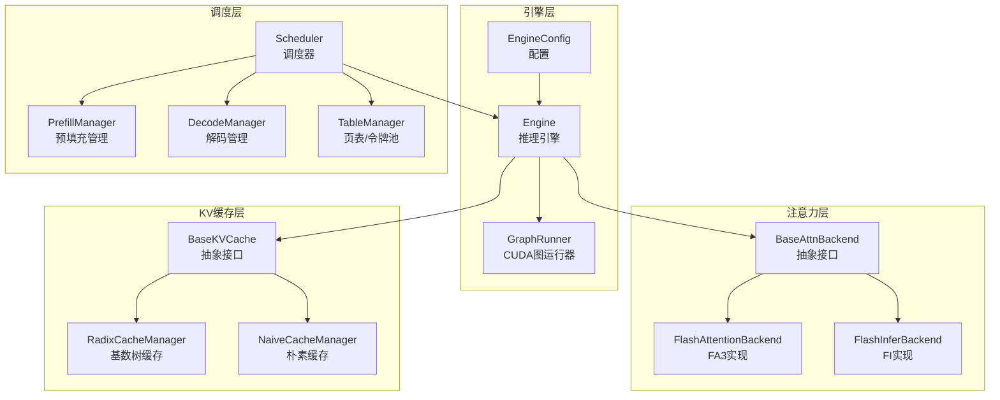
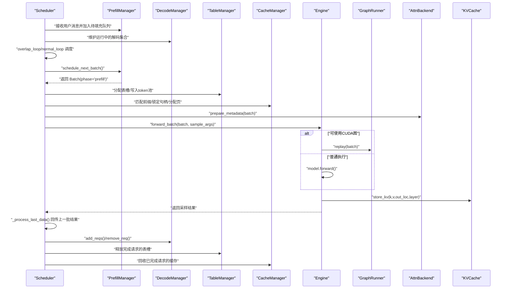
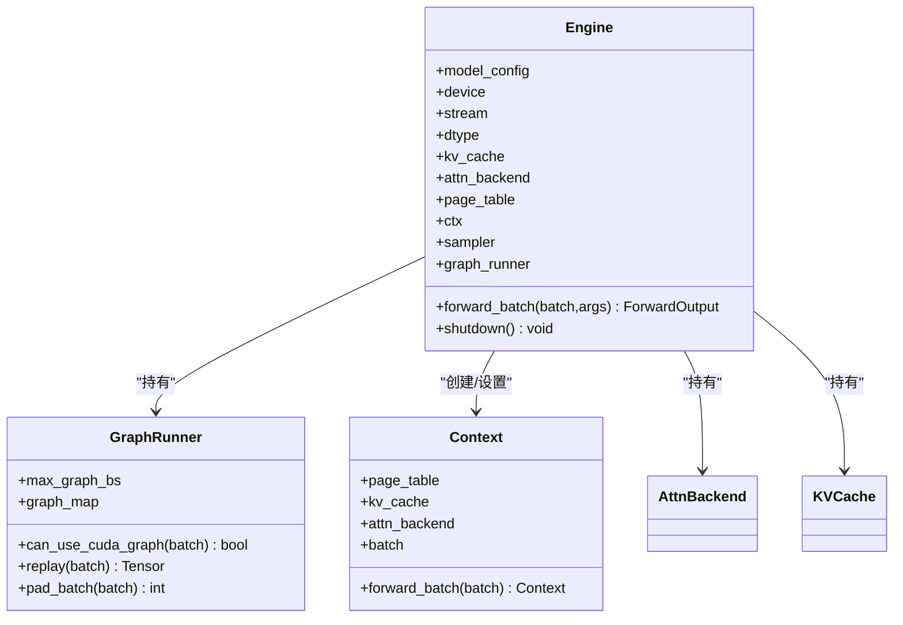
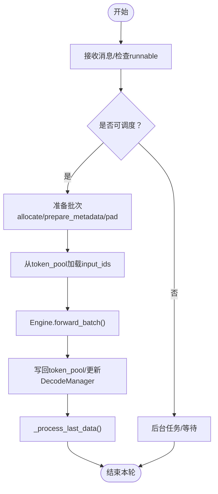
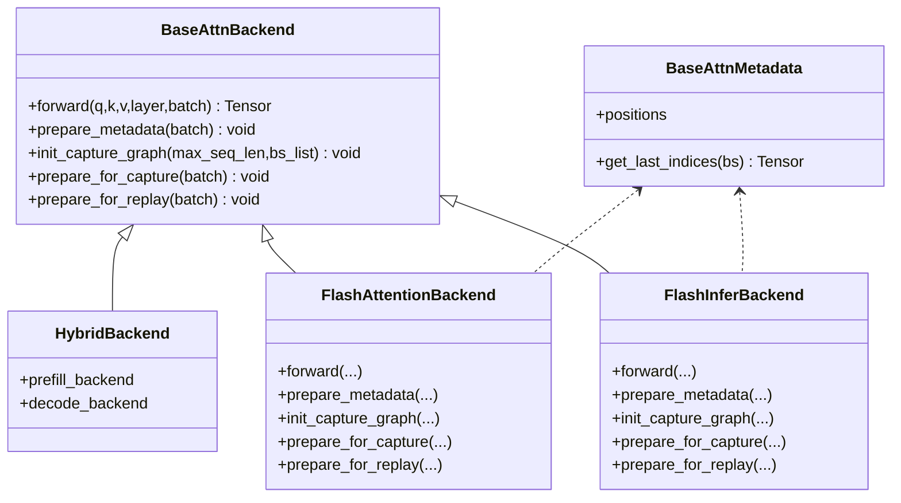
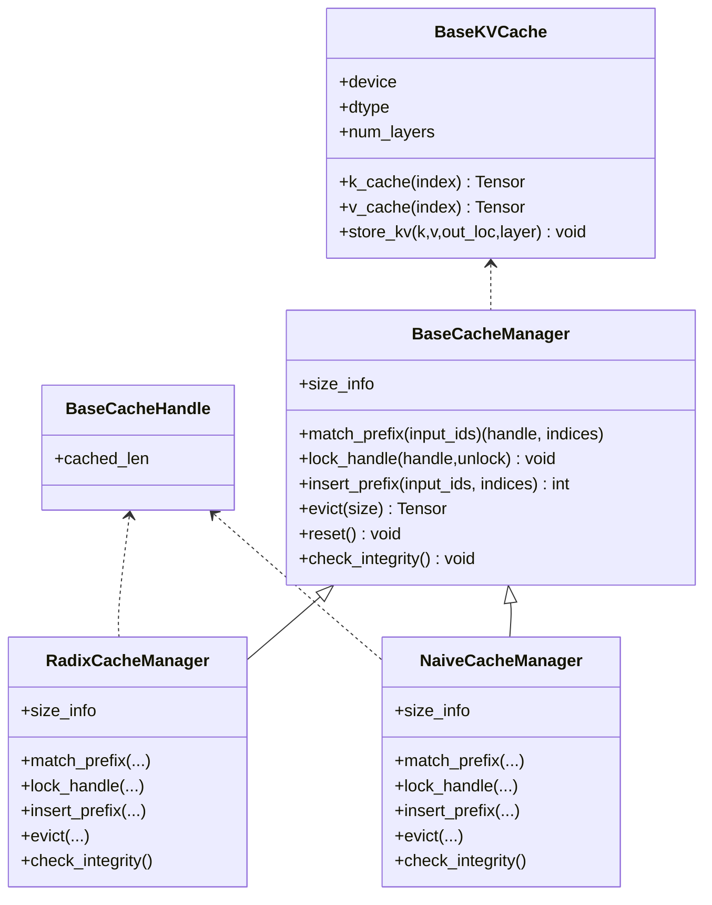
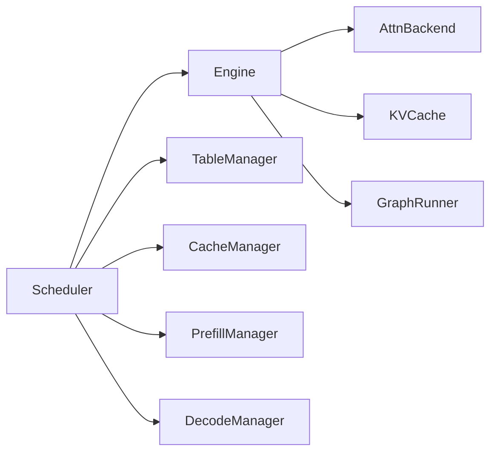

# 模块深度解析

<cite>
**本文引用的文件列表**
- [core.py](file://python/minisgl/core.py)
- [engine.py](file://python/minisgl/engine/engine.py)
- [config.py](file://python/minisgl/engine/config.py)
- [graph.py](file://python/minisgl/engine/graph.py)
- [scheduler.py](file://python/minisgl/scheduler/scheduler.py)
- [prefill.py](file://python/minisgl/scheduler/prefill.py)
- [decode.py](file://python/minisgl/scheduler/decode.py)
- [table.py](file://python/minisgl/scheduler/table.py)
- [base.py（注意力）](file://python/minisgl/attention/base.py)
- [fa3.py（注意力）](file://python/minisgl/attention/fa3.py)
- [fi.py（注意力）](file://python/minisgl/attention/fi.py)
- [base.py（KV缓存）](file://python/minisgl/kvcache/base.py)
- [radix_manager.py（KV缓存）](file://python/minisgl/kvcache/radix_manager.py)
- [naive_manager.py（KV缓存）](file://python/minisgl/kvcache/naive_manager.py)
</cite>

## 目录
1. [引言](#引言)
2. [项目结构](#项目结构)
3. [核心组件](#核心组件)
4. [架构总览](#架构总览)
5. [详细组件分析](#详细组件分析)
6. [依赖关系分析](#依赖关系分析)
7. [性能考量](#性能考量)
8. [故障排查指南](#故障排查指南)
9. [结论](#结论)

## 引言
本文件面向希望深入理解 MiniSGLang 核心代码的工程师与研究者，围绕以下目标展开系统性剖析：
- 解析 core.py 中 Req、Batch、Context 等核心数据结构的设计与职责边界
- 深入 engine 模块：Engine 如何统一管理模型、KV 缓存、注意力后端与 CUDA 图
- 分析 scheduler 模块的调度逻辑：prefill 与 decode 阶段的管理、批处理策略与重叠调度循环
- 解析 attention 与 kvcache 模块的抽象接口与具体实现，说明如何支持多后端与缓存策略

## 项目结构
MiniSGLang 的 Python 包组织采用“按功能域分层”的方式，核心模块分布如下：
- engine：引擎初始化、推理执行、CUDA 图捕获与回放
- scheduler：请求调度、预填充与解码阶段管理、重叠调度循环
- attention：注意力后端抽象与实现（FlashAttention、FlashInfer）
- kvcache：KV 缓存抽象与实现（基数树、朴素缓存）
- 其他：消息通信、分布式、模型加载、采样器等

图表来源
- [engine.py](file://python/minisgl/engine/engine.py#L1-L217)
- [scheduler.py](file://python/minisgl/scheduler/scheduler.py#L1-L285)
- [attention/base.py](file://python/minisgl/attention/base.py#L1-L66)
- [kvcache/base.py](file://python/minisgl/kvcache/base.py#L1-L135)

章节来源
- [engine.py](file://python/minisgl/engine/engine.py#L1-L217)
- [scheduler.py](file://python/minisgl/scheduler/scheduler.py#L1-L285)

## 核心组件
本节聚焦 core.py 中的核心数据结构，阐明其在系统中的角色与约束。

- Req（请求）
  - 字段与语义：包含输入 token、表索引、已缓存长度、设备侧长度、最大长度、采样参数、缓存句柄等；提供 remain_len、extend_len、complete_one、append_host、can_decode 等方法
  - 设计要点：严格断言输入位于 CPU，确保与页表/令牌池交互的安全性；通过 cached_len/device_len/max_device_len 维护状态机
- Batch（批次）
  - 字段与语义：包含 req 列表、阶段（prefill/decode）、输入 id、输出位置、填充后的 req 列表、注意力元数据
  - 设计要点：phase 与 is_prefill/is_decode 属性驱动注意力后端选择；padded_reqs 支持 CUDA 图批对齐
- Context（上下文）
  - 字段与语义：全局上下文持有当前 batch、页表、KV 缓存、注意力后端；提供 set_batch/reset_batch/forward_batch 上下文管理
  - 设计要点：page_table 必须为 CUDA 连续整型二维张量；通过全局单例保证注意力后端与缓存的一致性

章节来源
- [core.py](file://python/minisgl/core.py#L1-L156)

## 架构总览
下面以“调度-执行-注意力-缓存”为主线，展示各模块间的调用关系与数据流。

图表来源
- [scheduler.py](file://python/minisgl/scheduler/scheduler.py#L1-L285)
- [engine.py](file://python/minisgl/engine/engine.py#L1-L217)
- [graph.py](file://python/minisgl/engine/graph.py#L1-L156)
- [attention/base.py](file://python/minisgl/attention/base.py#L1-L66)
- [kvcache/base.py](file://python/minisgl/kvcache/base.py#L1-L135)

## 详细组件分析

### Engine 类：模型、KV缓存、注意力后端与 CUDA 图
- 初始化流程
  - 设置分布式与设备流，加载模型权重，确定页数与最大序列长度
  - 创建 KV 缓存、页表、注意力后端，并构建 Context 与全局上下文
  - 初始化采样器与 GraphRunner（捕获不同 batch size 的 CUDA 图）
- 执行流程
  - forward_batch 在当前引擎流中执行：若满足 CUDA 图条件则回放，否则直接调用模型前向
  - 对每个请求执行一次 complete_one，推进设备侧长度
  - 使用 Sampler 基于 batch 采样参数生成下一 token，并异步拷贝到 CPU
- 内存与拓扑
  - 通过跨 rank 同步与 all_reduce 检测内存均衡性
  - 通过 page_size 对齐与 dummy_req 填充，保障 CUDA 图稳定性

图表来源
- [engine.py](file://python/minisgl/engine/engine.py#L1-L217)
- [graph.py](file://python/minisgl/engine/graph.py#L1-L156)
- [core.py](file://python/minisgl/core.py#L101-L156)

章节来源
- [engine.py](file://python/minisgl/engine/engine.py#L1-L217)
- [graph.py](file://python/minisgl/engine/graph.py#L1-L156)
- [config.py](file://python/minisgl/engine/config.py#L1-L55)

### Scheduler：调度逻辑与重叠循环
- 管理器职责
  - PrefillManager：从待填充队列挑选请求，基于 CacheManager 与 TableManager 分配缓存与表槽，支持分片（ChunkedReq）
  - DecodeManager：维护运行中的解码集合，统计在途 token 数，决定解码批次
  - TableManager：维护空闲槽位，提供 token_pool 与 page_table 的二维索引能力
- 批次准备
  - allocate/prepare_metadata/写入 page_table/构造 out_loc，确保注意力后端能正确读取 KV
  - pad_batch 与 dummy_page 用于 CUDA 图批对齐
- 重叠调度
  - overlap_loop 将“上一批结果处理”与“当前批次执行”重叠，通过引擎流与调度流同步提升利用率
  - normal_loop 顺序模式，便于调试与对比
- 结果回传
  - _process_last_data 同步上一批采样事件，拼装 DetokenizeMsg 并释放完成请求资源

图表来源
- [scheduler.py](file://python/minisgl/scheduler/scheduler.py#L1-L285)
- [prefill.py](file://python/minisgl/scheduler/prefill.py#L1-L154)
- [decode.py](file://python/minisgl/scheduler/decode.py#L1-L31)
- [table.py](file://python/minisgl/scheduler/table.py#L1-L20)

章节来源
- [scheduler.py](file://python/minisgl/scheduler/scheduler.py#L1-L285)
- [prefill.py](file://python/minisgl/scheduler/prefill.py#L1-L154)
- [decode.py](file://python/minisgl/scheduler/decode.py#L1-L31)
- [table.py](file://python/minisgl/scheduler/table.py#L1-L20)

### Attention 抽象与实现
- 抽象接口
  - BaseAttnBackend：定义 forward、prepare_metadata、init_capture_graph、prepare_for_capture、prepare_for_replay
  - BaseAttnMetadata：定义 positions 与 get_last_indices
  - HybridBackend：根据 Batch 阶段自动切换 prefill/decode 后端
- 实现一：FlashAttentionBackend（FA3）
  - 使用自定义内核接口，将 KV 写入缓存并计算注意力输出
  - prepare_metadata 计算 cu_seqlens、cache_seqlens、positions，并构造 FA3Metadata
  - CUDA 图：prepare_for_capture/prepare_for_replay 复用捕获缓冲区，decode 专用
- 实现二：FlashInferBackend（FI）
  - 基于 FlashInfer 的批处理封装，支持 prefill/decode 双通道
  - prepare_metadata 构造 FIMetadata，包含 cu_seqlens_cpu/gpu、indices、last_page_len 等
  - CUDA 图：CUDAGraphBatchDecodeWithPagedKVCacheWrapper，支持 tensor cores 优化

图表来源
- [attention/base.py](file://python/minisgl/attention/base.py#L1-L66)
- [fa3.py](file://python/minisgl/attention/fa3.py#L1-L211)
- [fi.py](file://python/minisgl/attention/fi.py#L1-L278)

章节来源
- [attention/base.py](file://python/minisgl/attention/base.py#L1-L66)
- [fa3.py](file://python/minisgl/attention/fa3.py#L1-L211)
- [fi.py](file://python/minisgl/attention/fi.py#L1-L278)

### KVCache 抽象与实现
- 抽象接口
  - BaseKVCache：提供 k_cache/v_cache 与 store_kv 接口，暴露设备与 dtype 等属性
  - BaseCacheManager：定义 match_prefix/lock_handle/insert_prefix/evict/reset/check_integrity 等
  - BaseCacheHandle：携带 cached_len 等信息
- 实现一：RadixCacheManager
  - 基于基数树的前缀匹配与缓存回收，支持 ref_count 保护与 LRU 风格的叶子节点回收
  - 提供 size_info（evictable_size/protected_size），支持完整性检查
- 实现二：NaiveCacheManager
  - 朴素实现，不进行前缀匹配与回收，适合简单场景或测试

图表来源
- [kvcache/base.py](file://python/minisgl/kvcache/base.py#L1-L135)
- [radix_manager.py](file://python/minisgl/kvcache/radix_manager.py#L1-L221)
- [naive_manager.py](file://python/minisgl/kvcache/naive_manager.py#L1-L45)

章节来源
- [kvcache/base.py](file://python/minisgl/kvcache/base.py#L1-L135)
- [radix_manager.py](file://python/minisgl/kvcache/radix_manager.py#L1-L221)
- [naive_manager.py](file://python/minisgl/kvcache/naive_manager.py#L1-L45)

## 依赖关系分析
- 模块耦合
  - Engine 依赖注意力后端与 KV 缓存接口，通过抽象隔离具体实现差异
  - Scheduler 依赖 TableManager、CacheManager、PrefillManager、DecodeManager，形成清晰的调度职责分离
  - GraphRunner 仅依赖注意力后端的捕获接口，避免与模型细节耦合
- 关键依赖链
  - Scheduler -> Engine -> AttnBackend/KVCache -> GraphRunner（decode路径）
  - Scheduler -> TableManager/CacheManager -> KVCache（prefill路径）

图表来源
- [scheduler.py](file://python/minisgl/scheduler/scheduler.py#L1-L285)
- [engine.py](file://python/minisgl/engine/engine.py#L1-L217)
- [graph.py](file://python/minisgl/engine/graph.py#L1-L156)

章节来源
- [scheduler.py](file://python/minisgl/scheduler/scheduler.py#L1-L285)
- [engine.py](file://python/minisgl/engine/engine.py#L1-L217)
- [graph.py](file://python/minisgl/engine/graph.py#L1-L156)

## 性能考量
- CUDA 图
  - GraphRunner 在初始化时捕获多个 batch size 的图，decode 专用，显著降低内核启动开销
  - 通过 pad_batch 与 dummy_req 保证批大小对齐，减少图数量与内存占用
- 注意力后端
  - FA3/FI 均支持 CUDA 图捕获与回放；FI 还支持 Tensor Cores 优化，依据 GQA 比例动态启用
- 内存与拓扑
  - 跨 rank 内存均衡检测，避免显存倾斜导致吞吐下降
  - 页表对齐与 dummy 页面填充，提升缓存命中与内存访问效率
- 调度策略
  - overlap_loop 将 CPU 结果处理与 GPU 执行重叠，隐藏 CPU-latency，提高 GPU 利用率

[本节为通用性能建议，无需列出具体文件来源]

## 故障排查指南
- CUDA 图相关
  - 若捕获失败或显存不足，检查 GraphRunner 的 batch size 列表与可用显存；必要时减小 cuda_graph_max_bs 或禁用 CUDA 图
  - 回放失败通常由 out_loc/cu_seqlens/positions 未正确更新引起，确认 prepare_for_replay 已被调用
- 注意力后端
  - FA3 需要 sgl_kernel，缺少依赖会抛出导入异常；确保安装并正确加载
  - FI 需要 FlashInfer，注意版本兼容与工作空间缓冲区大小
- 调度与缓存
  - 若出现请求被丢弃或提前结束，检查 max_seq_len 与 max_tokens 的限制逻辑
  - CacheManager 完整性检查失败时，优先检查 radix 树的锁与回收逻辑
- 分布式
  - 分布式初始化失败或内存不平衡错误时，检查分布式地址、超时与 TP 配置

章节来源
- [graph.py](file://python/minisgl/engine/graph.py#L1-L156)
- [fa3.py](file://python/minisgl/attention/fa3.py#L144-L211)
- [fi.py](file://python/minisgl/attention/fi.py#L1-L278)
- [scheduler.py](file://python/minisgl/scheduler/scheduler.py#L1-L285)
- [kvcache/base.py](file://python/minisgl/kvcache/base.py#L1-L135)

## 结论
MiniSGLang 通过清晰的抽象与模块化设计，在 Engine/Scheduler/Attention/KVCache 四个维度实现了高内聚低耦合的架构：
- core.py 的 Req/Batch/Context 为系统提供了稳定的状态与上下文管理
- engine 模块将模型、KV 缓存、注意力后端与 CUDA 图整合为统一执行单元
- scheduler 模块以 Prefill/Decode 两条主线清晰划分，结合重叠调度显著提升吞吐
- attention 与 kvcache 模块通过抽象接口与多实现，支持灵活的后端与缓存策略

该设计既便于扩展新后端与缓存策略，也便于在生产环境中进行性能优化与问题定位。