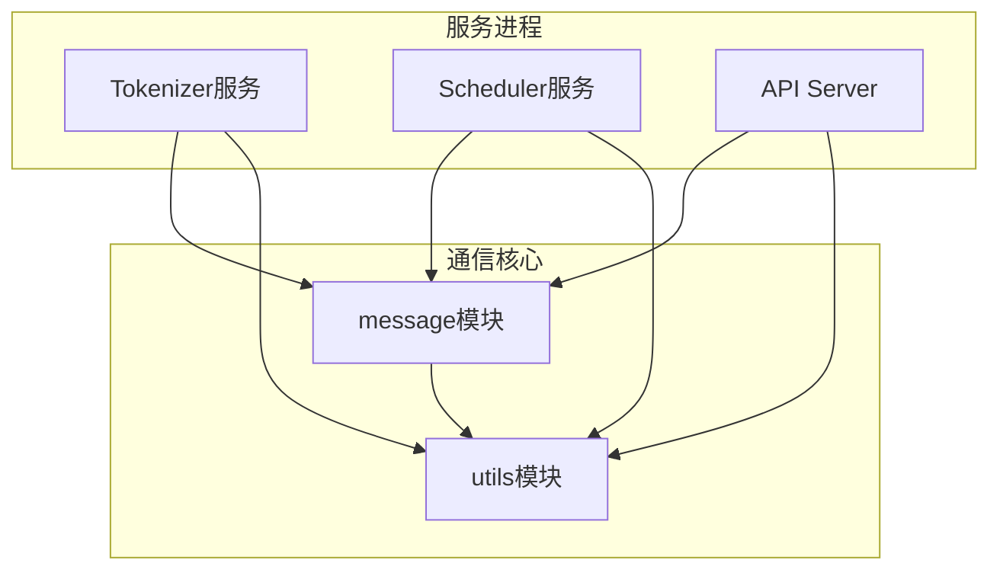
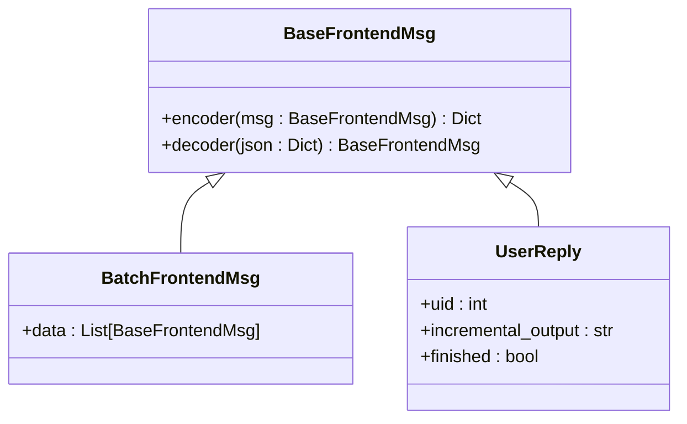
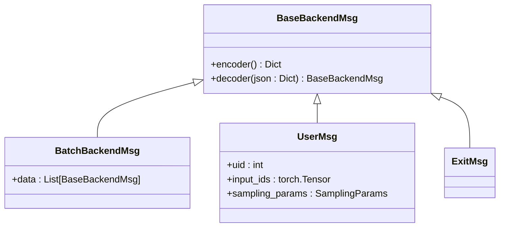
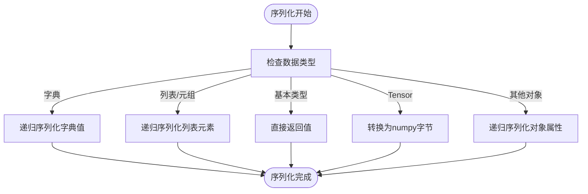
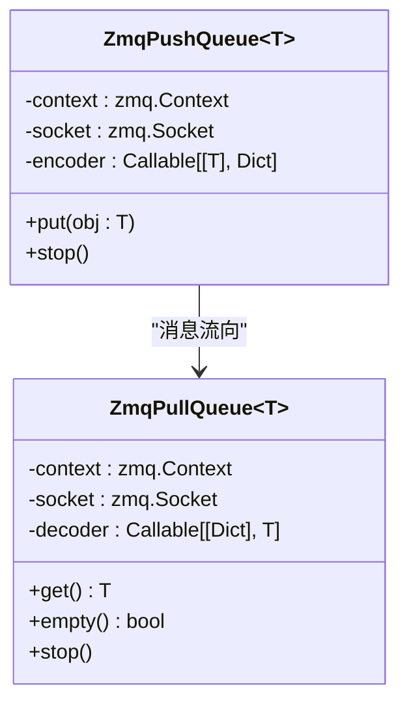
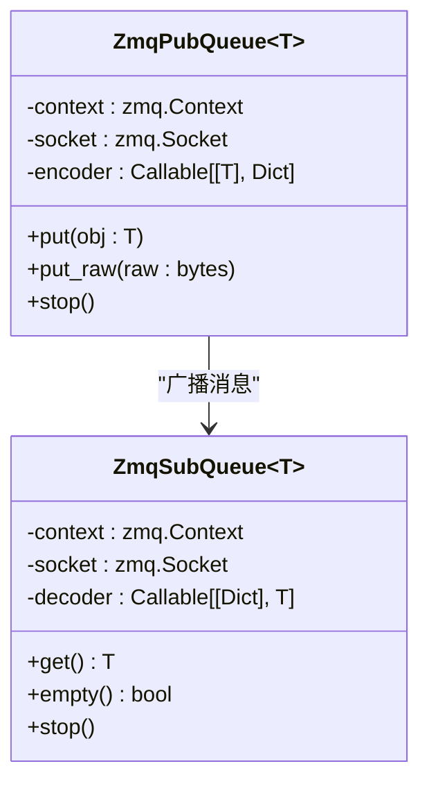
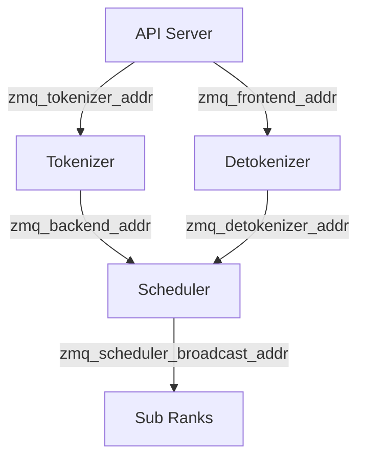
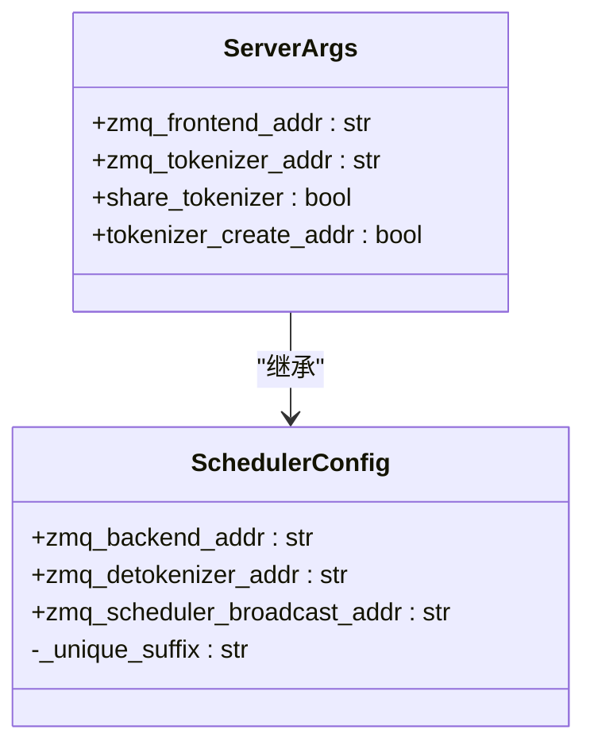
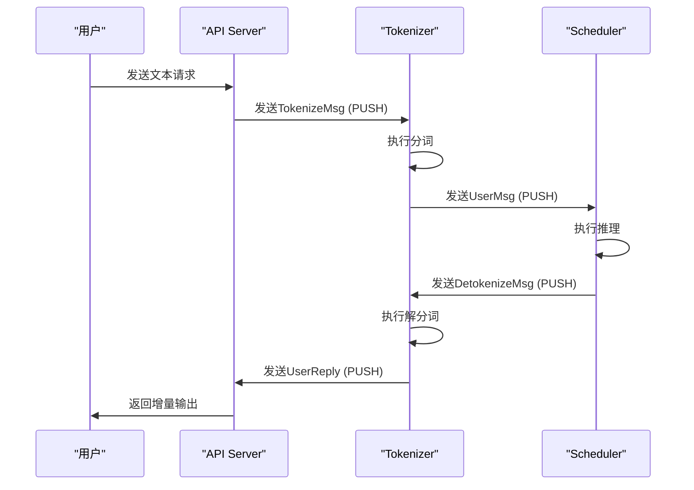
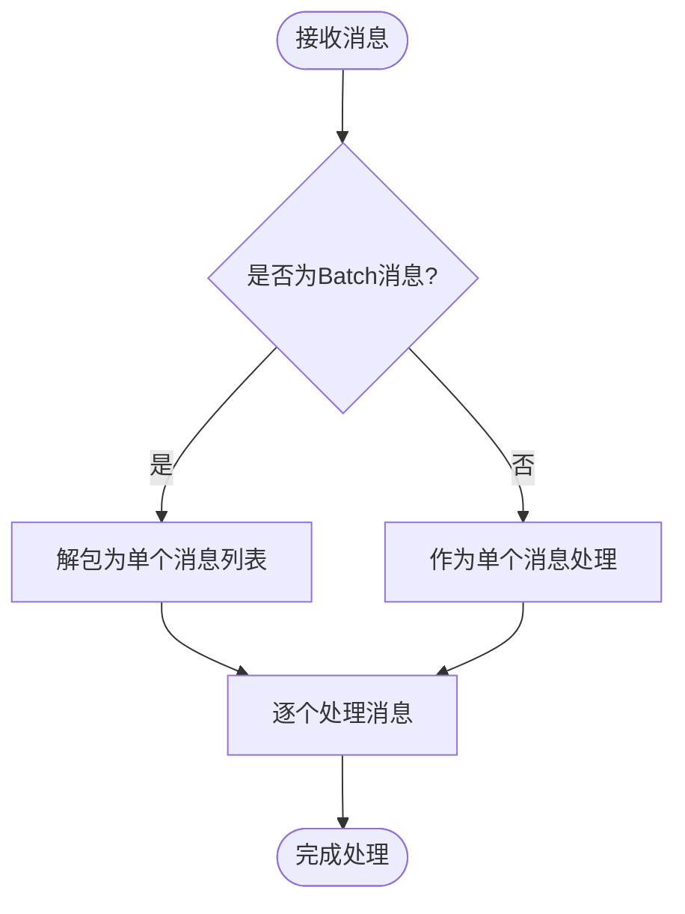

# 控制流：基于ZeroMQ的消息通信

<cite>
**本文档引用的文件**
- [frontend.py](file://python/minisgl/message/frontend.py)
- [backend.py](file://python/minisgl/message/backend.py)
- [mp.py](file://python/minisgl/utils/mp.py)
- [utils.py](file://python/minisgl/message/utils.py)
- [server.py](file://python/minisgl/tokenizer/server.py)
- [tokenize.py](file://python/minisgl/tokenizer/tokenize.py)
- [detokenize.py](file://python/minisgl/tokenizer/detokenize.py)
- [io.py](file://python/minisgl/scheduler/io.py)
- [scheduler.py](file://python/minisgl/scheduler/scheduler.py)
- [config.py](file://python/minisgl/scheduler/config.py)
- [args.py](file://python/minisgl/server/args.py)
- [api_server.py](file://python/minisgl/server/api_server.py)
</cite>

## 目录
1. [项目结构](#项目结构)
2. [核心消息类型与序列化机制](#核心消息类型与序列化机制)
3. [ZeroMQ消息队列封装](#zeromq消息队列封装)
4. [进程间通信拓扑与地址配置](#进程间通信拓扑与地址配置)
5. [完整消息流转时序分析](#完整消息流转时序分析)
6. [潜在通信瓶颈与优化建议](#潜在通信瓶颈与优化建议)

## 项目结构

mini-sglang项目采用模块化设计，其核心控制流通信机制主要分布在`message`、`utils`、`tokenizer`和`scheduler`等模块中。`message`模块定义了所有进程间通信的消息类型，`utils/mp.py`提供了ZeroMQ队列的高级封装，`tokenizer`模块实现了分词与解分词服务，而`scheduler`模块则负责请求的调度与执行。

**图示来源**
- [message/frontend.py](file://python/minisgl/message/frontend.py)
- [utils/mp.py](file://python/minisgl/utils/mp.py)
- [tokenizer/server.py](file://python/minisgl/tokenizer/server.py)

**本节来源**
- [project_structure](file://project_structure)

## 核心消息类型与序列化机制

### 前端消息类型
前端消息主要由`UserReply`和`BatchFrontendMsg`构成，用于从服务端向API Server返回响应。`UserReply`包含用户ID（uid）、增量输出（incremental_output）和完成状态（finished）三个字段。

**图示来源**
- [message/frontend.py](file://python/minisgl/message/frontend.py#L9-L30)

**本节来源**
- [message/frontend.py](file://python/minisgl/message/frontend.py#L1-L30)

### 后端消息类型
后端消息主要由`UserMsg`和`BatchBackendMsg`构成，用于从Tokenizer向Scheduler传递请求。`UserMsg`包含用户ID（uid）、输入ID张量（input_ids）和采样参数（sampling_params）。

**图示来源**
- [message/backend.py](file://python/minisgl/message/backend.py#L12-L37)

**本节来源**
- [message/backend.py](file://python/minisgl/message/backend.py#L1-L37)

### 高效序列化原理
消息的序列化通过`message/utils.py`中的`serialize_type`和`deserialize_type`函数实现。该机制支持递归序列化任意Python对象，特别针对`torch.Tensor`进行了优化，将其转换为字节缓冲区进行传输，从而实现高效的数据序列化。

**图示来源**
- [message/utils.py](file://python/minisgl/message/utils.py#L9-L70)

**本节来源**
- [message/utils.py](file://python/minisgl/message/utils.py#L1-L70)

## ZeroMQ消息队列封装

`utils/mp.py`模块提供了对ZeroMQ的高级封装，包括`ZmqPushQueue`、`ZmqPullQueue`、`ZmqPubQueue`和`ZmqSubQueue`四种队列类型，分别对应PUSH/PULL和PUB/SUB通信模式。

### PUSH/PULL队列
PUSH/PULL模式用于点对点的单向消息传递，常用于任务分发和结果收集。

**图示来源**
- [utils/mp.py](file://python/minisgl/utils/mp.py#L12-L31)

**本节来源**
- [utils/mp.py](file://python/minisgl/utils/mp.py#L1-L152)

### PUB/SUB队列
PUB/SUB模式用于一对多的广播消息传递，常用于多进程环境下的消息同步。

**图示来源**
- [utils/mp.py](file://python/minisgl/utils/mp.py#L105-L152)

**本节来源**
- [utils/mp.py](file://python/minisgl/utils/mp.py#L1-L152)

## 进程间通信拓扑与地址配置

### 通信拓扑结构
mini-sglang的进程间通信采用星型拓扑结构，API Server作为中心节点，与Tokenizer、Scheduler等服务进程进行通信。

**图示来源**
- [scheduler/config.py](file://python/minisgl/scheduler/config.py#L24-L33)
- [server/args.py](file://python/minisgl/server/args.py#L26-L35)

**本节来源**
- [scheduler/config.py](file://python/minisgl/scheduler/config.py#L1-L42)
- [server/args.py](file://python/minisgl/server/args.py#L1-L235)

### 地址配置机制
通信地址通过`SchedulerConfig`和`ServerArgs`中的属性方法动态生成，使用进程ID作为后缀确保唯一性。

**图示来源**
- [scheduler/config.py](file://python/minisgl/scheduler/config.py#L24-L33)
- [server/args.py](file://python/minisgl/server/args.py#L26-L35)

**本节来源**
- [scheduler/config.py](file://python/minisgl/scheduler/config.py#L1-L42)
- [server/args.py](file://python/minisgl/server/args.py#L1-L235)

## 完整消息流转时序分析

### 用户请求到响应的完整流程
从用户请求到最终响应返回，涉及API Server、Tokenizer、Scheduler等多个组件的协同工作。

**图示来源**
- [server/api_server.py](file://python/minisgl/server/api_server.py#L384-L425)
- [tokenizer/server.py](file://python/minisgl/tokenizer/server.py#L30-L101)
- [scheduler/scheduler.py](file://python/minisgl/scheduler/scheduler.py#L155-L178)

**本节来源**
- [server/api_server.py](file://python/minisgl/server/api_server.py#L1-L425)
- [tokenizer/server.py](file://python/minisgl/tokenizer/server.py#L1-L101)
- [scheduler/scheduler.py](file://python/minisgl/scheduler/scheduler.py#L1-L285)

### 批处理与消息解包
系统支持批量消息处理，通过`Batch*Msg`类型实现消息的批量传输与处理。

**图示来源**
- [tokenizer/server.py](file://python/minisgl/tokenizer/server.py#L23-L26)
- [scheduler/scheduler.py](file://python/minisgl/scheduler/scheduler.py#L155-L158)

**本节来源**
- [tokenizer/server.py](file://python/minisgl/tokenizer/server.py#L1-L101)
- [scheduler/scheduler.py](file://python/minisgl/scheduler/scheduler.py#L1-L285)

## 潜在通信瓶颈与优化建议

### 潜在通信瓶颈
1. **单点瓶颈**：当前架构中，Tokenizer作为中心节点，可能成为性能瓶颈。
2. **序列化开销**：频繁的序列化/反序列化操作可能带来额外的CPU开销。
3. **IPC通信延迟**：使用IPC协议进行进程间通信可能存在延迟问题。

### 优化建议
1. **并行化处理**：增加Tokenizer进程数量，实现负载均衡。
2. **批量优化**：优化批量消息的处理逻辑，减少序列化次数。
3. **连接复用**：复用ZeroMQ连接，减少连接建立开销。
4. **异步处理**：采用异步队列（ZmqAsyncPushQueue/ZmqAsyncPullQueue）提高吞吐量。

**本节来源**
- [tokenizer/server.py](file://python/minisgl/tokenizer/server.py#L38-L39)
- [utils/mp.py](file://python/minisgl/utils/mp.py#L33-L52)
- [scheduler/io.py](file://python/minisgl/scheduler/io.py#L35-L45)