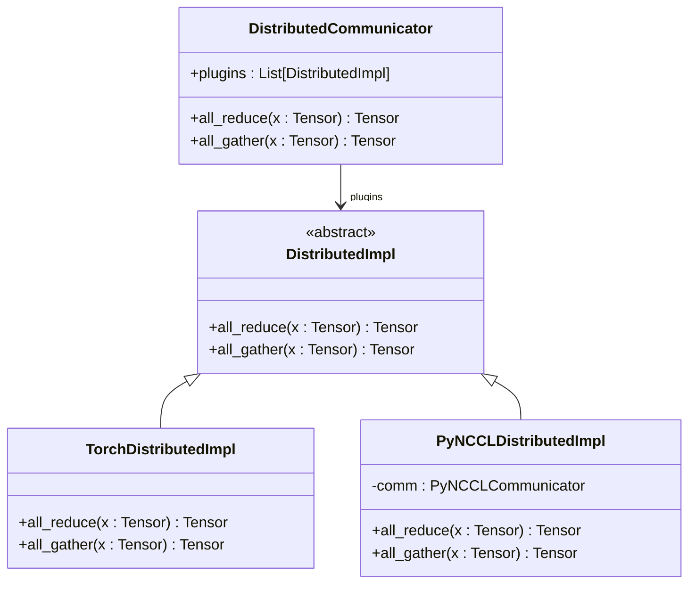
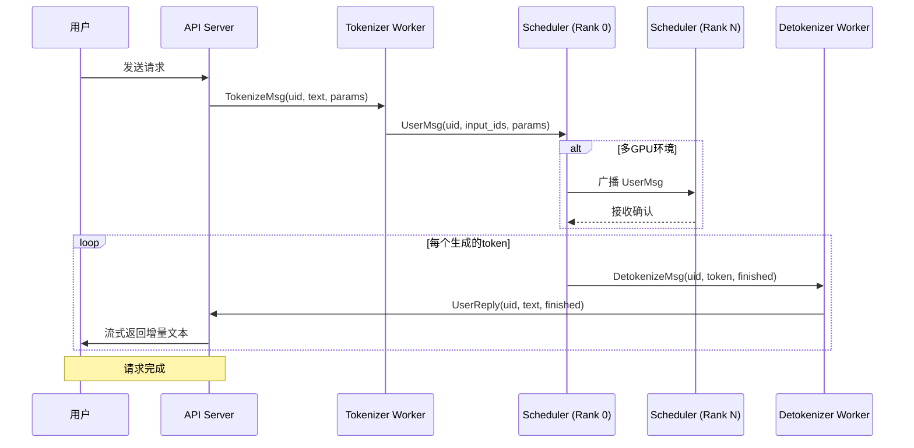

# 数据流与通信机制

<cite>
**本文档引用的文件**
- [frontend.py](file://python/minisgl/message/frontend.py)
- [backend.py](file://python/minisgl/message/backend.py)
- [utils.py](file://python/minisgl/message/utils.py)
- [structures.md](file://docs/structures.md)
- [api_server.py](file://python/minisgl/server/api_server.py)
- [tokenizer/server.py](file://python/minisgl/tokenizer/server.py)
- [scheduler/scheduler.py](file://python/minisgl/scheduler/scheduler.py)
- [scheduler/io.py](file://python/minisgl/scheduler/io.py)
- [distributed/impl.py](file://python/minisgl/distributed/impl.py)
- [kernel/pynccl.py](file://python/minisgl/kernel/pynccl.py)
- [utils/mp.py](file://python/minisgl/utils/mp.py)
- [server/args.py](file://python/minisgl/server/args.py)
</cite>

## 目录
1. [引言](#引言)
2. [双通道通信架构概述](#双通道通信架构概述)
3. [控制流：基于ZeroMQ的消息传递](#控制流基于zeromq的消息传递)
4. [数据流：基于NCCL的张量同步](#数据流基于nccl的张量同步)
5. [消息序列化与反序列化机制](#消息序列化与反序列化机制)
6. [请求生命周期与消息流转时序](#请求生命周期与消息流转时序)
7. [ZMQ套接字地址配置](#zmq套接字地址配置)
8. [结论](#结论)

## 引言

mini-sglang 是一个为大型语言模型（LLM）推理设计的分布式系统，其核心在于通过双通道通信架构实现高效、低延迟的推理服务。该架构将控制流与数据流分离，分别使用 ZeroMQ 和 NCCL 两种技术。控制流负责在 API Server、Tokenizer、Scheduler 和 Detokenizer 等组件之间传递序列化消息，协调整个推理流程；而数据流则专注于在多 GPU 环境下，利用 NCCL 实现跨 GPU 的张量同步，确保模型在张量并行（Tensor Parallelism）模式下正确运行。本文将深入解析这一双通道架构，详细阐述其工作原理和实现细节。

## 双通道通信架构概述

mini-sglang 的双通道通信架构是其高性能的关键。该架构将通信分为两个独立的通道：

1.  **控制流（Control Flow）**：使用 **ZeroMQ** 作为消息传递中间件。它承载着轻量级的、结构化的控制消息，如 `UserMsg`、`UserReply` 等。这些消息在 API Server、Tokenizer Worker、Scheduler Worker 和 Detokenizer Worker 之间传递，用于协调请求的接收、分发、处理和响应。ZeroMQ 的轻量级和高吞吐特性使其非常适合处理这类控制信号。

2.  **数据流（Data Flow）**：使用 **NCCL**（NVIDIA Collective Communications Library）进行张量数据的同步。当系统在多 GPU 环境下运行时，模型的权重和激活值被分割到不同的 GPU 上。在推理过程中，特别是在采样阶段，需要在所有 GPU 之间进行 `all-reduce` 等集体通信操作，以聚合计算结果。NCCL 针对 NVIDIA GPU 和网络进行了高度优化，能够提供极高的带宽和极低的延迟，是实现高效张量并行的理想选择。

这种分离设计使得控制逻辑和数据计算可以并行进行，避免了相互阻塞，从而最大化了系统的整体吞吐量和资源利用率。

## 控制流：基于ZeroMQ的消息传递

控制流是 mini-sglang 各组件协同工作的神经系统。它通过 ZeroMQ 的 `PUSH/PULL` 和 `PUB/SUB` 模式，在不同进程间传递消息。

### 核心消息类型

消息的定义位于 `python/minisgl/message/` 目录下，主要分为三类：

*   **前端消息（Frontend Messages）**：定义在 `frontend.py` 中，由 Scheduler 发送给 API Server。
    *   `UserReply`：包含用户请求的增量输出（`incremental_output`）、用户ID（`uid`）和完成状态（`finished`）。这是 API Server 流式返回给用户的最终数据。
    *   `BatchFrontendMsg`：一个容器，用于批量发送多个 `UserReply` 消息，以提高通信效率。

*   **后端消息（Backend Messages）**：定义在 `backend.py` 中，由 Tokenizer 发送给 Scheduler。
    *   `UserMsg`：核心消息类型，包含用户ID（`uid`）、已分词的输入ID（`input_ids`，一个CPU上的1D int32张量）以及采样参数（`sampling_params`）。这是 Scheduler 开始执行推理的起点。
    *   `ExitMsg`：用于通知进程优雅退出。
    *   `BatchBackendMsg`：用于批量发送多个 `UserMsg` 或其他后端消息。

*   **分词器消息（Tokenizer Messages）**：定义在 `tokenizer.py` 中，是 API Server 与 Tokenizer/Detokenizer 之间的桥梁。
    *   `TokenizeMsg`：API Server 发送给 Tokenizer 的消息，包含原始文本（`text`）和采样参数。
    *   `DetokenizeMsg`：Scheduler 发送给 Detokenizer 的消息，包含待解码的 token ID（`next_token`）和用户ID。
    *   `AbortMsg`：用于取消一个请求。

### 消息流转路径

1.  **API Server → Tokenizer**：当收到用户请求时，API Server 创建一个 `TokenizeMsg`，并通过 ZeroMQ 发送给 Tokenizer Worker。
2.  **Tokenizer → Scheduler (Rank 0)**：Tokenizer Worker 将文本转换为 `input_ids` 后，创建一个 `UserMsg`，并通过 ZeroMQ 发送给主 Scheduler（TP Rank 0）。
3.  **Scheduler (Rank 0) → 其他 Schedulers**：在多 GPU 环境下，主 Scheduler 会通过 `PUB/SUB` 模式将 `UserMsg` 广播给所有其他 Rank 的 Scheduler。
4.  **Scheduler → Detokenizer**：当一个 token 被生成后，Scheduler 创建一个 `DetokenizeMsg`，并通过 ZeroMQ 发送给 Detokenizer Worker。
5.  **Detokenizer → API Server**：Detokenizer 将 token ID 转换为可读文本后，创建一个 `UserReply`，并通过 ZeroMQ 发送回 API Server，最终流式返回给用户。

**Section sources**
- [frontend.py](file://python/minisgl/message/frontend.py)
- [backend.py](file://python/minisgl/message/backend.py)
- [tokenizer.py](file://python/minisgl/message/tokenizer.py)
- [api_server.py](file://python/minisgl/server/api_server.py)
- [tokenizer/server.py](file://python/minisgl/tokenizer/server.py)
- [scheduler/scheduler.py](file://python/minisgl/scheduler/scheduler.py)

## 数据流：基于NCCL的张量同步

在张量并行（TP）环境下，模型的计算被分割到多个 GPU 上。为了确保计算的正确性，必须在特定阶段进行跨 GPU 的数据同步。NCCL 是实现这一目标的核心技术。

### PyNCCL 分布式实现

mini-sglang 通过 `python/minisgl/distributed/impl.py` 中的 `PyNCCLDistributedImpl` 类来封装 NCCL 通信。该类通过 `init_pynccl` 函数初始化一个 `PyNCCLCommunicator` 对象，该对象提供了 `all_reduce` 和 `all_gather` 等方法。

**Diagram sources**
- [impl.py](file://python/minisgl/distributed/impl.py)
- [pynccl.py](file://python/minisgl/kernel/pynccl.py)

### All-Reduce 操作在采样阶段的应用

`all-reduce` 操作是数据流中最关键的环节。它在以下场景中被频繁使用：

1.  **模型层的前向传播**：在 `VocabParallelEmbedding` 和 `LinearRowParallel` 等支持张量并行的模型层中，局部计算结果需要通过 `all-reduce` 进行求和，以得到全局结果。
2.  **采样阶段的同步**：在生成下一个 token 的采样阶段，每个 GPU 上的模型会计算出自己的 logits。为了确保所有 GPU 上的模型状态一致，必须对这些 logits 进行 `all-reduce` 操作，将它们求和。这样，所有 GPU 上的模型都能基于相同的、聚合后的 logits 进行采样，从而保证输出的一致性。

`DistributedCommunicator` 类作为单例，管理着通信插件。在系统启动时，如果启用了 PyNCCL（默认启用），`enable_pynccl_distributed` 函数会将 `PyNCCLDistributedImpl` 实例添加到插件列表中，使得后续的 `all_reduce` 调用都通过高效的 NCCL 库执行。

**Section sources**
- [impl.py](file://python/minisgl/distributed/impl.py)
- [pynccl.py](file://python/minisgl/kernel/pynccl.py)
- [layers/embedding.py](file://python/minisgl/layers/embedding.py)
- [layers/linear.py](file://python/minisgl/layers/linear.py)

## 消息序列化与反序列化机制

为了在 ZeroMQ 通道中传递复杂的 Python 对象（如 `UserMsg`），mini-sglang 实现了一套高效的序列化/反序列化机制，定义在 `python/minisgl/message/utils.py` 中。

### 序列化过程

1.  **`serialize_type` 函数**：这是序列化的入口。它首先检查对象是否为 `torch.Tensor`。目前，系统仅支持序列化一维张量。
2.  **张量序列化**：对于一维张量，它会将其转换为 NumPy 数组，然后使用 `tobytes()` 方法转换为二进制字节流（`buffer`），同时记录其数据类型（`dtype`）。最终生成一个包含 `__type__`、`buffer` 和 `dtype` 的字典。
3.  **普通对象序列化**：对于非张量对象，它会遍历其所有成员变量（`__dict__`），递归地调用 `_serialize_any` 函数进行序列化。基本数据类型（int, str, bool 等）直接保留，而复杂对象则再次调用 `serialize_type`。
4.  **编码与传输**：序列化后的字典通过 `msgpack` 库打包成二进制格式，然后通过 ZeroMQ 套接字发送。

### 反序列化过程

1.  **`deserialize_type` 函数**：这是反序列化的入口。它首先检查数据中是否存在 `__type__` 字段。
2.  **张量反序列化**：如果 `__type__` 为 "Tensor"，则从 `buffer` 中读取二进制数据，根据 `dtype` 信息创建 NumPy 数组，最后使用 `torch.from_numpy()` 将其转换回 PyTorch 张量。
3.  **普通对象反序列化**：对于其他类型，它会根据 `__type__` 字段从全局命名空间（`globals()`）中查找对应的类，然后递归地反序列化其所有成员变量，并使用这些变量作为参数构造该类的实例。

这种机制确保了消息在不同进程间传递时，其结构和数据能够被完整、准确地重建。

**Section sources**
- [utils.py](file://python/minisgl/message/utils.py)
- [frontend.py](file://python/minisgl/message/frontend.py)
- [backend.py](file://python/minisgl/message/backend.py)

## 请求生命周期与消息流转时序

结合 `docs/structures.md` 中的请求生命周期，我们可以绘制出从用户请求到响应返回的完整消息流转时序图。

**Diagram sources**
- [structures.md](file://docs/structures.md)
- [api_server.py](file://python/minisgl/server/api_server.py)
- [tokenizer/server.py](file://python/minisgl/tokenizer/server.py)
- [scheduler/scheduler.py](file://python/minisgl/scheduler/scheduler.py)

## ZMQ套接字地址配置

ZMQ 套接字的地址配置是进程间通信的基础，这些配置在 `python/minisgl/server/args.py` 中通过 `ServerArgs` 类的属性定义。

*   **`zmq_frontend_addr`**：API Server 用于接收来自 Detokenizer Worker 的 `UserReply` 消息的地址。它是一个 `PULL` 套接字，监听在 IPC（进程间通信）路径上，如 `ipc:///tmp/minisgl_3_unique_suffix`。
*   **`zmq_tokenizer_addr`**：API Server 用于向 Tokenizer Worker 发送 `TokenizeMsg` 消息的地址。它是一个 `PUSH` 套接字，连接到 Tokenizer Worker 的监听地址。
*   **`zmq_backend_addr`**：Scheduler (Rank 0) 用于接收来自 Tokenizer Worker 的 `UserMsg` 消息的地址。它是一个 `PULL` 套接字，监听在 IPC 路径上。
*   **`zmq_detokenizer_addr`**：Scheduler 用于向 Detokenizer Worker 发送 `DetokenizeMsg` 消息的地址。它是一个 `PUSH` 套接字。
*   **`zmq_scheduler_broadcast_addr`**：在多 GPU 环境下，主 Scheduler (Rank 0) 用于向其他 Rank 的 Scheduler 广播消息的地址。它使用 `PUB/SUB` 模式，主 Scheduler 作为 `PUB`，其他 Scheduler 作为 `SUB`。

这些地址的配置确保了消息能够准确地路由到正确的接收方，构成了整个控制流的物理网络。

**Section sources**
- [args.py](file://python/minisgl/server/args.py)
- [api_server.py](file://python/minisgl/server/api_server.py)
- [scheduler/io.py](file://python/minisgl/scheduler/io.py)

## 结论

mini-sglang 通过精心设计的双通道通信架构，实现了控制流与数据流的高效分离。基于 ZeroMQ 的控制流确保了各组件间协调的灵活性和可靠性，而基于 NCCL 的数据流则为多 GPU 环境下的张量并行计算提供了强大的性能保障。消息的序列化/反序列化机制和清晰的 ZMQ 地址配置，共同构建了一个健壮、可扩展的分布式推理系统。这种架构设计不仅满足了 LLM 推理的高吞吐和低延迟需求，也为系统的进一步优化和扩展奠定了坚实的基础。