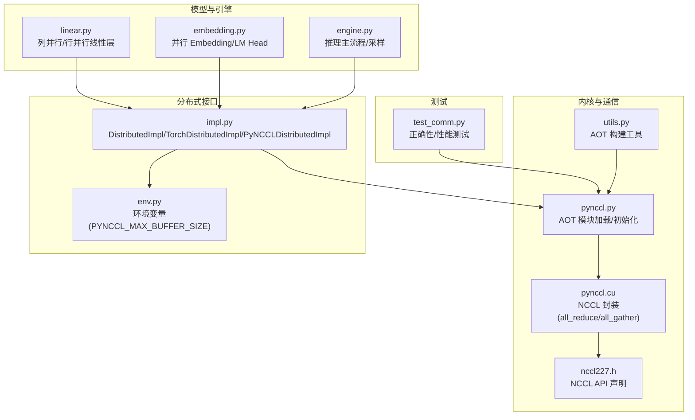
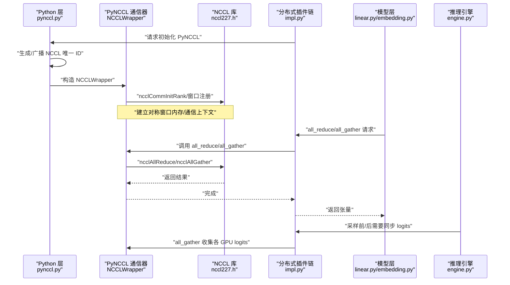
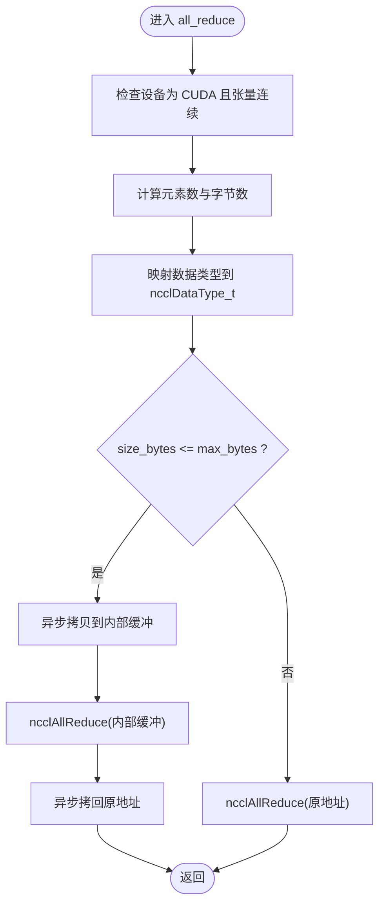
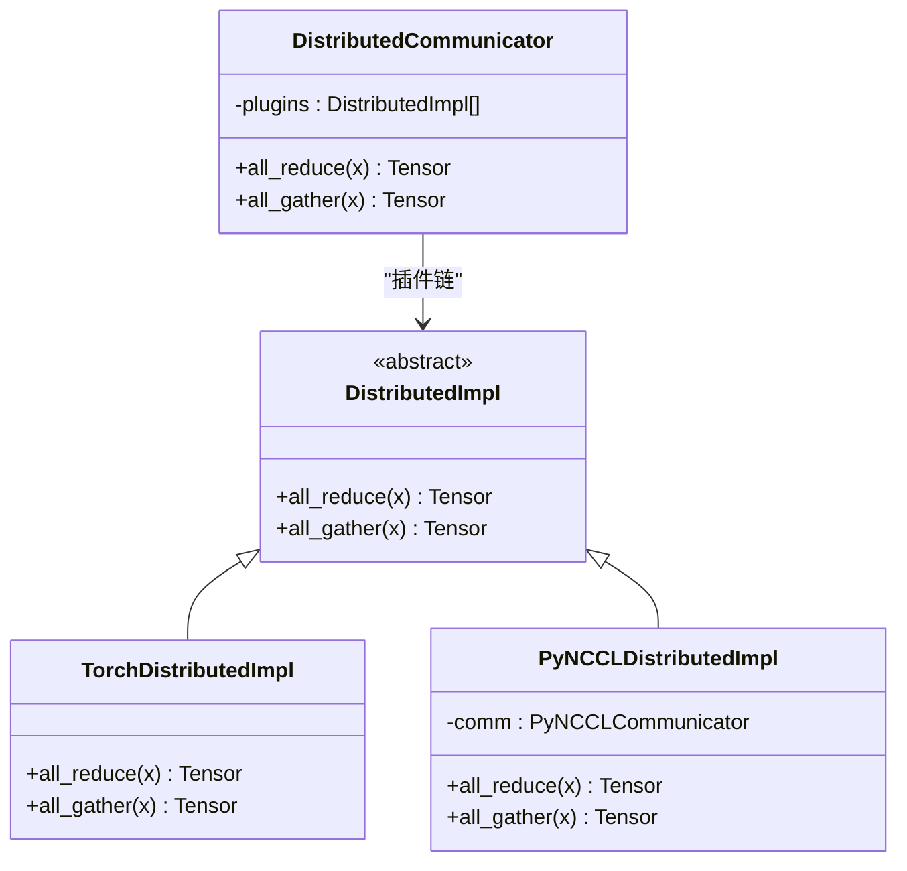
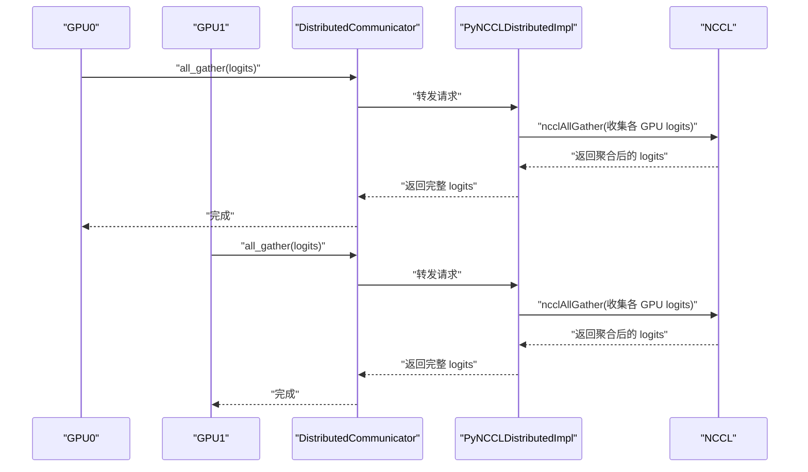
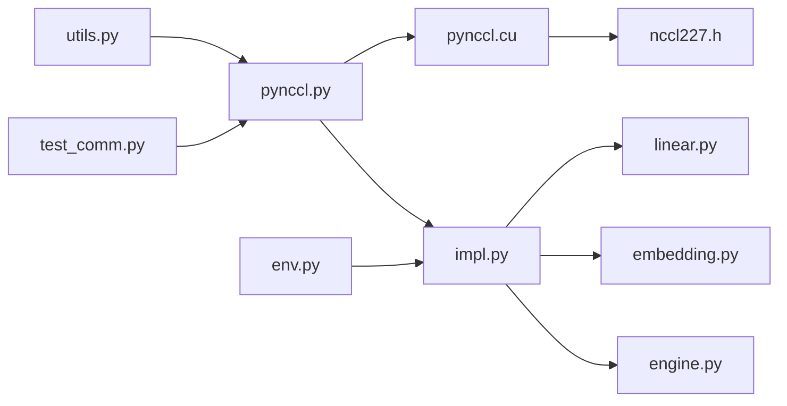

# 数据流：基于NCCL的张量并行通信

<cite>
**本文引用的文件列表**
- [pynccl.cu](file://python/minisgl/kernel/csrc/src/pynccl.cu)
- [nccl227.h](file://python/minisgl/kernel/csrc/include/minisgl/nccl227.h)
- [pynccl.py](file://python/minisgl/kernel/pynccl.py)
- [impl.py](file://python/minisgl/distributed/impl.py)
- [env.py](file://python/minisgl/env.py)
- [test_comm.py](file://tests/kernel/test_comm.py)
- [linear.py](file://python/minisgl/layers/linear.py)
- [embedding.py](file://python/minisgl/layers/embedding.py)
- [engine.py](file://python/minisgl/engine/engine.py)
- [utils.py](file://python/minisgl/kernel/utils.py)
</cite>

## 目录
1. [引言](#引言)
2. [项目结构](#项目结构)
3. [核心组件](#核心组件)
4. [架构总览](#架构总览)
5. [关键组件详解](#关键组件详解)
6. [依赖关系分析](#依赖关系分析)
7. [性能考量](#性能考量)
8. [故障排查指南](#故障排查指南)
9. [结论](#结论)
10. [附录](#附录)

## 引言
本文件围绕 mini-sglang 在张量并行（Tensor Parallelism, TP）场景下的数据流与通信机制展开，重点解析 PyNCCL 自定义通信后端的设计动机与优势，剖析 pynccl.cu 中 all_reduce 的实现细节（含小张量双缓冲优化与大张量直通策略），结合 nccl227.h 头文件说明 NCCL AllReduce、AllGather 等集体通信在 LLM 推理中的典型应用（特别是采样阶段跨 GPU 同步 logits 的实现）。同时，通过 test_comm.py 测试用例验证通信正确性与性能，并解释 enable_pynccl_distributed 如何将 PyNCCL 集成到分布式通信插件链中，以及与 TorchDistributedImpl 的兼容与切换机制。

## 项目结构
与通信相关的关键目录与文件：
- kernel/csrc/src/pynccl.cu：PyNCCL C++/CUDA 实现，封装 NCCL 通信原语，提供 all_reduce/all_gather。
- kernel/csrc/include/minisgl/nccl227.h：NCCL 头文件，声明 all_reduce/all_gather 等 API。
- kernel/pynccl.py：Python 层加载 AOT 编译模块、构造 PyNCCL 通信器、广播 NCCL 唯一 ID。
- distributed/impl.py：分布式通信抽象与实现，包含 TorchDistributedImpl 与 PyNCCLDistributedImpl，以及 enable_pynccl_distributed 插件注入。
- env.py：环境变量配置，包含 PyNCCL 最大内部缓冲大小等参数。
- tests/kernel/test_comm.py：通信正确性与性能基准测试。
- layers/linear.py、layers/embedding.py：张量并行线性层与词嵌入/LM Head 的 TP 使用示例。
- engine/engine.py：推理主流程，展示采样阶段 logits 的收集与同步。
- kernel/utils.py：内核构建工具，用于 AOT 加载与编译。

图表来源
- [pynccl.cu](file://python/minisgl/kernel/csrc/src/pynccl.cu#L93-L161)
- [nccl227.h](file://python/minisgl/kernel/csrc/include/minisgl/nccl227.h#L402-L438)
- [pynccl.py](file://python/minisgl/kernel/pynccl.py#L45-L79)
- [impl.py](file://python/minisgl/distributed/impl.py#L44-L91)
- [env.py](file://python/minisgl/env.py#L60-L66)
- [linear.py](file://python/minisgl/layers/linear.py#L88-L106)
- [embedding.py](file://python/minisgl/layers/embedding.py#L86-L108)
- [engine.py](file://python/minisgl/engine/engine.py#L196-L216)
- [utils.py](file://python/minisgl/kernel/utils.py#L53-L84)
- [test_comm.py](file://tests/kernel/test_comm.py#L14-L151)

章节来源
- [pynccl.cu](file://python/minisgl/kernel/csrc/src/pynccl.cu#L1-L189)
- [nccl227.h](file://python/minisgl/kernel/csrc/include/minisgl/nccl227.h#L1-L572)
- [pynccl.py](file://python/minisgl/kernel/pynccl.py#L1-L79)
- [impl.py](file://python/minisgl/distributed/impl.py#L1-L98)
- [env.py](file://python/minisgl/env.py#L1-L82)
- [test_comm.py](file://tests/kernel/test_comm.py#L1-L173)
- [linear.py](file://python/minisgl/layers/linear.py#L1-L108)
- [embedding.py](file://python/minisgl/layers/embedding.py#L1-L108)
- [engine.py](file://python/minisgl/engine/engine.py#L175-L216)
- [utils.py](file://python/minisgl/kernel/utils.py#L1-L130)

## 核心组件
- PyNCCL 通信器（NCCLWrapper）
  - 负责创建 NCCL 通信上下文、注册对称窗口内存、执行 all_reduce/all_gather。
  - 支持根据张量大小选择内部缓冲或直通路径。
- Python 初始化与广播
  - 生成并广播 NCCL 唯一 ID，构造 PyNCCL 通信器对象。
- 分布式插件链
  - 提供 TorchDistributedImpl 与 PyNCCLDistributedImpl 两种实现，支持动态切换。
- 环境变量
  - 控制 PyNCCL 内部缓冲上限，影响小张量的双缓冲策略。
- 测试与基准
  - 验证 all_reduce 正确性与带宽，验证 all_gather 正确性。

章节来源
- [pynccl.cu](file://python/minisgl/kernel/csrc/src/pynccl.cu#L72-L167)
- [pynccl.py](file://python/minisgl/kernel/pynccl.py#L45-L79)
- [impl.py](file://python/minisgl/distributed/impl.py#L44-L91)
- [env.py](file://python/minisgl/env.py#L60-L66)
- [test_comm.py](file://tests/kernel/test_comm.py#L96-L151)

## 架构总览
下图展示了从 Python 层到 C++/CUDA 层再到 NCCL 库的整体调用链路，以及插件链的切换机制。

图表来源
- [pynccl.py](file://python/minisgl/kernel/pynccl.py#L45-L79)
- [pynccl.cu](file://python/minisgl/kernel/csrc/src/pynccl.cu#L72-L167)
- [nccl227.h](file://python/minisgl/kernel/csrc/include/minisgl/nccl227.h#L402-L438)
- [impl.py](file://python/minisgl/distributed/impl.py#L44-L91)
- [linear.py](file://python/minisgl/layers/linear.py#L88-L106)
- [embedding.py](file://python/minisgl/layers/embedding.py#L86-L108)
- [engine.py](file://python/minisgl/engine/engine.py#L196-L216)

## 关键组件详解

### PyNCCL 设计动机与优势
- 目标
  - 在张量并行场景下，为 PyTorch CUDA 张量提供低延迟、高带宽的 NCCL 通信后端。
- 优势
  - 直接使用 NCCL 原生 API，避免额外中间层开销；通过内部对称窗口内存与流绑定，减少主机侧同步与拷贝。
  - 对小张量采用双缓冲策略，避免 in-place 操作带来的竞争与同步问题；对大张量则直通，降低一次额外拷贝。
  - 与 PyTorch 分布式 CPU 进程组配合，安全地广播 NCCL 唯一 ID，确保多进程一致性。

章节来源
- [pynccl.cu](file://python/minisgl/kernel/csrc/src/pynccl.cu#L93-L134)
- [pynccl.py](file://python/minisgl/kernel/pynccl.py#L45-L79)
- [nccl227.h](file://python/minisgl/kernel/csrc/include/minisgl/nccl227.h#L252-L267)

### pynccl.cu 中 all_reduce 的实现与优化
- 输入校验
  - 张量必须位于 CUDA 设备且连续，否则抛出运行时错误。
- 数据类型映射
  - 将 DLDataType 映射到 ncclDataType_t，当前支持半精度与 bfloat16。
- 操作选择
  - 根据张量大小与内部最大字节数阈值决定策略：
    - 小于等于阈值：使用对称窗口内存作为内部缓冲，先异步拷贝至缓冲区，执行 ncclAllReduce，再异步拷回原地址。
    - 大于阈值：直接以原地址作为 send/recv，避免一次额外拷贝。
- 流绑定
  - 解析张量对应的 CUDA 流，将 NCCL 操作提交到该流，保证与模型计算流水线协同。

图表来源
- [pynccl.cu](file://python/minisgl/kernel/csrc/src/pynccl.cu#L93-L134)

章节来源
- [pynccl.cu](file://python/minisgl/kernel/csrc/src/pynccl.cu#L93-L134)

### all_gather 的实现与直通策略
- 输入校验
  - 源张量与目标张量均需位于 CUDA 设备且连续；目标张量首维应为源张量首维乘以世界规模。
- 直通策略
  - 不使用内部缓冲，直接将源张量发送到目标张量对应位置，避免额外拷贝。
- 流绑定
  - 使用张量所在流提交 NCCL AllGather。

章节来源
- [pynccl.cu](file://python/minisgl/kernel/csrc/src/pynccl.cu#L136-L161)

### NCCL API 与数据类型/操作符映射
- NCCL 集体通信 API
  - AllReduce：ncclAllReduce，支持多种归约操作（加、乘、最大、最小、平均）。
  - AllGather：ncclAllGather，将各 GPU 的数据聚合到目标张量。
- 数据类型与操作符映射
  - DLDataType 到 ncclDataType_t 的映射表，当前覆盖半精度与 bfloat16。
  - 字符串到 ncclRedOp_t 的映射表，支持 sum、prod、max、min、avg。

章节来源
- [nccl227.h](file://python/minisgl/kernel/csrc/include/minisgl/nccl227.h#L268-L301)
- [nccl227.h](file://python/minisgl/kernel/csrc/include/minisgl/nccl227.h#L402-L438)
- [pynccl.cu](file://python/minisgl/kernel/csrc/src/pynccl.cu#L43-L64)

### PyNCCL 通信器生命周期与窗口注册
- 初始化
  - 生成唯一 ID，调用 ncclCommInitRank 创建通信器；分配并注册对称窗口内存（ncclMemAlloc + ncclCommWindowRegister）。
- 生命周期
  - 通信器与窗口在对象销毁时释放，确保资源回收。
- 获取内部缓冲指针
  - 通过 get_buffer 返回对称窗口内存地址，供小张量双缓冲使用。

章节来源
- [pynccl.cu](file://python/minisgl/kernel/csrc/src/pynccl.cu#L72-L91)
- [pynccl.cu](file://python/minisgl/kernel/csrc/src/pynccl.cu#L163-L167)
- [nccl227.h](file://python/minisgl/kernel/csrc/include/minisgl/nccl227.h#L135-L143)
- [nccl227.h](file://python/minisgl/kernel/csrc/include/minisgl/nccl227.h#L252-L267)

### enable_pynccl_distributed 的插件注入与切换
- 注入流程
  - 当 TP size > 1 时，调用 init_pynccl 初始化 PyNCCL 通信器，并将其包装为 PyNCCLDistributedImpl，追加到 DistributedCommunicator.plugins 列表末尾。
- 切换机制
  - DistributedCommunicator.plugins 默认包含 TorchDistributedImpl；启用 PyNCCL 后，所有通信请求由 PyNCCLDistributedImpl 处理，形成“后进先出”的插件链。
- 兼容性
  - 与 TorchDistributedImpl 并行存在，但实际生效的是链表末尾的实现，因此启用 PyNCCL 即可无缝替换默认行为。

图表来源
- [impl.py](file://python/minisgl/distributed/impl.py#L15-L91)

章节来源
- [impl.py](file://python/minisgl/distributed/impl.py#L44-L91)

### 与 TorchDistributedImpl 的兼容与切换
- 默认实现
  - DistributedCommunicator.plugins 初始包含 TorchDistributedImpl，直接调用 torch.distributed 的 all_reduce/all_gather。
- 切换条件
  - 当 TP size == 1 时不启用 PyNCCL；当 TP size > 1 时，启用 PyNCCL 并替换默认实现。
- 行为差异
  - PyNCCL 使用 NCCL 原生 API，通常具有更低延迟与更高带宽利用率；TorchDistributedImpl 依赖 CPU 进程组进行 ID 广播，适合 CPU-only 场景。

章节来源
- [impl.py](file://python/minisgl/distributed/impl.py#L24-L43)
- [impl.py](file://python/minisgl/distributed/impl.py#L73-L91)

### LLM 推理中的应用场景：采样阶段跨 GPU 同步 logits
- LM Head 并行输出
  - 并行 LM Head 在各 GPU 上分别计算 logits，得到形状为 (bs, tp_size, vocab_local) 或 (bs, vocab_local*tp_size) 的张量。
- all_gather 收集
  - 通过 DistributedCommunicator.all_gather 收集各 GPU 的 logits，形成完整词汇表维度的 logits。
- 采样
  - 在完整 logits 上执行 softmax 与 multinomial 采样，得到下一 token。

图表来源
- [embedding.py](file://python/minisgl/layers/embedding.py#L86-L108)
- [impl.py](file://python/minisgl/distributed/impl.py#L52-L61)

章节来源
- [embedding.py](file://python/minisgl/layers/embedding.py#L86-L108)
- [engine.py](file://python/minisgl/engine/engine.py#L196-L216)

### 测试用例：正确性与性能验证
- 正确性
  - all_reduce：对全 1、按 rank 填充值、分段不同值等输入进行多次 all_reduce，断言最终结果符合数学期望。
  - all_gather：构造每 GPU 源张量为 [rank, ..., rank]，断言聚合后为 [0,...,0,1,...,1,...,n-1,...,n-1]。
- 性能
  - 使用 CUDA Graph 与 Event 计时，统计平均耗时与带宽（GB/s），并记录显存占用峰值。
- 并发与同步
  - 通过同步与 sleep 模拟某 GPU 延迟，验证 NCCL 的屏障语义确保所有 GPU 同步。

章节来源
- [test_comm.py](file://tests/kernel/test_comm.py#L96-L151)

## 依赖关系分析
- 组件耦合
  - pynccl.py 依赖 utils.py 的 AOT 加载能力与链接 NCCL 库。
  - pynccl.cu 依赖 nccl227.h 的 NCCL API 声明。
  - impl.py 依赖 pynccl.py 构造 PyNCCL 通信器，并与 env.py 的环境变量交互。
  - 模型层（linear.py、embedding.py）通过 DistributedCommunicator 发起 all_reduce/all_gather。
- 外部依赖
  - NCCL 库（-lnccl）、CUDA 运行时、PyTorch 分布式 gloo 后端（用于 CPU 进程组广播 ID）。

图表来源
- [utils.py](file://python/minisgl/kernel/utils.py#L53-L84)
- [pynccl.py](file://python/minisgl/kernel/pynccl.py#L28-L44)
- [pynccl.cu](file://python/minisgl/kernel/csrc/src/pynccl.cu#L1-L20)
- [nccl227.h](file://python/minisgl/kernel/csrc/include/minisgl/nccl227.h#L1-L50)
- [impl.py](file://python/minisgl/distributed/impl.py#L63-L91)
- [env.py](file://python/minisgl/env.py#L60-L66)
- [linear.py](file://python/minisgl/layers/linear.py#L88-L106)
- [embedding.py](file://python/minisgl/layers/embedding.py#L86-L108)
- [engine.py](file://python/minisgl/engine/engine.py#L196-L216)
- [test_comm.py](file://tests/kernel/test_comm.py#L14-L41)

章节来源
- [utils.py](file://python/minisgl/kernel/utils.py#L53-L84)
- [pynccl.py](file://python/minisgl/kernel/pynccl.py#L28-L44)
- [pynccl.cu](file://python/minisgl/kernel/csrc/src/pynccl.cu#L1-L20)
- [nccl227.h](file://python/minisgl/kernel/csrc/include/minisgl/nccl227.h#L1-L50)
- [impl.py](file://python/minisgl/distributed/impl.py#L63-L91)
- [env.py](file://python/minisgl/env.py#L60-L66)
- [linear.py](file://python/minisgl/layers/linear.py#L88-L106)
- [embedding.py](file://python/minisgl/layers/embedding.py#L86-L108)
- [engine.py](file://python/minisgl/engine/engine.py#L196-L216)
- [test_comm.py](file://tests/kernel/test_comm.py#L14-L41)

## 性能考量
- 小张量双缓冲
  - 通过内部对称窗口内存与两次异步拷贝，避免 in-place 操作的竞争与同步阻塞，提升吞吐。
- 大张量直通
  - 避免一次额外拷贝，降低内存带宽压力，提高整体效率。
- 内部缓冲上限
  - 受环境变量控制，合理设置可平衡拷贝与通信成本。
- 流绑定与 CUDA Graph
  - 将 NCCL 操作提交到张量所在流，并结合 CUDA Graph 可进一步降低启动开销与抖动。

章节来源
- [pynccl.cu](file://python/minisgl/kernel/csrc/src/pynccl.cu#L93-L134)
- [env.py](file://python/minisgl/env.py#L60-L66)
- [test_comm.py](file://tests/kernel/test_comm.py#L43-L95)

## 故障排查指南
- 常见错误
  - 张量不在 CUDA 或非连续：触发运行时检查失败，需确保张量在 CUDA 设备上且连续。
  - 数据类型不支持：DLDataType 映射表未覆盖时会抛异常，需确认 dtype 是否在映射范围内。
  - all_gather 目标尺寸不匹配：目标首维应为源首维乘以世界规模。
- 调试建议
  - 使用测试用例的正确性断言快速定位问题。
  - 逐步缩小张量规模，验证小/大张量路径是否一致。
  - 检查 NCCL 唯一 ID 广播是否成功，确保所有 GPU 使用相同 ID。
  - 关注 CUDA 流绑定与同步，避免与模型计算流冲突。

章节来源
- [pynccl.cu](file://python/minisgl/kernel/csrc/src/pynccl.cu#L93-L161)
- [pynccl.py](file://python/minisgl/kernel/pynccl.py#L45-L79)
- [test_comm.py](file://tests/kernel/test_comm.py#L96-L151)

## 结论
mini-sglang 通过 PyNCCL 自定义通信后端，在张量并行场景下提供了低延迟、高带宽的 NCCL 通信能力。pynccl.cu 的 all_reduce 实现针对小/大张量分别采用双缓冲与直通策略，结合对称窗口内存与流绑定，有效提升了吞吐与稳定性。通过 enable_pynccl_distributed 将 PyNCCL 注入分布式插件链，可在 TP size > 1 时无缝替换默认实现。测试用例验证了通信正确性与性能，同时在 LLM 推理中，采样阶段通过 all_gather 收集各 GPU 的 logits，确保全局采样一致性。

## 附录
- 环境变量
  - MINISGL_PYNCCL_MAX_BUFFER_SIZE：控制 PyNCCL 内部缓冲上限，影响小张量双缓冲策略的触发阈值。
- 关键 API 参考
  - NCCL AllReduce/AllGather 原型与语义参见 nccl227.h。
  - PyNCCL 通信器方法：all_reduce、all_gather、get_buffer。

章节来源
- [env.py](file://python/minisgl/env.py#L60-L66)
- [nccl227.h](file://python/minisgl/kernel/csrc/include/minisgl/nccl227.h#L402-L438)
- [pynccl.cu](file://python/minisgl/kernel/csrc/src/pynccl.cu#L163-L167)