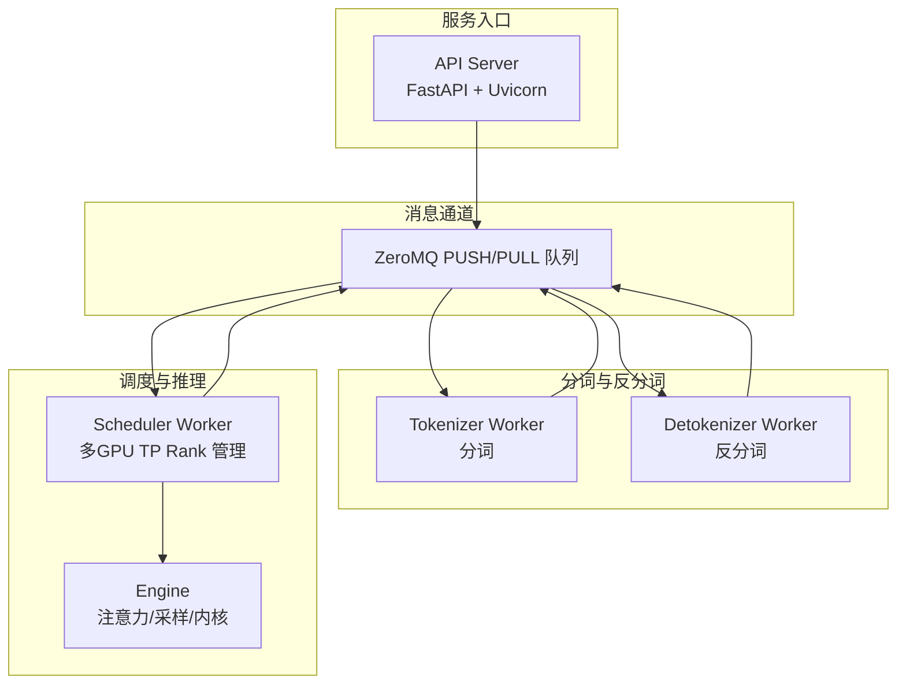
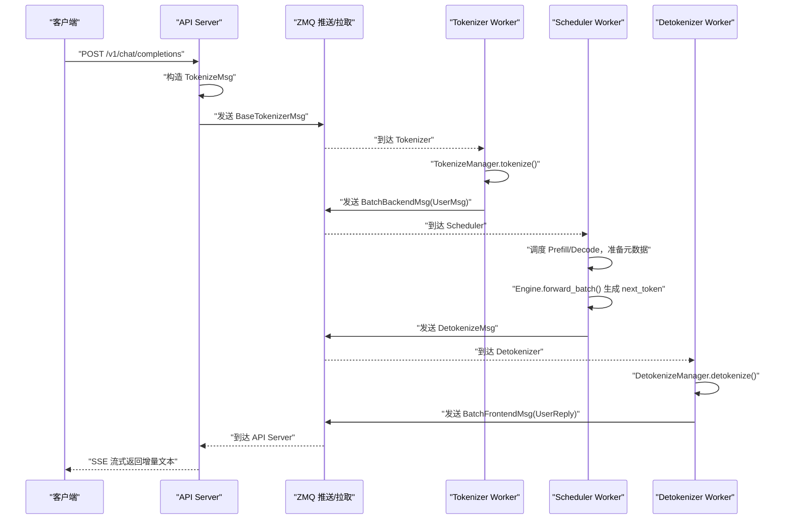
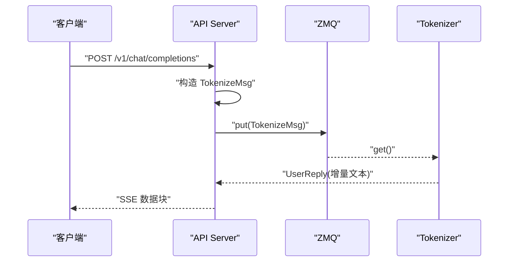
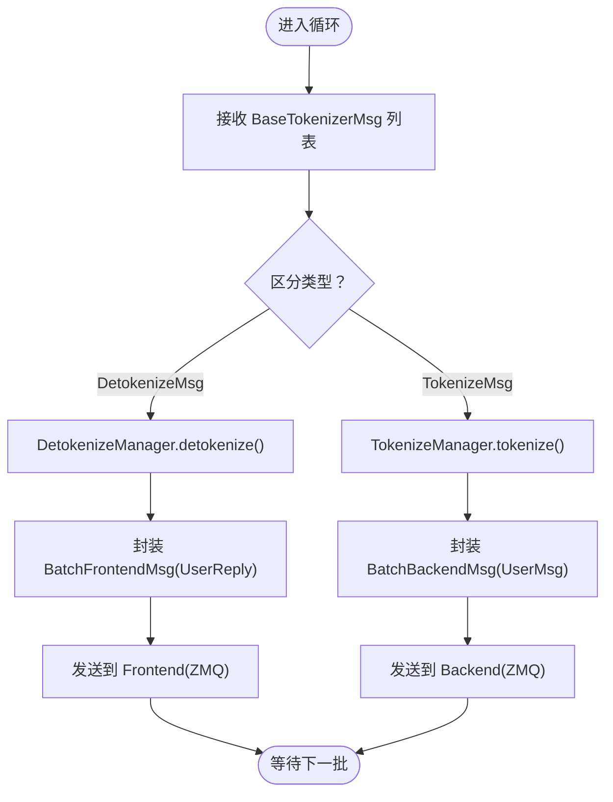
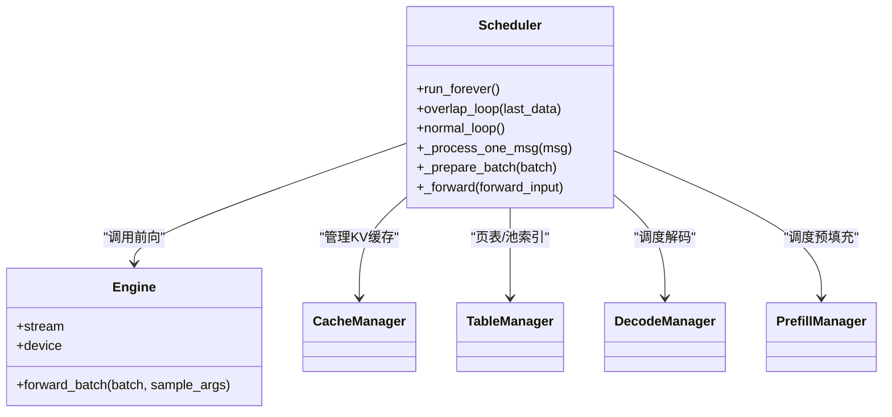
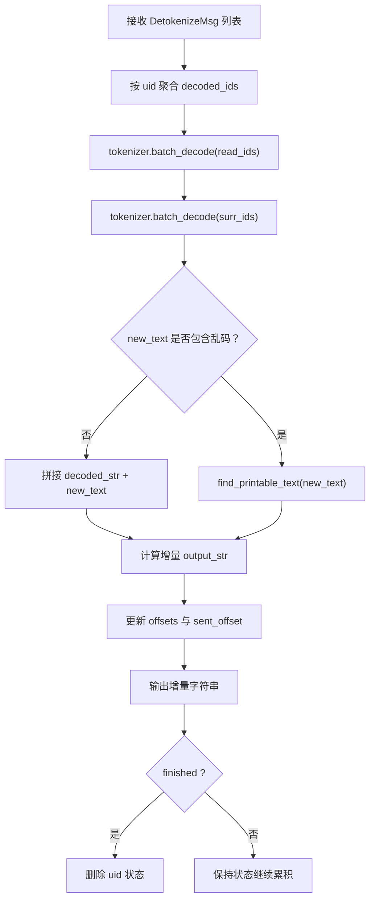
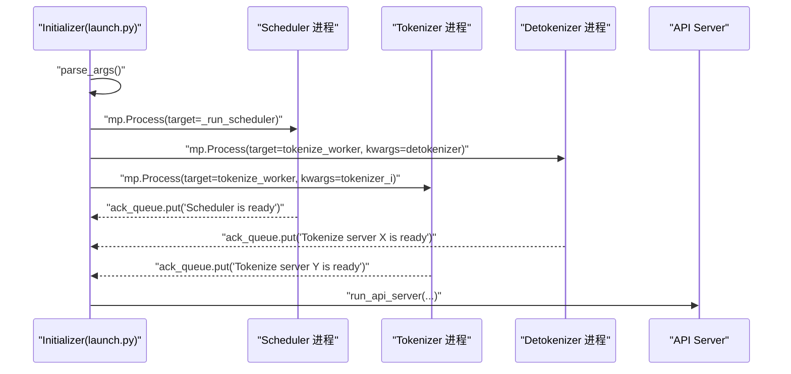
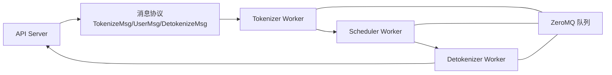

# 核心组件

<cite>
**本文引用的文件**
- [python/minisgl/server/api_server.py](file://python/minisgl/server/api_server.py)
- [python/minisgl/tokenizer/server.py](file://python/minisgl/tokenizer/server.py)
- [python/minisgl/tokenizer/tokenize.py](file://python/minisgl/tokenizer/tokenize.py)
- [python/minisgl/tokenizer/detokenize.py](file://python/minisgl/tokenizer/detokenize.py)
- [python/minisgl/scheduler/scheduler.py](file://python/minisgl/scheduler/scheduler.py)
- [python/minisgl/server/launch.py](file://python/minisgl/server/launch.py)
- [python/minisgl/utils/mp.py](file://python/minisgl/utils/mp.py)
- [python/minisgl/message/__init__.py](file://python/minisgl/message/__init__.py)
- [python/minisgl/message/backend.py](file://python/minisgl/message/backend.py)
- [python/minisgl/message/frontend.py](file://python/minisgl/message/frontend.py)
- [python/minisgl/message/tokenizer.py](file://python/minisgl/message/tokenizer.py)
- [python/minisgl/distributed/impl.py](file://python/minisgl/distributed/impl.py)
- [python/minisgl/server/args.py](file://python/minisgl/server/args.py)
</cite>

## 目录
1. [引言](#引言)
2. [项目结构](#项目结构)
3. [核心组件](#核心组件)
4. [架构总览](#架构总览)
5. [组件详解](#组件详解)
6. [依赖关系分析](#依赖关系分析)
7. [性能考量](#性能考量)
8. [故障排查指南](#故障排查指南)
9. [结论](#结论)

## 引言
本文件围绕 mini-sglang 的四大核心组件进行深入剖析：API Server、Tokenizer Worker、Scheduler Worker 和 Detokenizer Worker。我们将从职责边界、运行时行为、数据流与控制流、以及通过 launch.py 启动的进程组织方式等维度，系统性地梳理它们如何协同工作，形成完整的推理服务链路。同时，结合 ZeroMQ 消息队列与 OpenAI 兼容接口，解释从 HTTP 请求到最终自然语言输出的全链路过程。

## 项目结构
该仓库采用按功能域分层的组织方式：
- server：API 前端、启动器与参数解析
- tokenizer：分词与反分词（Detokenize）工作进程
- scheduler：调度与推理引擎核心
- message：跨进程消息协议定义
- utils：通用工具（ZeroMQ 封装、日志、并行等）
- distributed：分布式通信实现（TP 并行）

图表来源
- [python/minisgl/server/api_server.py](file://python/minisgl/server/api_server.py#L210-L280)
- [python/minisgl/tokenizer/server.py](file://python/minisgl/tokenizer/server.py#L29-L101)
- [python/minisgl/scheduler/scheduler.py](file://python/minisgl/scheduler/scheduler.py#L80-L120)
- [python/minisgl/tokenizer/detokenize.py](file://python/minisgl/tokenizer/detokenize.py#L67-L115)
- [python/minisgl/utils/mp.py](file://python/minisgl/utils/mp.py#L12-L103)

章节来源
- [python/minisgl/server/launch.py](file://python/minisgl/server/launch.py#L40-L114)
- [python/minisgl/server/args.py](file://python/minisgl/server/args.py#L14-L53)

## 核心组件
- API Server：提供 OpenAI 兼容接口（/v1/chat/completions、/v1/models 等），接收 HTTP 请求，封装为 TokenizeMsg，通过 ZeroMQ 发送到 Tokenizer，并将 Detokenize 流式结果返回给客户端。
- Tokenizer Worker：使用 Hugging Face AutoTokenizer 进行文本到令牌的编码，将输入文本批量编码为张量，发送到 Backend；同时处理 DetokenizeMsg，将生成的下一个 token 反向解码为增量文本，发回 Frontend。
- Scheduler Worker：多 GPU 环境下以 TP Rank 为单位管理 Engine，负责预填充（Prefill）与解码（Decode）调度、KV 缓存管理、CUDA 流重叠优化，将生成的 token 通过 DetokenizeMsg 返回给 Tokenizer。
- Detokenizer Worker：独立的反分词进程，聚合多个 UID 的增量文本，避免不完整词与乱码，输出可读的自然语言片段。

章节来源
- [python/minisgl/server/api_server.py](file://python/minisgl/server/api_server.py#L210-L280)
- [python/minisgl/tokenizer/server.py](file://python/minisgl/tokenizer/server.py#L29-L101)
- [python/minisgl/scheduler/scheduler.py](file://python/minisgl/scheduler/scheduler.py#L80-L120)
- [python/minisgl/tokenizer/detokenize.py](file://python/minisgl/tokenizer/detokenize.py#L67-L115)

## 架构总览
下面的图展示了从 FastAPI 到 Tokenizer、Scheduler、Detokenizer 的完整调用链与消息流向。

图表来源
- [python/minisgl/server/api_server.py](file://python/minisgl/server/api_server.py#L239-L274)
- [python/minisgl/tokenizer/server.py](file://python/minisgl/tokenizer/server.py#L84-L99)
- [python/minisgl/scheduler/scheduler.py](file://python/minisgl/scheduler/scheduler.py#L110-L154)
- [python/minisgl/tokenizer/detokenize.py](file://python/minisgl/tokenizer/detokenize.py#L73-L115)

## 组件详解

### API Server（OpenAI 兼容接口前端）
- 职责边界
  - 提供 /v1/chat/completions、/v1/models、/generate 等接口，支持 SSE 流式响应。
  - 将 HTTP 请求转换为内部消息（TokenizeMsg），通过 ZeroMQ 发送给 Tokenizer。
  - 接收来自 Tokenizer 的增量输出（UserReply），拼装为 OpenAI 风格的流式 JSON。
- 运行时行为
  - 使用 FastAPI + Uvicorn，生命周期中初始化 FrontendManager，建立与 Tokenizer 的 ZeroMQ 连接。
  - 对于聊天补全，将 messages 序列化为 Chat Template 文本后提交；对于普通 generate，直接使用 prompt 字符串。
  - 支持后台任务在请求取消或完成时清理状态。
- 关键交互
  - /v1/chat/completions：构造 TokenizeMsg，开启流式响应，持续推送增量内容。
  - /v1/models：返回可用模型列表。
  - /generate：面向简单场景的纯文本生成。

图表来源
- [python/minisgl/server/api_server.py](file://python/minisgl/server/api_server.py#L239-L274)
- [python/minisgl/utils/mp.py](file://python/minisgl/utils/mp.py#L12-L103)

章节来源
- [python/minisgl/server/api_server.py](file://python/minisgl/server/api_server.py#L210-L280)
- [python/minisgl/server/api_server.py](file://python/minisgl/server/api_server.py#L384-L426)

### Tokenizer Worker（分词与反分词）
- 职责边界
  - 分词：将用户输入（字符串或 Chat Template）编码为 input_ids，打包为 UserMsg，发送到 Backend。
  - 反分词：将 Scheduler 产生的 next_token 解码为增量文本，打包为 UserReply，发送到 Frontend。
- 运行时行为
  - 使用 Hugging Face AutoTokenizer（LlamaTokenizer）加载本地或 HF 模型路径。
  - 支持批量消息处理，按 local_bs 聚合，减少上下文切换。
  - 通过 ZmqPullQueue 接收 BaseTokenizerMsg，区分 DetokenizeMsg 与 TokenizeMsg，分别处理。
  - 在共享分词模式下，Detokenizer 与 Tokenizer 合并为同一进程（Detokenizer 0）。
- 关键流程
  - 分词：TokenizeManager.tokenize() 批量编码，返回张量，封装为 UserMsg 发送 Backend。
  - 反分词：DetokenizeManager.detokenize() 聚合已解码 ID，避免不完整词，输出增量文本。

图表来源
- [python/minisgl/tokenizer/server.py](file://python/minisgl/tokenizer/server.py#L29-L101)
- [python/minisgl/tokenizer/tokenize.py](file://python/minisgl/tokenizer/tokenize.py#L12-L34)
- [python/minisgl/tokenizer/detokenize.py](file://python/minisgl/tokenizer/detokenize.py#L67-L115)

章节来源
- [python/minisgl/tokenizer/server.py](file://python/minisgl/tokenizer/server.py#L29-L101)
- [python/minisgl/tokenizer/tokenize.py](file://python/minisgl/tokenizer/tokenize.py#L12-L34)
- [python/minisgl/tokenizer/detokenize.py](file://python/minisgl/tokenizer/detokenize.py#L67-L115)

### Scheduler Worker（调度与推理核心）
- 职责边界
  - 多 GPU 环境下以 TP Rank 为单位管理 Engine，协调 Prefill 与 Decode，维护 KV Cache。
  - 通过 overlap_loop/normal_loop 实现调度与执行的重叠，隐藏 CPU 开销，提升 GPU 利用率。
  - 将生成的 next_token 封装为 DetokenizeMsg，返回给 Tokenizer。
- 运行时行为
  - 初始化 Engine、CacheManager、TableManager、DecodeManager、PrefillManager。
  - 接收 UserMsg，检查长度与最大输出，加入调度队列。
  - 准备元数据（token 池索引、KV 写入位置），执行前向，写回 token 池，更新请求状态。
  - 处理已完成请求，释放页表与缓存资源。
- 关键机制
  - CUDA Stream 与 Engine Stream 协作，overlap_loop 中先处理上一批结果再执行当前批次，最大化吞吐。
  - 通过 DistributedInfo 与 PyNCCL/TorchDistributed 实现 TP 并行通信。

图表来源
- [python/minisgl/scheduler/scheduler.py](file://python/minisgl/scheduler/scheduler.py#L80-L120)
- [python/minisgl/scheduler/scheduler.py](file://python/minisgl/scheduler/scheduler.py#L155-L202)
- [python/minisgl/scheduler/scheduler.py](file://python/minisgl/scheduler/scheduler.py#L231-L280)
- [python/minisgl/distributed/impl.py](file://python/minisgl/distributed/impl.py#L63-L98)

章节来源
- [python/minisgl/scheduler/scheduler.py](file://python/minisgl/scheduler/scheduler.py#L80-L120)
- [python/minisgl/scheduler/scheduler.py](file://python/minisgl/scheduler/scheduler.py#L155-L202)
- [python/minisgl/scheduler/scheduler.py](file://python/minisgl/scheduler/scheduler.py#L231-L280)
- [python/minisgl/distributed/impl.py](file://python/minisgl/distributed/impl.py#L63-L98)

### Detokenizer Worker（反分词）
- 职责边界
  - 将生成的下一个 token 逐步解码为自然语言文本，避免截断不完整词与乱码。
  - 维护每个 UID 的解码状态（decoded_ids、decoded_str、offsets），仅输出新增增量。
- 运行时行为
  - 从 Scheduler 接收 DetokenizeMsg，按 UID 聚合增量 token。
  - 使用 tokenizer.batch_decode() 生成候选文本，通过 find_printable_text() 选择可打印部分。
  - 输出增量字符串，若 finished 则清理状态。
- 与 Tokenizer 的协作
  - 在共享分词模式下，Detokenizer 与 Tokenizer 合并为同一进程（Detokenizer 0），减少一次 ZMQ 跳转。

图表来源
- [python/minisgl/tokenizer/detokenize.py](file://python/minisgl/tokenizer/detokenize.py#L67-L115)

章节来源
- [python/minisgl/tokenizer/detokenize.py](file://python/minisgl/tokenizer/detokenize.py#L1-L115)

### 启动与进程组织（launch.py）
- 启动顺序
  - 解析命令行参数，构建 ServerArgs。
  - 启动多个 Scheduler 进程（数量等于 TP Size），每个进程绑定不同的 TP Rank。
  - 启动 Detokenizer Worker（Detokenizer 0）与若干 Tokenizer Worker（数量由 num_tokenizer 决定）。
  - 所有子进程通过 ack_queue 确保全部就绪后再启动 API Server。
- 地址与连接
  - API Server 与 Tokenizer 之间通过 zmq_frontend_addr/zmq_tokenizer_addr 连接。
  - Tokenizer 与 Scheduler 之间通过 zmq_backend_addr 连接。
  - Detokenizer 与 Frontend 之间通过 zmq_detokenizer_addr 连接。
  - 当 num_tokenizer=0 时，共享分词与反分词，Detokenizer 与 Tokenizer 合并为同一进程。
- 进程命名与守护
  - Scheduler 进程命名为 minisgl-TP{i}-scheduler。
  - Detokenizer 进程命名为 minisgl-detokenizer-0。
  - Tokenizer 进程命名为 minisgl-tokenizer-{i}。

图表来源
- [python/minisgl/server/launch.py](file://python/minisgl/server/launch.py#L40-L114)
- [python/minisgl/server/args.py](file://python/minisgl/server/args.py#L14-L53)

章节来源
- [python/minisgl/server/launch.py](file://python/minisgl/server/launch.py#L40-L114)
- [python/minisgl/server/args.py](file://python/minisgl/server/args.py#L14-L53)

## 依赖关系分析
- 消息协议
  - Frontend <-> Tokenizer <-> Backend <-> Scheduler <-> Detokenizer
  - 消息类型包括：TokenizeMsg、UserMsg、DetokenizeMsg、UserReply、Batch* 等。
- 通信抽象
  - ZmqPushQueue/ZmqPullQueue/ZmqAsyncPushQueue/ZmqAsyncPullQueue 提供统一的 ZeroMQ 封装，支持 msgpack 编解码。
- 分布式通信
  - 通过 DistributedInfo 与 PyNCCL/TorchDistributed 实现 TP 并行，加速张量归约与收集。

图表来源
- [python/minisgl/message/__init__.py](file://python/minisgl/message/__init__.py#L1-L18)
- [python/minisgl/utils/mp.py](file://python/minisgl/utils/mp.py#L12-L103)
- [python/minisgl/distributed/impl.py](file://python/minisgl/distributed/impl.py#L63-L98)

章节来源
- [python/minisgl/message/__init__.py](file://python/minisgl/message/__init__.py#L1-L18)
- [python/minisgl/utils/mp.py](file://python/minisgl/utils/mp.py#L12-L103)
- [python/minisgl/distributed/impl.py](file://python/minisgl/distributed/impl.py#L63-L98)

## 性能考量
- 流水线与重叠
  - Scheduler 的 overlap_loop 通过 CUDA Stream 与 Engine Stream 协作，将“处理上一批结果”与“执行当前批次”重叠，降低 CPU 等待时间，提高 GPU 利用率。
- 批量化与合并
  - Tokenizer Worker 在本地循环中尽可能合并消息，减少 ZeroMQ 往返开销。
- KV 缓存与页表
  - 通过 CacheManager 与 TableManager 管理页表与缓存，避免频繁分配与拷贝。
- TP 并行
  - 使用 PyNCCL 或 TorchDistributed 实现跨 GPU 的张量归约与收集，加速并行计算。
- I/O 与序列化
  - 使用 msgpack 编解码，减少序列化成本；ZeroMQ 的异步队列在高并发下更稳定。

[本节为通用性能建议，无需特定文件引用]

## 故障排查指南
- API Server 无法启动或端口占用
  - 检查 server_host/server_port 参数是否冲突；确认 run_api_server 已正确绑定。
- 子进程未就绪导致阻塞
  - 确认 ack_queue 是否收到所有子进程的“ready”信号；检查 num_tokenizer 与 TP Size 设置。
- 分词/反分词异常
  - 确认 tokenizer_path 正确且可访问；在共享分词模式下，确保 Detokenizer 与 Tokenizer 合并逻辑生效。
- 调度卡顿或吞吐低
  - 检查 overlap_loop 是否启用；适当增大 max_running_req 与 max_extend_tokens；确认 KV 缓存配置合理。
- 分布式通信错误
  - 检查 TP Rank 数量与环境变量；确认 PyNCCL 初始化成功；必要时降级为单卡测试。

章节来源
- [python/minisgl/server/launch.py](file://python/minisgl/server/launch.py#L40-L114)
- [python/minisgl/server/api_server.py](file://python/minisgl/server/api_server.py#L384-L426)
- [python/minisgl/distributed/impl.py](file://python/minisgl/distributed/impl.py#L73-L98)

## 结论
mini-sglang 通过清晰的职责划分与高效的进程间通信，实现了从 OpenAI 兼容接口到多 GPU 推理的完整链路。API Server 负责接入与流式输出，Tokenizer/ Detokenizer 负责文本与令牌的双向转换，Scheduler 负责调度与执行并在 TP Rank 上扩展。借助 ZeroMQ 与消息协议，系统具备良好的可扩展性与稳定性。通过 launch.py 的统一启动逻辑，用户可以灵活配置分词进程数量与 TP 并行规模，快速搭建生产级推理服务。