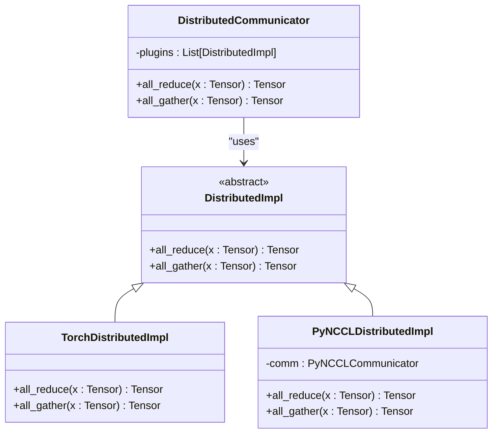
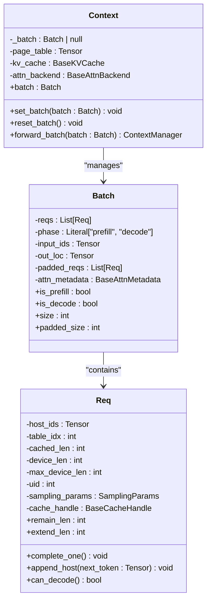
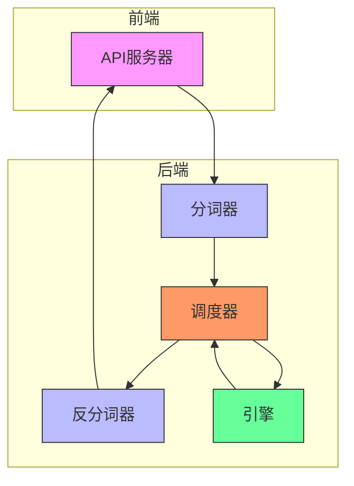
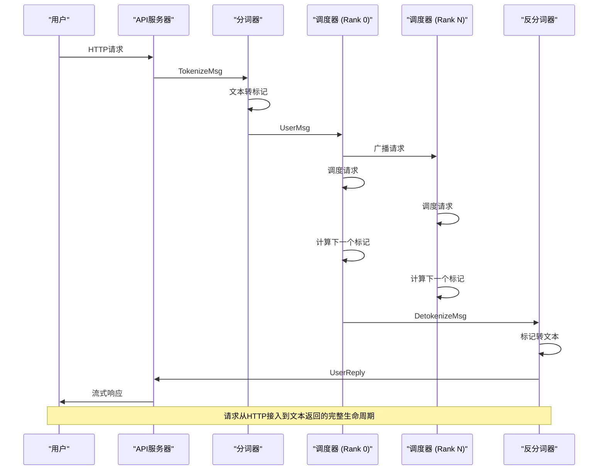

# 系统架构

<cite>
**本文档中引用的文件**   
- [structures.md](file://docs/structures.md)
- [api_server.py](file://python/minisgl/server/api_server.py)
- [server.py](file://python/minisgl/tokenizer/server.py)
- [scheduler.py](file://python/minisgl/scheduler/scheduler.py)
- [impl.py](file://python/minisgl/distributed/impl.py)
- [core.py](file://python/minisgl/core.py)
- [engine.py](file://python/minisgl/engine/engine.py)
- [mp.py](file://python/minisgl/utils/mp.py)
- [launch.py](file://python/minisgl/server/launch.py)
- [frontend.py](file://python/minisgl/message/frontend.py)
- [io.py](file://python/minisgl/scheduler/io.py)
- [tokenize.py](file://python/minisgl/tokenizer/tokenize.py)
- [detokenize.py](file://python/minisgl/tokenizer/detokenize.py)
- [info.py](file://python/minisgl/distributed/info.py)
</cite>

## 目录
1. [引言](#引言)
2. [核心组件职责与交互](#核心组件职责与交互)
3. [双通道通信设计](#双通道通信设计)
4. [请求生命周期](#请求生命周期)
5. [多GPU环境下的数据同步](#多gpu环境下的数据同步)
6. [全局上下文协调](#全局上下文协调)
7. [系统上下文图](#系统上下文图)
8. [组件通信时序图](#组件通信时序图)

## 引言

mini-sglang是一个为高效处理大语言模型（LLM）推理而设计的分布式系统。该系统由多个独立进程组成，通过精心设计的架构实现高性能推理。系统采用分布式设计，支持多GPU并行计算，通过ZeroMQ和NCCL两种通信机制实现控制消息和张量数据的高效传输。系统架构包括API服务器、分词器、调度器和反分词器等核心组件，各组件通过明确的职责划分和高效的通信机制协同工作。

**Section sources**
- [structures.md](file://docs/structures.md#L1-L50)

## 核心组件职责与交互

mini-sglang系统由多个核心组件构成，每个组件都有明确的职责和交互方式。

### API服务器

API服务器是系统的入口点，为用户提供OpenAI兼容的API接口（如`/v1/chat/completions`）来接收提示并返回生成的文本。它负责处理HTTP请求，将用户请求转发给分词器，并将最终结果流式传输回用户。API服务器使用FastAPI框架实现，支持流式响应，能够实时返回生成的文本片段。

**Section sources**
- [api_server.py](file://python/minisgl/server/api_server.py#L1-L426)

### 分词器

分词器负责将输入文本转换为模型可以理解的数字（标记）。它接收来自API服务器的文本请求，使用Hugging Face的AutoTokenizer将文本转换为标记ID序列，并将这些标记发送给调度器。分词器还负责批处理多个请求以提高效率。

**Section sources**
- [server.py](file://python/minisgl/tokenizer/server.py#L1-L101)
- [tokenize.py](file://python/minisgl/tokenizer/tokenize.py#L1-L34)

### 调度器

调度器是系统的核心工作进程。在多GPU设置中，每个GPU都有一个调度器进程（称为TP Rank）。调度器负责管理特定GPU上的计算和资源分配。它接收来自分词器的请求，调度请求的执行，并触发本地引擎进行下一个标记的计算。调度器还负责管理KV缓存、批处理请求和采样参数。

**Section sources**
- [scheduler.py](file://python/minisgl/scheduler/scheduler.py#L1-L285)
- [io.py](file://python/minisgl/scheduler/io.py#L1-L132)

### 反分词器

反分词器负责将模型生成的数字（标记）转换回人类可读的文本。它接收来自调度器的标记ID，使用分词器将标记转换为文本，并将生成的文本发送回API服务器。反分词器还处理流式输出，确保文本片段能够及时返回给用户。

**Section sources**
- [server.py](file://python/minisgl/tokenizer/server.py#L1-L101)
- [detokenize.py](file://python/minisgl/tokenizer/detokenize.py#L1-L115)

## 双通道通信设计

mini-sglang系统采用双通道通信设计，使用ZeroMQ进行控制消息传输，使用NCCL进行张量数据交换。

### ZeroMQ控制通道

ZeroMQ用于在不同组件之间传输控制消息。API服务器、分词器、调度器和反分词器之间通过ZeroMQ套接字进行通信。控制消息包括请求、响应、分词结果和反分词结果等。ZeroMQ提供了高效的异步消息传递机制，确保控制消息能够快速传输。

**Section sources**
- [mp.py](file://python/minisgl/utils/mp.py#L1-L152)
- [io.py](file://python/minisgl/scheduler/io.py#L1-L132)

### NCCL张量通道

NCCL（NVIDIA Collective Communications Library）用于在多GPU环境中进行张量数据的高效交换。当使用多个GPU时，调度器之间通过NCCL进行张量并行计算。NCCL提供了优化的集体通信操作，如all-reduce和all-gather，能够在多GPU之间高效同步张量数据。

**Section sources**
- [impl.py](file://python/minisgl/distributed/impl.py#L1-L98)
- [info.py](file://python/minisgl/distributed/info.py#L1-L39)

## 请求生命周期

请求从HTTP接入到文本返回的完整生命周期如下：

1. **用户**向**API服务器**发送请求。
2. **API服务器**将请求转发给**分词器**。
3. **分词器**将文本转换为标记，并将标记发送给**调度器（Rank 0）**。
4. **调度器（Rank 0）**将请求广播到所有其他调度器（如果使用多个GPU）。
5. **所有调度器**调度请求并触发其本地**引擎**计算下一个标记。
6. **调度器（Rank 0）**收集输出标记并发送给**反分词器**。
7. **反分词器**将标记转换为文本并发送回**API服务器**。
8. **API服务器**将结果流式传输回**用户**。

**Section sources**
- [structures.md](file://docs/structures.md#L20-L29)

## 多GPU环境下的数据同步

在多GPU环境下，各TP Rank之间的数据同步机制通过NCCL实现。调度器使用PyNCCL或Torch Distributed进行集体通信操作。

### PyNCCL实现

当启用PyNCCL时，系统使用自定义的PyNCCL通信器进行all-reduce和all-gather操作。PyNCCLDistributedImpl类封装了NCCL通信原语，提供了高效的张量并行支持。

**Diagram sources **
- [impl.py](file://python/minisgl/distributed/impl.py#L15-L98)

### 内存同步

系统在初始化时会同步各TP Rank的内存状态，确保所有GPU具有相同的可用内存。Engine类的`_sync_get_memory`方法使用all-reduce操作获取各Rank的最小和最大空闲内存，确保内存分配的均衡性。

**Section sources**
- [engine.py](file://python/minisgl/engine/engine.py#L175-L194)

## 全局上下文协调

全局Context对象负责协调跨进程状态，确保所有组件共享一致的推理上下文。

### Context类

Context类封装了推理过程中的全局状态，包括页面表、KV缓存、注意力后端等。它通过`set_global_ctx`和`get_global_ctx`函数提供全局访问接口，确保所有组件能够访问相同的上下文对象。

**Diagram sources **
- [core.py](file://python/minisgl/core.py#L101-L156)

### 状态管理

Context对象通过`set_batch`和`reset_batch`方法管理当前批处理状态。`forward_batch`上下文管理器确保在前向传播期间批处理状态的一致性。这种设计确保了多进程环境下状态的协调和一致性。

**Section sources**
- [core.py](file://python/minisgl/core.py#L101-L156)
- [engine.py](file://python/minisgl/engine/engine.py#L196-L211)

## 系统上下文图

**Diagram sources **
- [structures.md](file://docs/structures.md#L1-L50)
- [launch.py](file://python/minisgl/server/launch.py#L1-L114)

## 组件通信时序图

**Diagram sources **
- [structures.md](file://docs/structures.md#L20-L29)
- [api_server.py](file://python/minisgl/server/api_server.py#L1-L426)
- [server.py](file://python/minisgl/tokenizer/server.py#L1-L101)
- [scheduler.py](file://python/minisgl/scheduler/scheduler.py#L1-L285)