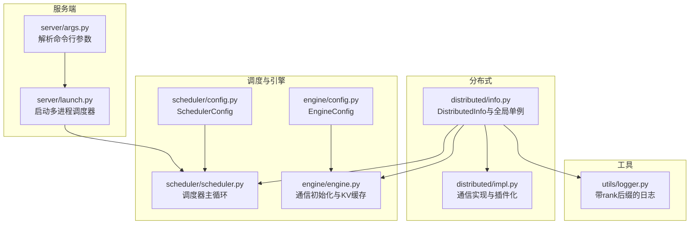
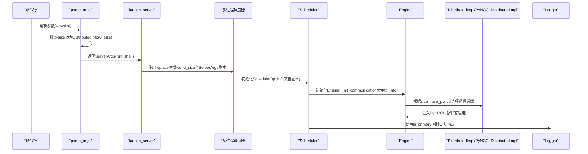
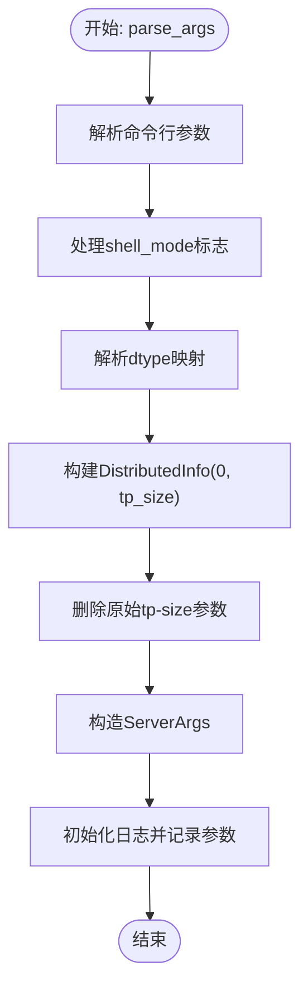
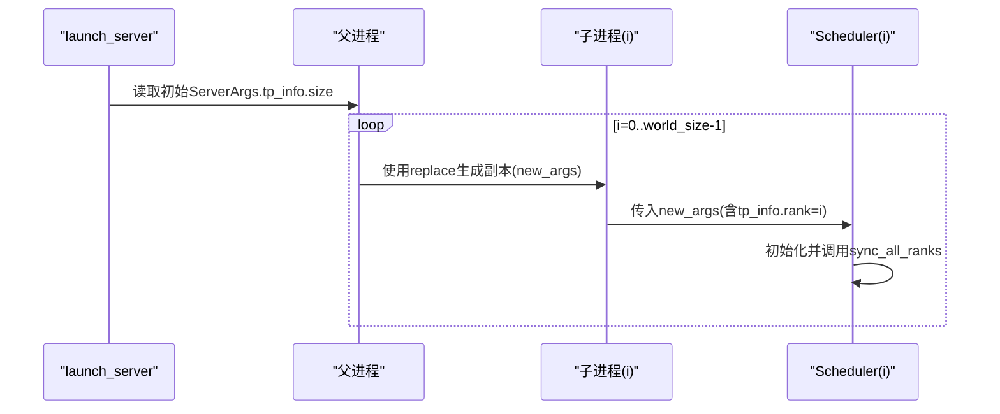
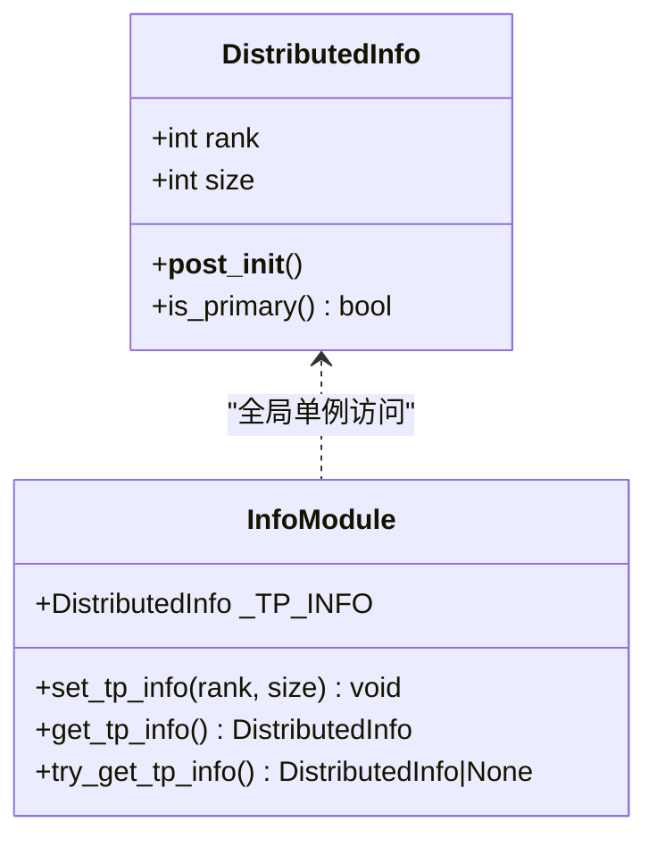
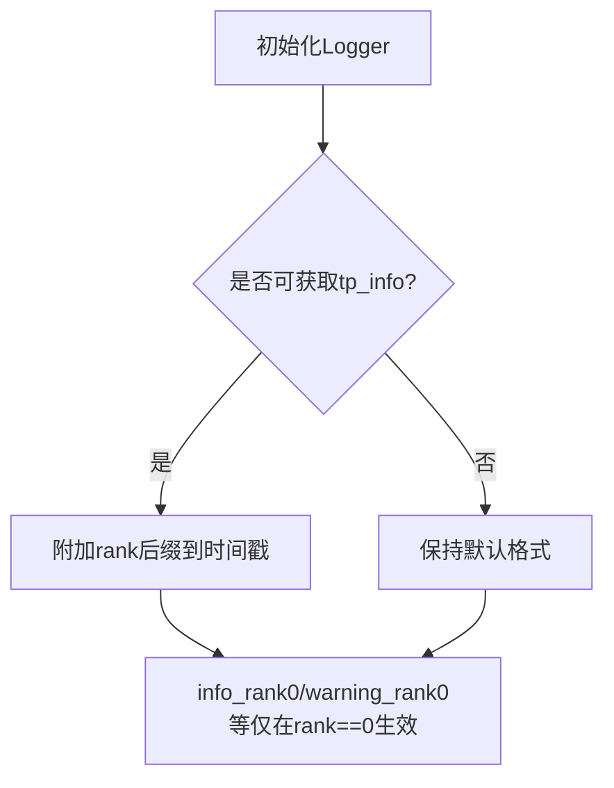
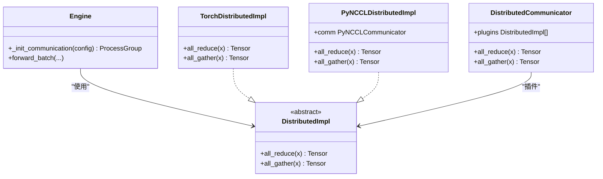
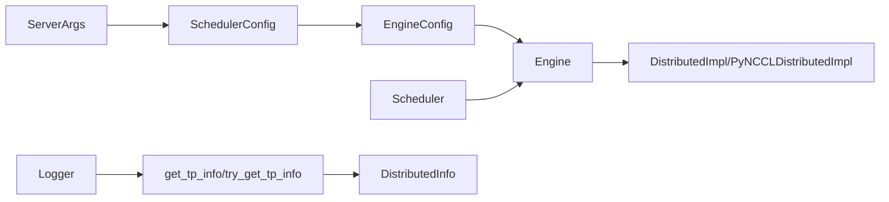

# 分布式配置与TP拓扑管理

<cite>
**本文引用的文件列表**
- [python/minisgl/server/args.py](file://python/minisgl/server/args.py)
- [python/minisgl/server/launch.py](file://python/minisgl/server/launch.py)
- [python/minisgl/distributed/info.py](file://python/minisgl/distributed/info.py)
- [python/minisgl/distributed/impl.py](file://python/minisgl/distributed/impl.py)
- [python/minisgl/engine/config.py](file://python/minisgl/engine/config.py)
- [python/minisgl/engine/engine.py](file://python/minisgl/engine/engine.py)
- [python/minisgl/scheduler/config.py](file://python/minisgl/scheduler/config.py)
- [python/minisgl/scheduler/scheduler.py](file://python/minisgl/scheduler/scheduler.py)
- [python/minisgl/utils/logger.py](file://python/minisgl/utils/logger.py)
</cite>

## 目录
1. [引言](#引言)
2. [项目结构](#项目结构)
3. [核心组件](#核心组件)
4. [架构总览](#架构总览)
5. [详细组件分析](#详细组件分析)
6. [依赖关系分析](#依赖关系分析)
7. [性能考量](#性能考量)
8. [故障排查指南](#故障排查指南)
9. [结论](#结论)

## 引言
本文件围绕分布式环境下的张量并行（Tensor Parallelism, TP）配置与拓扑管理展开，重点解析以下问题：
- 命令行参数如何被解析并转换为分布式信息对象；
- 如何通过复制（replace）机制为每个Scheduler Worker生成独立的ServerArgs实例，以实现rank与tp_info的差异化配置；
- DistributedInfo类中rank、size与is_primary方法的作用；
- 全局单例_tp_info如何在运行时由set_tp_info初始化，并被各模块通过get_tp_info或try_get_tp_info访问；
- is_primary在日志输出、请求分发与结果收集中的关键作用；
- 该设计如何支持灵活的张量并行拓扑结构。

## 项目结构
本仓库采用按功能域划分的组织方式，分布式相关逻辑集中在distributed子包，服务端入口位于server子包，调度器与引擎分别位于scheduler与engine子包，工具与日志位于utils子包。

图表来源
- [python/minisgl/server/args.py](file://python/minisgl/server/args.py#L54-L235)
- [python/minisgl/server/launch.py](file://python/minisgl/server/launch.py#L40-L114)
- [python/minisgl/distributed/info.py](file://python/minisgl/distributed/info.py#L1-L39)
- [python/minisgl/distributed/impl.py](file://python/minisgl/distributed/impl.py#L1-L98)
- [python/minisgl/scheduler/config.py](file://python/minisgl/scheduler/config.py#L1-L42)
- [python/minisgl/scheduler/scheduler.py](file://python/minisgl/scheduler/scheduler.py#L80-L110)
- [python/minisgl/engine/config.py](file://python/minisgl/engine/config.py#L1-L55)
- [python/minisgl/engine/engine.py](file://python/minisgl/engine/engine.py#L114-L140)
- [python/minisgl/utils/logger.py](file://python/minisgl/utils/logger.py#L1-L129)

章节来源
- [python/minisgl/server/args.py](file://python/minisgl/server/args.py#L54-L235)
- [python/minisgl/server/launch.py](file://python/minisgl/server/launch.py#L40-L114)
- [python/minisgl/distributed/info.py](file://python/minisgl/distributed/info.py#L1-L39)
- [python/minisgl/distributed/impl.py](file://python/minisgl/distributed/impl.py#L1-L98)
- [python/minisgl/scheduler/config.py](file://python/minisgl/scheduler/config.py#L1-L42)
- [python/minisgl/scheduler/scheduler.py](file://python/minisgl/scheduler/scheduler.py#L80-L110)
- [python/minisgl/engine/config.py](file://python/minisgl/engine/config.py#L1-L55)
- [python/minisgl/engine/engine.py](file://python/minisgl/engine/engine.py#L114-L140)
- [python/minisgl/utils/logger.py](file://python/minisgl/utils/logger.py#L1-L129)

## 核心组件
- ServerArgs：服务端参数容器，继承自SchedulerConfig，包含网络地址、分词器数量等；其中包含tp_info字段用于张量并行拓扑。
- parse_args：解析命令行参数，将tensor_parallel_size转换为DistributedInfo(0, size)，并删除原始参数，最终返回ServerArgs与是否进入shell模式。
- DistributedInfo：不可变数据类，记录rank与size，并提供is_primary判断；配合全局单例_tp_info与set_tp_info/get_tp_info/try_get_tp_info进行运行时访问。
- SchedulerConfig：调度器配置基类，定义ZMQ地址、唯一后缀等；ServerArgs继承自它。
- EngineConfig：引擎配置基类，包含模型路径、dtype、tp_info、分布式超时等；Engine在通信初始化中使用tp_info。
- Scheduler：调度器主循环，持有tp_info并在日志接口中使用is_primary控制输出。
- Logger：初始化日志时自动注入rank后缀，便于区分不同rank的输出。
- DistributedImpl/PyNCCLDistributedImpl/TorchDistributedImpl：通信抽象与实现，根据tp_info.size选择不同策略；当启用pynccl且size>1时，通过enable_pynccl_distributed注入PyNCCL插件。

章节来源
- [python/minisgl/server/args.py](file://python/minisgl/server/args.py#L14-L235)
- [python/minisgl/distributed/info.py](file://python/minisgl/distributed/info.py#L1-L39)
- [python/minisgl/scheduler/config.py](file://python/minisgl/scheduler/config.py#L14-L42)
- [python/minisgl/engine/config.py](file://python/minisgl/engine/config.py#L15-L55)
- [python/minisgl/scheduler/scheduler.py](file://python/minisgl/scheduler/scheduler.py#L80-L110)
- [python/minisgl/utils/logger.py](file://python/minisgl/utils/logger.py#L1-L129)
- [python/minisgl/distributed/impl.py](file://python/minisgl/distributed/impl.py#L1-L98)
- [python/minisgl/engine/engine.py](file://python/minisgl/engine/engine.py#L114-L140)

## 架构总览
下图展示了从命令行到多进程调度器、再到通信层的整体流程，以及分布式信息在各层之间的传递与使用。

图表来源
- [python/minisgl/server/args.py](file://python/minisgl/server/args.py#L54-L235)
- [python/minisgl/server/launch.py](file://python/minisgl/server/launch.py#L40-L114)
- [python/minisgl/scheduler/scheduler.py](file://python/minisgl/scheduler/scheduler.py#L80-L110)
- [python/minisgl/engine/engine.py](file://python/minisgl/engine/engine.py#L114-L140)
- [python/minisgl/distributed/impl.py](file://python/minisgl/distributed/impl.py#L73-L98)
- [python/minisgl/utils/logger.py](file://python/minisgl/utils/logger.py#L103-L129)

## 详细组件分析

### 组件A：命令行参数解析与ServerArgs构建
- parse_args负责解析所有服务端参数，包括模型路径、dtype、tensor_parallel_size、网络地址、分词器数量等。
- 关键点：
  - 将tensor_parallel_size转换为DistributedInfo(0, size)，并从kwargs中移除原始参数，避免后续误用。
  - 根据shell_mode调整部分参数（如批大小、静默输出），确保测试场景的一致性。
  - 最终构造ServerArgs并初始化日志，打印解析后的参数摘要。

图表来源
- [python/minisgl/server/args.py](file://python/minisgl/server/args.py#L54-L235)

章节来源
- [python/minisgl/server/args.py](file://python/minisgl/server/args.py#L54-L235)

### 组件B：通过replace为每个Worker创建独立ServerArgs实例
- launch_server在启动阶段读取初始ServerArgs中的tp_info.size作为世界规模，随后使用dataclasses.replace为每个rank生成一个新副本，将tp_info替换为DistributedInfo(i, world_size)。
- 这样每个调度器进程都拥有独立的ServerArgs实例，其中tp_info.rank=i，从而在后续初始化与运行中体现不同的角色与行为。

图表来源
- [python/minisgl/server/launch.py](file://python/minisgl/server/launch.py#L40-L114)

章节来源
- [python/minisgl/server/launch.py](file://python/minisgl/server/launch.py#L40-L114)

### 组件C：DistributedInfo类与全局单例
- DistributedInfo是一个不可变数据类，包含rank与size，并在构造后断言rank的有效性（0 <= rank < size）。
- 提供is_primary方法用于快速判断当前rank是否为0。
- 全局单例_tp_info通过set_tp_info在运行时初始化，get_tp_info在需要严格保证已初始化时使用，try_get_tp_info用于可选访问。

图表来源
- [python/minisgl/distributed/info.py](file://python/minisgl/distributed/info.py#L1-L39)

章节来源
- [python/minisgl/distributed/info.py](file://python/minisgl/distributed/info.py#L1-L39)

### 组件D：is_primary在日志输出、请求分发与结果收集中的作用
- 日志系统：Logger在初始化时尝试获取tp_info，若存在则在时间戳后附加“|core|rank=<i>”，并通过rank0专用接口（如info_rank0）仅在主rank输出关键信息，避免重复与噪声。
- 调度器：Scheduler在启动同步与退出时使用is_primary进行条件输出与ACK通知，确保只有主rank对外发布状态。
- 结果收集：在结果回传给分词器时，通常由主rank统一处理或协调，减少跨rank的竞态与冗余。

图表来源
- [python/minisgl/utils/logger.py](file://python/minisgl/utils/logger.py#L1-L129)
- [python/minisgl/scheduler/scheduler.py](file://python/minisgl/scheduler/scheduler.py#L120-L140)
- [python/minisgl/server/launch.py](file://python/minisgl/server/launch.py#L24-L38)

章节来源
- [python/minisgl/utils/logger.py](file://python/minisgl/utils/logger.py#L1-L129)
- [python/minisgl/scheduler/scheduler.py](file://python/minisgl/scheduler/scheduler.py#L120-L140)
- [python/minisgl/server/launch.py](file://python/minisgl/server/launch.py#L24-L38)

### 组件E：通信层与张量并行拓扑
- Engine在初始化通信时依据tp_info.size与use_pynccl标志选择不同的后端策略：
  - 当size==1或use_pynccl为真时，使用gloo后端初始化进程组，并在启用pynccl时注入PyNCCL插件；
  - 否则使用nccl后端初始化进程组，并创建gloo CPU组用于跨rank同步。
- PyNCCLDistributedImpl在all_gather中通过get_tp_info().size推导输出形状，确保与拓扑规模一致。
- DistributedCommunicator以插件化方式提供all_reduce/all_gather，便于在不同拓扑下切换实现。

图表来源
- [python/minisgl/engine/engine.py](file://python/minisgl/engine/engine.py#L114-L140)
- [python/minisgl/distributed/impl.py](file://python/minisgl/distributed/impl.py#L1-L98)

章节来源
- [python/minisgl/engine/engine.py](file://python/minisgl/engine/engine.py#L114-L140)
- [python/minisgl/distributed/impl.py](file://python/minisgl/distributed/impl.py#L1-L98)

## 依赖关系分析
- ServerArgs继承自SchedulerConfig，后者继承自EngineConfig，因此ServerArgs直接携带tp_info字段，使调度器与引擎共享同一分布式拓扑信息。
- Scheduler在初始化时将tp_info赋值给自身，用于日志与同步操作。
- Engine在通信初始化中使用tp_info.rank与tp_info.size，决定进程组后端与CPU组创建策略。
- Logger在初始化时通过try_get_tp_info优先非严格获取，必要时通过get_tp_info强制要求已设置，确保主rank输出的唯一性。
- PyNCCLDistributedImpl在all_gather中依赖get_tp_info().size计算输出形状，保证与拓扑规模一致。

图表来源
- [python/minisgl/server/args.py](file://python/minisgl/server/args.py#L14-L235)
- [python/minisgl/scheduler/config.py](file://python/minisgl/scheduler/config.py#L14-L42)
- [python/minisgl/engine/config.py](file://python/minisgl/engine/config.py#L15-L55)
- [python/minisgl/scheduler/scheduler.py](file://python/minisgl/scheduler/scheduler.py#L80-L110)
- [python/minisgl/engine/engine.py](file://python/minisgl/engine/engine.py#L114-L140)
- [python/minisgl/utils/logger.py](file://python/minisgl/utils/logger.py#L1-L129)
- [python/minisgl/distributed/info.py](file://python/minisgl/distributed/info.py#L1-L39)

章节来源
- [python/minisgl/server/args.py](file://python/minisgl/server/args.py#L14-L235)
- [python/minisgl/scheduler/config.py](file://python/minisgl/scheduler/config.py#L14-L42)
- [python/minisgl/engine/config.py](file://python/minisgl/engine/config.py#L15-L55)
- [python/minisgl/scheduler/scheduler.py](file://python/minisgl/scheduler/scheduler.py#L80-L110)
- [python/minisgl/engine/engine.py](file://python/minisgl/engine/engine.py#L114-L140)
- [python/minisgl/utils/logger.py](file://python/minisgl/utils/logger.py#L1-L129)
- [python/minisgl/distributed/info.py](file://python/minisgl/distributed/info.py#L1-L39)

## 性能考量
- 张量并行规模对内存与通信的影响：Engine在确定KV缓存页数时会考虑tp_info.size，以平衡各rank内存占用，避免跨rank内存不平衡导致的性能退化。
- 通信后端选择：当启用pynccl且size>1时，通过enable_pynccl_distributed注入高性能插件；否则使用torch.distributed后端。合理选择后端有助于降低通信开销。
- 日志输出的主rank控制：仅主rank输出关键信息，减少重复日志带来的I/O开销与噪声干扰。

章节来源
- [python/minisgl/engine/engine.py](file://python/minisgl/engine/engine.py#L154-L173)
- [python/minisgl/distributed/impl.py](file://python/minisgl/distributed/impl.py#L73-L98)
- [python/minisgl/utils/logger.py](file://python/minisgl/utils/logger.py#L103-L129)

## 故障排查指南
- TP信息未初始化：若在模块中直接调用get_tp_info而未先通过set_tp_info初始化，将抛出异常。应确保在进程启动早期完成初始化。
- 主rank输出缺失：若日志中未出现预期的主rank输出，请检查is_primary判断与info_rank0/warning_rank0的使用是否正确。
- 通信后端不匹配：当size>1但未启用pynccl时，Engine会使用torch.distributed后端；请确认环境满足相应后端要求（如NCCL可用性）。
- 内存不平衡：Engine在同步内存时若检测到跨rank内存差异过大，会报错并终止，提示需调整参数或拓扑。

章节来源
- [python/minisgl/distributed/info.py](file://python/minisgl/distributed/info.py#L21-L36)
- [python/minisgl/utils/logger.py](file://python/minisgl/utils/logger.py#L103-L129)
- [python/minisgl/engine/engine.py](file://python/minisgl/engine/engine.py#L175-L193)

## 结论
本设计通过命令行参数解析将张量并行规模转换为DistributedInfo，并借助dataclasses.replace为每个Worker生成独立的ServerArgs实例，实现了rank与tp_info的差异化配置。DistributedInfo的is_primary方法在日志输出、同步与结果收集等关键环节发挥重要作用，确保主rank承担协调职责。全局单例_tp_info与set_tp_info/get_tp_info/try_get_tp_info的组合提供了灵活且安全的运行时访问方式。结合Engine的通信初始化策略与Logger的日志分级输出，整体架构既支持灵活的张量并行拓扑，又具备良好的可观测性与可维护性。