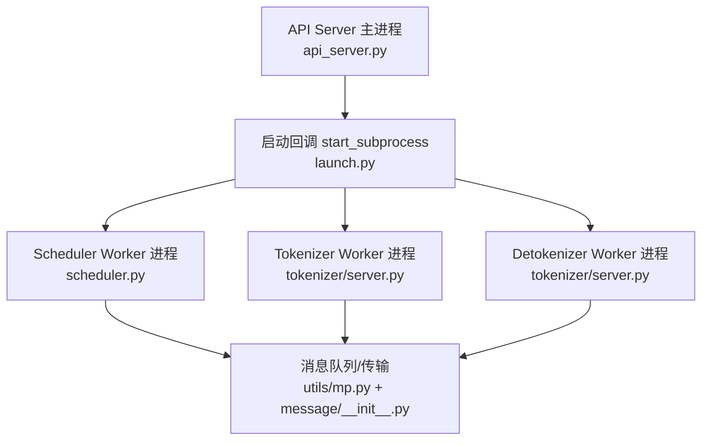
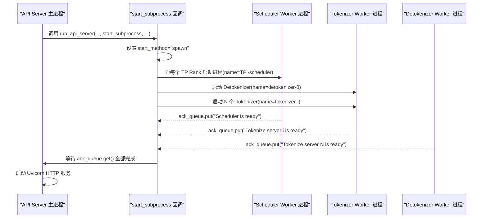
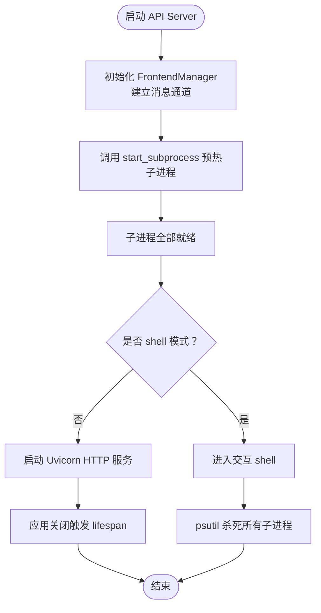
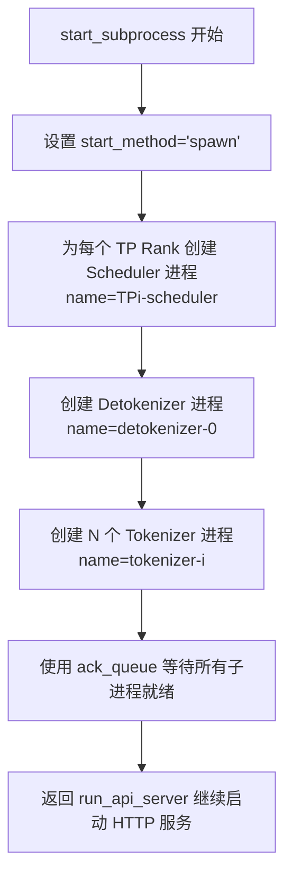
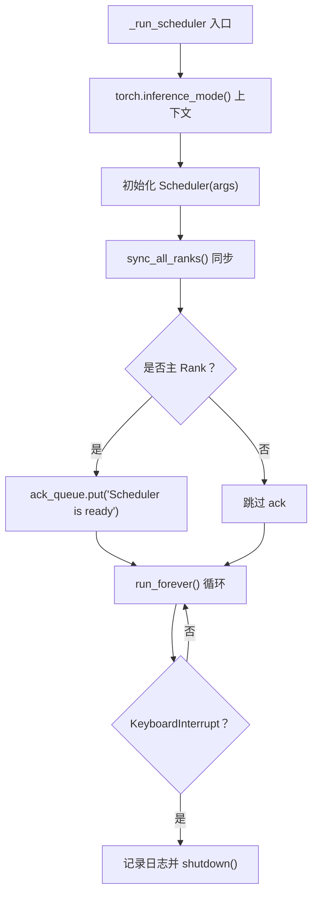
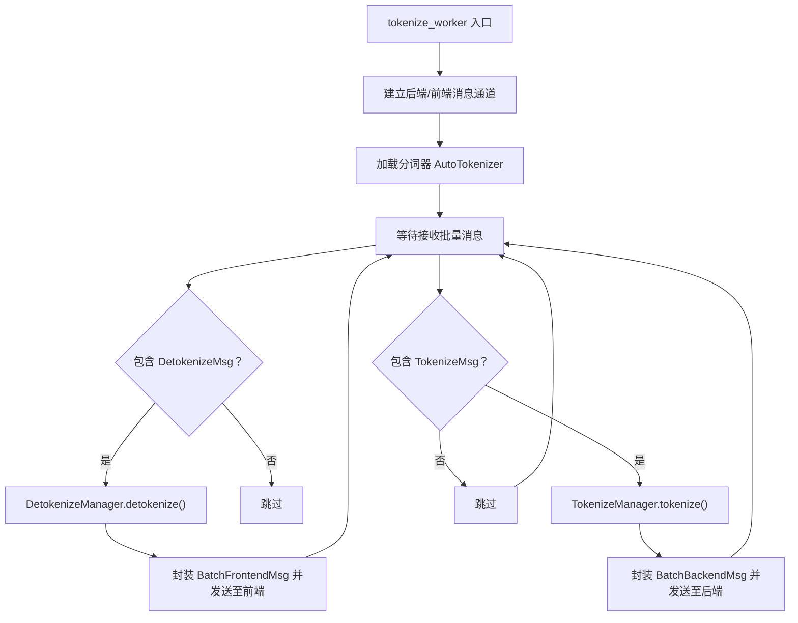
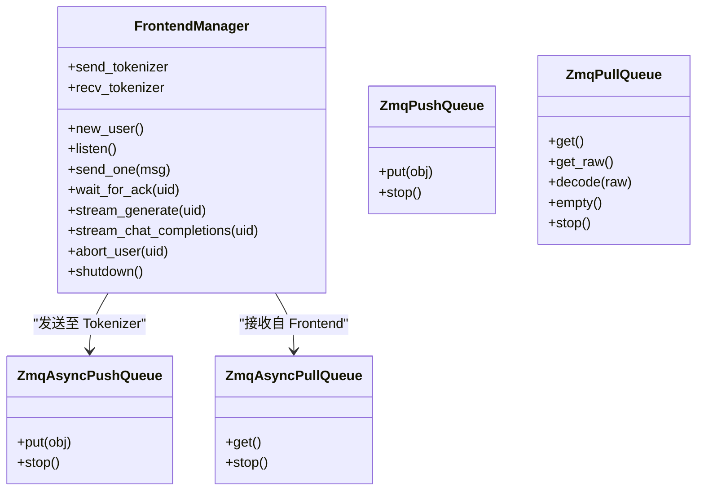
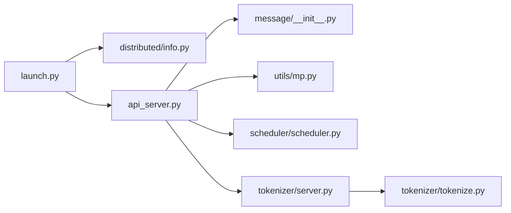

# 进程启动机制

<cite>
**本文引用的文件**
- [launch.py](file://python/minisgl/server/launch.py)
- [api_server.py](file://python/minisgl/server/api_server.py)
- [server.py](file://python/minisgl/tokenizer/server.py)
- [tokenize.py](file://python/minisgl/tokenizer/tokenize.py)
- [scheduler.py](file://python/minisgl/scheduler/scheduler.py)
- [info.py](file://python/minisgl/distributed/info.py)
- [mp.py](file://python/minisgl/utils/mp.py)
- [__init__.py](file://python/minisgl/message/__init__.py)
</cite>

## 目录
1. [引言](#引言)
2. [项目结构](#项目结构)
3. [核心组件](#核心组件)
4. [架构总览](#架构总览)
5. [详细组件分析](#详细组件分析)
6. [依赖关系分析](#依赖关系分析)
7. [性能考量](#性能考量)
8. [故障排查指南](#故障排查指南)
9. [结论](#结论)

## 引言
本文件围绕 mini-sglang 的多进程启动流程展开，重点解析 API Server 主进程如何通过回调函数在接收 HTTP 请求之前预先启动所有子服务：包括每个 TP Rank 对应的一个 Scheduler Worker、若干 Tokenizer Worker，以及一个 Detokenizer Worker。文档将说明：
- 如何使用 multiprocessing.spawn 模式创建独立进程；
- start_subprocess 回调如何派生多个子进程并通过 name 参数进行进程标识；
- 为什么选择 spawn 而非 fork 来保障 CUDA 上下文安全；
- daemon=False 设置对进程生命周期管理的意义；
- 结合 API Server 的信号与生命周期管理，主进程如何监听中断并正确终止所有子进程。

## 项目结构
本节聚焦与多进程启动直接相关的模块与文件组织方式：
- 启动入口与子进程派生：python/minisgl/server/launch.py
- API Server 与生命周期管理：python/minisgl/server/api_server.py
- 分词器工作进程实现：python/minisgl/tokenizer/server.py
- 分词器工具类：python/minisgl/tokenizer/tokenize.py
- 调度器工作进程实现：python/minisgl/scheduler/scheduler.py
- 分布式信息（TP Rank）：python/minisgl/distributed/info.py
- 队列与消息传输：python/minisgl/utils/mp.py、python/minisgl/message/__init__.py

图表来源
- [launch.py](file://python/minisgl/server/launch.py#L40-L114)
- [api_server.py](file://python/minisgl/server/api_server.py#L384-L426)
- [server.py](file://python/minisgl/tokenizer/server.py#L1-L101)
- [scheduler.py](file://python/minisgl/scheduler/scheduler.py#L1-L285)
- [mp.py](file://python/minisgl/utils/mp.py#L1-L152)
- [__init__.py](file://python/minisgl/message/__init__.py#L1-L18)

章节来源
- [launch.py](file://python/minisgl/server/launch.py#L40-L114)
- [api_server.py](file://python/minisgl/server/api_server.py#L384-L426)

## 核心组件
- 启动入口与回调
  - API Server 主进程通过 run_api_server 接收 start_subprocess 回调，并在启动 HTTP 服务前执行该回调以预热所有子服务。
  - 参考路径：[run_api_server](file://python/minisgl/server/api_server.py#L384-L426)

- 子进程派生与命名
  - start_subprocess 使用 multiprocessing.set_start_method("spawn") 明确采用 spawn 模式；随后为每个 TP Rank 创建一个 Scheduler Worker 进程，并为 Detokenizer 和多个 Tokenizer 各创建一个进程；所有子进程均设置 name 以便识别。
  - 参考路径：[start_subprocess 内部逻辑](file://python/minisgl/server/launch.py#L47-L109)

- 子进程目标函数
  - Scheduler Worker 目标函数 _run_scheduler：初始化调度器、同步各 Rank、按需输出就绪信号、进入循环处理；捕获 KeyboardInterrupt 并优雅关闭。
  - 参考路径：[_run_scheduler](file://python/minisgl/server/launch.py#L16-L38)

  - Tokenizer/Detokenizer Worker 目标函数 tokenize_worker：建立与后端/前端的消息通道，加载分词器，处理批量消息，向前端或后端发送结果；捕获 KeyboardInterrupt 并退出。
  - 参考路径：[tokenize_worker](file://python/minisgl/tokenizer/server.py#L29-L101)

- 分布式信息
  - DistributedInfo 提供 rank 与 size，并提供 is_primary 判定；Scheduler 在主 Rank 输出“已就绪”信号。
  - 参考路径：[DistributedInfo](file://python/minisgl/distributed/info.py#L6-L16)

- 生命周期与信号处理
  - API Server 的 lifespan 管理 FastAPI 应用生命周期；shell 模式下通过 psutil 获取父进程子进程并统一杀死。
  - 参考路径：[lifespan](file://python/minisgl/server/api_server.py#L201-L209)，[shell 中的子进程清理](file://python/minisgl/server/api_server.py#L377-L382)

章节来源
- [launch.py](file://python/minisgl/server/launch.py#L16-L114)
- [api_server.py](file://python/minisgl/server/api_server.py#L201-L209)
- [server.py](file://python/minisgl/tokenizer/server.py#L29-L101)
- [info.py](file://python/minisgl/distributed/info.py#L6-L16)

## 架构总览
下面的时序图展示了从 API Server 启动到子进程全部就绪并开始对外提供服务的关键步骤。

图表来源
- [launch.py](file://python/minisgl/server/launch.py#L47-L109)
- [api_server.py](file://python/minisgl/server/api_server.py#L384-L426)

## 详细组件分析

### 组件A：API Server 主进程与生命周期管理
- run_api_server 初始化全局状态 FrontendManager，建立与 Tokenizer/Detokenizer 的消息通道，然后调用 start_subprocess 预热子进程，最后启动 Uvicorn 或进入 shell 模式。
- lifespan 钩子用于应用关闭时调用 FrontendManager.shutdown，确保消息通道被正确停止。
- shell 模式下，当退出交互时会遍历当前进程的所有子进程并强制终止，确保资源回收。

图表来源
- [api_server.py](file://python/minisgl/server/api_server.py#L384-L426)

章节来源
- [api_server.py](file://python/minisgl/server/api_server.py#L384-L426)

### 组件B：子进程派生与命名（start_subprocess）
- 使用 multiprocessing.set_start_method("spawn", force=True) 明确采用 spawn 模式，避免 fork 导致的 CUDA 上下文共享问题。
- 为每个 TP Rank 启动一个 Scheduler Worker，name 为 "minisgl-TPi-scheduler"。
- 启动一个 Detokenizer Worker，name 为 "minisgl-detokenizer-0"。
- 启动多个 Tokenizer Worker，name 为 "minisgl-tokenizer-i"。
- 所有子进程 daemon=False，确保主进程退出时不会自动杀死子进程，需要显式管理生命周期。

图表来源
- [launch.py](file://python/minisgl/server/launch.py#L47-L109)

章节来源
- [launch.py](file://python/minisgl/server/launch.py#L47-L109)

### 组件C：Scheduler Worker（_run_scheduler）
- 在新进程中初始化 Scheduler，调用 sync_all_ranks 完成跨进程同步。
- 若为主 Rank，则向 ack_queue 发送“已就绪”信号。
- 进入 run_forever 循环处理请求；捕获 KeyboardInterrupt 后记录日志并调用 shutdown 优雅退出。

图表来源
- [launch.py](file://python/minisgl/server/launch.py#L16-L38)
- [scheduler.py](file://python/minisgl/scheduler/scheduler.py#L268-L285)

章节来源
- [launch.py](file://python/minisgl/server/launch.py#L16-L38)
- [scheduler.py](file://python/minisgl/scheduler/scheduler.py#L268-L285)

### 组件D：Tokenizer/Detokenizer Worker（tokenize_worker）
- 建立与后端/前端的消息通道，加载分词器，处理批量消息：
  - 将 TokenizeMsg 转换为张量并发送至后端；
  - 将 DetokenizeMsg 转换为文本并发送至前端。
- 捕获 KeyboardInterrupt 并退出，确保进程可被主进程统一管理。

图表来源
- [server.py](file://python/minisgl/tokenizer/server.py#L29-L101)
- [tokenize.py](file://python/minisgl/tokenizer/tokenize.py#L12-L34)

章节来源
- [server.py](file://python/minisgl/tokenizer/server.py#L29-L101)
- [tokenize.py](file://python/minisgl/tokenizer/tokenize.py#L12-L34)

### 组件E：消息与队列（ZMQ）
- FrontendManager 通过 ZmqAsyncPushQueue/ZmqAsyncPullQueue 与 Tokenizer/Detokenizer 通信；
- utils/mp.py 提供同步与异步的 PUSH/PULL/SUB/PUB 队列封装，支持编码/解码与停止逻辑；
- message/__init__.py 暴露前后端消息类型，便于进程间数据契约一致。

图表来源
- [api_server.py](file://python/minisgl/server/api_server.py#L1-L200)
- [mp.py](file://python/minisgl/utils/mp.py#L1-L152)
- [__init__.py](file://python/minisgl/message/__init__.py#L1-L18)

章节来源
- [api_server.py](file://python/minisgl/server/api_server.py#L1-L200)
- [mp.py](file://python/minisgl/utils/mp.py#L1-L152)
- [__init__.py](file://python/minisgl/message/__init__.py#L1-L18)

## 依赖关系分析
- 启动层依赖
  - launch.py 依赖 DistributedInfo 为每个 TP Rank 生成独立配置，并通过 multiprocessing.spawn 启动子进程。
  - api_server.py 依赖 FrontendManager 作为消息前端，依赖 run_api_server 启动 HTTP 服务。
- 计算层依赖
  - scheduler.py 依赖 engine、cache、decode、prefill 等模块，负责调度与推理；
  - tokenizer/server.py 依赖 tokenize.py 的 TokenizeManager 与 detokenize.py 的 DetokenizeManager。
- 通信层依赖
  - 所有进程通过 utils/mp.py 的 ZMQ 队列进行消息传递，消息契约由 message/__init__.py 统一。

图表来源
- [launch.py](file://python/minisgl/server/launch.py#L1-L114)
- [api_server.py](file://python/minisgl/server/api_server.py#L1-L200)
- [info.py](file://python/minisgl/distributed/info.py#L1-L39)
- [mp.py](file://python/minisgl/utils/mp.py#L1-L152)
- [__init__.py](file://python/minisgl/message/__init__.py#L1-L18)
- [scheduler.py](file://python/minisgl/scheduler/scheduler.py#L1-L285)
- [server.py](file://python/minisgl/tokenizer/server.py#L1-L101)
- [tokenize.py](file://python/minisgl/tokenizer/tokenize.py#L1-L34)

章节来源
- [launch.py](file://python/minisgl/server/launch.py#L1-L114)
- [api_server.py](file://python/minisgl/server/api_server.py#L1-L200)
- [info.py](file://python/minisgl/distributed/info.py#L1-L39)
- [mp.py](file://python/minisgl/utils/mp.py#L1-L152)
- [__init__.py](file://python/minisgl/message/__init__.py#L1-L18)
- [scheduler.py](file://python/minisgl/scheduler/scheduler.py#L1-L285)
- [server.py](file://python/minisgl/tokenizer/server.py#L1-L101)
- [tokenize.py](file://python/minisgl/tokenizer/tokenize.py#L1-L34)

## 性能考量
- 多进程启动策略
  - 采用 spawn 模式避免 fork 导致的 CUDA 上下文共享问题，确保每个子进程拥有独立的 CUDA 上下文，降低竞态风险。
  - 通过 ack_queue 在主进程侧等待所有子进程就绪，避免后续请求到达时因子进程未完全初始化导致的延迟或错误。
- 进程命名与可观测性
  - 通过 name 参数为每个子进程设置唯一标识，便于日志与监控定位。
- 生命周期管理
  - daemon=False 使子进程成为前台进程，主进程可显式控制其生命周期；配合 lifespan 与 shell 模式的子进程清理，确保资源释放。

[本节为通用指导，不涉及具体文件分析]

## 故障排查指南
- 子进程未就绪导致请求失败
  - 检查 start_subprocess 是否正确设置 start_method="spawn"，并确认 ack_queue 的等待逻辑是否被执行。
  - 参考路径：[start_subprocess](file://python/minisgl/server/launch.py#L47-L109)

- CUDA 上下文异常或冲突
  - 确认未使用 fork 模式；spawn 模式会在新进程中重新初始化 Python 解释器，避免 CUDA 上下文继承。
  - 参考路径：[start_subprocess 中的 start_method 设置](file://python/minisgl/server/launch.py#L52-L52)

- 子进程无法优雅退出
  - 检查 Scheduler 的 KeyboardInterrupt 处理与 shutdown 调用链；确认 FrontendManager 的 lifespan shutdown 是否被触发。
  - 参考路径：[_run_scheduler 的 KeyboardInterrupt 处理](file://python/minisgl/server/launch.py#L30-L38)，[lifespan 关闭逻辑](file://python/minisgl/server/api_server.py#L201-L209)

- shell 模式下子进程未被清理
  - 确认 shell 退出路径中通过 psutil 获取并杀死所有子进程。
  - 参考路径：[shell 中的子进程清理](file://python/minisgl/server/api_server.py#L377-L382)

章节来源
- [launch.py](file://python/minisgl/server/launch.py#L47-L109)
- [api_server.py](file://python/minisgl/server/api_server.py#L201-L209)
- [api_server.py](file://python/minisgl/server/api_server.py#L377-L382)

## 结论
mini-sglang 的多进程启动流程通过 API Server 主进程在启动 HTTP 服务前调用 start_subprocess 回调，采用 multiprocessing.spawn 模式为每个 TP Rank 启动一个 Scheduler Worker，再启动一个 Detokenizer Worker 与多个 Tokenizer Worker，并通过进程名进行标识。ack_queue 保证所有子进程就绪后才对外提供服务。daemon=False 使主进程能够显式管理子进程生命周期；lifespan 与 shell 模式下的子进程清理共同确保资源正确回收。spawn 模式有效规避了 fork 可能带来的 CUDA 上下文共享问题，提升了系统的稳定性与可维护性。