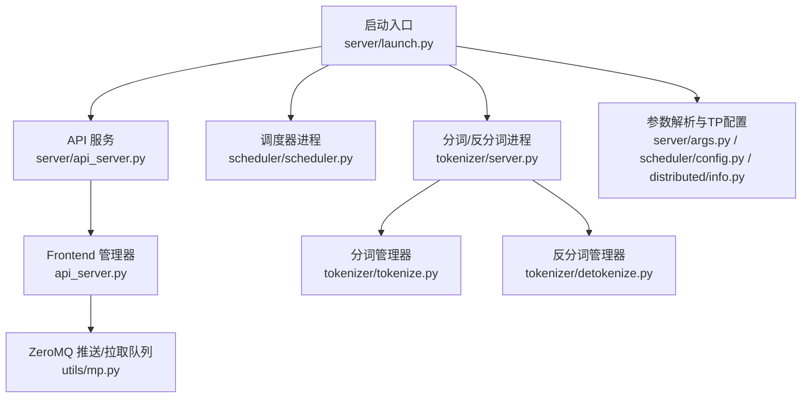
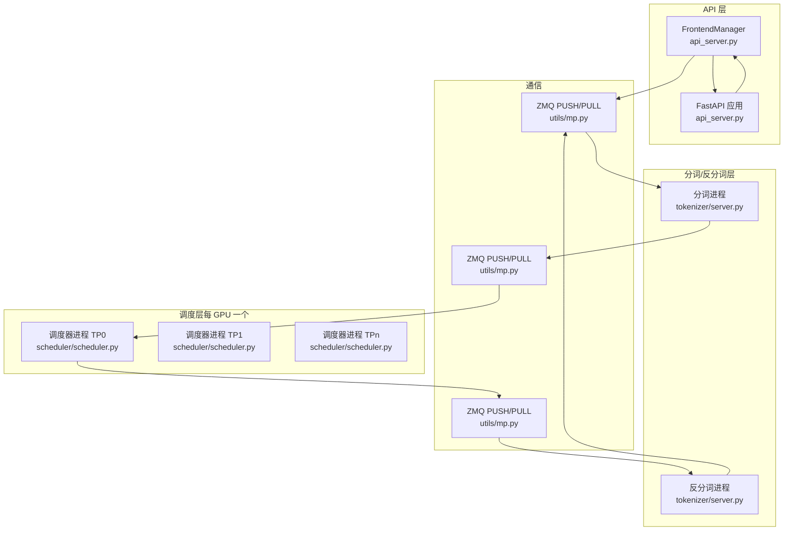
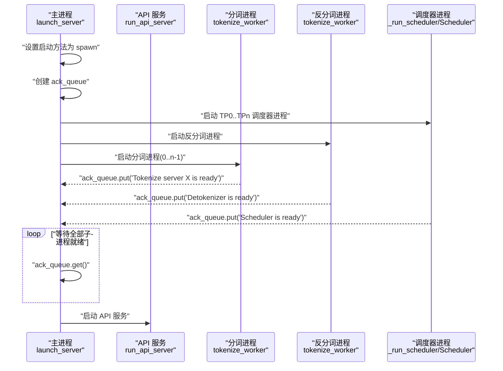
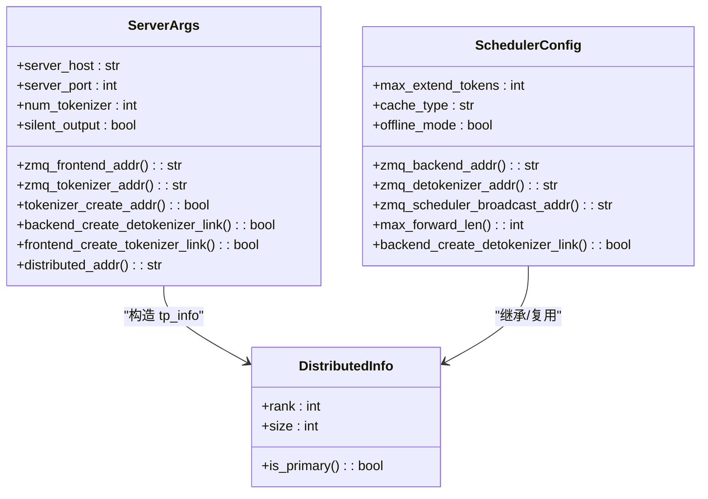
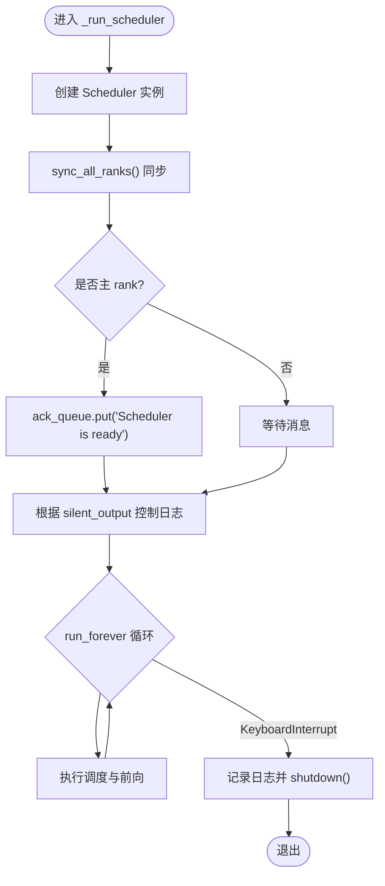
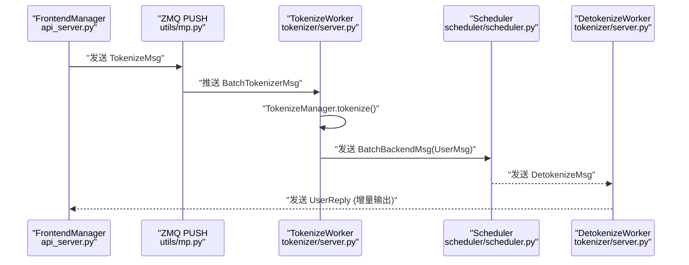
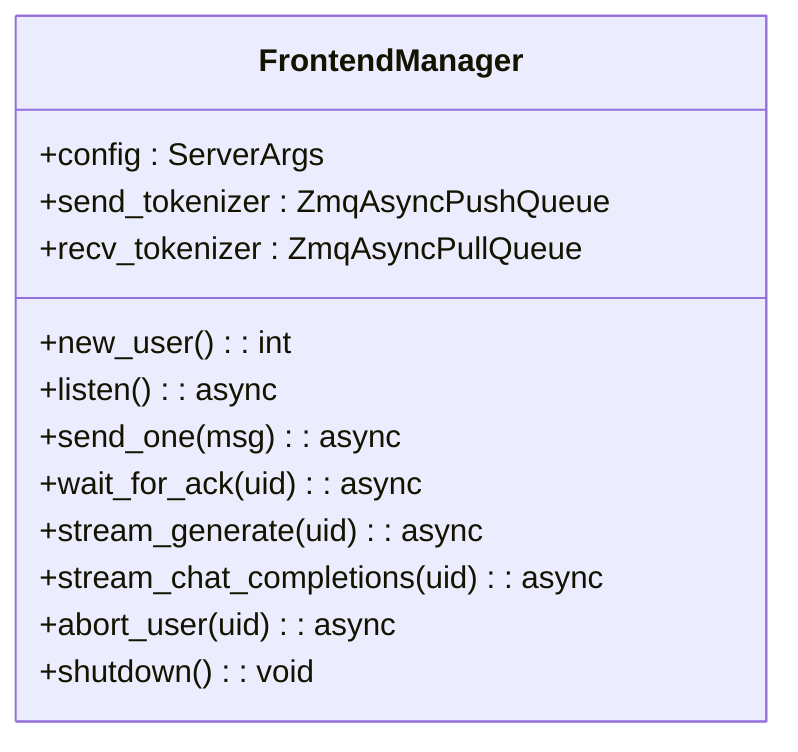
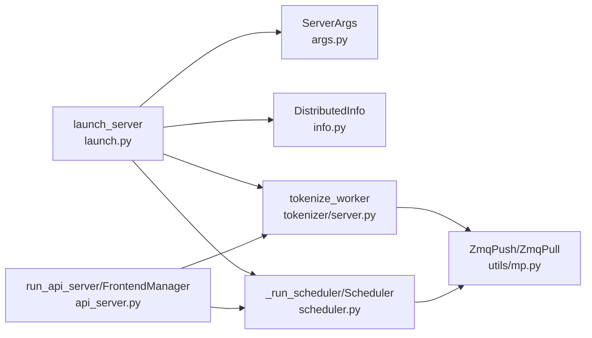

# 进程模型与启动流程

<cite>
**本文引用的文件列表**
- [launch.py](file://python/minisgl/server/launch.py)
- [api_server.py](file://python/minisgl/server/api_server.py)
- [args.py](file://python/minisgl/server/args.py)
- [info.py](file://python/minisgl/distributed/info.py)
- [scheduler.py](file://python/minisgl/scheduler/scheduler.py)
- [config.py](file://python/minisgl/scheduler/config.py)
- [server.py](file://python/minisgl/tokenizer/server.py)
- [tokenize.py](file://python/minisgl/tokenizer/tokenize.py)
- [detokenize.py](file://python/minisgl/tokenizer/detokenize.py)
- [mp.py](file://python/minisgl/utils/mp.py)
- [__init__.py](file://python/minisgl/message/__init__.py)
</cite>

## 目录
1. [引言](#引言)
2. [项目结构](#项目结构)
3. [核心组件](#核心组件)
4. [架构总览](#架构总览)
5. [详细组件分析](#详细组件分析)
6. [依赖关系分析](#依赖关系分析)
7. [性能考量](#性能考量)
8. [故障排查指南](#故障排查指南)
9. [结论](#结论)

## 引言
本文件围绕 mini-sglang 的分布式进程模型与启动流程展开，重点基于 launch.py 中的 launch_server 与 _run_scheduler 函数，系统阐述以下内容：
- 如何通过 multiprocessing.spawn 启动多个独立进程：包括一个 API Server 主进程、多个 Tokenizer Worker、一个 Detokenizer Worker 以及多个 Scheduler Worker（每个 GPU 一个）。
- ServerArgs 与 DistributedInfo 如何协同工作以配置 TP（张量并行）拓扑结构。
- ack_queue 如何确保所有子进程就绪后才开放服务。
- 为什么采用多进程而非多线程模型，以及该设计在内存隔离、GIL 规避与容错性方面的优势。

## 项目结构
从入口到各子系统的关键文件组织如下：
- 启动入口：server/launch.py
- API 服务：server/api_server.py
- 参数解析与 TP 配置：server/args.py、scheduler/config.py、distributed/info.py
- 调度器：scheduler/scheduler.py
- 分词与反分词：tokenizer/server.py、tokenizer/tokenize.py、tokenizer/detokenize.py
- 进程间通信：utils/mp.py（ZeroMQ 封装）
- 消息类型：message/__init__.py

图表来源
- [launch.py](file://python/minisgl/server/launch.py#L40-L114)
- [api_server.py](file://python/minisgl/server/api_server.py#L384-L426)
- [scheduler.py](file://python/minisgl/scheduler/scheduler.py#L80-L120)
- [server.py](file://python/minisgl/tokenizer/server.py#L29-L101)
- [args.py](file://python/minisgl/server/args.py#L14-L235)
- [config.py](file://python/minisgl/scheduler/config.py#L14-L41)
- [info.py](file://python/minisgl/distributed/info.py#L6-L39)
- [mp.py](file://python/minisgl/utils/mp.py#L12-L152)

章节来源
- [launch.py](file://python/minisgl/server/launch.py#L40-L114)
- [api_server.py](file://python/minisgl/server/api_server.py#L384-L426)
- [args.py](file://python/minisgl/server/args.py#L14-L235)
- [config.py](file://python/minisgl/scheduler/config.py#L14-L41)
- [info.py](file://python/minisgl/distributed/info.py#L6-L39)

## 核心组件
- 启动器（launch_server）：负责解析参数、设置进程启动方法为 spawn、创建 ack 队列、按 TP 大小启动多个调度器进程，并启动分词与反分词进程；在收到全部子进程“已就绪”信号后，再启动 API 服务。
- 调度器（Scheduler）：每个 TP 进程运行一个调度器实例，负责接收来自分词进程的消息，执行预填充/解码调度、CUDA 图与重叠计算、将结果回传给反分词进程。
- 分词/反分词（tokenize_worker）：统一的进程入口，内部包含 TokenizeManager 与 DetokenizeManager，分别处理编码与解码，使用 ZeroMQ 在进程间传递消息。
- API 服务（run_api_server/FrontendManager）：FastAPI 应用，负责接收外部请求，通过 ZeroMQ 将请求转发至分词进程，并将反分词结果流式返回客户端。
- 参数与拓扑（ServerArgs/DistributedInfo/SchedulerConfig）：ServerArgs 解析命令行参数并构造分布式拓扑信息 tp_info；SchedulerConfig 提供 ZeroMQ 地址与唯一后缀等网络配置；DistributedInfo 描述 rank 与 world_size。

章节来源
- [launch.py](file://python/minisgl/server/launch.py#L16-L114)
- [scheduler.py](file://python/minisgl/scheduler/scheduler.py#L80-L120)
- [server.py](file://python/minisgl/tokenizer/server.py#L29-L101)
- [api_server.py](file://python/minisgl/server/api_server.py#L98-L199)
- [args.py](file://python/minisgl/server/args.py#L14-L235)
- [config.py](file://python/minisgl/scheduler/config.py#L14-L41)
- [info.py](file://python/minisgl/distributed/info.py#L6-L39)

## 架构总览
下图展示了从 API 请求到推理完成的端到端流程，以及多进程之间的职责划分与通信路径。

图表来源
- [api_server.py](file://python/minisgl/server/api_server.py#L98-L199)
- [server.py](file://python/minisgl/tokenizer/server.py#L29-L101)
- [scheduler.py](file://python/minisgl/scheduler/scheduler.py#L80-L120)
- [mp.py](file://python/minisgl/utils/mp.py#L12-L152)

## 详细组件分析

### 启动流程与进程模型
- 启动入口：launch_server 解析参数后，调用 run_api_server 并传入 start_subprocess 回调。
- 子进程启动：
  - 设置进程启动方法为 spawn，保证跨平台一致性与资源隔离。
  - 创建 ack_queue，用于收集子进程“已就绪”信号。
  - 按照 tp_info.size 启动多个调度器进程，每个进程的 tp_info.rank 由替换后的 DistributedInfo 决定。
  - 启动一个反分词进程（Detokenizer），以及若干分词进程（Tokenizer），数量由 num_tokenizer 决定；当 num_tokenizer 为 0 时，分词与反分词共享同一地址。
- 就绪同步：主进程循环从 ack_queue 获取“已就绪”消息，直到收到全部子进程的确认后，才启动 API 服务。

图表来源
- [launch.py](file://python/minisgl/server/launch.py#L40-L114)
- [server.py](file://python/minisgl/tokenizer/server.py#L29-L101)
- [scheduler.py](file://python/minisgl/scheduler/scheduler.py#L16-L38)

章节来源
- [launch.py](file://python/minisgl/server/launch.py#L40-L114)

### ServerArgs 与 DistributedInfo 协同配置 TP 拓扑
- ServerArgs 解析命令行参数，其中 --tensor-parallel-size 决定 world_size，随后构造 DistributedInfo(0, world_size) 作为初始 tp_info。
- 在启动子进程时，launch_server 对每个调度器进程使用 dataclasses.replace 将 tp_info.rank 替换为 [0, world_size-1]，从而形成完整的 TP 拓扑。
- SchedulerConfig 通过唯一后缀生成 IPC/TCP 地址，确保不同进程/会话的 ZeroMQ 通道互不冲突。
- DistributedInfo 提供 is_primary 判断，便于主 rank 执行特定操作（例如发送“已就绪”信号）。

图表来源
- [args.py](file://python/minisgl/server/args.py#L14-L235)
- [info.py](file://python/minisgl/distributed/info.py#L6-L39)
- [config.py](file://python/minisgl/scheduler/config.py#L14-L41)

章节来源
- [args.py](file://python/minisgl/server/args.py#L14-L235)
- [info.py](file://python/minisgl/distributed/info.py#L6-L39)
- [config.py](file://python/minisgl/scheduler/config.py#L14-L41)

### 调度器进程生命周期与就绪同步
- _run_scheduler：在 torch.inference_mode 下创建 Scheduler 实例，调用 sync_all_ranks 完成进程组同步；主 rank 放入“Scheduler is ready”到 ack_queue；根据 silent_output 控制日志级别；进入 run_forever 循环；捕获 KeyboardInterrupt 后优雅关闭。
- Scheduler.run_forever：根据环境变量选择重叠调度或普通调度，持续接收消息、调度批处理、执行前向、处理上一批结果并回传反分词。

图表来源
- [launch.py](file://python/minisgl/server/launch.py#L16-L38)
- [scheduler.py](file://python/minisgl/scheduler/scheduler.py#L268-L285)

章节来源
- [launch.py](file://python/minisgl/server/launch.py#L16-L38)
- [scheduler.py](file://python/minisgl/scheduler/scheduler.py#L268-L285)

### 分词/反分词进程与消息编解码
- tokenize_worker：作为统一入口，根据 create 标志决定绑定或连接 ZeroMQ 地址；加载 AutoTokenizer；维护 TokenizeManager 与 DetokenizeManager；从监听队列读取消息，批量处理后分别发送至后端（Engine）与前端（API）。
- TokenizeManager：将文本转换为 input_ids。
- DetokenizeManager：维护 DecodeStatus，增量输出可打印文本，支持中文字符边界处理。

图表来源
- [api_server.py](file://python/minisgl/server/api_server.py#L98-L199)
- [server.py](file://python/minisgl/tokenizer/server.py#L29-L101)
- [tokenize.py](file://python/minisgl/tokenizer/tokenize.py#L12-L34)
- [detokenize.py](file://python/minisgl/tokenizer/detokenize.py#L67-L115)
- [mp.py](file://python/minisgl/utils/mp.py#L12-L152)

章节来源
- [server.py](file://python/minisgl/tokenizer/server.py#L29-L101)
- [tokenize.py](file://python/minisgl/tokenizer/tokenize.py#L12-L34)
- [detokenize.py](file://python/minisgl/tokenizer/detokenize.py#L67-L115)

### API 服务与前端管理
- FrontendManager：持有 ZmqAsyncPushQueue（发送至分词）与 ZmqAsyncPullQueue（接收自反分词），维护每个 UID 的事件与累积回复；提供异步监听、等待 ACK、流式返回等功能。
- run_api_server：构建 FrontendManager，调用 start_backend（即启动子进程），然后启动 Uvicorn 或 Shell 模式。

图表来源
- [api_server.py](file://python/minisgl/server/api_server.py#L98-L199)

章节来源
- [api_server.py](file://python/minisgl/server/api_server.py#L98-L199)

## 依赖关系分析
- 启动器依赖：ServerArgs、DistributedInfo、Scheduler（调度器）、tokenize_worker（分词/反分词）。
- 调度器依赖：SchedulerConfig、Engine（推理引擎）、ZeroMQ I/O 混入。
- 分词/反分词依赖：TokenizeManager、DetokenizeManager、ZeroMQ 推拉队列。
- API 服务依赖：FrontendManager、ZeroMQ 异步队列、FastAPI。

图表来源
- [launch.py](file://python/minisgl/server/launch.py#L40-L114)
- [args.py](file://python/minisgl/server/args.py#L14-L235)
- [info.py](file://python/minisgl/distributed/info.py#L6-L39)
- [scheduler.py](file://python/minisgl/scheduler/scheduler.py#L80-L120)
- [server.py](file://python/minisgl/tokenizer/server.py#L29-L101)
- [api_server.py](file://python/minisgl/server/api_server.py#L384-L426)
- [mp.py](file://python/minisgl/utils/mp.py#L12-L152)

章节来源
- [launch.py](file://python/minisgl/server/launch.py#L40-L114)
- [api_server.py](file://python/minisgl/server/api_server.py#L384-L426)
- [scheduler.py](file://python/minisgl/scheduler/scheduler.py#L80-L120)
- [server.py](file://python/minisgl/tokenizer/server.py#L29-L101)
- [args.py](file://python/minisgl/server/args.py#L14-L235)
- [info.py](file://python/minisgl/distributed/info.py#L6-L39)
- [mp.py](file://python/minisgl/utils/mp.py#L12-L152)

## 性能考量
- 重叠调度：Scheduler.overlap_loop 在 CUDA 流中重叠调度与执行，减少 CPU 等待时间，提升 GPU 利用率。
- CUDA Graph：EngineConfig 支持 cuda_graph_bs/cuda_graph_max_bs，降低内核启动开销。
- 批处理与消息聚合：tokenize_worker 支持本地批量处理，减少 ZeroMQ 传输次数。
- 零拷贝与异步：ZmqAsyncPushQueue/ZmqAsyncPullQueue 使用异步上下文，避免阻塞主线程。

章节来源
- [scheduler.py](file://python/minisgl/scheduler/scheduler.py#L231-L280)
- [config.py](file://python/minisgl/engine/config.py#L15-L55)
- [server.py](file://python/minisgl/tokenizer/server.py#L58-L99)
- [mp.py](file://python/minisgl/utils/mp.py#L33-L103)

## 故障排查指南
- API 服务未启动：检查 ack_queue 是否收到全部子进程“已就绪”信号；确认 num_tokenizer 与 tp_info.size 是否匹配。
- 进程无法就绪：检查 _run_scheduler 中 sync_all_ranks 是否抛出异常；确认 DistributedInfo.rank/size 是否正确传递。
- 分词/反分词无响应：检查 ZeroMQ 地址是否一致（frontend/backend/detokenizer 地址由 ServerArgs/SchedulerConfig 生成）；确认 create 标志与连接顺序。
- 调度器崩溃：捕获 KeyboardInterrupt 后应调用 shutdown 并释放资源；检查 CUDA 流与设备状态。

章节来源
- [launch.py](file://python/minisgl/server/launch.py#L16-L38)
- [api_server.py](file://python/minisgl/server/api_server.py#L384-L426)
- [server.py](file://python/minisgl/tokenizer/server.py#L29-L101)
- [scheduler.py](file://python/minisgl/scheduler/scheduler.py#L268-L285)

## 结论
mini-sglang 采用多进程模型，以 multiprocessing.spawn 启动 API Server、Tokenizer、Detokenizer 与多个 Scheduler 进程，每个 GPU 对应一个调度器进程，形成清晰的 TP 拓扑。ServerArgs 与 DistributedInfo 共同定义拓扑，ack_queue 确保所有子进程就绪后才开放服务。该设计在内存隔离、规避 GIL、简化容错方面具有显著优势，配合重叠调度、CUDA Graph 与 ZeroMQ 异步队列，实现了高吞吐与低延迟的推理服务。