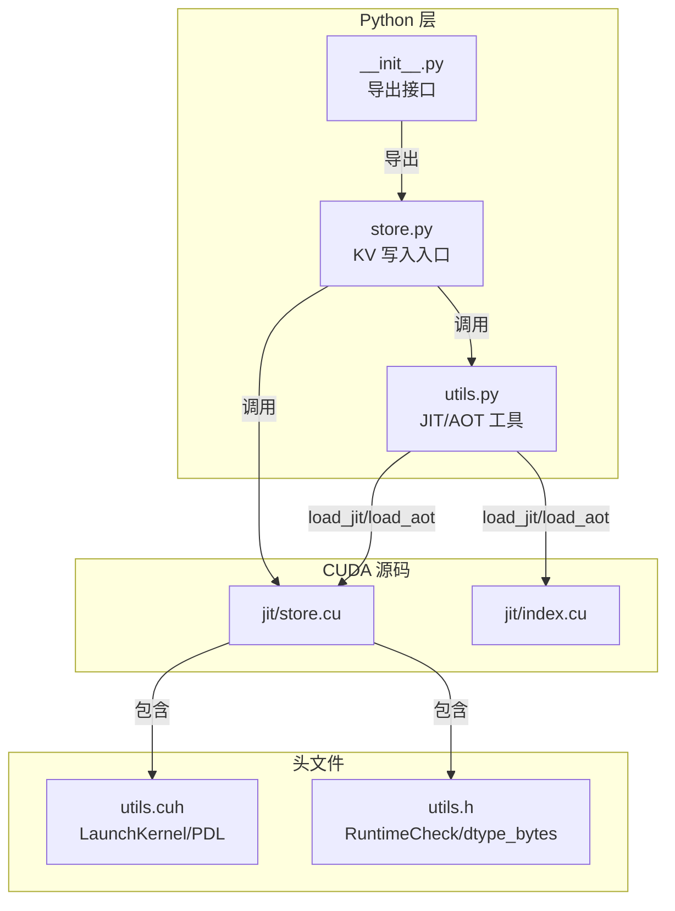
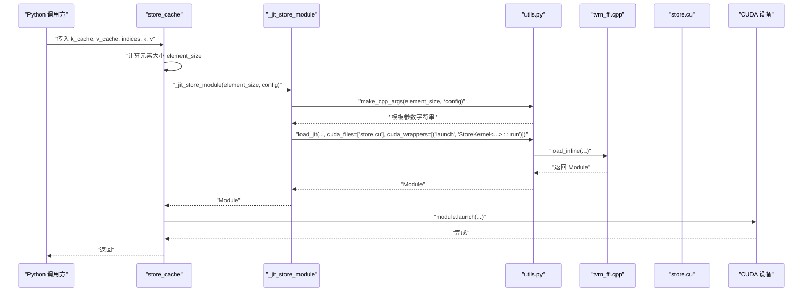
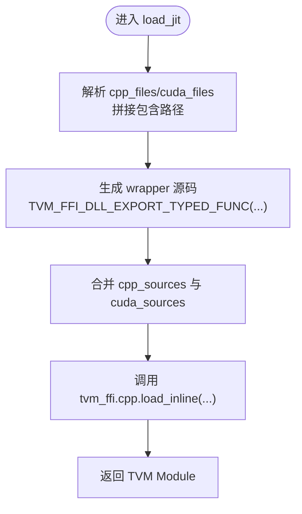
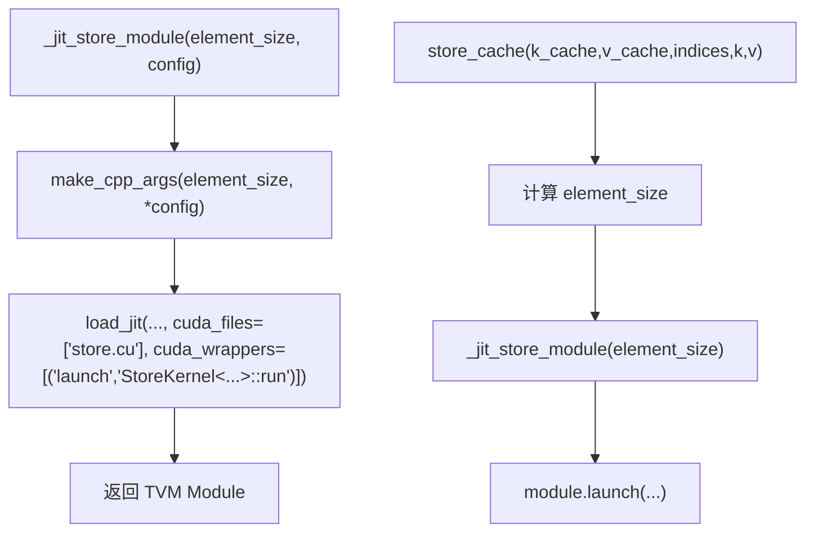
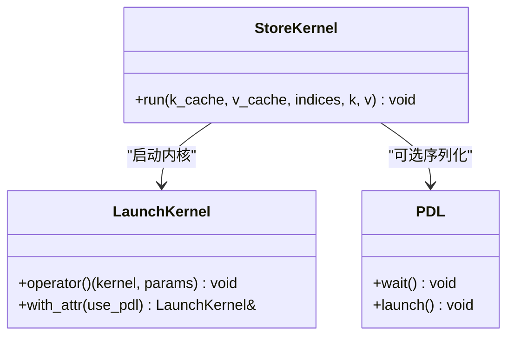
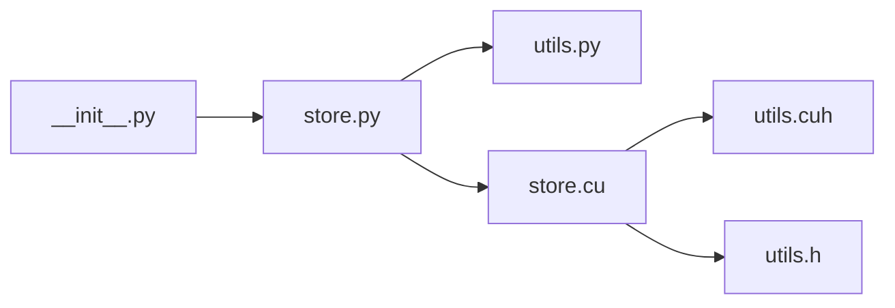

# JIT编译与内核加载机制

<cite>
**本文引用的文件**
- [python/minisgl/kernel/utils.py](file://python/minisgl/kernel/utils.py)
- [python/minisgl/kernel/store.py](file://python/minisgl/kernel/store.py)
- [python/minisgl/kernel/csrc/jit/store.cu](file://python/minisgl/kernel/csrc/jit/store.cu)
- [python/minisgl/kernel/csrc/jit/index.cu](file://python/minisgl/kernel/csrc/jit/index.cu)
- [python/minisgl/kernel/csrc/include/minisgl/utils.cuh](file://python/minisgl/kernel/csrc/include/minisgl/utils.cuh)
- [python/minisgl/kernel/csrc/include/minisgl/utils.h](file://python/minisgl/kernel/csrc/include/minisgl/utils.h)
- [python/minisgl/kernel/__init__.py](file://python/minisgl/kernel/__init__.py)
- [tests/kernel/test_store.py](file://tests/kernel/test_store.py)
</cite>

## 目录
1. [引言](#引言)
2. [项目结构](#项目结构)
3. [核心组件](#核心组件)
4. [架构总览](#架构总览)
5. [详细组件分析](#详细组件分析)
6. [依赖关系分析](#依赖关系分析)
7. [性能考量](#性能考量)
8. [故障排查指南](#故障排查指南)
9. [结论](#结论)
10. [附录：新增JIT内核步骤](#附录新增jit内核步骤)

## 引言
本文件系统性地文档化项目中基于 tvm-ffi 的 JIT 编译机制，重点解释：
- utils.py 中的 load_jit 与 load_aot 如何根据配置动态编译 CUDA 内核（如 store.cu）
- KernelConfig 如何控制编译参数（线程数、占用率、是否启用 PDL）
- store.py 中 _jit_store_module 与 store_cache 如何按元素大小生成特化内核模块，并通过 cuda_wrappers 注册启动函数
- JIT 编译的缓存策略（@lru_cache）及其对启动性能的影响
- 新增一个 JIT 内核的完整步骤：编写 .cu 文件、定义 wrapper、在 Python 中加载与调用

## 项目结构
围绕 JIT 编译与内核加载的相关目录与文件如下：
- Python 层：kernel/utils.py（JIT/AOT 加载工具）、kernel/store.py（KV 写入内核入口）
- CUDA 源码：kernel/csrc/jit/*.cu（JIT 可包含的内核源文件）
- 头文件：kernel/csrc/include/minisgl/*.h（内核运行时辅助与封装）
- 导出入口：kernel/__init__.py（对外暴露 store_cache 等接口）

图表来源
- [python/minisgl/kernel/utils.py](file://python/minisgl/kernel/utils.py#L53-L129)
- [python/minisgl/kernel/store.py](file://python/minisgl/kernel/store.py#L1-L43)
- [python/minisgl/kernel/csrc/jit/store.cu](file://python/minisgl/kernel/csrc/jit/store.cu#L1-L124)
- [python/minisgl/kernel/csrc/jit/index.cu](file://python/minisgl/kernel/csrc/jit/index.cu#L1-L174)
- [python/minisgl/kernel/csrc/include/minisgl/utils.cuh](file://python/minisgl/kernel/csrc/include/minisgl/utils.cuh#L1-L144)
- [python/minisgl/kernel/csrc/include/minisgl/utils.h](file://python/minisgl/kernel/csrc/include/minisgl/utils.h#L1-L96)
- [python/minisgl/kernel/__init__.py](file://python/minisgl/kernel/__init__.py#L1-L15)

章节来源
- [python/minisgl/kernel/utils.py](file://python/minisgl/kernel/utils.py#L1-L129)
- [python/minisgl/kernel/store.py](file://python/minisgl/kernel/store.py#L1-L43)
- [python/minisgl/kernel/__init__.py](file://python/minisgl/kernel/__init__.py#L1-L15)

## 核心组件
- KernelConfig：用于描述内核编译参数的命名元组，包含线程数、最大占用、是否启用 PDL。其 template_args 属性用于生成模板参数字符串。
- load_jit：通过 tvm_ffi.cpp.load_inline 动态编译 CUDA/CPP 源码，支持传入 wrapper 列表，将 C++ 函数导出为 TVM FFI 接口。
- load_aot：通过 tvm_ffi.cpp.load 预编译并链接静态产物（与 JIT 相比，适合已知编译环境与参数的场景）。
- _jit_store_module：基于元素大小与 KernelConfig 进行特化编译，返回 TVM Module；使用 lru_cache 缓存编译结果。
- store_cache：对外接口，负责将输入张量视图化、计算元素大小、调用 JIT 模块执行写入。

章节来源
- [python/minisgl/kernel/utils.py](file://python/minisgl/kernel/utils.py#L22-L31)
- [python/minisgl/kernel/utils.py](file://python/minisgl/kernel/utils.py#L53-L84)
- [python/minisgl/kernel/utils.py](file://python/minisgl/kernel/utils.py#L87-L129)
- [python/minisgl/kernel/store.py](file://python/minisgl/kernel/store.py#L12-L28)
- [python/minisgl/kernel/store.py](file://python/minisgl/kernel/store.py#L30-L43)

## 架构总览
下图展示了从 Python 调用到 CUDA 内核执行的整体流程，包括 JIT 编译、参数特化、模块加载与启动。

图表来源
- [python/minisgl/kernel/store.py](file://python/minisgl/kernel/store.py#L15-L28)
- [python/minisgl/kernel/store.py](file://python/minisgl/kernel/store.py#L30-L43)
- [python/minisgl/kernel/utils.py](file://python/minisgl/kernel/utils.py#L87-L129)
- [python/minisgl/kernel/csrc/jit/store.cu](file://python/minisgl/kernel/csrc/jit/store.cu#L55-L122)

## 详细组件分析

### 组件一：JIT 加载与参数特化（utils.py）
- KernelConfig
  - 字段：num_threads、max_occupancy、use_pdl
  - 方法：template_args 将上述字段转换为逗号分隔字符串，供模板实例化使用
- load_jit
  - 支持 cpp_files 与 cuda_files 的包含路径解析（从 kernel/csrc/jit 目录）
  - 支持 cpp_wrappers 与 cuda_wrappers，通过 _make_wrapper 生成 TVM_FFI_DLL_EXPORT_TYPED_FUNC 包装，将 C++ 函数导出为 TVM FFI 接口
  - 使用 DEFAULT_CFLAGS/DEFAULT_CUDA_CFLAGS/DEFAULT_INCLUDE 等默认编译选项
  - 返回 TVM Module，供 Python 调用
- load_aot
  - 与 load_jit 类似，但使用 load 预编译静态产物，适合固定参数与稳定构建环境

图表来源
- [python/minisgl/kernel/utils.py](file://python/minisgl/kernel/utils.py#L87-L129)

章节来源
- [python/minisgl/kernel/utils.py](file://python/minisgl/kernel/utils.py#L22-L31)
- [python/minisgl/kernel/utils.py](file://python/minisgl/kernel/utils.py#L53-L84)
- [python/minisgl/kernel/utils.py](file://python/minisgl/kernel/utils.py#L87-L129)

### 组件二：KV 写入内核入口（store.py）
- _jit_store_module
  - 使用 lru_cache(maxsize=None) 对 element_size 与 KernelConfig 进行缓存，避免重复编译
  - 通过 make_cpp_args 将 element_size 与 KernelConfig 展开为模板参数
  - 调用 load_jit，指定 cuda_files 为 ["store.cu"]，并通过 cuda_wrappers 将 "launch" 映射到 StoreKernel<...>::run
- store_cache
  - 将 k_cache/v_cache 视图为二维，计算 element_size = shape[1] * element_size
  - 获取模块并调用 module.launch 执行内核

图表来源
- [python/minisgl/kernel/store.py](file://python/minisgl/kernel/store.py#L15-L28)
- [python/minisgl/kernel/store.py](file://python/minisgl/kernel/store.py#L30-L43)

章节来源
- [python/minisgl/kernel/store.py](file://python/minisgl/kernel/store.py#L12-L28)
- [python/minisgl/kernel/store.py](file://python/minisgl/kernel/store.py#L30-L43)

### 组件三：CUDA 内核实现（store.cu）
- StoreKernel 模板
  - run 接口接收 TVM TensorView，进行设备、形状、步幅、数据类型的验证
  - 计算 stride、长度等运行时参数，构造 StoreKernelParams
  - 根据 indices 数据类型选择 int32/int64，计算 block 数与 grid 数，调用 LaunchKernel 启动内核
- 内核主体
  - 使用 __launch_bounds__ 固定占用率，每个 warp 处理一个索引位置
  - 通过 warp::copy 完成内存拷贝，支持 element_size 特化

图表来源
- [python/minisgl/kernel/csrc/jit/store.cu](file://python/minisgl/kernel/csrc/jit/store.cu#L55-L122)
- [python/minisgl/kernel/csrc/include/minisgl/utils.cuh](file://python/minisgl/kernel/csrc/include/minisgl/utils.cuh#L1-L144)

章节来源
- [python/minisgl/kernel/csrc/jit/store.cu](file://python/minisgl/kernel/csrc/jit/store.cu#L1-L124)
- [python/minisgl/kernel/csrc/include/minisgl/utils.cuh](file://python/minisgl/kernel/csrc/include/minisgl/utils.cuh#L1-L144)
- [python/minisgl/kernel/csrc/include/minisgl/utils.h](file://python/minisgl/kernel/csrc/include/minisgl/utils.h#L1-L96)

### 组件四：索引内核（index.cu）作为参考
- IndexKernel 提供通用索引与掩码索引功能，展示如何通过模板参数控制线程块占用、元素拆分与 PDL 序列化
- 与 store.cu 的差异在于数据流向与掩码处理，但编译与启动模式一致

章节来源
- [python/minisgl/kernel/csrc/jit/index.cu](file://python/minisgl/kernel/csrc/jit/index.cu#L1-L174)

## 依赖关系分析
- Python 层依赖关系
  - store.py 依赖 utils.py 的 KernelConfig、load_jit、make_cpp_args
  - store.py 依赖 CUDA 源码 store.cu
- CUDA 层依赖关系
  - store.cu 依赖 utils.cuh（LaunchKernel、PDL）与 utils.h（dtype_bytes、RuntimeCheck）
- 导出关系
  - __init__.py 将 store_cache 对外导出，便于上层模块直接使用

图表来源
- [python/minisgl/kernel/store.py](file://python/minisgl/kernel/store.py#L1-L43)
- [python/minisgl/kernel/utils.py](file://python/minisgl/kernel/utils.py#L1-L129)
- [python/minisgl/kernel/csrc/jit/store.cu](file://python/minisgl/kernel/csrc/jit/store.cu#L1-L124)
- [python/minisgl/kernel/csrc/include/minisgl/utils.cuh](file://python/minisgl/kernel/csrc/include/minisgl/utils.cuh#L1-L144)
- [python/minisgl/kernel/csrc/include/minisgl/utils.h](file://python/minisgl/kernel/csrc/include/minisgl/utils.h#L1-L96)
- [python/minisgl/kernel/__init__.py](file://python/minisgl/kernel/__init__.py#L1-L15)

章节来源
- [python/minisgl/kernel/store.py](file://python/minisgl/kernel/store.py#L1-L43)
- [python/minisgl/kernel/utils.py](file://python/minisgl/kernel/utils.py#L1-L129)
- [python/minisgl/kernel/__init__.py](file://python/minisgl/kernel/__init__.py#L1-L15)

## 性能考量
- 编译期优化
  - 默认编译选项包含 -std=c++20、-O3，以及 CUDA 专属的 --expt-relaxed-constexpr，有助于模板常量表达式与优化
- 运行时优化
  - LaunchKernel::with_attr 支持启用 PDL（Programmatic Stream Serialization），在需要严格序列化时设置 cudaLaunchAttributeProgrammaticStreamSerialization
  - __launch_bounds__ 固定占用率，提升 SM 利用率与稳定性
- 缓存策略
  - _jit_store_module 使用 lru_cache(maxsize=None)，对相同 element_size 与 KernelConfig 的组合复用编译产物，显著降低首次启动开销
  - 测试中通过对比 baseline（torch.index_put）与 store_cache，验证在大批量写入场景下的带宽与延迟优势

章节来源
- [python/minisgl/kernel/utils.py](file://python/minisgl/kernel/utils.py#L11-L13)
- [python/minisgl/kernel/csrc/include/minisgl/utils.cuh](file://python/minisgl/kernel/csrc/include/minisgl/utils.cuh#L103-L144)
- [python/minisgl/kernel/store.py](file://python/minisgl/kernel/store.py#L15-L28)
- [tests/kernel/test_store.py](file://tests/kernel/test_store.py#L1-L54)

## 故障排查指南
- 参数不匹配
  - CUDA 内核在运行时会校验输入张量的设备、形状、步幅与数据类型，若不满足要求会触发运行时检查错误
- 元素大小不一致
  - StoreKernel::run 会断言 element_size 与 dtype_size*D.unwrap() 一致，否则抛出异常
- 索引类型不匹配
  - 根据 indices 的位宽选择 int32 或 int64，若传入类型不一致可能导致启动失败或错误行为
- 编译失败
  - 若 CUDA 源码包含语法错误或缺失头文件，load_jit/load_aot 会在编译阶段报错；建议先单独验证 .cu 文件可编译

章节来源
- [python/minisgl/kernel/csrc/jit/store.cu](file://python/minisgl/kernel/csrc/jit/store.cu#L90-L121)
- [python/minisgl/kernel/csrc/include/minisgl/utils.h](file://python/minisgl/kernel/csrc/include/minisgl/utils.h#L51-L67)

## 结论
本机制通过 tvm-ffi 的 JIT/AOT 工具链，实现了面向 CUDA 的高性能内核编译与加载。KernelConfig 提供了灵活的编译参数控制，_jit_store_module 基于元素大小与配置进行模板特化，并通过 lru_cache 有效降低启动成本。CUDA 内核采用模板与 LaunchKernel 封装，兼顾可读性与性能。该设计为后续扩展更多内核提供了清晰的模式与最佳实践。

## 附录：新增JIT内核步骤
- 步骤一：编写 .cu 文件
  - 在 kernel/csrc/jit 下创建新的 CUDA 源文件，定义模板类/函数与 run 接口，遵循现有风格（如 StoreKernel::run）
  - 在 run 中完成张量验证、参数计算与 LaunchKernel 启动
- 步骤二：定义 wrapper
  - 在 Python 层的 utils.py 中，使用 _make_wrapper 生成 TVM_FFI_DLL_EXPORT_TYPED_FUNC 包装，将 C++ 函数导出为 TVM FFI 接口
  - 在 load_jit 调用中通过 cuda_wrappers/cpp_wrappers 指定导出名称与目标函数签名
- 步骤三：在 Python 中加载与调用
  - 在对应模块中定义一个工厂函数（类似 _jit_store_module），使用 make_cpp_args 生成模板参数，调用 load_jit 加载内核
  - 对外暴露一个简洁的 Python 接口（类似 store_cache），负责参数准备与 module.launch 调用
- 步骤四：集成与测试
  - 在 __init__.py 中导出新接口
  - 编写单元测试，覆盖不同数据类型、形状与索引类型，验证正确性与性能

章节来源
- [python/minisgl/kernel/utils.py](file://python/minisgl/kernel/utils.py#L37-L40)
- [python/minisgl/kernel/utils.py](file://python/minisgl/kernel/utils.py#L87-L129)
- [python/minisgl/kernel/store.py](file://python/minisgl/kernel/store.py#L15-L28)
- [python/minisgl/kernel/__init__.py](file://python/minisgl/kernel/__init__.py#L1-L15)