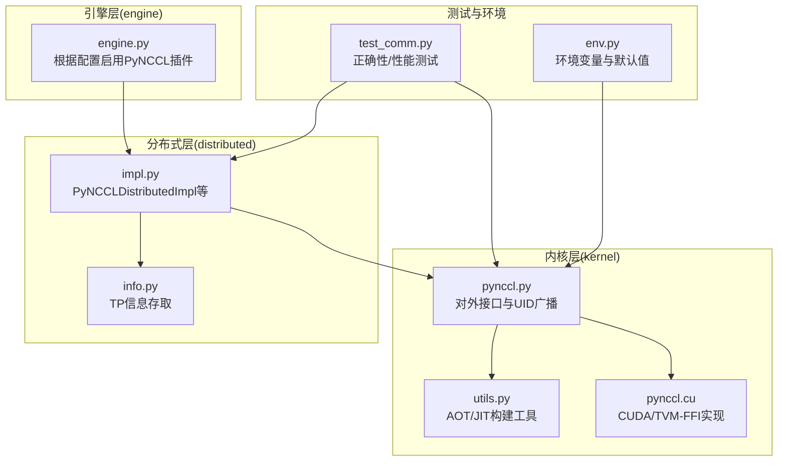
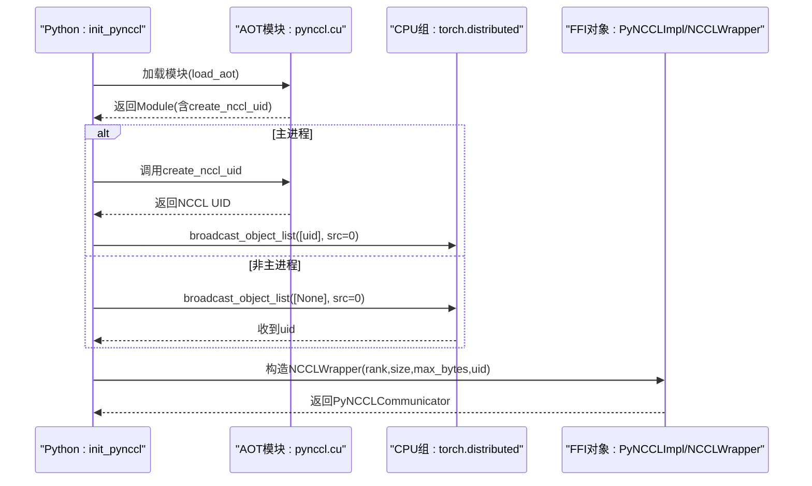
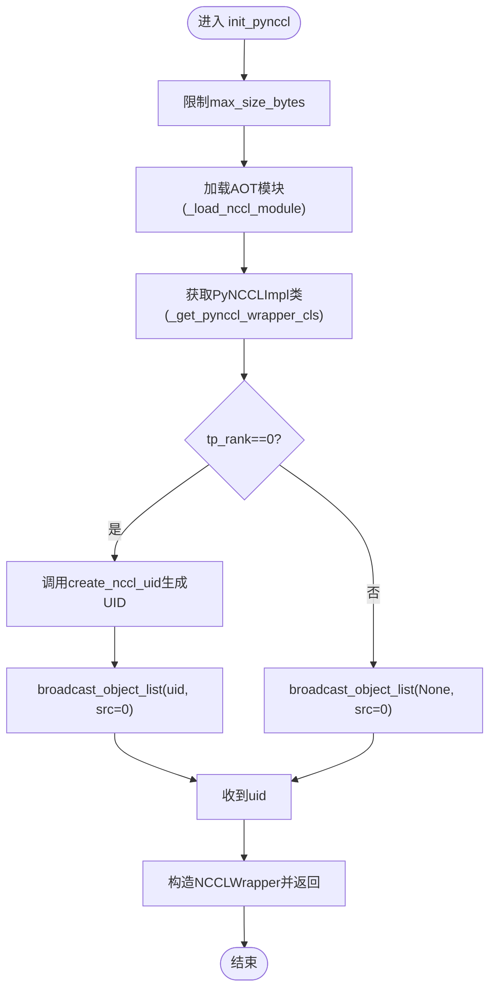
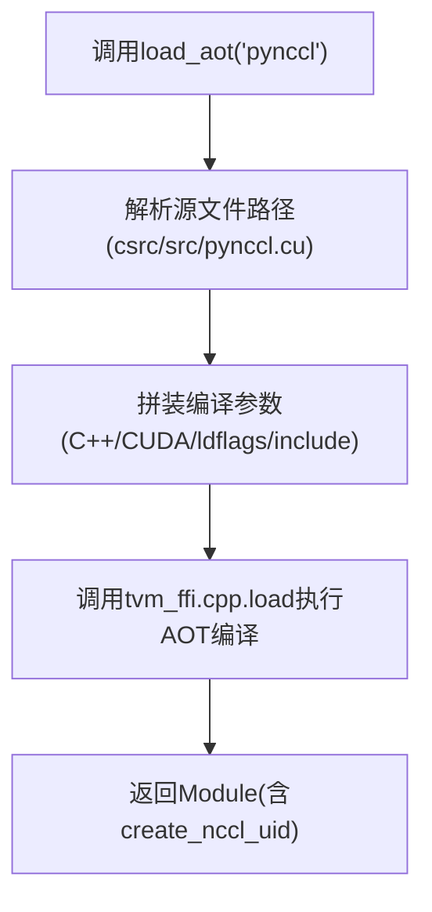
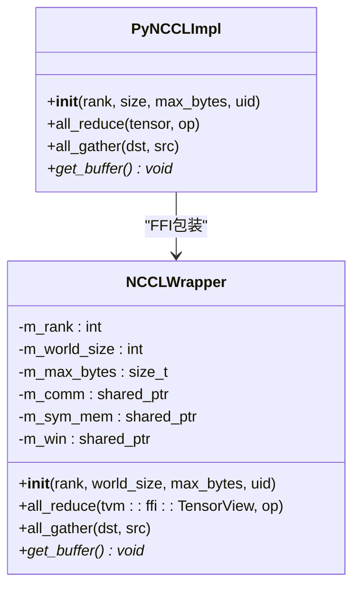
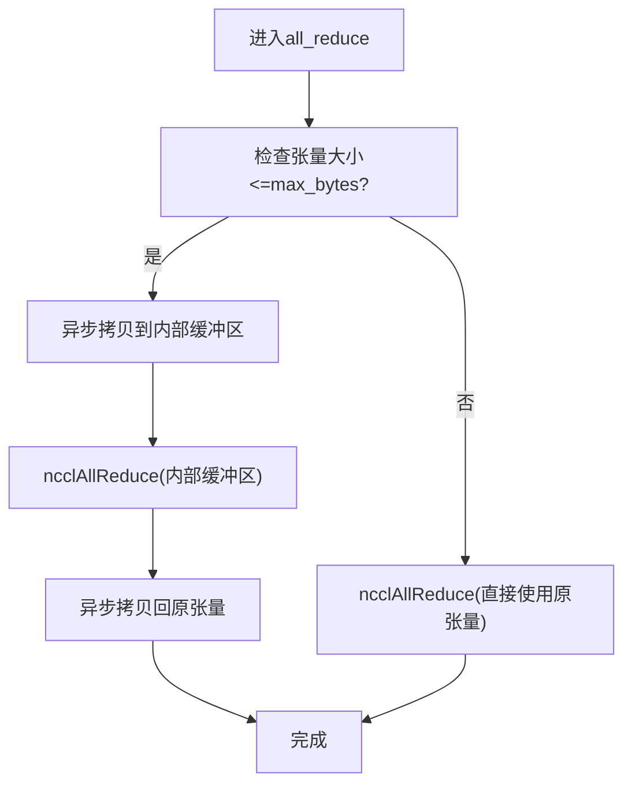
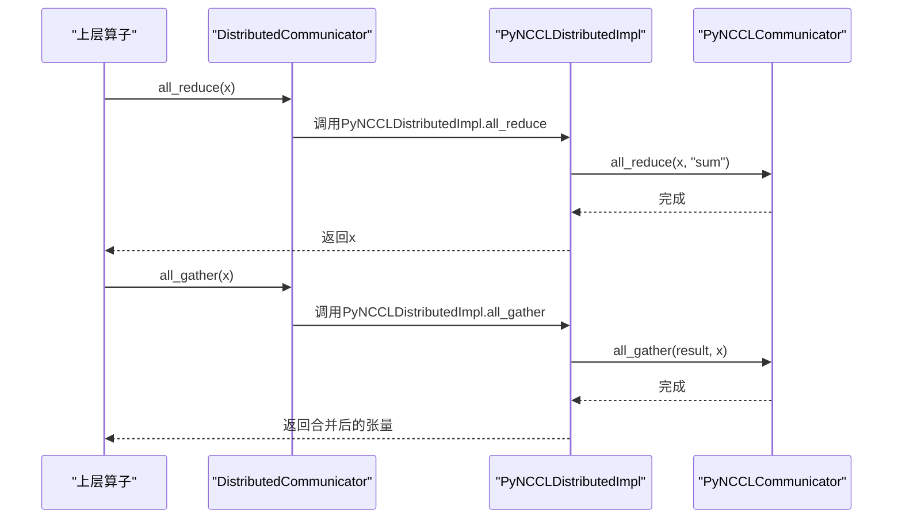
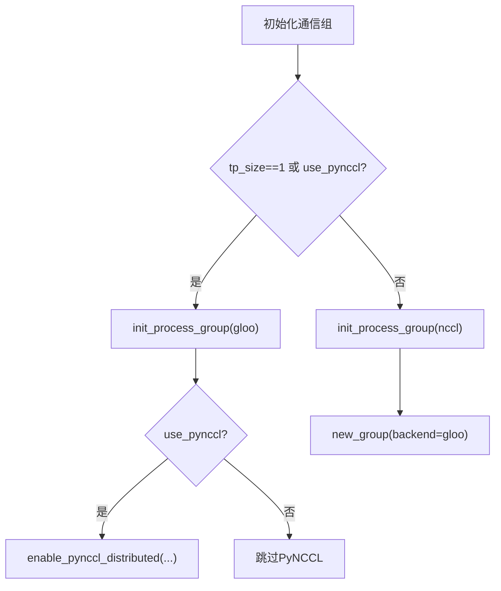
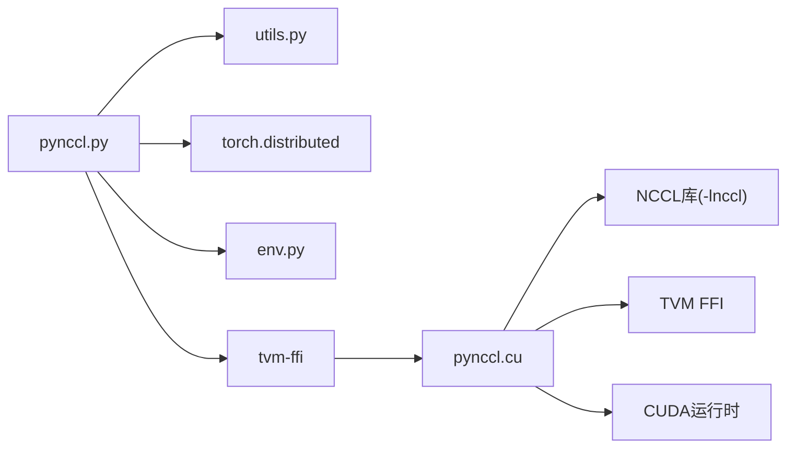

# PyNCCL通信内核

<cite>
**本文引用的文件**
- [pynccl.py](file://python/minisgl/kernel/pynccl.py)
- [pynccl.cu](file://python/minisgl/kernel/csrc/src/pynccl.cu)
- [utils.py](file://python/minisgl/kernel/utils.py)
- [impl.py](file://python/minisgl/distributed/impl.py)
- [info.py](file://python/minisgl/distributed/info.py)
- [engine.py](file://python/minisgl/engine/engine.py)
- [env.py](file://python/minisgl/env.py)
- [test_comm.py](file://tests/kernel/test_comm.py)
- [__init__.py](file://python/minisgl/kernel/__init__.py)
</cite>

## 目录
1. [简介](#简介)
2. [项目结构](#项目结构)
3. [核心组件](#核心组件)
4. [架构总览](#架构总览)
5. [详细组件分析](#详细组件分析)
6. [依赖关系分析](#依赖关系分析)
7. [性能考量](#性能考量)
8. [故障排查指南](#故障排查指南)
9. [结论](#结论)
10. [附录：张量并行使用示例](#附录张量并平行使用示例)

## 简介
本文件系统性文档化 PyNCCL 通信内核的实现机制，重点覆盖以下方面：
- 如何通过 tvm-ffi 加载与封装 NCCL 通信原语；
- 初始化分布式通信上下文并广播 NCCL UID 的流程；
- PyNCCLImpl 类作为 FFI 对象与 CUDA 后端交互的方式；
- _load_nccl_module 函数的 AOT 编译过程及对 pynccl.cu 的依赖；
- 在张量并行场景下的使用方式与性能优势；
- 常见问题与解决方案（如 NCCL UID 广播失败、链接错误 -lnccl）。

## 项目结构
PyNCCL 位于 kernel 子模块中，配合分布式层与引擎层共同完成张量并行通信。关键文件分布如下：
- kernel/pynccl.py：对外暴露 init_pynccl 与 PyNCCLCommunicator 接口，负责加载 AOT 模块、注册 FFI 对象、广播 NCCL UID 并构造通信器。
- kernel/csrc/src/pynccl.cu：CUDA/TVM-FFI 实现，封装 NCCL 通信原语，管理 NCCL 会话、对称缓冲区与窗口注册。
- kernel/utils.py：AOT/JIT 构建工具，统一编译参数与包含路径。
- distributed/impl.py：分布式实现插件，提供 PyNCCLDistributedImpl 将 PyNCCL 通信器接入高层算子。
- distributed/info.py：张量并行信息（rank/size）的存取接口。
- engine/engine.py：引擎层根据配置选择是否启用 PyNCCL 插件。
- env.py：环境变量与默认参数（如最大缓冲区大小）。
- tests/kernel/test_comm.py：端到端正确性与性能基准测试。

图表来源
- [pynccl.py](file://python/minisgl/kernel/pynccl.py#L1-L79)
- [utils.py](file://python/minisgl/kernel/utils.py#L53-L85)
- [pynccl.cu](file://python/minisgl/kernel/csrc/src/pynccl.cu#L1-L189)
- [impl.py](file://python/minisgl/distributed/impl.py#L1-L98)
- [info.py](file://python/minisgl/distributed/info.py#L1-L39)
- [engine.py](file://python/minisgl/engine/engine.py#L114-L140)
- [env.py](file://python/minisgl/env.py#L58-L82)
- [test_comm.py](file://tests/kernel/test_comm.py#L1-L173)

章节来源
- [pynccl.py](file://python/minisgl/kernel/pynccl.py#L1-L79)
- [utils.py](file://python/minisgl/kernel/utils.py#L53-L85)
- [pynccl.cu](file://python/minisgl/kernel/csrc/src/pynccl.cu#L1-L189)
- [impl.py](file://python/minisgl/distributed/impl.py#L1-L98)
- [info.py](file://python/minisgl/distributed/info.py#L1-L39)
- [engine.py](file://python/minisgl/engine/engine.py#L114-L140)
- [env.py](file://python/minisgl/env.py#L58-L82)
- [test_comm.py](file://tests/kernel/test_comm.py#L1-L173)

## 核心组件
- PyNCCLCommunicator 接口：抽象出 all_reduce 与 all_gather 能力，以及 get_buffer 获取内部对称缓冲区指针。
- PyNCCLImpl（FFI 对象）：由 TVM-FFI 注册，封装 NCCL 会话、内存窗口与通信原语调用。
- init_pynccl：初始化分布式上下文，生成/广播 NCCL UID，构造 PyNCCLImpl 并返回。
- _load_nccl_module：通过 AOT 编译 pynccl.cu，链接 -lnccl，导出 create_nccl_uid 与 NCCLWrapper 方法。
- PyNCCLDistributedImpl：将 PyNCCL 通信器接入分布式算子层，供上层算子使用。

章节来源
- [pynccl.py](file://python/minisgl/kernel/pynccl.py#L1-L79)
- [utils.py](file://python/minisgl/kernel/utils.py#L53-L85)
- [pynccl.cu](file://python/minisgl/kernel/csrc/src/pynccl.cu#L72-L188)
- [impl.py](file://python/minisgl/distributed/impl.py#L44-L91)

## 架构总览
PyNCCL 的整体架构围绕“FFI 对象 + CUDA 内核”的模式展开。Python 层通过 tvm-ffi 的 AOT 加载，将 C++/CUDA 实现编译为可执行模块；随后注册 NCCLWrapper 为 TVM-FFI 对象，Python 侧以对象形式调用 all_reduce/all_gather 等方法。NCCL 会话在构造时建立，内部维护对称缓冲区与窗口，用于优化大张量的归约与聚合。

图表来源
- [pynccl.py](file://python/minisgl/kernel/pynccl.py#L45-L79)
- [utils.py](file://python/minisgl/kernel/utils.py#L53-L85)
- [pynccl.cu](file://python/minisgl/kernel/csrc/src/pynccl.cu#L177-L188)

## 详细组件分析

### 组件一：init_pynccl 初始化流程与 UID 广播
- 功能要点
  - 限制最大缓冲区大小（受环境变量约束）。
  - 加载 AOT 模块并注册 FFI 对象类型。
  - 主进程生成 NCCL UID，通过 CPU 进程组广播给所有进程。
  - 使用 UID 构造 NCCLWrapper（PyNCCLImpl），返回 PyNCCLCommunicator。

图表来源
- [pynccl.py](file://python/minisgl/kernel/pynccl.py#L45-L79)

章节来源
- [pynccl.py](file://python/minisgl/kernel/pynccl.py#L45-L79)
- [env.py](file://python/minisgl/env.py#L58-L82)

### 组件二：_load_nccl_module 的 AOT 编译与链接
- 功能要点
  - 通过 utils.load_aot 编译 pynccl.cu，附加 -lnccl 链接标志。
  - 统一编译参数（C++20、-O3、CUDA 扩展选项）与包含路径。
  - 导出 create_nccl_uid 与 NCCLWrapper 的方法，供 Python 侧直接调用。

图表来源
- [utils.py](file://python/minisgl/kernel/utils.py#L53-L85)
- [pynccl.py](file://python/minisgl/kernel/pynccl.py#L28-L31)

章节来源
- [utils.py](file://python/minisgl/kernel/utils.py#L53-L85)
- [pynccl.py](file://python/minisgl/kernel/pynccl.py#L28-L31)

### 组件三：PyNCCLImpl 与 NCCLWrapper（FFI 对象）
- 设计要点
  - 通过 TVM-FFI 注册为 minisgl.NCCLWrapper，Python 侧以对象形式访问。
  - 构造时初始化 NCCL 会话、分配对称缓冲区并注册窗口。
  - 提供 all_reduce、all_gather、get_buffer 三个核心方法。

图表来源
- [pynccl.py](file://python/minisgl/kernel/pynccl.py#L33-L43)
- [pynccl.cu](file://python/minisgl/kernel/csrc/src/pynccl.cu#L72-L188)

章节来源
- [pynccl.py](file://python/minisgl/kernel/pynccl.py#L33-L43)
- [pynccl.cu](file://python/minisgl/kernel/csrc/src/pynccl.cu#L72-L188)

### 组件四：CUDA 实现细节（pynccl.cu）
- NCCL 会话与窗口
  - 从 UID 初始化 NCCL 会话，分配对称缓冲区并注册窗口，支持后续复用。
- all_reduce
  - 根据张量大小与最大缓冲区阈值决定是否使用内部缓冲区进行拷贝与复用。
  - 在 CUDA 流中异步内存拷贝与 NCCL 归约，保证与用户计算流解耦。
- all_gather
  - 直接对输出张量进行聚合，不使用内部缓冲区。
- 数据类型与归约操作映射
  - 当前支持半精度与 bfloat16，归约操作包含 sum/prod/max/min/avg。

图表来源
- [pynccl.cu](file://python/minisgl/kernel/csrc/src/pynccl.cu#L93-L134)

章节来源
- [pynccl.cu](file://python/minisgl/kernel/csrc/src/pynccl.cu#L1-L189)

### 组件五：分布式层集成（PyNCCLDistributedImpl）
- 将 PyNCCL 通信器注入 DistributedCommunicator 插件链，替换默认的 Torch 分布式实现。
- all_reduce：直接调用 comm.all_reduce。
- all_gather：根据 TP size 计算输出形状并调用 comm.all_gather。

图表来源
- [impl.py](file://python/minisgl/distributed/impl.py#L44-L91)

章节来源
- [impl.py](file://python/minisgl/distributed/impl.py#L1-L98)

### 组件六：引擎层启用与配置
- 引擎根据配置选择是否启用 PyNCCL 插件：
  - 若 tp_size==1 或 use_pynccl，则使用 gloo 初始化 CPU 进程组，并按需启用 PyNCCL。
  - 否则使用 nccl 初始化 GPU 进程组，并创建一个 gloo 的 CPU 组合。
- 计算最大缓冲区大小：基于前向长度、隐藏维度与数据类型字节数估算。

图表来源
- [engine.py](file://python/minisgl/engine/engine.py#L114-L140)

章节来源
- [engine.py](file://python/minisgl/engine/engine.py#L114-L140)

## 依赖关系分析
- Python 层依赖
  - tvm-ffi：用于 AOT 编译与对象注册。
  - torch.distributed：用于 CPU 进程组与对象广播。
  - 环境变量：控制最大缓冲区大小等参数。
- CUDA 层依赖
  - NCCL：提供通信原语与会话管理。
  - TVM FFI：桥接 C++/CUDA 与 Python。
  - CUDA 运行时：异步内存拷贝与流同步。

图表来源
- [pynccl.py](file://python/minisgl/kernel/pynccl.py#L1-L79)
- [utils.py](file://python/minisgl/kernel/utils.py#L53-L85)
- [pynccl.cu](file://python/minisgl/kernel/csrc/src/pynccl.cu#L1-L189)
- [env.py](file://python/minisgl/env.py#L58-L82)

章节来源
- [pynccl.py](file://python/minisgl/kernel/pynccl.py#L1-L79)
- [utils.py](file://python/minisgl/kernel/utils.py#L53-L85)
- [pynccl.cu](file://python/minisgl/kernel/csrc/src/pynccl.cu#L1-L189)
- [env.py](file://python/minisgl/env.py#L58-L82)

## 性能考量
- 对称缓冲区与窗口注册：在构造阶段一次性分配并注册窗口，避免每次通信重复分配开销。
- 大张量路径优化：当输入张量超过阈值时，直接使用原张量进行归约，减少一次拷贝。
- 小张量路径优化：使用内部缓冲区，先拷贝到缓冲区再归约，最后再拷回原张量，提升缓存命中与带宽利用率。
- 流隔离：在用户指定的 CUDA 流中执行异步拷贝与 NCCL 调用，避免阻塞用户计算。
- 环境变量控制：通过 PYNCCL_MAX_BUFFER_SIZE 控制缓冲区上限，平衡内存占用与性能。

章节来源
- [pynccl.cu](file://python/minisgl/kernel/csrc/src/pynccl.cu#L72-L134)
- [env.py](file://python/minisgl/env.py#L58-L82)

## 故障排查指南
- NCCL UID 广播失败
  - 现象：assert 抛出“未能在某 rank 上获取 NCCL UID”。
  - 可能原因
    - CPU 进程组未正确初始化或网络不可达。
    - 主进程未成功生成 UID 或广播未到达非主进程。
  - 解决方案
    - 确认 torch.distributed 已使用 gloo 后端初始化 CPU 进程组。
    - 检查 MASTER_ADDR/MASTER_PORT 等环境变量。
    - 在主进程显式调用 create_nccl_uid 并确保广播成功。
  - 参考位置
    - [pynccl.py](file://python/minisgl/kernel/pynccl.py#L59-L76)

- 链接错误 -lnccl
  - 现象：AOT 编译时报找不到 -lnccl。
  - 可能原因
    - NCCL 库未安装或未在链接器搜索路径中。
    - 编译器/链接器版本与 NCCL 不兼容。
  - 解决方案
    - 确保已安装 NCCL，并将其库路径加入 LD_LIBRARY_PATH。
    - 在 extra_ldflags 中显式添加 -lnccl。
    - 检查 CUDA 版本与 NCCL 版本匹配。
  - 参考位置
    - [utils.py](file://python/minisgl/kernel/utils.py#L53-L85)
    - [pynccl.py](file://python/minisgl/kernel/pynccl.py#L28-L31)

- 张量类型/形状不满足要求
  - 现象：运行时断言失败，提示张量必须在 CUDA 设备且连续。
  - 解决方案
    - 确保张量位于 CUDA 设备且为连续内存布局。
    - 对于 all_gather，目标张量首维应等于源张量首维乘以世界规模。
  - 参考位置
    - [pynccl.cu](file://python/minisgl/kernel/csrc/src/pynccl.cu#L93-L161)

- 性能异常
  - 现象：带宽偏低或内存占用过高。
  - 可能原因
    - 缓冲区阈值设置不当，导致频繁拷贝或未使用内部缓冲区。
  - 解决方案
    - 调整 PYNCCL_MAX_BUFFER_SIZE，结合模型前向大小估算合理阈值。
  - 参考位置
    - [env.py](file://python/minisgl/env.py#L58-L82)
    - [engine.py](file://python/minisgl/engine/engine.py#L126-L129)

章节来源
- [pynccl.py](file://python/minisgl/kernel/pynccl.py#L45-L79)
- [utils.py](file://python/minisgl/kernel/utils.py#L53-L85)
- [pynccl.cu](file://python/minisgl/kernel/csrc/src/pynccl.cu#L93-L161)
- [env.py](file://python/minisgl/env.py#L58-L82)
- [engine.py](file://python/minisgl/engine/engine.py#L126-L129)

## 结论
PyNCCL 通过 TVM-FFI 的 AOT 编译将 CUDA 实现无缝嵌入 Python，借助对称缓冲区与窗口注册，在张量并行场景下显著降低通信开销。其与标准 NCCL 兼容，同时在小张量路径上通过内部缓冲区优化与流隔离提升吞吐。通过合理的缓冲区阈值与环境配置，可在不同硬件与模型规模下获得稳定且优异的性能表现。

## 附录：张量并行使用示例
以下示例展示如何在张量并行场景中启用 PyNCCL 并进行 all_reduce 与 all_gather 操作。示例来源于测试文件，展示了多进程、多张量规模与性能统计的完整流程。

- 初始化 CPU 进程组并设置 TP 信息
- 调用 kernel.init_pynccl 创建通信器
- 使用 comm.all_reduce 与 comm.all_gather 进行分布式通信
- 运行正确性校验与性能基准

章节来源
- [test_comm.py](file://tests/kernel/test_comm.py#L14-L151)
- [impl.py](file://python/minisgl/distributed/impl.py#L44-L91)
- [engine.py](file://python/minisgl/engine/engine.py#L114-L140)