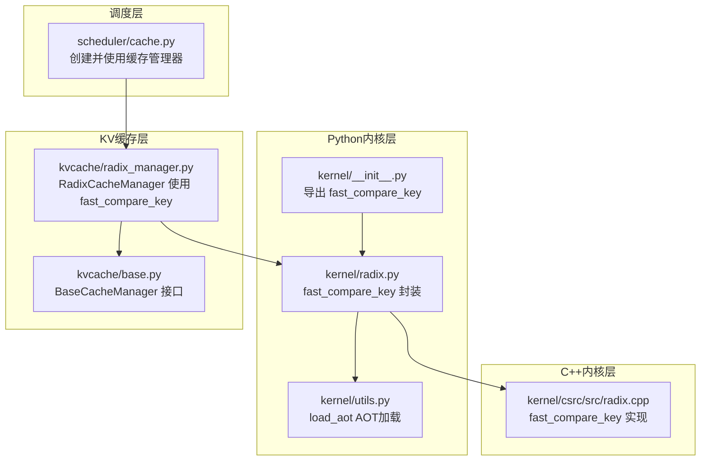
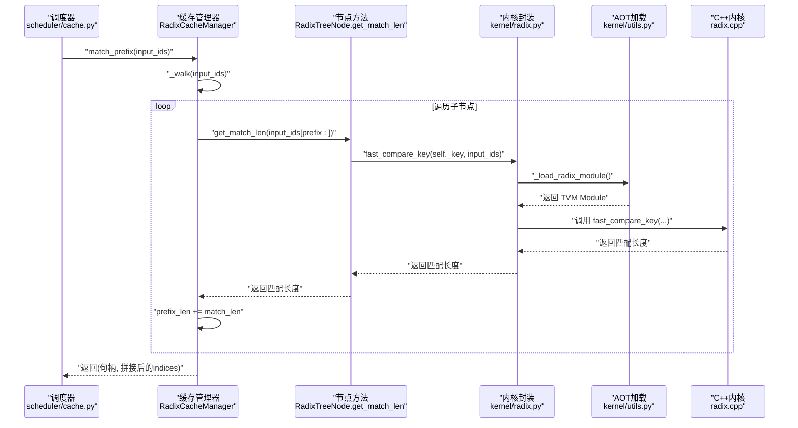
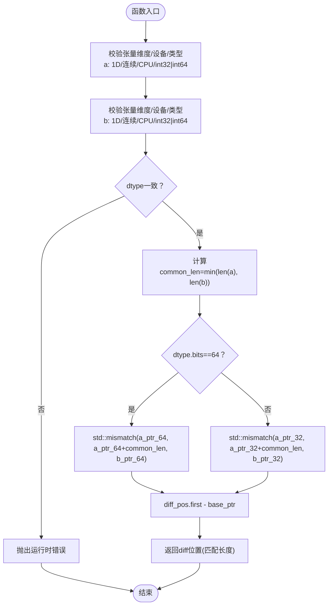
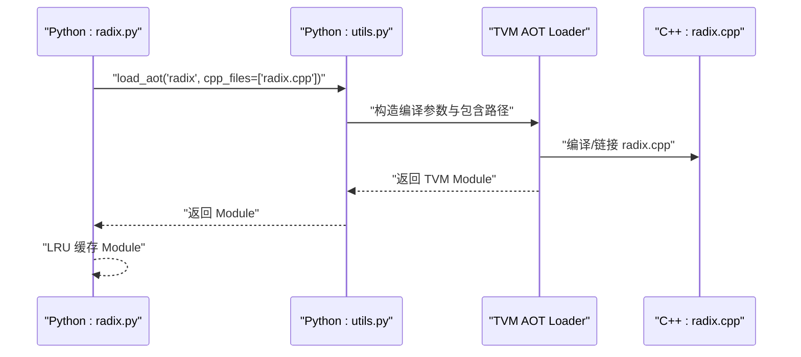
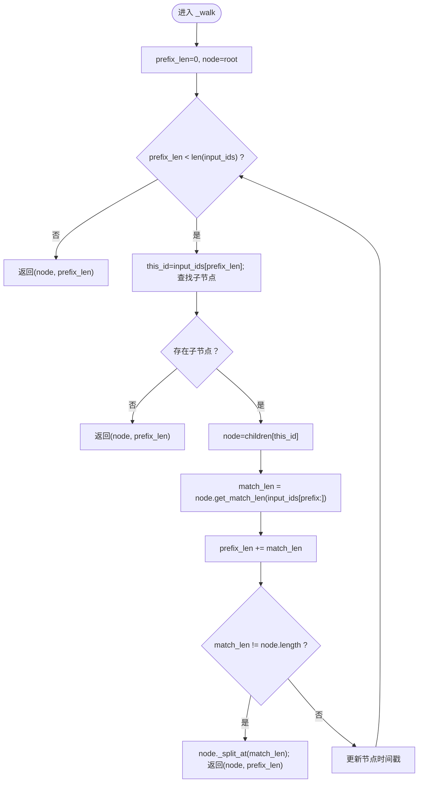
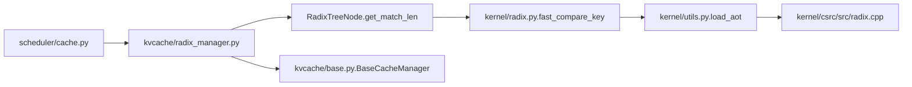

# Radix树比较内核

<cite>
**本文引用的文件**
- [python/minisgl/kernel/radix.py](file://python/minisgl/kernel/radix.py)
- [python/minisgl/kernel/csrc/src/radix.cpp](file://python/minisgl/kernel/csrc/src/radix.cpp)
- [python/minisgl/kernel/utils.py](file://python/minisgl/kernel/utils.py)
- [python/minisgl/kvcache/radix_manager.py](file://python/minisgl/kvcache/radix_manager.py)
- [python/minisgl/kvcache/base.py](file://python/minisgl/kvcache/base.py)
- [python/minisgl/scheduler/cache.py](file://python/minisgl/scheduler/cache.py)
- [python/minisgl/kernel/__init__.py](file://python/minisgl/kernel/__init__.py)
</cite>

## 目录
1. [引言](#引言)
2. [项目结构](#项目结构)
3. [核心组件](#核心组件)
4. [架构总览](#架构总览)
5. [详细组件分析](#详细组件分析)
6. [依赖关系分析](#依赖关系分析)
7. [性能考量](#性能考量)
8. [故障排查指南](#故障排查指南)
9. [结论](#结论)
10. [附录：扩展与兼容性指南](#附录扩展与兼容性指南)

## 引言
本文件深入解析 Radix 树比较内核 fast_compare_key 的设计与实现，阐明其如何高效比较两个一维整数 CPU 张量以支持 KV 缓存的前缀匹配；解释 _load_radix_module 如何通过 AOT 编译加载 radix.cpp 中的 C++ 实现；说明该内核在 RadixCacheManager 中用于快速判断请求序列相似性的关键作用；并提供性能对比思路与扩展指南，帮助开发者在保持 Python 接口兼容的前提下修改 radix.cpp 以扩展比较逻辑。

## 项目结构
围绕 Radix 比较内核的相关模块组织如下：
- Python 层内核封装与导出：kernel/radix.py、kernel/__init__.py
- C++ 内核实现：kernel/csrc/src/radix.cpp
- AOT 加载工具：kernel/utils.py
- KV 缓存管理器（使用 fast_compare_key）：kvcache/radix_manager.py
- 调度器对缓存管理器的集成：scheduler/cache.py
- 基类接口定义：kvcache/base.py

图表来源
- [python/minisgl/kernel/radix.py](file://python/minisgl/kernel/radix.py#L1-L21)
- [python/minisgl/kernel/utils.py](file://python/minisgl/kernel/utils.py#L53-L84)
- [python/minisgl/kernel/csrc/src/radix.cpp](file://python/minisgl/kernel/csrc/src/radix.cpp#L1-L45)
- [python/minisgl/kernel/__init__.py](file://python/minisgl/kernel/__init__.py#L1-L15)
- [python/minisgl/kvcache/radix_manager.py](file://python/minisgl/kvcache/radix_manager.py#L1-L221)
- [python/minisgl/kvcache/base.py](file://python/minisgl/kvcache/base.py#L64-L134)
- [python/minisgl/scheduler/cache.py](file://python/minisgl/scheduler/cache.py#L1-L71)

章节来源
- [python/minisgl/kernel/radix.py](file://python/minisgl/kernel/radix.py#L1-L21)
- [python/minisgl/kernel/utils.py](file://python/minisgl/kernel/utils.py#L53-L84)
- [python/minisgl/kernel/csrc/src/radix.cpp](file://python/minisgl/kernel/csrc/src/radix.cpp#L1-L45)
- [python/minisgl/kernel/__init__.py](file://python/minisgl/kernel/__init__.py#L1-L15)
- [python/minisgl/kvcache/radix_manager.py](file://python/minisgl/kvcache/radix_manager.py#L1-L221)
- [python/minisgl/kvcache/base.py](file://python/minisgl/kvcache/base.py#L64-L134)
- [python/minisgl/scheduler/cache.py](file://python/minisgl/scheduler/cache.py#L1-L71)

## 核心组件
- fast_compare_key：Python 入口，负责将两个一维整数 CPU 张量传入 TVM FFI 导出的 C++ 函数，返回最长公共前缀长度（字节数或元素数，取决于实现细节）。
- _load_radix_module：通过 AOT 编译加载 radix.cpp，生成可直接调用的 TVM Module。
- RadixCacheManager：在前缀匹配过程中调用 fast_compare_key 判断当前节点键与输入序列的匹配长度，从而决定是否分裂或继续遍历。
- BaseCacheManager：定义匹配、锁定、插入、驱逐等抽象接口，保证不同缓存策略的一致行为契约。

章节来源
- [python/minisgl/kernel/radix.py](file://python/minisgl/kernel/radix.py#L1-L21)
- [python/minisgl/kernel/utils.py](file://python/minisgl/kernel/utils.py#L53-L84)
- [python/minisgl/kvcache/radix_manager.py](file://python/minisgl/kvcache/radix_manager.py#L116-L164)
- [python/minisgl/kvcache/base.py](file://python/minisgl/kvcache/base.py#L64-L134)

## 架构总览
下图展示了从调度层到缓存管理器再到内核的调用链路，以及 TVM AOT 加载与导出的关键步骤。

图表来源
- [python/minisgl/scheduler/cache.py](file://python/minisgl/scheduler/cache.py#L12-L38)
- [python/minisgl/kvcache/radix_manager.py](file://python/minisgl/kvcache/radix_manager.py#L116-L164)
- [python/minisgl/kvcache/radix_manager.py](file://python/minisgl/kvcache/radix_manager.py#L58-L63)
- [python/minisgl/kernel/radix.py](file://python/minisgl/kernel/radix.py#L13-L20)
- [python/minisgl/kernel/utils.py](file://python/minisgl/kernel/utils.py#L53-L84)
- [python/minisgl/kernel/csrc/src/radix.cpp](file://python/minisgl/kernel/csrc/src/radix.cpp#L19-L45)

## 详细组件分析

### fast_compare_key 设计与实现
- 输入约束：要求两个张量均为一维、连续、CPU 设备、整型（32 或 64 位），且类型一致。这些约束由内核内部校验函数完成。
- 比较策略：以公共长度为界，使用标准库的不匹配算法定位第一个不同的位置，返回该位置索引作为“匹配长度”。该索引既可视为元素个数，也可视作按字节计算的偏移（取决于具体数据类型与内存布局）。
- 性能特征：内核采用 C++ 实现并通过 TVM FFI 导出，避免了 Python 循环与逐元素比较的开销，适合高频调用场景。
- 返回值语义：返回值表示“最长公共前缀长度”，用于 RadixCacheManager 在 _walk 过程中推进 prefix_len 并决定是否需要分裂节点。

图表来源
- [python/minisgl/kernel/csrc/src/radix.cpp](file://python/minisgl/kernel/csrc/src/radix.cpp#L12-L45)

章节来源
- [python/minisgl/kernel/csrc/src/radix.cpp](file://python/minisgl/kernel/csrc/src/radix.cpp#L12-L45)

### _load_radix_module 与 AOT 编译加载
- 加载流程：通过 utils.load_aot 动态构建包含 kernel/csrc/src/radix.cpp 的 TVM AOT 可执行模块，返回可直接调用的 Module 对象。
- 缓存机制：radix.py 内部使用 LRU 缓存保存已加载模块，避免重复编译与初始化开销。
- 导出宏：C++ 端使用 TVM_FFI_DLL_EXPORT_TYPED_FUNC 将 fast_compare_key 导出为可被 Python 调用的函数名。

图表来源
- [python/minisgl/kernel/radix.py](file://python/minisgl/kernel/radix.py#L13-L20)
- [python/minisgl/kernel/utils.py](file://python/minisgl/kernel/utils.py#L53-L84)
- [python/minisgl/kernel/csrc/src/radix.cpp](file://python/minisgl/kernel/csrc/src/radix.cpp#L44-L45)

章节来源
- [python/minisgl/kernel/radix.py](file://python/minisgl/kernel/radix.py#L13-L20)
- [python/minisgl/kernel/utils.py](file://python/minisgl/kernel/utils.py#L53-L84)
- [python/minisgl/kernel/csrc/src/radix.cpp](file://python/minisgl/kernel/csrc/src/radix.cpp#L44-L45)

### RadixCacheManager 中的使用与前缀匹配
- 匹配流程：_walk 从根节点开始，按输入序列逐字符查找子节点；若命中，则调用节点的 get_match_len 获取与当前节点键的最长公共前缀长度。
- 分裂策略：当匹配长度小于节点键长时，需要在该位置进行分裂，保留公共前缀并新建子节点存储剩余部分。
- 锁定与驱逐：匹配完成后，调用方需先锁定句柄，再安全使用返回的 indices；后续插入新前缀时会根据已匹配长度决定释放哪些索引。

图表来源
- [python/minisgl/kvcache/radix_manager.py](file://python/minisgl/kvcache/radix_manager.py#L138-L163)
- [python/minisgl/kvcache/radix_manager.py](file://python/minisgl/kvcache/radix_manager.py#L58-L63)

章节来源
- [python/minisgl/kvcache/radix_manager.py](file://python/minisgl/kvcache/radix_manager.py#L116-L164)
- [python/minisgl/kvcache/radix_manager.py](file://python/minisgl/kvcache/radix_manager.py#L58-L63)

### Python 接口与导出
- kernel/__init__.py 将 fast_compare_key 暴露给上层模块，便于直接导入使用。
- 调度层通过 scheduler/cache.py 创建缓存管理器并调用其 match_prefix，间接使用 fast_compare_key 完成前缀匹配。

章节来源
- [python/minisgl/kernel/__init__.py](file://python/minisgl/kernel/__init__.py#L1-L15)
- [python/minisgl/scheduler/cache.py](file://python/minisgl/scheduler/cache.py#L12-L38)

## 依赖关系分析
- 组件耦合
  - RadixCacheManager 依赖 RadixTreeNode 的 get_match_len，后者依赖 fast_compare_key。
  - fast_compare_key 依赖 TVM FFI 导出的 C++ 内核，而 C++ 内核由 utils.load_aot 编译加载。
  - 调度层通过工厂函数创建缓存管理器，统一对外暴露 BaseCacheManager 接口。
- 外部依赖
  - TVM FFI：负责 C++ 内核的导出与 Python 调用桥接。
  - 标准库 mismatch：提供高效的前缀比较能力。
- 潜在循环依赖
  - 当前结构清晰，无明显循环依赖；注意在新增功能时避免在 C++ 内核中引入对 Python 层的反向依赖。

图表来源
- [python/minisgl/scheduler/cache.py](file://python/minisgl/scheduler/cache.py#L12-L38)
- [python/minisgl/kvcache/radix_manager.py](file://python/minisgl/kvcache/radix_manager.py#L58-L63)
- [python/minisgl/kernel/radix.py](file://python/minisgl/kernel/radix.py#L13-L20)
- [python/minisgl/kernel/utils.py](file://python/minisgl/kernel/utils.py#L53-L84)
- [python/minisgl/kernel/csrc/src/radix.cpp](file://python/minisgl/kernel/csrc/src/radix.cpp#L19-L45)
- [python/minisgl/kvcache/base.py](file://python/minisgl/kvcache/base.py#L64-L134)

章节来源
- [python/minisgl/scheduler/cache.py](file://python/minisgl/scheduler/cache.py#L12-L38)
- [python/minisgl/kvcache/radix_manager.py](file://python/minisgl/kvcache/radix_manager.py#L58-L63)
- [python/minisgl/kernel/radix.py](file://python/minisgl/kernel/radix.py#L13-L20)
- [python/minisgl/kernel/utils.py](file://python/minisgl/kernel/utils.py#L53-L84)
- [python/minisgl/kernel/csrc/src/radix.cpp](file://python/minisgl/kernel/csrc/src/radix.cpp#L19-L45)
- [python/minisgl/kvcache/base.py](file://python/minisgl/kvcache/base.py#L64-L134)

## 性能考量
- 加速点
  - C++ 内核避免 Python 循环与逐元素比较，利用标准库 mismatch 提供的高效前缀比较。
  - AOT 编译一次性完成编译与链接，后续调用无需重复编译，降低启动开销。
  - LRU 缓存模块实例，减少重复加载成本。
- 适用场景
  - 高频前缀匹配：在大规模请求流中频繁进行 KV 缓存前缀匹配时，C++ 内核显著降低延迟。
  - CPU 张量：内核明确要求 CPU 设备与整型，确保与 TVM FFI 的最佳交互。
- 性能对比建议
  - 基准方法：在相同硬件与数据分布下，分别测量 C++ 内核与纯 Python 实现的平均耗时与吞吐。
  - 指标收集：记录匹配次数、平均匹配长度、最大/最小耗时、吞吐量等。
  - 影响因素：张量大小、数据类型（32/64）、连续性、CPU 缓存命中率等。
- 注意事项
  - 若输入为 GPU 张量，需先迁移到 CPU 或在内核中增加 CUDA 支持（见扩展指南）。
  - 对于超长序列，应评估内存带宽与 CPU 计算瓶颈。

[本节为通用性能讨论，不直接分析具体文件]

## 故障排查指南
- 常见错误
  - 张量类型不满足约束：维度非一维、非连续、设备非 CPU、类型非整型或位宽不符，将触发运行时检查失败。
  - 类型不一致：两个张量 dtype 不一致会导致断言失败。
- 定位方法
  - 在 Python 层捕获异常，确认输入张量的形状、设备与 dtype。
  - 在 C++ 内核侧检查 _is_1d_cpu_int_tensor 与 dtype 校验逻辑。
- 修复建议
  - 确保输入张量为 CPU、连续、整型（int32 或 int64）。
  - 在调用前对张量进行 reshape/contiguous/clone 等预处理。
  - 若需要 GPU 支持，参考扩展指南添加 CUDA 版本与设备检测。

章节来源
- [python/minisgl/kernel/csrc/src/radix.cpp](file://python/minisgl/kernel/csrc/src/radix.cpp#L12-L27)
- [python/minisgl/kernel/csrc/src/radix.cpp](file://python/minisgl/kernel/csrc/src/radix.cpp#L21-L24)

## 结论
fast_compare_key 通过 AOT 编译加载的 C++ 内核，为 KV 缓存的 Radix 树前缀匹配提供了高性能基础。其严格的输入约束与高效的比较策略，使得在大规模在线推理场景中能够显著降低匹配延迟。RadixCacheManager 在 _walk 流程中充分利用该内核，实现了快速的相似性判断与树结构维护。结合调度层的统一接口，整体架构具备良好的可扩展性与可维护性。

[本节为总结性内容，不直接分析具体文件]

## 附录：扩展与兼容性指南
- 扩展比较逻辑
  - 在 radix.cpp 中新增比较函数或增强现有 fast_compare_key，确保遵循相同的输入约束与导出宏。
  - 若需支持 GPU：在内核中增加设备检测与分支逻辑，或新增 CUDA 版本并在 utils.load_aot 中启用 CUDA 文件列表。
- 保持 Python 接口兼容
  - 修改 C++ 函数名时，同步更新 TVM_FFI_DLL_EXPORT_TYPED_FUNC 的导出名称，并在 Python 层保持 fast_compare_key 名称不变。
  - 保持返回值语义一致（如返回“匹配长度”），避免破坏上层调用逻辑。
- 构建与加载
  - 使用 utils.load_aot 的 cpp_files 参数指定新增源文件，确保包含路径正确指向 kernel/csrc/src。
  - 如需调试，可在 utils.py 中临时调整编译标志（例如开启更详细的优化或调试信息）。

章节来源
- [python/minisgl/kernel/csrc/src/radix.cpp](file://python/minisgl/kernel/csrc/src/radix.cpp#L44-L45)
- [python/minisgl/kernel/utils.py](file://python/minisgl/kernel/utils.py#L53-L84)
- [python/minisgl/kernel/__init__.py](file://python/minisgl/kernel/__init__.py#L1-L15)