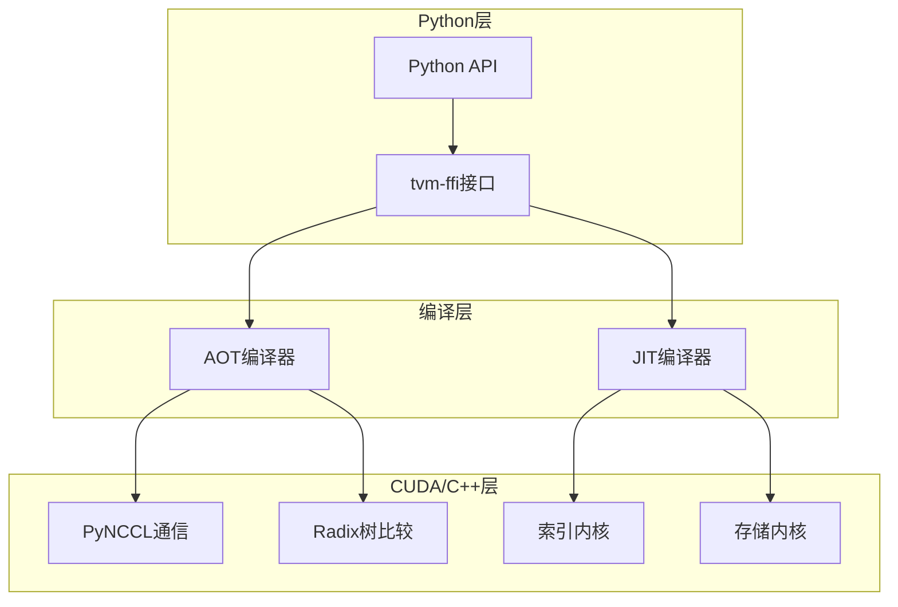
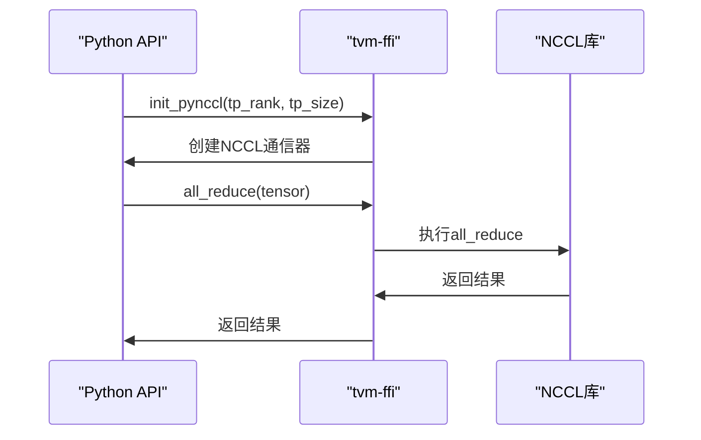
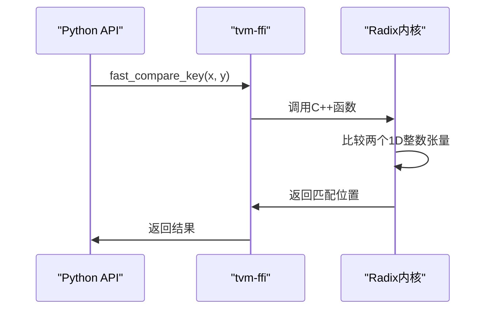
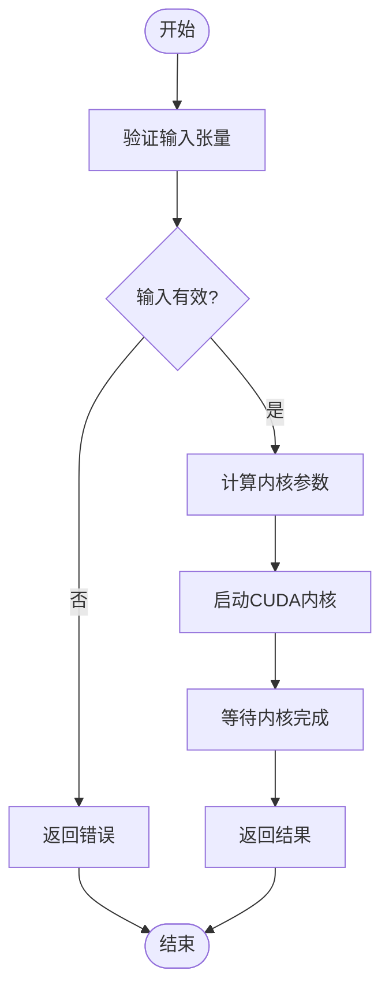
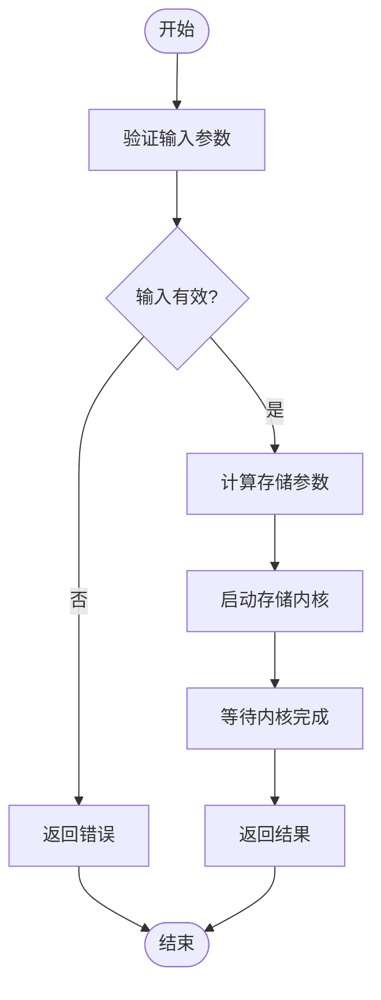
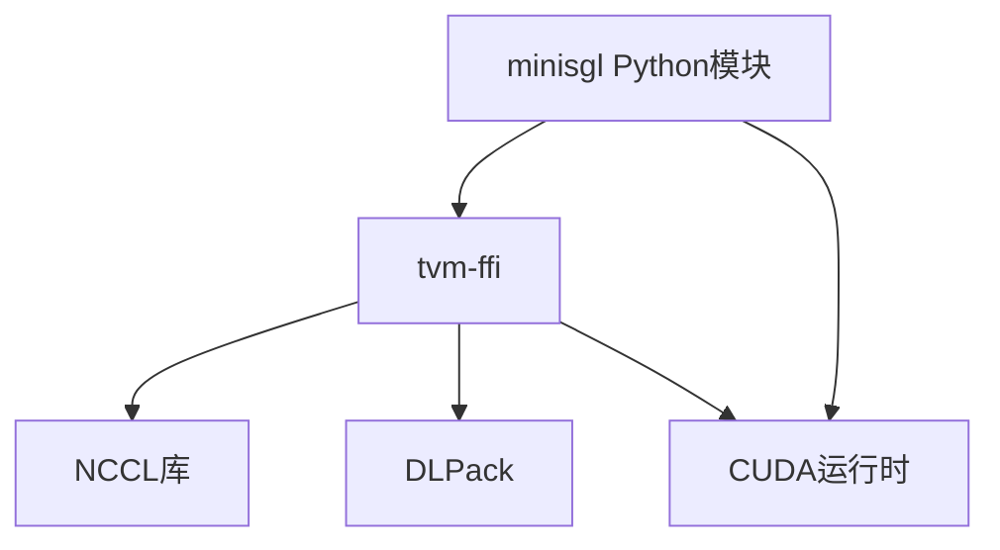

# 自定义内核开发

<cite>
**本文档中引用的文件**   
- [pynccl.py](file://python/minisgl/kernel/pynccl.py)
- [radix.py](file://python/minisgl/kernel/radix.py)
- [store.py](file://python/minisgl/kernel/store.py)
- [tensor.py](file://python/minisgl/kernel/tensor.py)
- [index.py](file://python/minisgl/kernel/index.py)
- [pynccl.cu](file://python/minisgl/kernel/csrc/src/pynccl.cu)
- [radix.cpp](file://python/minisgl/kernel/csrc/src/radix.cpp)
- [index.cu](file://python/minisgl/kernel/csrc/jit/index.cu)
- [store.cu](file://python/minisgl/kernel/csrc/jit/store.cu)
- [utils.py](file://python/minisgl/kernel/utils.py)
- [utils.h](file://python/minisgl/kernel/csrc/include/minisgl/utils.h)
- [tensor.h](file://python/minisgl/kernel/csrc/include/minisgl/tensor.h)
- [test_comm.py](file://tests/kernel/test_comm.py)
- [test_index.py](file://tests/kernel/test_index.py)
- [test_store.py](file://tests/kernel/test_store.py)
</cite>

## 目录
1. [引言](#引言)
2. [项目结构](#项目结构)
3. [核心组件](#核心组件)
4. [架构概述](#架构概述)
5. [详细组件分析](#详细组件分析)
6. [依赖分析](#依赖分析)
7. [性能考虑](#性能考虑)
8. [故障排除指南](#故障排除指南)
9. [结论](#结论)

## 引言
本文档详细说明了mini-sglang项目中自定义CUDA内核的设计与使用。文档重点介绍了PyNCCL通信库如何替代NCCL进行高效的张量并行通信，Radix树比较内核如何加速KV缓存的前缀匹配，以及tvm-ffi在JIT编译和Python绑定中的作用机制。此外，还为开发者提供了添加新CUDA内核的完整流程指导，包括编写.cu/.cpp文件、注册JIT函数以及在Python中调用的步骤。

## 项目结构
项目的核心自定义内核位于`python/minisgl/kernel`目录下，分为Python接口层和C++/CUDA实现层。Python层提供高层API，而C++/CUDA层包含实际的内核实现。这种分层设计使得内核可以高效执行，同时保持Python接口的简洁性。

```mermaid
graph TD
subgraph "Python接口层"
pynccl_py[pynccl.py]
radix_py[radix.py]
store_py[store.py]
index_py[index.py]
utils_py[utils.py]
end
subgraph "C++/CUDA实现层"
subgraph "预编译内核"
pynccl_cu[pynccl.cu]
radix_cpp[radix.cpp]
tensor_cpp[tensor.cpp]
end
subgraph "JIT编译内核"
index_cu[index.cu]
store_cu[store.cu]
end
subgraph "头文件"
utils_h[utils.h]
tensor_h[tensor.h]
warp_cuh[warp.cuh]
end
end
utils_py --> pynccl_py
utils_py --> radix_py
utils_py --> store_py
utils_py --> index_py
pynccl_py --> pynccl_cu
radix_py --> radix_cpp
store_py --> store_cu
index_py --> index_cu
pynccl_cu --> utils_h
pynccl_cu --> tensor_h
radix_cpp --> utils_h
index_cu --> utils_h
index_cu --> tensor_h
index_cu --> warp_cuh
store_cu --> utils_h
store_cu --> tensor_h
store_cu --> warp_cuh
```

**图源**
- [pynccl.py](file://python/minisgl/kernel/pynccl.py)
- [radix.py](file://python/minisgl/kernel/radix.py)
- [store.py](file://python/minisgl/kernel/store.py)
- [index.py](file://python/minisgl/kernel/index.py)
- [pynccl.cu](file://python/minisgl/kernel/csrc/src/pynccl.cu)
- [radix.cpp](file://python/minisgl/kernel/csrc/src/radix.cpp)
- [index.cu](file://python/minisgl/kernel/csrc/jit/index.cu)
- [store.cu](file://python/minisgl/kernel/csrc/jit/store.cu)
- [utils.h](file://python/minisgl/kernel/csrc/include/minisgl/utils.h)
- [tensor.h](file://python/minisgl/kernel/csrc/include/minisgl/tensor.h)

**节源**
- [pynccl.py](file://python/minisgl/kernel/pynccl.py)
- [radix.py](file://python/minisgl/kernel/radix.py)
- [store.py](file://python/minisgl/kernel/store.py)
- [index.py](file://python/minisgl/kernel/index.py)

## 核心组件
本项目的核心组件包括PyNCCL通信库、Radix树比较内核、索引内核和存储内核。这些组件共同实现了高效的张量并行通信和KV缓存管理。PyNCCL提供了NCCL的替代实现，Radix树内核加速了KV缓存的前缀匹配，而索引和存储内核则优化了关键的张量操作。

**节源**
- [pynccl.py](file://python/minisgl/kernel/pynccl.py)
- [radix.py](file://python/minisgl/kernel/radix.py)
- [store.py](file://python/minisgl/kernel/store.py)
- [index.py](file://python/minisgl/kernel/index.py)

## 架构概述
系统的整体架构基于tvm-ffi框架，实现了Python与CUDA/C++代码的高效集成。通过JIT编译和AOT编译技术，内核可以在运行时动态生成和优化，同时保持与Python的无缝集成。这种架构设计使得内核能够针对特定的硬件和工作负载进行优化。



**图源**
- [pynccl.py](file://python/minisgl/kernel/pynccl.py)
- [radix.py](file://python/minisgl/kernel/radix.py)
- [store.py](file://python/minisgl/kernel/store.py)
- [index.py](file://python/minisgl/kernel/index.py)
- [utils.py](file://python/minisgl/kernel/utils.py)

## 详细组件分析

### PyNCCL通信库分析
PyNCCL通信库提供了NCCL的替代实现，用于高效的张量并行通信。它通过tvm-ffi框架与CUDA代码集成，实现了all_reduce和all_gather等关键通信操作。



**图源**
- [pynccl.py](file://python/minisgl/kernel/pynccl.py#L28-L78)
- [pynccl.cu](file://python/minisgl/kernel/csrc/src/pynccl.cu#L72-L164)

**节源**
- [pynccl.py](file://python/minisgl/kernel/pynccl.py)
- [pynccl.cu](file://python/minisgl/kernel/csrc/src/pynccl.cu)

### Radix树比较内核分析
Radix树比较内核用于加速KV缓存的前缀匹配，通过高效的CPU端比较操作来优化推理过程中的缓存查找。



**图源**
- [radix.py](file://python/minisgl/kernel/radix.py#L13-L20)
- [radix.cpp](file://python/minisgl/kernel/csrc/src/radix.cpp#L12-L44)

**节源**
- [radix.py](file://python/minisgl/kernel/radix.py)
- [radix.cpp](file://python/minisgl/kernel/csrc/src/radix.cpp)

### 索引内核分析
索引内核实现了高效的张量索引操作，通过CUDA内核优化了大规模张量的随机访问模式。



**图源**
- [index.py](file://python/minisgl/kernel/index.py#L15-L50)
- [index.cu](file://python/minisgl/kernel/csrc/jit/index.cu#L31-L173)

**节源**
- [index.py](file://python/minisgl/kernel/index.py)
- [index.cu](file://python/minisgl/kernel/csrc/jit/index.cu)

### 存储内核分析
存储内核负责KV缓存的高效更新，通过CUDA内核实现了批量存储操作的优化。



**图源**
- [store.py](file://python/minisgl/kernel/store.py#L15-L42)
- [store.cu](file://python/minisgl/kernel/csrc/jit/store.cu#L25-L123)

**节源**
- [store.py](file://python/minisgl/kernel/store.py)
- [store.cu](file://python/minisgl/kernel/csrc/jit/store.cu)

## 依赖分析
项目依赖关系清晰，通过tvm-ffi框架实现了Python与CUDA/C++代码的无缝集成。核心依赖包括tvm-ffi、NCCL库、DLPack和CUDA运行时。



**图源**
- [pynccl.py](file://python/minisgl/kernel/pynccl.py)
- [utils.py](file://python/minisgl/kernel/utils.py)
- [pynccl.cu](file://python/minisgl/kernel/csrc/src/pynccl.cu)

**节源**
- [pynccl.py](file://python/minisgl/kernel/pynccl.py)
- [utils.py](file://python/minisgl/kernel/utils.py)

## 性能考虑
内核设计充分考虑了性能优化，包括使用JIT编译进行运行时优化、利用CUDA warp级别的并行性、以及通过预分配缓冲区减少内存分配开销。测试表明，这些内核在大规模张量操作上相比传统实现有显著的性能提升。

## 故障排除指南
当遇到内核相关问题时，首先检查输入张量的形状和数据类型是否符合要求。对于通信问题，确保所有进程组正确初始化。对于性能问题，检查是否启用了适当的编译优化选项。

**节源**
- [test_comm.py](file://tests/kernel/test_comm.py)
- [test_index.py](file://tests/kernel/test_index.py)
- [test_store.py](file://tests/kernel/test_store.py)

## 结论
本文档详细介绍了mini-sglang项目中自定义CUDA内核的设计与实现。通过PyNCCL、Radix树比较、索引和存储内核的组合，系统实现了高效的张量并行通信和KV缓存管理。tvm-ffi框架的使用使得内核开发既灵活又高效，为未来的扩展提供了坚实的基础。