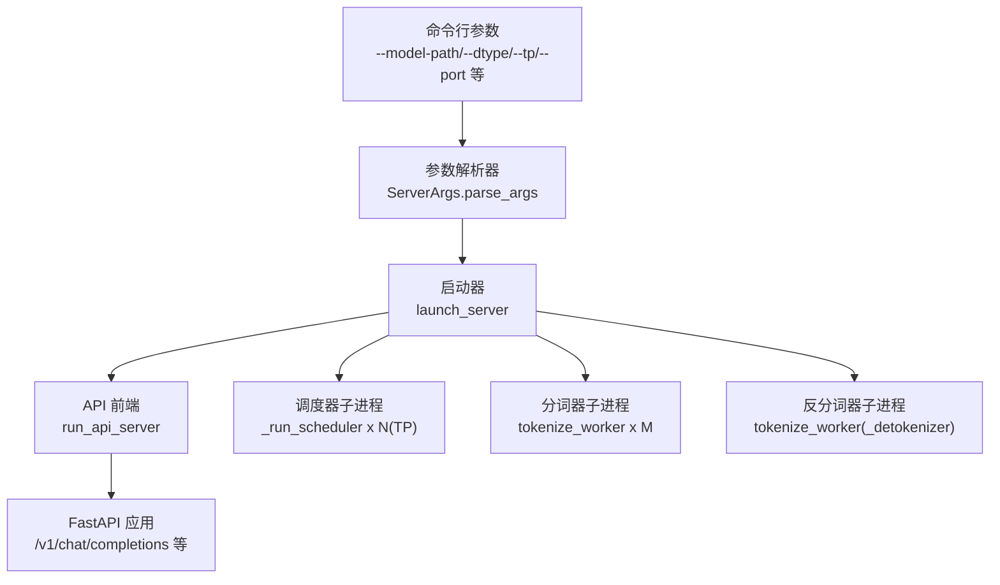
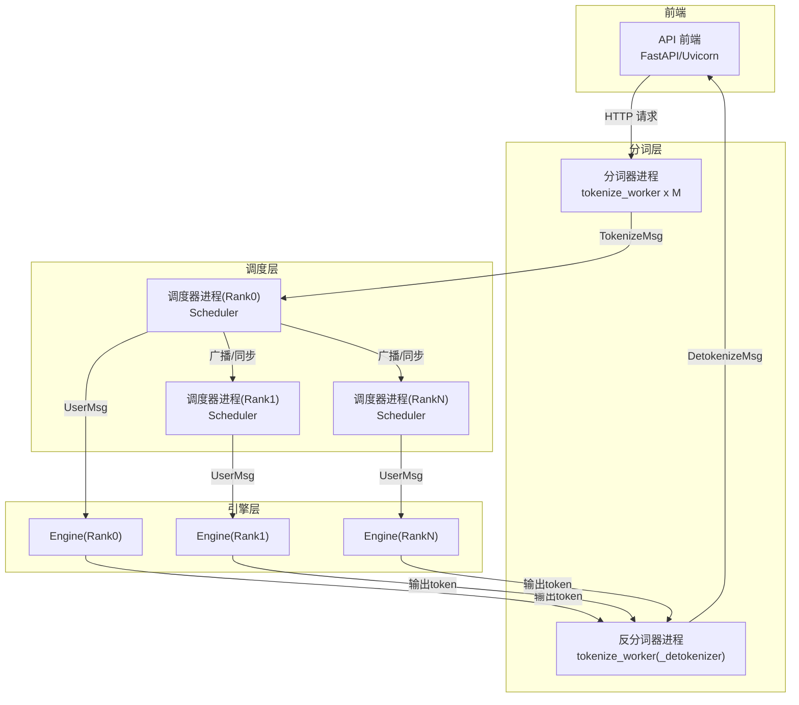
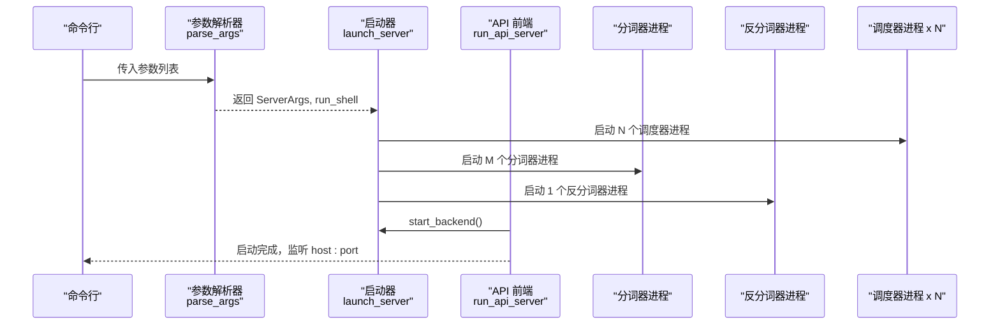
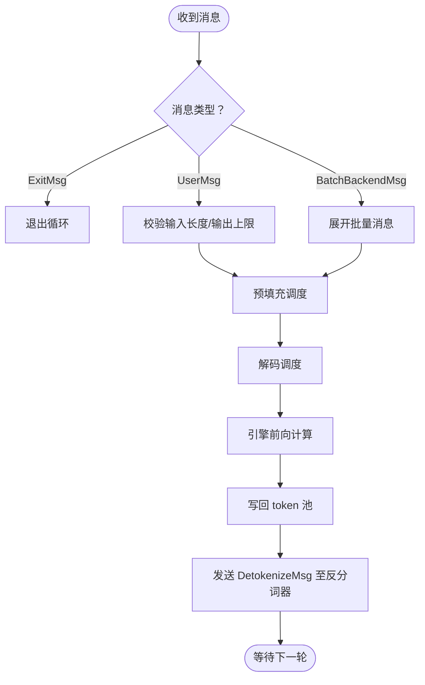
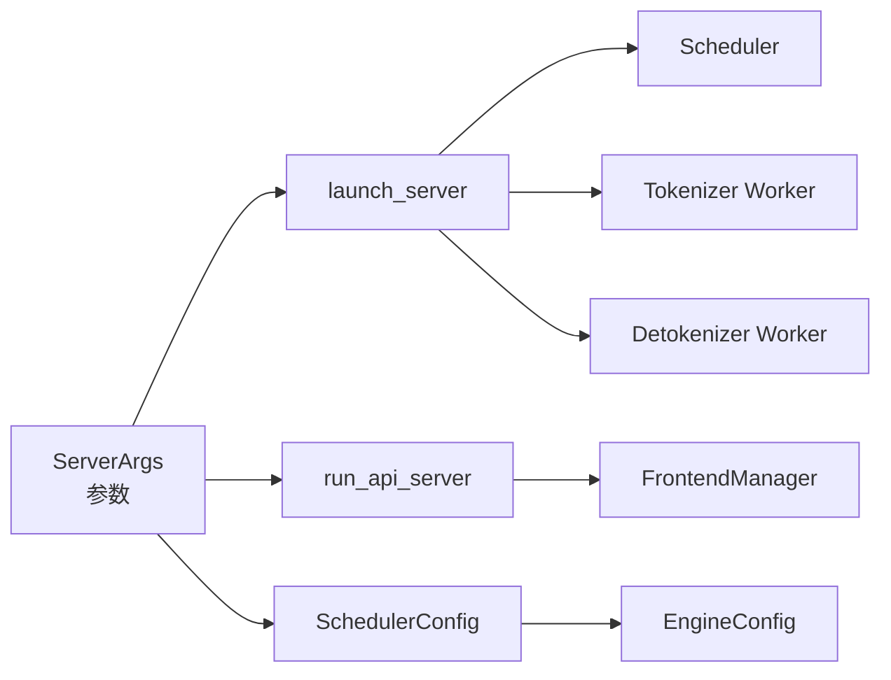

# 配置与启动

<cite>
**本文引用的文件**
- [python/minisgl/server/launch.py](file://python/minisgl/server/launch.py)
- [python/minisgl/server/args.py](file://python/minisgl/server/args.py)
- [python/minisgl/server/api_server.py](file://python/minisgl/server/api_server.py)
- [python/minisgl/tokenizer/server.py](file://python/minisgl/tokenizer/server.py)
- [python/minisgl/scheduler/scheduler.py](file://python/minisgl/scheduler/scheduler.py)
- [python/minisgl/scheduler/config.py](file://python/minisgl/scheduler/config.py)
- [python/minisgl/engine/config.py](file://python/minisgl/engine/config.py)
- [python/minisgl/utils/arch.py](file://python/minisgl/utils/arch.py)
- [README.md](file://README.md)
- [docs/features.md](file://docs/features.md)
- [docs/structures.md](file://docs/structures.md)
</cite>

## 目录
1. [简介](#简介)
2. [项目结构](#项目结构)
3. [核心组件](#核心组件)
4. [架构总览](#架构总览)
5. [详细组件分析](#详细组件分析)
6. [依赖关系分析](#依赖关系分析)
7. [性能考量](#性能考量)
8. [故障排查指南](#故障排查指南)
9. [结论](#结论)
10. [附录：典型配置示例](#附录典型配置示例)

## 简介
本章节聚焦于 MiniSGLang 的命令行启动参数与启动流程，系统性梳理各参数的含义、默认值、取值范围以及对系统行为的影响；并详解 launch.py 如何解析参数、创建并协调 API Server、Tokenizer、Scheduler 等子进程之间的协作关系；最后给出单 GPU 推理、多 GPU 分布式部署、性能测试等典型场景的配置建议与示例。

## 项目结构
- 启动入口与参数解析位于 server 子模块：
  - 命令行参数定义与解析：python/minisgl/server/args.py
  - 启动器：python/minisgl/server/launch.py
  - API 前端服务（FastAPI/Uvicorn）：python/minisgl/server/api_server.py
- 进程间通信与消息模型：
  - Tokenizer 工作进程：python/minisgl/tokenizer/server.py
  - 调度器与引擎：python/minisgl/scheduler/scheduler.py
  - 调度器配置：python/minisgl/scheduler/config.py
  - 引擎配置：python/minisgl/engine/config.py
- 平台能力检测：
  - 架构支持判断：python/minisgl/utils/arch.py
- 文档参考：
  - README 快速开始与示例
  - features.md 功能说明与参数要点
  - structures.md 架构与数据流说明

图表来源
- [python/minisgl/server/launch.py](file://python/minisgl/server/launch.py#L40-L114)
- [python/minisgl/server/args.py](file://python/minisgl/server/args.py#L54-L235)
- [python/minisgl/server/api_server.py](file://python/minisgl/server/api_server.py#L384-L426)

章节来源
- [python/minisgl/server/launch.py](file://python/minisgl/server/launch.py#L40-L114)
- [python/minisgl/server/args.py](file://python/minisgl/server/args.py#L54-L235)
- [python/minisgl/server/api_server.py](file://python/minisgl/server/api_server.py#L384-L426)
- [docs/structures.md](file://docs/structures.md#L1-L50)

## 核心组件
- 参数解析与默认值
  - ServerArgs 继承自 EngineConfig，并在 args.py 中通过 argparse 定义了全部命令行参数。EngineConfig 提供了模型路径、张量并行信息、数据类型、最大运行请求数、注意力后端、CUDA 图最大批大小、页大小、内存比例、分布式超时、占位权重开关、NCCL 开关、序列长度覆盖、页数覆盖等字段。
  - SchedulerConfig 在 EngineConfig 基础上增加了预填充最大扩展长度、缓存类型、离线模式、以及若干 ZeroMQ 地址属性。
- 启动器
  - launch_server 解析参数后，按张量并行规模 world_size 启动 N 个调度器子进程；同时启动 1 个反分词器与 M 个分词器子进程；随后启动 API 前端服务。
- API 前端
  - run_api_server 初始化 FrontendManager，建立与分词器/反分词器的消息通道，然后启动 Uvicorn 或交互式 Shell。
- 调度器
  - 每个 TP Rank 对应一个 Scheduler 实例，负责接收用户请求、调度预填充/解码、与引擎交互、与其它调度器通信、向反分词器发送结果。
- 分词器/反分词器
  - tokenize_worker 负责将文本转为 token（或从 token 反推文本），并通过队列与前端/后端交换消息。

章节来源
- [python/minisgl/engine/config.py](file://python/minisgl/engine/config.py#L15-L55)
- [python/minisgl/scheduler/config.py](file://python/minisgl/scheduler/config.py#L14-L42)
- [python/minisgl/server/args.py](file://python/minisgl/server/args.py#L14-L235)
- [python/minisgl/server/launch.py](file://python/minisgl/server/launch.py#L40-L114)
- [python/minisgl/server/api_server.py](file://python/minisgl/server/api_server.py#L384-L426)
- [python/minisgl/scheduler/scheduler.py](file://python/minisgl/scheduler/scheduler.py#L80-L110)
- [python/minisgl/tokenizer/server.py](file://python/minisgl/tokenizer/server.py#L29-L101)

## 架构总览
下图展示了启动阶段的进程拓扑与消息通路，以及 API 请求在系统内的流转路径。

图表来源
- [python/minisgl/server/api_server.py](file://python/minisgl/server/api_server.py#L213-L274)
- [python/minisgl/tokenizer/server.py](file://python/minisgl/tokenizer/server.py#L29-L101)
- [python/minisgl/scheduler/scheduler.py](file://python/minisgl/scheduler/scheduler.py#L150-L200)
- [docs/structures.md](file://docs/structures.md#L1-L50)

## 详细组件分析

### 命令行参数与默认值
以下参数由 args.py 定义，EngineConfig/SchedulerConfig 提供默认值来源。参数解析后会构造 ServerArgs，并传递给启动器与各子进程。

- 基础参数
  - --model-path, --model
    - 类型：字符串；必填；作用：模型权重路径（本地目录或 HuggingFace 仓库 ID）
    - 默认值：无（必填）
    - 影响：决定加载的模型架构、权重与分片策略
  - --dtype, --precision
    - 类型：字符串；可选值：auto、float16、bfloat16、float32；默认值：auto
    - 影响：控制权重与激活的数据类型；auto 时根据 HF 配置自动选择
  - --host
    - 类型：字符串；默认值：127.0.0.1
    - 影响：API 服务器监听地址
  - --port
    - 类型：整数；默认值：1919
    - 影响：API 服务器监听端口
  - --shell-mode, --shell
    - 类型：布尔标志；默认值：False
    - 影响：进入交互式 Shell 模式；同时会强制设置 cuda-graph-max-bs=1、max-running-requests=1、silent-output=True

- 张量并行与分布式
  - --tensor-parallel-size, --tp-size, --tp
    - 类型：整数；默认值：1；作用：张量并行规模
    - 影响：决定启动的调度器子进程数量 world_size；并行通信使用 NCCL（可通过 --disable-pynccl 关闭）

- 内存与缓存
  - --memory-ratio
    - 类型：浮点；默认值：0.9
    - 影响：GPU KV 缓存占用比例
  - --num-pages, --num-tokens
    - 类型：整数；默认值：由引擎/调度器配置决定
    - 影响：KV 缓存页数上限；过小可能导致 OOM
  - --cache-type, --cache
    - 类型：字符串；可选值：naive、radix；默认值：radix
    - 影响：KV 缓存管理策略；radix 支持前缀复用，提升吞吐

- 注意力后端
  - --attention-backend, --attn
    - 类型：字符串；可选值：fa3、fi；默认值：auto
    - 影响：预填充与解码阶段的注意力实现；可分别指定 prefill 与 decode 后端

- CUDA 图与批大小
  - --cuda-graph-max-bs, --graph
    - 类型：整数；默认值：None（自动基于显存调优）
    - 影响：解码阶段捕获 CUDA 图的最大批大小；设为 0 可禁用

- 分词器进程
  - --num-tokenizer, --tokenizer-count
    - 类型：整数；默认值：0
    - 影响：分词器进程数量；0 表示与反分词器共享同一套分词器资源

- 预填充与序列长度
  - --max-prefill-length, --max-extend-length
    - 类型：整数；默认值：8192
    - 影响：预填充阶段的最大扩展长度（token 数）
  - --max-seq-len-override
    - 类型：整数；默认值：None
    - 影响：覆盖模型最大上下文长度；超出将被拒绝或截断

- 其他
  - --dummy-weight
    - 类型：布尔标志；默认值：False
    - 影响：使用占位权重进行测试
  - --disable-pynccl
    - 类型：布尔标志；默认值：False（即默认启用 PyNCCL）
    - 影响：关闭 PyNCCL，可能影响多卡通信性能
  - --silent-output
    - 类型：布尔标志；默认值：False
    - 影响：静默日志输出（在调度器中生效）

章节来源
- [python/minisgl/server/args.py](file://python/minisgl/server/args.py#L54-L235)
- [python/minisgl/engine/config.py](file://python/minisgl/engine/config.py#L15-L55)
- [python/minisgl/scheduler/config.py](file://python/minisgl/scheduler/config.py#L14-L42)
- [docs/features.md](file://docs/features.md#L1-L55)

### 参数解析与启动流程
- 参数解析
  - parse_args 使用 argparse 定义所有命令行参数，解析后：
    - 将 shell_mode 合并到 run_shell 标志
    - 若 run_shell 为真，强制设置 cuda_graph_max_bs=1、max_running_req=1、silent_output=True
    - 展开 ~ 为用户主目录
    - dtype 解析：非 auto 时映射到 torch.dtype；auto 时从 HF 配置读取
    - 构造 DistributedInfo(tp_info)，并将 tensor_parallel_size 字段移除
    - 返回 ServerArgs 实例与 run_shell
- 启动器
  - launch_server：
    - 调用 parse_args 获取 ServerArgs
    - 设置 multiprocessing 启动方式为 spawn
    - 按 world_size 启动 N 个调度器子进程（每个进程独立持有 tp_info）
    - 启动 1 个反分词器与 M 个分词器子进程
    - 所有子进程通过 ack_queue 确保就绪后再启动 API 服务
- API 前端
  - run_api_server：
    - 初始化 FrontendManager，建立与分词器/反分词器的 ZeroMQ 队列
    - 调用 start_backend 启动后端子进程
    - 若非 shell 模式则启动 Uvicorn；否则进入交互式 Shell

图表来源
- [python/minisgl/server/args.py](file://python/minisgl/server/args.py#L54-L235)
- [python/minisgl/server/launch.py](file://python/minisgl/server/launch.py#L40-L114)
- [python/minisgl/server/api_server.py](file://python/minisgl/server/api_server.py#L384-L426)

章节来源
- [python/minisgl/server/args.py](file://python/minisgl/server/args.py#L54-L235)
- [python/minisgl/server/launch.py](file://python/minisgl/server/launch.py#L40-L114)
- [python/minisgl/server/api_server.py](file://python/minisgl/server/api_server.py#L384-L426)

### 调度器与引擎交互
- 调度器职责
  - 接收来自分词器的 UserMsg，校验输入长度与最大输出长度
  - 预填充阶段调度与批准备，解码阶段调度
  - 与引擎交互执行前向计算，写回 token 池
  - 与其它调度器进行广播/同步（TP Rank 间）
  - 将输出 token 发送至反分词器
- 引擎配置
  - EngineConfig 提供模型路径、dtype、最大运行请求数、注意力后端、CUDA 图、页大小、内存比例、分布式超时、占位权重、NCCL 开关、序列长度覆盖、页数覆盖等
  - SchedulerConfig 在此基础上增加预填充最大扩展长度、缓存类型、离线模式与 ZeroMQ 地址

图表来源
- [python/minisgl/scheduler/scheduler.py](file://python/minisgl/scheduler/scheduler.py#L150-L200)
- [python/minisgl/scheduler/scheduler.py](file://python/minisgl/scheduler/scheduler.py#L203-L280)
- [python/minisgl/engine/config.py](file://python/minisgl/engine/config.py#L15-L55)
- [python/minisgl/scheduler/config.py](file://python/minisgl/scheduler/config.py#L14-L42)

章节来源
- [python/minisgl/scheduler/scheduler.py](file://python/minisgl/scheduler/scheduler.py#L150-L280)
- [python/minisgl/engine/config.py](file://python/minisgl/engine/config.py#L15-L55)
- [python/minisgl/scheduler/config.py](file://python/minisgl/scheduler/config.py#L14-L42)

### 分词器与反分词器
- tokenize_worker
  - 从 ZeroMQ 接收批量消息，区分 DetokenizeMsg 与 TokenizeMsg
  - 对 TokenizeMsg 调用 TokenizeManager，对 DetokenizeMsg 调用 DetokenizeManager
  - 将结果以 BatchFrontendMsg/BatchBackendMsg 形式返回前端/后端
  - 可选 ack_queue 用于进程就绪通知
- API 前端与消息模型
  - FrontendManager 维护 UID 计数、事件与 ACK 缓冲，支持 SSE 流式响应与 OpenAI 兼容接口

章节来源
- [python/minisgl/tokenizer/server.py](file://python/minisgl/tokenizer/server.py#L29-L101)
- [python/minisgl/server/api_server.py](file://python/minisgl/server/api_server.py#L93-L199)

## 依赖关系分析
- 组件耦合
  - ServerArgs 是启动与各子进程的统一配置载体，继承自 EngineConfig/SchedulerConfig，确保参数一致性
  - 启动器通过 multiprocessing.spawn 启动子进程，避免共享状态问题
  - API 前端与分词/反分词通过 ZeroMQ 队列解耦
  - 调度器与引擎通过 SchedulerIOMixin 与 Engine 协作，Rank 间通过 torch.distributed/NCCL 通信
- 外部依赖
  - PyTorch、Transformers、Uvicorn/FastAPI、ZeroMQ、NCCL
  - CUDA 架构能力检测用于优化注意力后端选择

图表来源
- [python/minisgl/server/args.py](file://python/minisgl/server/args.py#L14-L235)
- [python/minisgl/scheduler/config.py](file://python/minisgl/scheduler/config.py#L14-L42)
- [python/minisgl/engine/config.py](file://python/minisgl/engine/config.py#L15-L55)
- [python/minisgl/server/launch.py](file://python/minisgl/server/launch.py#L40-L114)
- [python/minisgl/server/api_server.py](file://python/minisgl/server/api_server.py#L384-L426)

章节来源
- [python/minisgl/server/args.py](file://python/minisgl/server/args.py#L14-L235)
- [python/minisgl/scheduler/config.py](file://python/minisgl/scheduler/config.py#L14-L42)
- [python/minisgl/engine/config.py](file://python/minisgl/engine/config.py#L15-L55)
- [python/minisgl/server/launch.py](file://python/minisgl/server/launch.py#L40-L114)
- [python/minisgl/server/api_server.py](file://python/minisgl/server/api_server.py#L384-L426)

## 性能考量
- CUDA 图与批大小
  - --cuda-graph-max-bs 控制解码阶段捕获 CUDA 图的最大批大小；过大可能增加图构建开销，过小则无法隐藏 CPU launch 开销
  - shell 模式默认强制 cuda_graph_max_bs=1，以简化调试
- 注意力后端
  - --attn 支持 fa3 与 fi，不同后端在不同 GPU 架构上的性能差异较大；可针对预填充与解码分别指定
- KV 缓存
  - --cache-type=radix 默认开启，适合长上下文与高并发；若内存紧张可考虑 --cache naive
  - --num-pages 与 --memory-ratio 共同决定缓存容量，过小会导致频繁淘汰
- 张量并行
  - --tp n 启用多 GPU 并行；需确保 NCCL 正常工作且网络拓扑良好（如 NVLink）
- 预填充策略
  - --max-prefill-length 控制预填充块大小，平衡内存占用与吞吐
- 日志与静默
  - --silent-output 可减少日志噪声，便于压测环境

章节来源
- [docs/features.md](file://docs/features.md#L1-L55)
- [python/minisgl/server/args.py](file://python/minisgl/server/args.py#L143-L193)
- [python/minisgl/scheduler/config.py](file://python/minisgl/scheduler/config.py#L14-L42)
- [python/minisgl/engine/config.py](file://python/minisgl/engine/config.py#L15-L55)

## 故障排查指南
- 启动失败或子进程未就绪
  - 检查 --model-path 是否正确，是否具备读权限
  - 确认 ZeroMQ 地址唯一性（基于 PID 的后缀），避免端口冲突
  - 查看子进程 ack_queue 输出，确认分词器/反分词器/调度器均已打印“已就绪”
- 多卡通信异常
  - 确认 NCCL 环境变量与驱动版本匹配；必要时添加 --disable-pynccl 观察差异
  - 检查 --tp 与实际 GPU 数量一致
- 显存不足
  - 降低 --memory-ratio 或 --num-pages；或切换 --cache naive
  - 减少 --max-running-requests 与 --cuda-graph-max-bs
- 预填充 OOM
  - 适当减小 --max-prefill-length；或缩短输入序列
- Shell 模式问题
  - --shell-mode 下不支持 --dummy-weight；遇到占位权重错误时检查参数组合

章节来源
- [python/minisgl/server/launch.py](file://python/minisgl/server/launch.py#L40-L114)
- [python/minisgl/server/api_server.py](file://python/minisgl/server/api_server.py#L384-L426)
- [python/minisgl/tokenizer/server.py](file://python/minisgl/tokenizer/server.py#L29-L101)
- [python/minisgl/scheduler/scheduler.py](file://python/minisgl/scheduler/scheduler.py#L150-L200)

## 结论
本文系统梳理了 MiniSGLang 的命令行参数、默认值与影响，以及 launch.py 如何解析参数并协调 API Server、Tokenizer、Scheduler 等子进程。结合 EngineConfig/SchedulerConfig 的默认值与功能文档，读者可在单 GPU 推理、多 GPU 分布式部署、性能测试等场景中快速选择合适的参数组合，获得稳定且高性能的推理体验。

## 附录：典型配置示例
- 单 GPU 推理（OpenAI 兼容 API）
  - 示例：python -m minisgl --model-path "Qwen/Qwen3-0.6B" --host 0.0.0.0 --port 1919
  - 说明：默认 dtype=auto、tp=1、cache=radix、cuda-graph-max-bs 自动
- 多 GPU 分布式部署（Tensor Parallelism）
  - 示例：python -m minisgl --model-path "meta-llama/Llama-3.1-70B-Instruct" --tp 4 --port 30000
  - 说明：根据 GPU 数量设置 --tp；确保 NCCL 环境正常
- 性能测试（Shell 模式）
  - 示例：python -m minisgl --model-path "Qwen/Qwen3-0.6B" --shell
  - 说明：--shell-mode 会强制较小的批大小与静默输出，便于快速验证
- 长上下文与高并发
  - 示例：python -m minisgl --model-path "Qwen/Qwen3-32B" --tp 4 --cache-type radix --num-pages 100000 --memory-ratio 0.85
  - 说明：增大页数与内存比例，提升长上下文稳定性
- 注意力后端与 CUDA 图
  - 示例：python -m minisgl --model-path "Qwen/Qwen3-32B" --attn fa3,fi --cuda-graph-max-bs 8
  - 说明：预填充用 fa3，解码用 fi；根据 GPU 架构选择合适后端
- 离线/离线评测
  - 示例：python -m minisgl --model-path "Qwen/Qwen3-0.6B" --dummy-weight
  - 说明：使用占位权重进行离线评测，避免真实权重加载

章节来源
- [README.md](file://README.md#L49-L74)
- [docs/features.md](file://docs/features.md#L1-L55)
- [python/minisgl/server/args.py](file://python/minisgl/server/args.py#L54-L235)