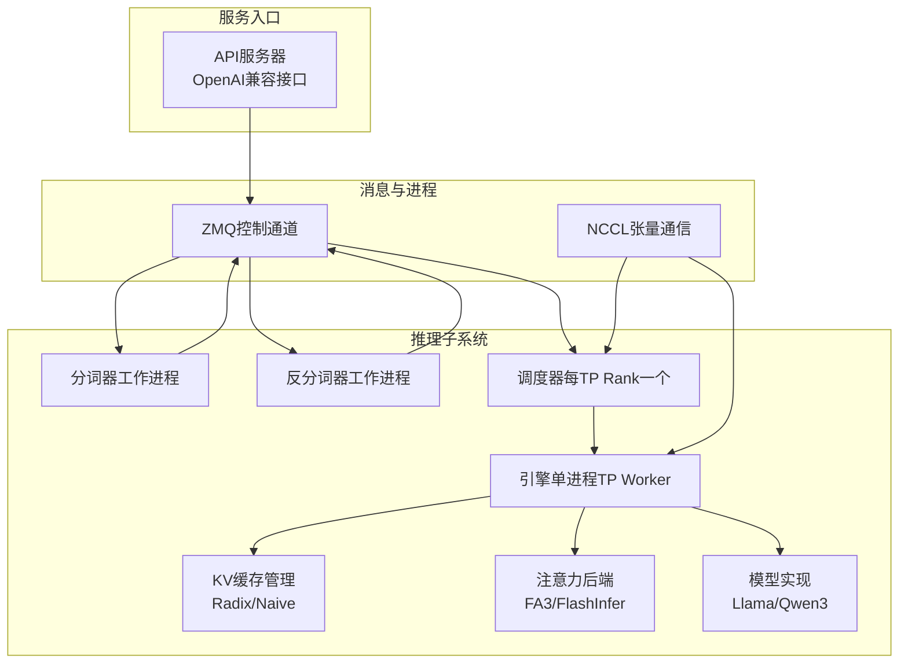
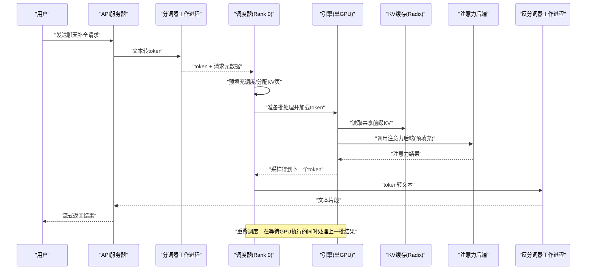
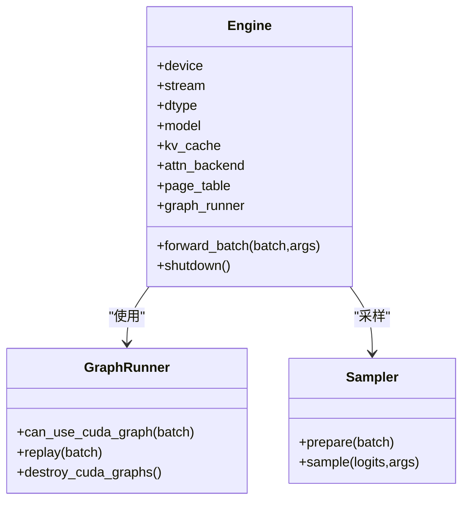
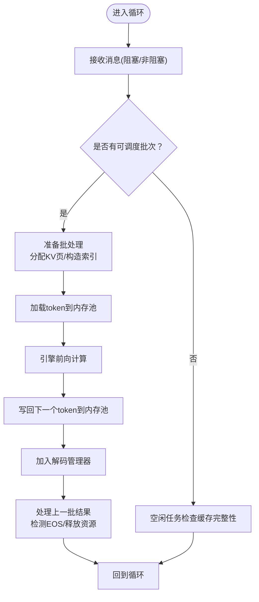
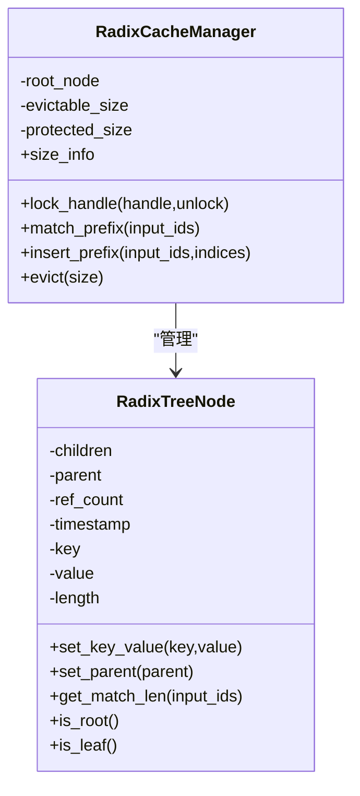
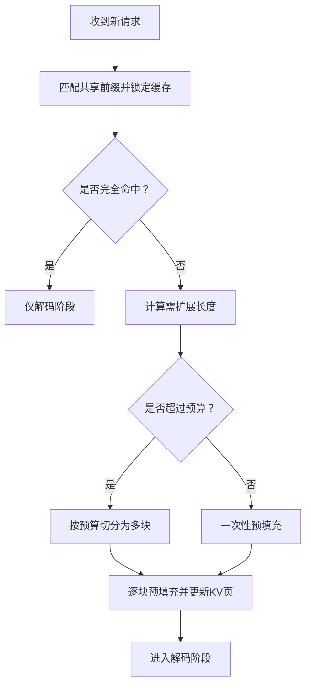
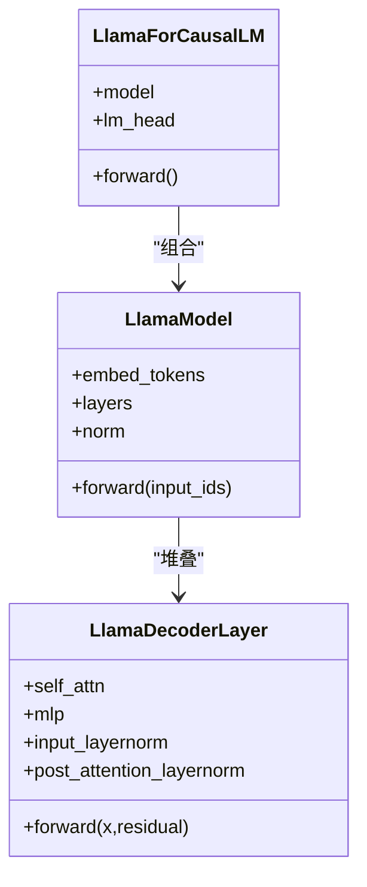
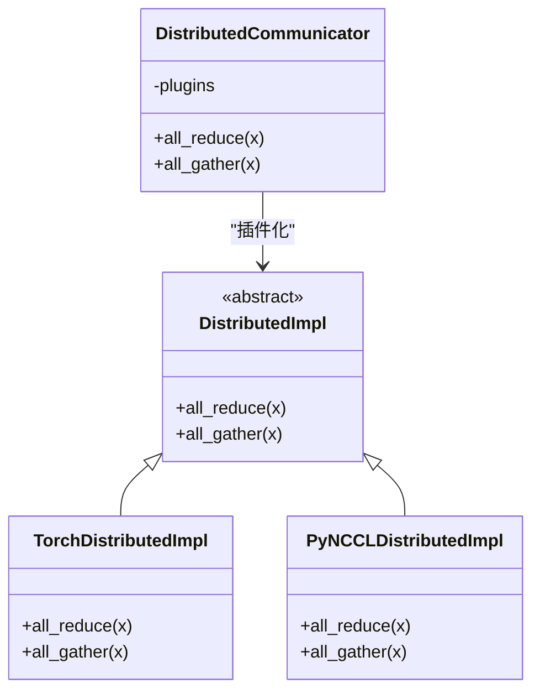
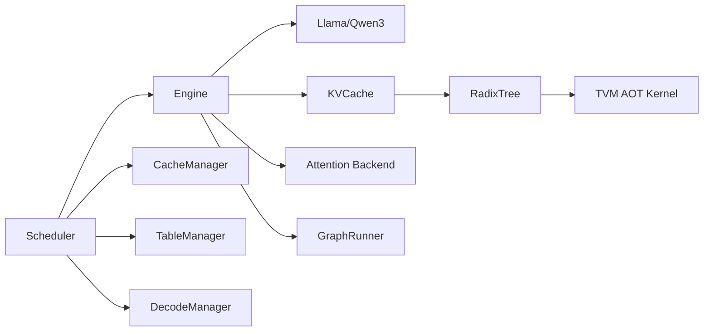

# 项目概述

<cite>
**本文引用的文件**
- [README.md](file://README.md)
- [features.md](file://docs/features.md)
- [structures.md](file://docs/structures.md)
- [engine.py](file://python/minisgl/engine/engine.py)
- [config.py](file://python/minisgl/engine/config.py)
- [scheduler.py](file://python/minisgl/scheduler/scheduler.py)
- [prefill.py](file://python/minisgl/scheduler/prefill.py)
- [radix_manager.py](file://python/minisgl/kvcache/radix_manager.py)
- [radix.py](file://python/minisgl/kernel/radix.py)
- [llama.py](file://python/minisgl/models/llama.py)
- [launch.py](file://python/minisgl/server/launch.py)
- [core.py](file://python/minisgl/core.py)
- [impl.py](file://python/minisgl/distributed/impl.py)
</cite>

## 目录
1. [引言](#引言)
2. [项目结构](#项目结构)
3. [核心组件](#核心组件)
4. [架构总览](#架构总览)
5. [详细组件分析](#详细组件分析)
6. [依赖关系分析](#依赖关系分析)
7. [性能考量](#性能考量)
8. [故障排查指南](#故障排查指南)
9. [结论](#结论)
10. [附录](#附录)

## 引言
本项目“mini-sglang”是一个轻量且高性能的大语言模型（LLM）推理框架，旨在以简洁可读的代码实现现代服务系统的高吞吐与低延迟。它基于SGLang的设计理念，提供透明的研究参考实现，同时具备在线服务、交互式Shell、分布式张量并行等能力。其核心目标是通过Radix Cache、Chunked Prefill、Overlap Scheduling等关键技术协同，显著提升推理效率与资源利用率。

- 与SGLang的关系：mini-sglang是对SGLang思想与优化策略的精炼实现，保留了关键特性（如Radix Cache、Chunked Prefill、Overlap Scheduling、Tensor Parallelism、注意力后端选择等），并以更小的代码体量和更强的可读性服务于教学与研究。
- 设计哲学：模块化、可扩展、易维护；通过清晰的数据流与职责分离，使开发者能够快速理解并定制优化点。

**章节来源**
- file://README.md#L1-L118
- file://docs/features.md#L1-L55
- file://docs/structures.md#L1-L50

## 项目结构
仓库采用按功能域划分的包组织方式，核心模块包括：
- engine：引擎层，封装模型、KV缓存、注意力后端、CUDA图等运行时能力
- scheduler：调度器，负责请求生命周期管理、预填充与解码调度、重叠调度
- kvcache：KV缓存管理，包含Radix Cache与朴素缓存策略
- models：模型实现（如Llama、Qwen3）
- distributed：张量并行通信抽象与实现（含PyNCCL插件）
- server：服务启动与API网关
- kernel：自定义CUDA/TVM内核桥接
- core：通用数据结构（请求、批处理、上下文、采样参数）

**图表来源**
- [structures.md](file://docs/structures.md#L1-L50)
- [launch.py](file://python/minisgl/server/launch.py#L1-L114)
- [scheduler.py](file://python/minisgl/scheduler/scheduler.py#L1-L285)
- [engine.py](file://python/minisgl/engine/engine.py#L1-L217)

**章节来源**
- file://docs/structures.md#L1-L50
- file://python/minisgl/server/launch.py#L1-L114

## 核心组件
- 引擎（Engine）：在单GPU上构建模型、KV缓存、注意力后端与CUDA图，负责前向计算与采样输出。
- 调度器（Scheduler）：统一管理请求生命周期，协调预填充与解码阶段，支持重叠调度以隐藏CPU开销。
- KV缓存（Radix/Naive）：共享前缀复用，减少重复计算；支持锁与淘汰策略。
- 模型（Llama/Qwen3）：提供解码层、注意力与MLP等模块，配合张量并行嵌入与线性层。
- 分布式（PyNCCL/Torch DDP）：在多GPU场景下进行归约与聚合，保证TP一致性。
- 服务启动（launch）：启动API、分词器、反分词器与多个调度器进程，建立ZMQ/NCCL通信。

**章节来源**
- file://python/minisgl/engine/engine.py#L1-L217
- file://python/minisgl/scheduler/scheduler.py#L1-L285
- file://python/minisgl/kvcache/radix_manager.py#L1-L221
- file://python/minisgl/models/llama.py#L1-L89
- file://python/minisgl/distributed/impl.py#L1-L98
- file://python/minisgl/server/launch.py#L1-L114

## 架构总览
下面的序列图展示了从用户请求到返回文本的完整流程，体现重叠调度、分布式通信与注意力后端协作的关键路径。

**图表来源**
- [structures.md](file://docs/structures.md#L1-L50)
- [scheduler.py](file://python/minisgl/scheduler/scheduler.py#L1-L285)
- [engine.py](file://python/minisgl/engine/engine.py#L1-L217)
- [kvcache/radix_manager.py](file://python/minisgl/kvcache/radix_manager.py#L1-L221)
- [attention后端](file://python/minisgl/attention/fa3.py#L1-L200)

## 详细组件分析

### 引擎（Engine）与CUDA图
- 职责：初始化模型权重、KV缓存与注意力后端；在CUDA流中执行前向；使用CUDA图加速解码阶段。
- 关键点：
  - 通信初始化：根据TP配置选择Gloo或NCCL后端，必要时启用PyNCCL插件。
  - 内存估算：依据空闲显存与模型占用估算可用页数，确保KV缓存容量合理。
  - 前向流程：若可使用CUDA图则重放，否则直接调用模型前向；随后采样并异步拷回CPU。
- 性能影响：CUDA图可显著降低CPU调度开销；注意力后端选择直接影响吞吐与延迟。

**图表来源**
- [engine.py](file://python/minisgl/engine/engine.py#L1-L217)
- [config.py](file://python/minisgl/engine/config.py#L1-L55)

**章节来源**
- file://python/minisgl/engine/engine.py#L1-L217
- file://python/minisgl/engine/config.py#L1-L55

### 调度器（Scheduler）与重叠调度
- 职责：接收用户消息，管理请求队列，调度预填充与解码，协调结果回传与资源释放。
- 重叠调度机制：
  - 使用两个CUDA流：调度器在主流中准备批与元数据，引擎在专用流中执行计算。
  - 在等待引擎完成上一批次的同时，处理上一批次的解码结果（写回token池、检测EOS、释放已完成请求）。
- 预填充预算：根据当前解码在途token动态估计预填充预算，避免内存溢出。

**图表来源**
- [scheduler.py](file://python/minisgl/scheduler/scheduler.py#L1-L285)
- [prefill.py](file://python/minisgl/scheduler/prefill.py#L1-L154)

**章节来源**
- file://python/minisgl/scheduler/scheduler.py#L1-L285
- file://python/minisgl/scheduler/prefill.py#L1-L154

### KV缓存（Radix Cache）与共享前缀复用
- Radix树节点结构：保存键值序列、父指针、引用计数与时间戳；支持按token匹配与分裂。
- 锁与保护：通过递归更新祖先节点的引用计数，实现对共享前缀的保护与淘汰策略。
- 匹配与插入：先匹配共享前缀长度，再插入剩余部分；淘汰时优先选择可回收叶子节点。
- 与内核集成：通过TVM AOT模块提供的fast_compare_key加速键比较。

**图表来源**
- [radix_manager.py](file://python/minisgl/kvcache/radix_manager.py#L1-L221)
- [radix.py](file://python/minisgl/kernel/radix.py#L1-L21)

**章节来源**
- file://python/minisgl/kvcache/radix_manager.py#L1-L221
- file://python/minisgl/kernel/radix.py#L1-L21

### 预填充（Chunked Prefill）与长上下文
- 目标：降低长提示的峰值显存占用，避免OOM。
- 策略：将未命中缓存的部分按预算切分为若干块逐步预填充；已命中的共享前缀由KV缓存提供。
- 预算控制：考虑在途解码产生的token数量，动态调整预填充预算，平衡吞吐与内存。

**图表来源**
- [prefill.py](file://python/minisgl/scheduler/prefill.py#L1-L154)

**章节来源**
- file://python/minisgl/scheduler/prefill.py#L1-L154

### 模型（Llama/Qwen3）与注意力后端
- Llama实现：解码层包含自注意力与MLP，层间使用融合归一化；LM Head支持张量并行权重共享。
- 注意力后端：支持FlashAttention/FastAttention与FlashInfer等，按阶段切换以获得最佳性能。
- 上下文绑定：通过全局Context在前向过程中传递批处理与KV页表等元数据。

**图表来源**
- [llama.py](file://python/minisgl/models/llama.py#L1-L89)
- [core.py](file://python/minisgl/core.py#L1-L156)

**章节来源**
- file://python/minisgl/models/llama.py#L1-L89
- file://python/minisgl/core.py#L1-L156

### 分布式（张量并行）与通信
- 实现：提供Torch DDP与PyNCCL两种实现，后者通过自定义内核桥接NCCL，支持更大规模的张量交换。
- 启用：根据TP配置与环境变量决定后端；在多GPU场景下，所有Worker通过NCCL同步。
- 资源清理：退出时销毁进程组与通信插件，避免资源泄漏。

**图表来源**
- [impl.py](file://python/minisgl/distributed/impl.py#L1-L98)

**章节来源**
- file://python/minisgl/distributed/impl.py#L1-L98

## 依赖关系分析
- 组件耦合：
  - Scheduler依赖Engine、CacheManager、TableManager、DecodeManager与Tokenizer/Detokenizer的消息协议。
  - Engine依赖模型、KV缓存、注意力后端与CUDA图运行器。
  - KV缓存与注意力后端通过Context与PageTable解耦。
- 外部依赖：
  - ZeroMQ用于跨进程控制消息；NCCL用于张量并行通信。
  - TVM-FFI用于AOT编译的内核桥接（如Radix键比较）。

**图表来源**
- [scheduler.py](file://python/minisgl/scheduler/scheduler.py#L1-L285)
- [engine.py](file://python/minisgl/engine/engine.py#L1-L217)
- [radix_manager.py](file://python/minisgl/kvcache/radix_manager.py#L1-L221)
- [radix.py](file://python/minisgl/kernel/radix.py#L1-L21)

**章节来源**
- file://python/minisgl/scheduler/scheduler.py#L1-L285
- file://python/minisgl/engine/engine.py#L1-L217
- file://python/minisgl/kvcache/radix_manager.py#L1-L221
- file://python/minisgl/kernel/radix.py#L1-L21

## 性能考量
- Radix Cache：通过共享前缀复用减少注意力计算与KV写入，显著降低吞吐瓶颈。
- Chunked Prefill：在长上下文场景下有效控制峰值显存，避免OOM；需合理设置预算以平衡吞吐。
- Overlap Scheduling：在GPU计算与CPU调度之间建立流水线，提高GPU利用率与端到端延迟表现。
- Tensor Parallelism：多GPU并行扩展，结合PyNCCL可承载更大模型与更高吞吐。
- 注意力后端：根据硬件平台选择最优后端（如Hopper上预填充用FA3、解码用FlashInfer）。

**章节来源**
- file://README.md#L1-L118
- file://docs/features.md#L1-L55

## 故障排查指南
- 显存不平衡：当不同TP Rank之间空闲显存差异过大时会触发错误。建议检查各GPU负载均衡与内存分配策略。
- OOM问题：长上下文请求可能因预算不足导致失败。可通过增大预填充预算或减小最大输出长度缓解。
- 重叠调度异常：若禁用重叠调度后出现CPU瓶颈，可重新启用以隐藏调度开销。
- 分布式通信：确认NCCL初始化成功与进程组状态正常；PyNCCL启用时需满足内核大小限制。

**章节来源**
- file://python/minisgl/engine/engine.py#L154-L217
- file://python/minisgl/scheduler/scheduler.py#L1-L285
- file://python/minisgl/distributed/impl.py#L1-L98

## 结论
mini-sglang以轻量代码实现了现代LLM推理系统的关键优化点：Radix Cache、Chunked Prefill、Overlap Scheduling、Tensor Parallelism与高性能注意力后端。其模块化设计便于学习与扩展，既适合教学演示，也可作为研究与工程实践的参考实现。通过合理的参数配置与硬件适配，可在单GPU与多GPU环境下获得优异的吞吐与延迟表现。

## 附录

### 快速入门与部署要点
- 单GPU部署：使用命令行指定模型路径即可启动在线服务；支持OpenAI兼容接口与交互式Shell。
- 多GPU部署：通过张量并行参数在多GPU上扩展；PyNCCL插件可进一步提升通信效率。
- 基准测试：提供离线与在线基准脚本，支持关闭重叠调度进行消融实验。

**章节来源**
- file://README.md#L1-L118
- file://docs/features.md#L1-L55
- file://python/minisgl/server/launch.py#L1-L114